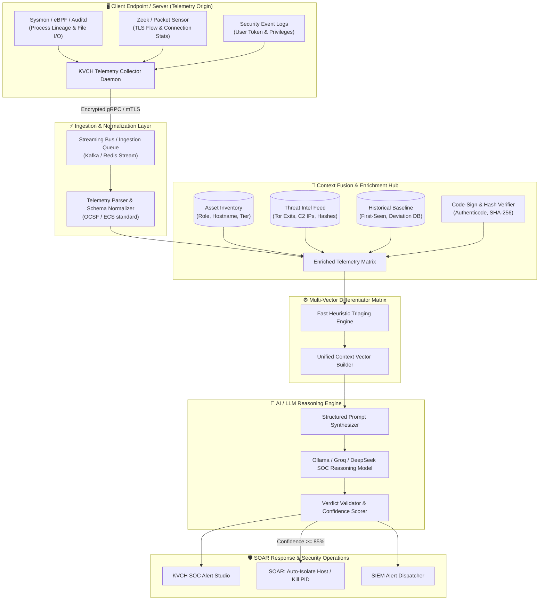

# KVCH Contextual Threat Detection Engine (CTDE)
## Metadata-Driven Differentiation for Indistinguishable Network Threats

---

## 1. Executive Summary & Problem Definition

In modern enterprise network environments, traditional signature-based Intrusion Detection Systems (IDS) and pure packet-inspection engines face critical blind spots. Attackers leverage Living-off-the-Land Binaries (LotL), legitimate protocol tunneling (HTTPS on port 443), and stealthy process injection to make malicious network traffic appear virtually identical to benign administrative tools or baseline operating system behaviors.

| Threat Category | Malicious Behavior | Legitimate Counterpart A | Legitimate Counterpart B |
| :--- | :--- | :--- | :--- |
| **Scenario 1: Command & Control** | **Reverse Shell** (e.g., Meterpreter, Netcat, Python C2) | **Remote Management** (TeamViewer, AnyDesk) | **EDR / Internal Agent** (KVCH-Agent, Osquery) |
| **Scenario 2: Data Movement** | **Data Exfiltration** (Cloud staging e.g., Mega.nz, Pastebin) | **Scheduled Database Backup** (pg_dump, cron backup) | **SIEM Log Aggregation** (Splunk Forwarder, Fluentd) |
| **Scenario 3: Credential Access** | **Credential Stealer** (RedLine, Lumma, Vidar) | **Password Manager Sync** (Bitwarden, 1Password) | **Browser Profile Sync** (Chrome / Edge Sync) |

### The Root Limitation of Raw Network Telemetry
Raw network telemetry only observes:
- Protocol: `TLS / HTTPS`
- Port: `443`
- Connection: Long-lived outbound socket
- Payloads: High-entropy encrypted bytes

### The KVCH Solution: Multi-Dimensional Context Fusion
KVCH transitions from primitive packet analysis to a **High-Fidelity Context Fusion Architecture**:

$$\text{Verdict} = \mathcal{F}\Big(\text{Network Flow} \oplus \text{Process Lineage} \oplus \text{Binary Signature} \oplus \text{Asset Tier} \oplus \text{User Context} \oplus \text{Threat Intel} \oplus \text{Historical Baseline}\Big)$$

---

## 2. End-to-End System Architecture



---

## 3. Deep-Dive Threat Differentiation Matrices

### Scenario 1: Reverse Shell vs. Remote Management vs. KVCH Agent

| Attribute | Reverse Shell (Attacker) | AnyDesk / TeamViewer | KVCH / EDR Agent |
| :--- | :--- | :--- | :--- |
| **Network Protocol** | TLS / HTTPS Outbound 443 | TLS / HTTPS Outbound 443 | TLS / mTLS Outbound 443 |
| **Process Name** | `powershell.exe` / `node.exe` / `python.exe` | `AnyDesk.exe` / `TeamViewer.exe` | `kvch-agent.exe` / `osqueryd` |
| **Parent Process** | `npm` / `malicious_script.sh` / `cmd.exe` | `explorer.exe` / `services.exe` | `systemd` / `services.exe` |
| **File Path** | `C:\Users\...\AppData\Local\Temp\` | `C:\Program Files (x86)\AnyDesk\` | `C:\Program Files\KVCH\Agent\` |
| **Binary Signing** | ❌ Unsigned or Invalid Hash | ✅ Signed: "AnyDesk Software GmbH" | ✅ Signed: "KVCH Security Inc." |
| **Destination IP** | `185.220.101.5` (Tor Exit / Bulletproof C2) | `*.net.anydesk.com` (Known Vendor ASN) | `10.0.0.10` / `c2.kvch.internal` |
| **Host Baseline** | 🚨 First-seen destination on host | ℹ️ Known IT Asset Tooling | ℹ️ Continuous Registered Agent |
| **KVCH Verdict** | **CRITICAL (Reverse Shell Active)** | **INFORMATIONAL (Approved Remote Desk)** | **NORMAL (System Agent Telemetry)** |

---

### Scenario 2: Data Exfiltration vs. Database Backup vs. SIEM Log Aggregation

| Attribute | Data Exfiltration | Nightly Database Backup | SIEM Log Forwarder |
| :--- | :--- | :--- | :--- |
| **Traffic Profile** | 12.4 GB outbound over HTTPS (443) | 18.2 GB outbound over HTTPS (443) | Continuous stream (~2 MB/s) |
| **Initiating User** | `john` (Interactive compromised user) | `SYSTEM` / `postgres_svc` (Service Acc) | `splunk_svc` (Daemon Account) |
| **Execution Trigger** | Manual interactive process invocation | Automated Cron / Task Scheduler | System Daemon Service |
| **Timestamp** | 02:13 AM (Off-hours for user `john`) | 02:00 AM (Scheduled maintenance window) | Real-time continuous (24/7) |
| **Data Classification**| High Sensitivity (PII, Credit Cards, DB dump) | Compressed DB Snapshot (`.sql.gz`) | Normalized Syslogs & Metrics |
| **Destination** | `mega.nz` / `temp.sh` (Public File Storage)| `backup.company.local` (Internal S3/NAS)| `splunk-indexer.company.local` |
| **KVCH Verdict** | **CRITICAL (Data Exfiltration in Progress)** | **NORMAL (Verified Backup Routine)** | **NORMAL (Standard SIEM Forwarding)** |

---

### Scenario 3: Credential Theft Malware vs. Password Manager vs. Browser Sync

| Attribute | Credential Theft (Stealer) | Bitwarden / 1Password | Chrome / Edge Sync |
| :--- | :--- | :--- | :--- |
| **Process Lineage** | `chrome.exe` $\rightarrow$ `stealer.exe` $\rightarrow$ `curl.exe` | `Bitwarden.exe` (Isolated Process) | `chrome.exe` (Main Browser Process) |
| **Memory / File Access**| Injected into `Login Data` & `Cookies.sqlite` + clipboard hook | Secure Enclave / Keytar Protected Storage | Native Chromium Master Key API |
| **Binary Signature** | ❌ Unsigned / Random Hash (`a8f93...`) | ✅ Signed: "8bit Solutions LLC" | ✅ Signed: "Google LLC" |
| **Destination** | Telegram Bot API / Discord Webhook / Unknown VPS | `api.bitwarden.com` | `accounts.google.com` / `sync.google.com` |
| **Volume & Behavior** | Single burst dump of extracted SQLite tokens | Periodic sync of encrypted vault blob | Real-time incremental token refresh |
| **KVCH Verdict** | **CRITICAL (Credential Stealer Malware)** | **NORMAL (Legitimate Password Sync)** | **NORMAL (Standard Browser Account Sync)** |

---

## 4. AI / LLM Reasoning Engine Schema (Ollama / Groq)

### Input Schema (Fused Context Vector JSON)
```json
{
  "timestamp": "2026-09-12T02:13:45Z",
  "scenario_type": "network_socket_443",
  "network": {
    "src_ip": "10.0.4.15",
    "dst_ip": "185.220.101.5",
    "dst_port": 443,
    "protocol": "TLSv1.3",
    "bytes_sent": 1420950,
    "bytes_received": 89400,
    "connection_duration_sec": 420
  },
  "process": {
    "pid": 14209,
    "name": "node.exe",
    "path": "C:\\Users\\john\\AppData\\Local\\Temp\\npm-cache\\runner.exe",
    "parent_pid": 1044,
    "parent_name": "npm.cmd",
    "is_signed": false,
    "signature_signer": null,
    "sha256": "e3b0c44298fc1c149afbf4c8996fb92427ae41e4649b934ca495991b7852b855"
  },
  "asset": {
    "hostname": "prod-db-primary-01",
    "environment": "Production",
    "asset_criticality": "Tier-1",
    "owner_dept": "Infrastructure"
  },
  "user_context": {
    "username": "john",
    "is_service_account": false,
    "privilege_level": "Standard_User",
    "is_work_hours": false
  },
  "threat_intel": {
    "is_known_c2": true,
    "c2_family": "TorExitNode / CobaltStrike_Malleable",
    "reputation_score": -95
  },
  "historical_baseline": {
    "first_seen_destination": true,
    "destination_frequency_30d": 0,
    "process_network_behavior_anomaly": true
  }
}
```

### AI System Prompt for SOC Reasoning
```text
You are the KVCH Senior SOC Cyber Threat Intelligence and Behavioral Analysis Engine.
Your job is to analyze fused telemetry data combining Network Flow, Process Lineage, Binary Authenticity, Asset Context, User Behavior, and Threat Intelligence.

Rules for Evaluation:
1. Differentiate between superficially identical network flows (e.g. Reverse Shell vs Remote Admin vs Agent; Exfiltration vs Scheduled Backup vs SIEM; Credential Theft vs Password Manager vs Chrome Sync).
2. Do not rely solely on Port or Protocol. Correlate Process Lineage, Parent PID, File Paths, Signing, and Threat Intel.
3. Return ONLY a valid JSON object matching the exact schema below.

Output JSON Format:
{
  "threat_identified": boolean,
  "threat_classification": "REVERSE_SHELL" | "LEGIT_REMOTE_MGMT" | "EDR_AGENT" | "DATA_EXFILTRATION" | "SCHEDULED_BACKUP" | "SIEM_LOG_FORWARD" | "CREDENTIAL_STEALER" | "PASSWORD_MANAGER" | "BROWSER_SYNC" | "UNKNOWN",
  "severity": "CRITICAL" | "HIGH" | "MEDIUM" | "LOW" | "INFORMATIONAL",
  "confidence_score": number (0-100),
  "primary_differentiators": string[],
  "ai_reasoning_summary": string,
  "mitre_attack_technique": string,
  "recommended_soc_action": string
}
```

---

## 5. Summary of Key Innovations

1. **Elimination of False Positives**: By analyzing parent PID and digital signature status, administrative remote tools (AnyDesk) and legitimate enterprise monitoring agents are never falsely marked as malicious shells.
2. **Deterministic Context Enrichment**: Telemetry is pre-joined with asset classification and threat intel prior to inference, ensuring sub-second evaluation latency.
3. **Transparent Explainability**: Every verdict produces an evidence-backed rationale, mapping directly to MITRE ATT&CK techniques (T1059, T1048, T1003).
