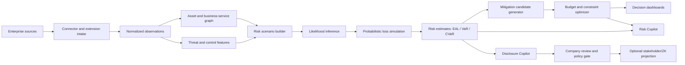
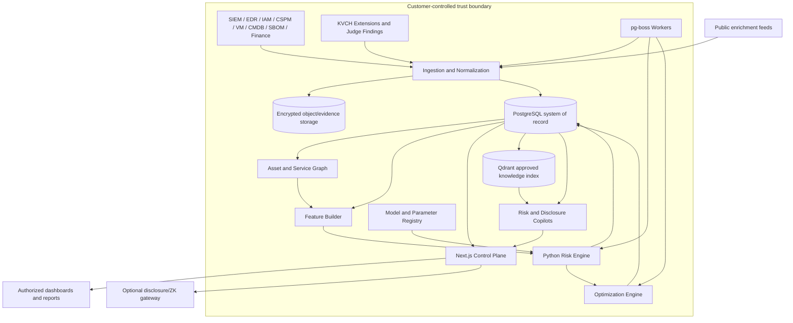

# KVCH Financial Cyber Risk Intelligence

## Product Requirements and ML Engineering Specification

**Expanded name:** Knowledge, Vigilance, Control Hub  
**Document purpose:** Winning product definition and build specification for the monetary cyber-risk problem statement  
**Status:** Implementation-ready product and ML architecture  
**Version:** 1.0  
**Date:** 8 September 2026  
**Primary geography:** India, with framework portability for global enterprises  
**Primary deployment:** Customer-controlled cloud, VPC, on-premises, or air-gapped environment  
**Related product definition:** [KVCH_PRD.md](./KVCH_PRD.md)  
**Related hosted extension runtime:** [web/docs/007-kvch-judge-agile-plan.md](./web/docs/007-kvch-judge-agile-plan.md)

---

## 1. Executive answer

KVCH Financial Cyber Risk Intelligence is a sovereign, AI-assisted cyber-risk quantification and security-investment platform. It continuously joins technical telemetry with asset criticality, business-service dependencies, control effectiveness, and financial assumptions to answer four questions:

1. **How much cyber risk does the enterprise carry in monetary terms?**
2. **Which technical conditions create that financial exposure?**
3. **Which mitigations reduce the most risk under a fixed budget and operational constraints?**
4. **How can those results be explained and selectively disclosed without exposing sensitive security evidence?**

The product does not replace existing scanners, SIEM, IAM, EDR, CSPM, governance tools, or human risk owners. It converts their disconnected observations into continuously refreshed, evidence-linked risk scenarios and decision support.

The system combines technologies according to their strengths:

- calibrated machine learning estimates exploitation and incident likelihood;
- a FAIR-aligned probabilistic loss engine estimates loss distributions instead of fake point estimates;
- an asset and service graph propagates technical impact into business impact;
- a constrained optimization engine proposes the best mitigation portfolio for a given budget;
- GenAI explains authorized, structured results and supports natural-language analysis;
- a Disclosure Copilot suggests audience-specific redactions while leaving the decision with the company;
- an optional, separate zero-knowledge layer can prove narrow stakeholder or consortium claims without disclosing the underlying evidence.

### 1.1 Winning product line

> **From vulnerability to rupee: KVCH shows what can be lost, why, and where the next security rupee should go.**

### 1.2 Defensible differentiator

Most security dashboards prioritize findings with severity labels. KVCH produces an auditable chain:

```text
Observed signal
  → affected asset
  → dependent business service
  → plausible loss event
  → calibrated likelihood
  → financial loss distribution
  → mitigation choices
  → constrained investment portfolio
  → verified residual risk
```

The differentiator is not “AI assigns a rupee number.” The differentiator is that every number is reproducible from versioned evidence, assumptions, models, and simulations—and every recommendation shows uncertainty and expected risk reduction.

---

## 2. Problem statement traceability

| Problem-statement requirement | KVCH response | Proof in product |
| --- | --- | --- |
| Continuously aggregate security and IT sources | Connectors and KVCH extensions normalize SIEM, IAM, EDR, CSPM, vulnerability, SBOM, asset, ticket, incident, and business data | Connector health, freshness, lineage, normalized observations |
| Estimate likelihood and financial impact | Calibrated likelihood models plus Monte Carlo loss engine | Scenario probability, EAL, VaR, CVaR, confidence interval, model version |
| Express risk by organization, business unit, and asset | Risk aggregation over an explicit asset/service dependency graph | Enterprise, business-service, business-unit, asset, and scenario views |
| Model asset criticality | Business owner inputs and dependency-derived criticality | Revenue, users, data classes, RTO/RPO, SLA, dependency centrality |
| Evaluate control effectiveness | Observed control telemetry and versioned effectiveness distributions | Design/operating effectiveness, freshness, evidence, uncertainty |
| Predict emerging and evolving threats | EPSS, KEV, threat intelligence, trend features, optional consortium signals | Threat velocity and likelihood delta with provenance |
| Recommend mitigations | Candidate-action catalog mapped to risk drivers and defensive techniques | Expected EAL reduction, cost, lead time, confidence, dependencies |
| Natural-language queries | Grounded Risk Copilot over authorized risk records and framework evidence | Source-linked answers with calculation IDs; no free-form calculation |
| What-if scenarios | Deterministic recalculation with modified control/exposure assumptions | Baseline/residual loss distributions and assumption diff |
| Optimize under a budget | MILP/constraint optimization | Feasible portfolio, spend, risk reduction, ROSI, excluded actions |
| Show investment vs risk reduction | Efficient-frontier computation | Budget slider and diminishing-return curve |
| Executive and technical dashboards | Role projections over one canonical risk result | Executive financial view and evidence-level technical drill-down |
| Map to ISO, NIST, CIS, RBI, SEBI | Versioned framework-control crosswalk and evidence mappings | Coverage view, assessment evidence, report exports |
| Support regulatory reporting | Evidence packages and form-aligned exports; no claim of automatic compliance | Source evidence, approval trail, report version, filing status |

### 2.1 Product hierarchy

The scope is deliberately ordered:

1. **Core:** continuous financial cyber-risk quantification.
2. **Core:** budget-constrained mitigation and investment optimization.
3. **Core:** executive/technical explanation and scenario simulation.
4. **Differentiator:** company-controlled disclosure assistance.
5. **Optional differentiator:** ZK stakeholder assurance and privacy-preserving consortium intelligence.
6. **Future:** consumer-facing service-impact transparency.

The ZK and public-transparency features must never displace the core problem-statement demo.

### 2.2 Competitive position

Commercial cyber-insurance platforms already demonstrate demand for probabilistic cyber-loss modeling. For example, [Guidewire Cyence](https://www.guidewire.com/products/analytics/cyence) describes company/portfolio cyber-risk and economic-impact modeling, while [CyberCube Portfolio Manager](https://www.cybcube.com/portfolio-manager) describes frequency/severity, dependency, attritional and catastrophe modeling for insurance portfolios. KVCH must not claim the category is new.

KVCH's winning position is different:

- it is an enterprise operational control plane, not primarily an underwriting platform;
- it starts from the customer's live, first-party findings, assets, controls and remediation workflow;
- it connects a risk estimate to the exact owner, action, verification evidence and framework requirement;
- it optimizes the customer's actual control portfolio under budget and staff constraints;
- it supports customer-controlled and sovereign deployment;
- it adds company-controlled disclosure assistance and optional privacy-preserving assurance.

The competition is not beaten by a flashier score. It is beaten by closing the loop from evidence to funded remediation to verified residual risk.

---

## 3. Goals, non-goals, and product principles

### 3.1 Goals

1. Continuously produce monetary loss distributions for material cyber-risk scenarios.
2. Refresh affected scenarios when technical, business, control, or threat conditions change.
3. Make technical-to-financial reasoning inspectable by security, risk, finance, and executive stakeholders.
4. Optimize mitigation portfolios under budget, staff, time, dependency, and change-window constraints.
5. Provide reliable natural-language analysis without allowing an LLM to invent calculations.
6. Keep customer telemetry isolated and prevent cross-company data access or accidental training.
7. Provide cold-start estimates without pretending public datasets represent the customer.
8. Learn from customer outcomes only through explicit, governed calibration.
9. Map evidence to relevant standards and regulatory workflows.
10. Make every estimate reproducible from immutable inputs and versioned computation artifacts.

### 3.2 Non-goals

KVCH will not:

- claim that a monetary estimate is an accounting fact or guaranteed future loss;
- use one opaque neural network to predict an exact rupee loss from raw logs;
- treat CVSS as incident probability or financial impact;
- treat a peer incident as proof that another company is compromised;
- use customer telemetry to train a shared model by default;
- auto-publish incident or risk data to investors, regulators, peers, or the public;
- let GenAI authorize access, compute canonical risk values, approve spend, or enforce disclosure;
- infer employee performance from security telemetry;
- state that framework mapping equals certification or regulatory compliance;
- recommend destructive remediation without human authorization;
- hide model uncertainty or data-quality gaps behind a single risk score.

### 3.3 Product principles

#### Evidence before estimate

Every material model feature must be linked to its source, observed time, transformation, quality state, and tenant.

#### Distribution before false precision

Show median, expected value, percentiles, and confidence—not a naked `₹42,73,119` number produced from weak inputs.

#### ML where labels support ML

Use ML for patterns supported by outcomes, such as exploitation likelihood. Use structured probabilistic models and expert/business inputs where reliable supervised labels do not exist.

#### One model package, private tenant context

Companies may use the same versioned base model code and weights. Each inference receives only one tenant's isolated features, calibration, and business context. Shared weights do not imply shared data.

#### Human authority

AI recommends; company policy and authorized humans decide.

#### Reproducibility

A risk result must be replayable from a feature snapshot, parameter set, model version, code version, random seed policy, and simulation configuration.

---

## 4. Users and decisions

| Persona | Decision enabled | Default view |
| --- | --- | --- |
| CISO | Which risks require action and which controls deserve funding? | Enterprise EAL/VaR, top drivers, residual risk, portfolio |
| CRO / risk officer | Is cyber risk within appetite and how reliable is the estimate? | Scenario distributions, uncertainty, assumptions, exceptions |
| CFO / finance partner | Is the proposed spend economically justified? | Cost, avoided loss, ROSI, cash timing, sensitivity |
| Board / executive | What can materially affect operations and what decision is required? | Business-service exposure, trend, approved narrative |
| Security analyst | Which observations and controls drive a scenario? | Evidence, features, model explanation, remediation candidates |
| Vulnerability manager | What should be patched first? | Exposure-aware likelihood, KEV/EPSS, asset criticality, action SLA |
| Service owner | How does a finding affect my service and what can I change? | Dependency path, downtime assumptions, available mitigations |
| Compliance / auditor | Which controls and evidence support a requirement? | Framework crosswalk, freshness, evidence and audit trail |
| Investor / insurer, if authorized | Can a narrow risk assertion be trusted without raw evidence? | Approved disclosure projection and optional proof |
| Platform / ML operator | Is the data/model pipeline healthy? | Freshness, drift, calibration, queue, latency, model registry |

---

## 5. End-to-end operating loop



### 5.1 Trigger types

Risk recalculation is triggered by:

- a new or materially changed finding;
- a newly discovered or rescored vulnerability;
- EPSS, KEV, or trusted threat-intelligence change;
- asset deployment, retirement, exposure, ownership, or dependency change;
- control implementation, failure, expiry, or new evidence;
- business input change such as revenue, transaction volume, SLA, RTO, records, or penalty assumptions;
- incident confirmation or post-incident loss update;
- approved scenario assumption change;
- scheduled full refresh;
- deployment of a new model or parameter version.

### 5.2 Freshness targets

| Change | Target refresh |
| --- | --- |
| Critical active-exploitation signal | under 5 minutes after normalized intake |
| New high-severity finding | under 5 minutes |
| Asset/control posture update | under 15 minutes |
| External enrichment feed | source cadence, normally daily or hourly |
| Business financial assumption | immediately after approval |
| Full portfolio recomputation | at least daily and on demand |

“Near real time” applies to recomputation after data arrival. KVCH must display source freshness and must not imply that a source was observed continuously when it was polled periodically.

---

## 6. Target architecture



### 6.1 Component responsibilities

| Component | Responsibility |
| --- | --- |
| Next.js control plane | Authentication, tenant authorization, workflows, dashboards, approvals, APIs |
| pg-boss workers | Durable ingestion, enrichment, feature, inference, simulation, optimization, report jobs |
| Python risk engine | Feature validation, likelihood inference, Monte Carlo loss simulation, explanations |
| Optimization engine | Feasible mitigation portfolio under explicit constraints |
| PostgreSQL | Canonical structured records, tenant data, lineage, results, decisions, audit events |
| Object/evidence storage | Encrypted raw payloads, exports, model artifacts, large evidence; never public |
| Qdrant | Approved text embeddings for RAG; not the source of truth for risk calculations |
| Model/parameter registry | Versioned model artifacts, datasets, metrics, approvals, aliases, rollback |
| Asset/service graph | Relationship traversal and impact propagation; V1 may use PostgreSQL adjacency tables |
| Copilot service | Explanation and drafting over pre-authorized structured projections |
| Disclosure/ZK gateway | Optional external publication after company decision and mandatory policy validation |

### 6.2 Why a Python service

The existing TypeScript application remains the product control plane. A narrow internal Python package/service owns numerical and ML workloads because the ecosystem for calibrated classifiers, probabilistic simulation, SHAP, optimization, and MLOps is mature. The service has no public ingress and accepts only authenticated, tenant-scoped job references—not arbitrary raw SQL or browser payloads.

### 6.3 Storage rule

- PostgreSQL stores canonical metadata, normalized features, calculations, and audit events.
- Object storage stores encrypted raw or large evidence.
- Qdrant stores embeddings of approved policies, framework text the customer is licensed to use, sanitized findings, and report projections.
- Raw logs, secrets, packet payloads, and unrestricted incident evidence must not be embedded into Qdrant by default.

---

## 7. Canonical risk model

### 7.1 Unit of analysis: risk scenario

A risk scenario is a specific, decision-relevant statement:

```text
Threat actor or hazard
  acts through a threat event
  against one or more assets
  causing primary and secondary loss to a business service
  under the currently observed control environment.
```

Example:

> An external actor exploits an internet-facing, vulnerable payment API, causing unauthorized access and payment-service disruption, leading to response cost, SLA penalties, lost transaction margin, customer remediation, and possible regulatory cost.

The system must not calculate financial risk directly per alert. Multiple findings may support one scenario; one finding may support multiple scenarios.

### 7.2 Required scenario fields

- `scenario_id`, `company_id`, title, description, taxonomy version;
- threat actor/hazard class, ATT&CK technique(s), entry path;
- target assets and business services;
- confidentiality, integrity, and availability consequences;
- time horizon, typically 12 months for EAL;
- evidence and feature snapshot IDs;
- threat-event-frequency distribution;
- vulnerability/susceptibility distribution;
- loss-event-frequency distribution;
- primary and secondary loss component distributions;
- control-effectiveness assumptions;
- model/parameter versions;
- owner, status, review date, confidence and limitations.

### 7.3 Quantitative outputs

Every material scenario produces:

- annualized expected loss (`EAL`);
- median annual loss (`P50`);
- value at risk at configured percentiles, at least `VaR95` and `VaR99`;
- conditional value at risk / expected shortfall above `VaR95` (`CVaR95`);
- probability of at least one material event in the horizon;
- probability of exceeding company risk-appetite thresholds;
- contribution to enterprise EAL and tail risk;
- data-quality and model-confidence indicators;
- top technical, control, business, and assumption drivers;
- residual estimates under candidate mitigations.

### 7.4 Core equations

For scenario `s` over horizon `T`:

```text
LossEventFrequency_s = ThreatEventFrequency_s × Vulnerability_s

AnnualLoss_s = Σ(i=1..N_s) LossMagnitude_s,i

EAL_s = E[AnnualLoss_s]

VaR95_s = quantile(AnnualLoss_s, 0.95)

CVaR95_s = E[AnnualLoss_s | AnnualLoss_s ≥ VaR95_s]
```

The production engine uses Monte Carlo draws rather than multiplying point estimates when frequency, vulnerability, impact, and secondary effects are uncertain or dependent.

Enterprise aggregation must account for shared dependencies and correlated events. Simply summing independent `VaR95` values is prohibited because it misrepresents tail risk.

### 7.5 Loss components

| Component | Example drivers | Suggested distributions |
| --- | --- | --- |
| Detection and response | analyst hours, forensics, external response | triangular, lognormal |
| Containment and recovery | rebuilds, restoration, overtime, cloud scaling | triangular, lognormal |
| Downtime | duration × revenue/margin/transaction loss per unit | duration and rate distributions |
| Data breach response | records, notification, support, credit monitoring | count × uncertain unit cost |
| Fraud/theft | transaction limits, exposure window, recovery rate | compound frequency/severity |
| SLA/contract cost | service contracts and downtime bands | discrete/contractual |
| Regulatory/legal | jurisdiction, materiality, legal interpretation | explicit range/scenario mixture |
| Customer churn | affected cohort × churn delta × customer value | beta-binomial plus value distribution |
| Reputation | modeled only with customer-approved proxy | sensitivity scenario, never hidden multiplier |
| Third-party impact | supplier dependency and contractual allocation | scenario mixture |

Regulatory penalties and reputational losses are not hard-coded universal percentages. They require sourced, jurisdiction-specific assumptions, legal review, and visible uncertainty.

### 7.6 Monetary display policy

- Store calculations at full precision.
- Display ranges or appropriately rounded values based on uncertainty.
- When the 90% interval is wider than the estimate, lead with the range and confidence warning.
- Distinguish `modeled`, `customer supplied`, `contractual`, `observed`, and `external benchmark` values.
- Never combine currencies without a versioned exchange-rate date and conversion record.

---

## 8. ML and analytical model portfolio

KVCH is a portfolio of models, not one monolithic “AI model.”

### 8.1 Model A — Vulnerability exploitation likelihood

**Purpose:** Estimate the probability that a CVE affecting a reachable customer asset will be exploited within a defined horizon.

**V1 approach:**

- start with FIRST EPSS as an external prior/input, not as ground truth for company compromise;
- incorporate CISA KEV membership, CVSS vector, vulnerability age, affected product, public exploit evidence, patch availability, internet exposure, asset reachability, authentication barriers, privilege, compensating controls, and observed local probes;
- train an interpretable gradient-boosted tree or regularized logistic model where labels and licensing permit;
- calibrate probabilities using time-separated data;
- fall back to an explicit policy model when required fields are missing.

**Output:** probability distribution/interval, not “will be exploited.”

**Prohibited interpretation:** EPSS or the model cannot prove that a company was or is compromised.

### 8.2 Model B — Scenario event frequency

**Purpose:** Estimate annual threat-event/loss-event frequency for a risk scenario.

**V1 approach:** hierarchical Bayesian frequency model or negative-binomial/Poisson model with expert priors and exposure offsets. Inputs include sector/base-rate evidence, enterprise exposure, local incident history, attack surface, detection coverage, control posture, threat activity, and service scale.

Sparse tenant history updates a tenant-specific posterior; it does not silently retrain shared weights.

### 8.3 Model C — Loss magnitude simulation

**Purpose:** Estimate primary and secondary financial loss.

**V1 approach:** FAIR-aligned Monte Carlo simulation with explicit distributions. Public breach data provides broad priors and taxonomy support; customer finance/service inputs dominate customer-specific impact.

This is a probabilistic model, not necessarily a trained ML model. Calling it ML when it is a simulation would weaken credibility.

### 8.4 Model D — Asset and service impact propagation

**Purpose:** identify downstream business services and avoid treating identical findings equally.

**V1 approach:** graph traversal with typed edges, dependency weights, redundancy/failover, criticality, data sensitivity, and recovery objectives. Later versions may learn edge weights from incidents, but V1 remains deterministic and inspectable.

### 8.5 Model E — Control effectiveness

**Purpose:** estimate how controls change event frequency and loss magnitude.

**V1 approach:**

- combine design effectiveness, observed operating evidence, freshness, scope coverage, and confidence;
- encode effectiveness as distributions, not universal percentages;
- map controls to scenario pathways via CIS, NIST, ATT&CK mitigations, and D3FEND;
- update tenant calibration after verified control changes and sufficient observation windows.

KVCH must not claim causal control effectiveness from before/after correlation without addressing confounding changes.

### 8.6 Model F — Security telemetry anomaly model

**Purpose:** augment existing detections and create normalized observations.

**V1:** optional isolation forest/autoencoder or supervised flow classifier for a narrow demonstrable data source. It is not required for core financial quantification because KVCH can consume detections from existing products and extensions.

Public network datasets may demonstrate this model, but their benchmark performance must not be presented as production accuracy on a customer's network.

### 8.7 Model G — Threat and incident NLP classifier

**Purpose:** extract candidate entities from advisories and findings:

- CVE/CWE/CPE/package identifiers;
- ATT&CK techniques and threat families;
- asset/service references;
- incident type and affected security property;
- candidate mitigations;
- time and confidence statements.

All extracted entities remain provisional until schema validation and deterministic/entity-resolution checks succeed.

### 8.8 Model H — Investment optimizer

**Purpose:** choose mitigation actions that maximize risk reduction within constraints.

This is operations research, not GenAI. See Section 15.

### 8.9 Model I — Risk Copilot

**Purpose:** explain calculated results, answer questions, draft reports, and translate between technical and executive language.

The Copilot never creates canonical financial values. It calls typed risk APIs and cites result IDs.

### 8.10 Model J — Disclosure Copilot

**Purpose:** suggest redactions, generalization, audience tier, timing, and safer wording. Company reviewers may accept, edit, reject, or decline publication. Deterministic policy/DLP controls run after the draft and before publication.

---

## 9. Multi-tenant model strategy and scaling

### 9.1 Required design

```text
Shared, versioned base model package
  + tenant-isolated feature snapshot
  + tenant-specific business parameters
  + tenant-specific calibration/posterior
  = tenant-specific risk estimate
```

The same model package can serve many tenants safely because inference is stateless and data remains isolated. Sharing model logic does not give one company access to another company's data.

### 9.2 What changes when Company A is attacked

- Company A's observation, incident state, posterior, and loss history change.
- Company B does not receive Company A's event or a breach label.
- If Company A explicitly publishes a minimized consortium threat claim, Company B may receive a threat-pattern signal.
- Company B's risk changes only if its own local inventory/exposure matches that pattern.
- A peer signal modifies threat likelihood; it never asserts local compromise.

### 9.3 Tenant customization ladder

| Stage | Method | Minimum evidence |
| --- | --- | --- |
| Cold start | shared prior + company business configuration | asset inventory and approved assumptions |
| Calibrated | per-tenant intercept/scale or Bayesian posterior | reliable local observations/outcomes |
| Specialized | tenant-specific model/calibrator | sufficient labels across time; validation approval |
| Sovereign | same package served inside customer VPC/on-prem | customer infrastructure |

Training a unique complex model for every company is not the default and is prohibited when data is insufficient.

### 9.4 Serving scale

- Stateless CPU inference workers load immutable production model artifacts.
- Jobs are partitioned and authorized by `company_id`.
- Micro-batch compatible requests reduce overhead during large refreshes.
- Per-tenant concurrency and cost quotas prevent noisy-neighbor effects.
- Feature snapshots are materialized once and reused across simulation/what-if jobs.
- Monte Carlo workloads are parallelized by scenario and deterministic seed partition.
- GPUs are not required for tree models or simulation; GenAI deployment is independently scalable.
- High-volume future deployments may introduce a stream bus, but V1 extends the existing Postgres/pg-boss foundation.

### 9.5 Tenant isolation requirements

- PostgreSQL queries require server-derived tenant scope and row-level security defense in depth.
- Object storage uses tenant prefixes and preferably tenant-specific envelope-encryption keys.
- Qdrant uses tenant-scoped collections or mandatory payload filters enforced server-side.
- Model inputs and outputs must not be logged in raw form.
- Caches include tenant identity in their key and authorization boundary.
- Customer data is excluded from shared training by default.
- Cross-tenant learning requires explicit opt-in, privacy review, dataset documentation, and revocation/retention terms.
- On-premises customers can disable all external model calls and enrichment egress.

---

## 10. Data-source and connector requirements

### 10.1 Enterprise sources

| Source | Minimum normalized fields | Risk use |
| --- | --- | --- |
| Vulnerability scanner | CVE, asset, package/product, state, first/last seen, fix | vulnerability and exposure |
| SIEM | event type, time, entity, rule, confidence, evidence reference | threat activity and incidents |
| EDR | endpoint, detection, containment, technique, status | control/detection effectiveness |
| IAM/PAM | identity class, privilege, MFA, stale access, anomalous auth | identity pathway likelihood |
| CSPM/CNAPP | resource, misconfiguration, exposure, account/project, control | cloud attack surface |
| CMDB/asset inventory | asset, owner, environment, lifecycle, criticality | graph and ownership |
| SBOM/VEX | component, version, dependency, vulnerability, exploitability state | supply-chain exposure |
| Network/security devices | reachability, segmentation, policy, gateway finding | pathway/control evidence |
| Ticketing/change | remediation, cost, owner, SLA, timestamps, verification | action cost and realized outcomes |
| Incident response | confirmed scenario, timeline, loss ranges, response | calibration and validation |
| BCP/DR | RTO, RPO, recovery tests, dependency/failover | downtime impact/control |
| Finance/ERP | revenue/margin rates, transaction value, labor rates | loss magnitude |
| Legal/compliance | jurisdiction, contracts, reporting duties, penalty inputs | secondary-loss assumptions |
| Customer/support | affected users, support volume, churn proxy | customer impact |
| KVCH Finding Envelope | severity, category, resource, evidence, baseline, details | native observation intake |

### 10.2 Connector contract

Every connector declares:

- connector and schema version;
- company and authorized scope;
- source type and authoritative identifiers;
- collection mode: push, webhook, poll, file, extension;
- observed/source/ingested timestamps;
- watermark and replay semantics;
- idempotency key;
- field classification and retention policy;
- expected cadence and stale threshold;
- permissions requested;
- health and last successful synchronization;
- normalization mapping and test fixture.

### 10.3 Normalization standards

- CVE/CWE/CPE and CVSS for vulnerability identity/severity;
- Package URL (`purl`) plus CycloneDX/SPDX for software components;
- CycloneDX VEX for customer-context exploitability statements;
- STIX 2.1 for exchangeable threat objects and TAXII 2.1 for compatible transport;
- MITRE ATT&CK for adversary behavior;
- MITRE D3FEND for defensive-technique knowledge;
- OSCAL-compatible representations where practical for control catalogs and assessment evidence;
- ISO 8601 UTC timestamps and explicit currency/date/version fields.

### 10.4 Data quality gates

No model run proceeds silently with invalid critical inputs. Each snapshot receives:

- schema validity;
- completeness by feature group;
- freshness;
- source reliability;
- identifier match confidence;
- duplicate/conflict state;
- coverage of in-scope assets;
- observed vs inferred field classification;
- leakage/PII/secret classification;
- overall quality tier.

Missingness is itself a feature only when doing so is validated. Otherwise it triggers a documented fallback or blocks the estimate.

---

## 11. Feature specification

### 11.1 Threat and vulnerability features

- CVE, CWE, CPE/purl, affected-version match confidence;
- CVSS v3.1/v4 vector components and source;
- FIRST EPSS probability, percentile, score date, delta and velocity;
- CISA KEV membership, catalog date, ransomware association where supplied;
- vulnerability age, patch age, fix availability;
- exploit/public PoC evidence and provenance;
- ATT&CK tactic/technique mapping;
- local scan recurrence, reopening, and exception age;
- observed probes/detections and time decay;
- trusted consortium corroboration count and freshness, if enabled.

### 11.2 Exposure features

- internet/restricted/internal reachability;
- externally resolvable endpoint;
- exposed port/protocol and ingress path;
- authentication required and MFA strength;
- privilege required and execution context;
- network segment and compensating controls;
- exploit preconditions;
- VEX state and justification;
- runtime/loading evidence for vulnerable component;
- asset environment: production, DR, staging, development.

### 11.3 Asset and business features

- business service and owner;
- asset class and environment;
- revenue/margin/transaction rate;
- active users/customers/records;
- confidentiality/integrity/availability criticality;
- RTO/RPO and tested recovery time;
- SLA/contractual thresholds;
- data classification and jurisdiction;
- dependency centrality and blast radius;
- redundancy, failover and concentration;
- peak/seasonality factors;
- manual workaround capacity.

### 11.4 Control features

- implementation scope and coverage;
- design effectiveness assessment;
- operating evidence and last test;
- telemetry uptime and detection coverage;
- patch/MFA/EDR/backup/segmentation coverage;
- alert response and containment time;
- control exception count and age;
- false-positive/false-negative evidence where available;
- framework mappings;
- confidence and evidence freshness.

### 11.5 Incident and outcome features

- incident type and confirmation status;
- initial access, compromise, detection, containment and recovery times;
- affected asset/service/data class;
- direct and secondary cost ranges;
- records/users/transactions affected;
- downtime and degraded-service duration;
- control failures/successes;
- remediation and verification;
- source and post-incident approval status.

### 11.6 Features explicitly prohibited by default

- employee productivity/activity-volume scores;
- protected personal characteristics;
- raw secret values;
- unredacted message contents unrelated to the risk purpose;
- customer identity when aggregated counts suffice;
- company name as a shortcut feature in a shared model;
- post-outcome fields that would leak labels into training.

---

## 12. Dataset and knowledge-source registry

### 12.1 Production enrichment sources

| Source | Official link | What it supplies | Intended use | Critical limitation |
| --- | --- | --- | --- | --- |
| FIRST EPSS | [EPSS overview/data](https://www.first.org/epss/) and [API](https://api.first.org/epss/) | Daily CVE exploitation probability and percentile | external prior/feature for exploitation likelihood | Predicts broad exploitation in the next 30 days, not company compromise |
| CISA KEV | [KEV catalog](https://www.cisa.gov/known-exploited-vulnerabilities-catalog) and [JSON feed](https://www.cisa.gov/sites/default/files/feeds/known_exploited_vulnerabilities.json) | CVEs with evidence of active exploitation | high-confidence threat activity feature and prioritization | Catalog inclusion is not customer exploitability |
| NIST NVD | [NVD](https://www.nist.gov/itl/nvd), [API](https://nvd.nist.gov/developers/vulnerabilities), [feeds](https://nvd.nist.gov/vuln/data-feeds) | CVE enrichment, CVSS, CPE, references, SSVC/affected data where present | vulnerability normalization and features | enrichment completeness and update timing vary; cache and preserve source date |
| OSV | [data sources/dumps](https://google.github.io/osv.dev/data/) and [API](https://google.github.io/osv.dev/quickstart/) | open-source ecosystem vulnerabilities and affected package versions | purl/package-to-vulnerability matching | package identity/version resolution still requires validation |
| MITRE ATT&CK | [official STIX repository](https://github.com/mitre-attack/attack-stix-data) | tactics, techniques, software, mitigations, relationships | scenario taxonomy and reasoning graph | not a frequency or financial-loss dataset |
| MITRE D3FEND | [resources and downloads](https://d3fend.mitre.org/resources/) | defensive techniques and relationships | mitigation candidate mapping | mappings do not prove local control effectiveness |
| CycloneDX | [specification](https://github.com/CycloneDX/specification) and [VEX capability](https://www.cyclonedx.org/capabilities/vex/) | SBOM and contextual exploitability | software inventory and VEX intake | VEX assertions require provenance and trust policy |
| NIST OSCAL | [official project](https://pages.nist.gov/OSCAL/) | machine-readable catalogs, profiles, implementations and assessment results | evidence/framework data interchange | external frameworks may have their own licensing/version restrictions |
| VERIS / VCDB | [VCDB repository](https://github.com/vz-risk/VCDB) | structured publicly disclosed incident records | taxonomy, broad frequency priors, research features | selection/reporting bias; explicitly not comprehensive |
| OASIS STIX/TAXII | [STIX/TAXII resources](https://oasis-open.github.io/cti-documentation/resources.html) | CTI representation and exchange protocol | interoperable threat intelligence | transport/format does not establish truth or authorization |

### 12.2 Public incident and impact sources

| Source | Official link | Useful fields | Permitted role in KVCH | Limitation |
| --- | --- | --- | --- | --- |
| HHS OCR Breach Portal | [portal](https://ocrportal.hhs.gov/ocr/breach/breach_frontpage.jsf) | breach type, location, affected individuals, entity information | healthcare impact priors and validation research | US healthcare-specific; large public reports are selected/reporting-driven |
| Washington breach notifications | [data.gov catalog](https://catalog.data.gov/dataset/data-breach-notifications-affecting-washington-residents) | reported breach statistics in CSV/JSON/XML | public incident research and count-impact relationships | threshold/jurisdiction-specific and incomplete for total loss |
| Delaware breach database | [Attorney General database](https://attorneygeneral.delaware.gov/fraud/cpu/securitybreachnotification/database/) | entity, dates, residents affected, notices | incident timing and affected-population research | not a clean financial-loss label set |
| ENISA CIRAS | [CIRAS](https://ciras.enisa.europa.eu/) | aggregated incidents by sector/country and downloadable views | European sector-level reference | aggregation and regulatory scope limit customer-level inference |
| SEC EDGAR filings | [data.sec.gov documentation](https://www.sec.gov/search-filings/edgar-application-programming-interfaces) and [cyber disclosure rule](https://www.sec.gov/files/rules/final/2023/33-11216.pdf) | material public-company incident disclosures and impact narrative | NLP research and public materiality examples | disclosures are selected, narrative and US issuer-specific; extraction needs review |

### 12.3 Optional licensed cyber-loss sources

Open incident registers rarely contain complete, normalized loss components. A production program should evaluate licensed loss data only after commercial-use, geography, sector, field provenance and redistribution rights are reviewed.

| Source | Vendor link | Potential use | Product requirement |
| --- | --- | --- | --- |
| Advisen Cyber Loss Data | [Advisen](https://www.advisenltd.com/data/cyber-loss-data/) | historical event attributes and reported loss amounts | optional licensed prior/backtesting source; never required for MVP |
| Guidewire Cyence | [Guidewire](https://www.guidewire.com/products/analytics/cyence) | external exposure and insurance-oriented loss analytics | competitor/partner benchmark; do not represent proprietary model outputs as KVCH training data |
| CyberCube | [CyberCube](https://www.cybcube.com/) | insurer-oriented cyber exposure/dependency/loss modeling | competitor/partner benchmark subject to contract |

The build must remain functional without proprietary sources. If licensed data is later used, KVCH must record license scope, permitted model use, derived-artifact rules and deletion obligations.

### 12.4 Data acquisition ladder

1. **Prototype:** public feeds, synthetic enterprise profile, safe KVCH fixture findings and explicitly approved assumptions.
2. **Pilot:** customer-owned asset/control/business data plus de-identified, reviewed incident outcomes.
3. **Calibration:** sufficient customer-specific outcomes, insurance/finance review and backtesting.
4. **Optional enrichment:** licensed cyber-loss data or partner benchmarks under contract.
5. **Cross-enterprise learning:** opt-in only, with a separate governance/privacy design; never implied by ordinary inference.

### 12.5 Detection benchmark datasets

These datasets may support a narrow telemetry classifier demo. They must not train the financial-loss engine directly.

| Dataset | Official link | Suitable for | Limitation |
| --- | --- | --- | --- |
| CIC-IDS2017 | [University of New Brunswick CIC](https://www.unb.ca/cic/datasets/ids-2017.html) | network-flow attack classification experiments | generated testbed, dated attack mix, potential leakage and environment shift |
| UNSW-NB15 | [UNSW Research](https://research.unsw.edu.au/projects/unsw-nb15-dataset) | flow classification and anomaly experiments | hybrid real/synthetic lab data; academic-use terms require review for commercial use |
| CTU-13 | [Stratosphere Laboratory](https://www.stratosphereips.org/datasets-ctu13) | botnet flow detection | 2011 scenarios and botnet-focused scope; not modern enterprise prevalence |
| Current CIC datasets | [CIC dataset index](https://www.unb.ca/cic/datasets/) | selecting newer, use-case-specific benchmarks | each dataset needs its own methodology/license review |

### 12.6 Standards and regulatory sources

| Source | Official link | KVCH use |
| --- | --- | --- |
| Open FAIR | [The Open Group Open FAIR](https://www.opengroup.org/open-fair) | risk taxonomy and quantitative analysis alignment |
| NIST CSF 2.0 | [NIST CSF 2.0](https://www.nist.gov/cyberframework) | Govern, Identify, Protect, Detect, Respond, Recover mapping |
| CIS Controls v8.1 | [CIS Controls](https://www.cisecurity.org/controls/v8) | prioritized safeguards and crosswalks |
| ISO/IEC 27001:2022 | [ISO official page](https://www.iso.org/standard/27001) | customer-owned ISMS/control mappings; respect licensed text |
| RBI IT Governance, Risk, Controls and Assurance Practices | [RBI Master Direction, 2023](https://www.rbi.org.in/Scripts/BS_ViewMasDirections.aspx?id=12562) | Indian regulated financial-entity governance/control evidence |
| RBI Cyber Security Framework in Banks | [RBI framework PDF](https://www.rbi.org.in/commonman/Upload/English/Notification/PDFs/NT41802062016.pdf) | banking cyber-control mapping where applicable |
| SEBI CSCRF | [SEBI circular](https://www.sebi.gov.in/legal/circulars/aug-2024/cybersecurity-and-cyber-resilience-framework-cscrf-for-sebi-regulated-entities-res-_85964.html) and [framework PDF](https://www.sebi.gov.in/sebi_data/attachdocs/aug-2024/1724326790365.pdf) | continuous risk, incident, resilience, evidence and threat-intelligence workflows |
| CERT-In Directions | [28 April 2022 Directions](https://cert-in.org.in/PDF/CERT-In_Directions_70B_28.04.2022.pdf) | incident-reporting timers and evidence preservation workflow |
| DPDP Act/Rules | [MeitY data-protection resources](https://www.meity.gov.in/data-protection-framework) and [DPDP Rules 2025](https://www.meity.gov.in/documents/act-and-policies/digital-personal-data-protection-rules-2025-gDOxUjMtQWa?pageTitle=Digital-Personal-Data-Protection-Rules-2025%3B) | purpose limitation, security, breach/privacy workflow review |
| NIST AI RMF | [AI RMF 1.0](https://www.nist.gov/publications/artificial-intelligence-risk-management-framework-ai-rmf-10) and [Playbook](https://www.nist.gov/itl/ai-risk-management-framework/nist-ai-rmf-playbook) | model governance: Govern, Map, Measure, Manage |
| NIST Privacy Framework | [official framework](https://www.nist.gov/privacy-framework) | disclosure and data-processing privacy controls |

### 12.7 Dataset onboarding checklist

No source enters production until its registry record includes:

- owner/publisher and canonical URL;
- access method and authentication;
- license/terms and commercial-use decision;
- geography, sector, time period and population;
- label definition and collection methodology;
- known missingness, reporting bias and sampling bias;
- update cadence, last checked time, checksum/version;
- allowed model/use cases;
- retention and redistribution restrictions;
- PII/security classification;
- parser schema/tests and quarantine behavior;
- approval owner and re-review date.

---

## 13. Training and calibration strategy

### 13.1 Cold-start truth

Public data cannot establish a customer's exact frequency or financial loss. V1 therefore combines:

1. external vulnerability/threat priors;
2. structured scenario logic;
3. customer asset/exposure/control evidence;
4. customer-approved business-loss assumptions;
5. probabilistic uncertainty;
6. later calibration from verified local outcomes.

The UI must distinguish model-derived inputs from expert/customer inputs.

### 13.2 Training labels

| Model | Positive label | Negative/censored handling |
| --- | --- | --- |
| Exploitation likelihood | trustworthy evidence that CVE was exploited within prediction horizon | absence is not always a true negative; use time censoring and source-aware labels |
| Local incident likelihood | confirmed incident tied to scenario within horizon | detection coverage affects label reliability |
| Anomaly classifier | validated attack/benign event in controlled or reviewed data | ambiguous/background remains separate class or excluded |
| NLP extraction | human-reviewed entity spans/relations | active-learning queue for uncertain candidates |
| Disclosure suggestions | reviewer decisions plus policy-test results | reviewer rejection reason required; no learning from silent non-action |

### 13.3 Data splits

- Use time-based train/validation/test splits.
- Group CVE, organization, campaign, or capture family to prevent duplicates crossing splits.
- Preserve a final out-of-time holdout.
- Test across sector/product cohorts and missing-data strata.
- Never randomly split individual flows from the same capture into both train and test when that leaks scenario fingerprints.
- Record all split manifests and hashes.

### 13.4 Baselines

Every ML experiment must beat relevant baselines:

- EPSS alone for broad exploitation likelihood;
- KEV membership/rule baseline;
- CVSS-only baseline;
- tenant historical base rate;
- logistic regression;
- no-change forecast for time-series values;
- deterministic policy model.

A complex model does not ship merely because its ROC-AUC is marginally higher.

### 13.5 Probability calibration

Probabilities used in monetary calculations must be calibrated. Evaluate:

- Brier score and decomposition;
- log loss;
- expected calibration error plus reliability diagrams;
- calibration intercept and slope;
- precision-recall AUC for imbalanced outcomes;
- recall/precision at operational top-K and threshold;
- lead time before known exploitation/incidents.

Calibration may use Platt/logistic scaling or isotonic regression selected on validation data. The [scikit-learn probability-calibration guidance](https://scikit-learn.org/stable/modules/calibration.html) is a reference implementation, not a substitute for KVCH validation.

### 13.6 Tenant calibration

- Do not fine-tune on a tenant until minimum sample/coverage gates pass.
- Prefer intercept/base-rate calibration or Bayesian posterior updates for sparse histories.
- Maintain global and tenant validation metrics separately.
- Tenant calibration artifacts are tenant-confidential.
- Company A's incident updates Company A only unless explicit cross-tenant training consent exists.

### 13.7 Synthetic data

Synthetic data may test pipelines, rare paths, security controls, and UI demonstrations. It must be labeled synthetic and must not be used to claim real-world accuracy without validation on representative real data.

---

## 14. Model evaluation, explainability, and release gates

### 14.1 Evaluation dimensions

| Dimension | Required evidence |
| --- | --- |
| Discrimination | PR-AUC, ROC-AUC where meaningful, top-K precision/recall |
| Calibration | Brier/log loss, reliability diagrams, calibration slope/intercept |
| Temporal generalization | out-of-time metrics and decay |
| Cohort robustness | sector, product, exposure, asset class, data quality |
| Missingness | performance by missing-feature pattern and fallback behavior |
| Stability | score/rank sensitivity to reasonable input perturbations |
| Business utility | avoided-loss ranking utility and remediation capacity simulation |
| Explainability | driver fidelity, analyst review and evidence links |
| Privacy/security | feature minimization, leakage tests, membership/inversion review where relevant |
| Operations | latency, memory, throughput, deterministic replay |

### 14.2 Loss-model validation

- Backtest incident-count and loss intervals as data becomes available.
- Measure empirical coverage of P50/P90/P95 intervals.
- Use proper distributional scores such as pinball loss or weighted interval score where appropriate.
- Run sensitivity and tornado analysis for dominant assumptions.
- Verify monotonic expectations: stronger relevant controls should not increase estimated risk absent an explained interaction.
- Compare modeled losses to post-incident ranges and record reconciliation, not silent parameter fitting.

### 14.3 Explainability requirements

Each risk estimate exposes:

- top drivers and direction;
- source observation behind each driver;
- model/parameter version;
- baseline and comparison point;
- counterfactual: smallest realistic changes that reduce risk;
- uncertainty and missing-data warnings;
- analyst-readable calculation trace.

Tree models may use SHAP/TreeExplainer, whose official implementation describes exact fast explanations for supported tree ensembles. SHAP output is an explanation aid, not causal evidence. Reference: [SHAP TreeExplainer](https://shap.readthedocs.io/en/stable/generated/shap.TreeExplainer.html).

### 14.4 Model release state machine

```text
DRAFT → TRAINED → VALIDATED → SECURITY_REVIEWED
→ APPROVED → SHADOW → PRODUCTION → DEPRECATED → ARCHIVED
```

Required release artifacts:

- model card;
- intended use and non-use;
- training/validation dataset cards and hashes;
- code/dependency versions;
- feature schema;
- metrics with thresholds;
- calibration artifact;
- explainability samples;
- security/privacy assessment;
- approvers;
- rollback target;
- artifact digest/signature.

The registry must preserve lineage, versioning, aliases, and promotion/rollback. [MLflow's model registry](https://mlflow.org/docs/latest/ml/model-registry/workflow) is the preferred implementation candidate, not a product dependency that may bypass KVCH authorization.

### 14.5 Initial release gates

Exact numeric thresholds require dataset discovery, but V1 must at minimum require:

- improvement over declared baselines on the out-of-time test;
- no critical schema, security, or tenant-isolation failure;
- calibrated probabilities within approved tolerance;
- stable ranking under reasonable perturbation;
- acceptable latency/resource use;
- human security/risk review;
- shadow comparison before production replacement.

---

## 15. Investment optimization module

### 15.1 Objective

Given candidate actions `i = 1..n`, choose binary or staged decisions `x_i` to maximize expected risk reduction subject to budget and operational constraints.

```text
maximize  ExpectedRiskReduction(x) - λ × ImplementationRisk(x)

subject to:
  Σ Cost_i × x_i ≤ Budget
  StaffHours(team, period) ≤ Capacity
  Action dependencies are satisfied
  Mutually exclusive actions are not co-selected
  Mandatory actions are selected
  Change windows and deadlines are respected
  Residual risk-appetite constraints are satisfied where feasible
```

For additive V1 approximations, use mixed-integer linear programming. [SciPy `milp`](https://docs.scipy.org/doc/scipy/reference/generated/scipy.optimize.milp.html) or [Google OR-Tools](https://developers.google.com/optimization) are suitable implementation candidates. Nonlinear interactions are handled by precomputed portfolio scenarios, piecewise linearization, or a bounded simulation search—not hidden inside an LLM.

### 15.2 Candidate action fields

- action and control IDs;
- affected assets/scenarios;
- one-time and recurring cost;
- internal staff hours by role;
- lead time and maintenance window;
- dependencies and exclusivity;
- expected frequency/magnitude effect distributions;
- uncertainty and evidence source;
- implementation/availability risk;
- mandatory/regulatory flag;
- reversibility and verification test;
- useful life and depreciation horizon.

### 15.3 Outputs

- recommended feasible portfolio;
- total cost and recurring cost;
- baseline/residual EAL, VaR and CVaR;
- expected and interval risk reduction;
- ROSI and payback estimate;
- constraint utilization;
- excluded high-value actions and exclusion reason;
- efficient frontier across multiple budget points;
- sensitivity to effect/cost uncertainty;
- alternative portfolios near the optimum.

### 15.4 ROSI

```text
AnnualRiskReduction = BaselineEAL - ResidualEAL

ROSI = (AnnualRiskReduction - AnnualizedControlCost)
       / AnnualizedControlCost
```

Display ROSI with confidence/sensitivity. Negative ROSI does not automatically reject a mandatory, safety-critical, tail-risk, or risk-appetite control.

### 15.5 Required scenarios

- “What is the best portfolio under ₹1 crore?”
- “What must we fund to bring VaR95 below the board threshold?”
- “What if remediation is delayed by 30 days?”
- “What if MFA covers all privileged identities?”
- “What if the primary cloud region becomes unavailable?”
- “Which action becomes optimal if its cost increases 20%?”

---

## 16. Risk Copilot and GenAI requirements

### 16.1 Scope

The Risk Copilot translates structured, authorized risk results into explanations and queries. It must use tools/functions for facts and calculations:

- `get_enterprise_risk_summary`
- `get_risk_scenario`
- `get_risk_drivers`
- `compare_risk_snapshots`
- `simulate_controls`
- `optimize_budget`
- `get_framework_mapping`
- `get_evidence_lineage`

The LLM receives returned projections; it does not query tenant databases directly.

### 16.2 Example questions

- “What is our highest financial cyber risk today?”
- “Why did EAL increase this week?”
- “Which vulnerabilities contribute most to expected loss?”
- “Show the evidence behind the payment-service estimate.”
- “Which controls reduce the most risk under ₹50 lakh?”
- “Explain the difference between expected loss and VaR95 to the board.”
- “What assumptions could reverse this recommendation?”
- “Map this mitigation portfolio to SEBI CSCRF and NIST CSF.”

### 16.3 Grounding contract

Every answer that contains a number must include:

- calculation/risk snapshot ID;
- as-of time and currency;
- scope;
- model/parameter version;
- uncertainty/range where applicable;
- evidence or source links available to the user;
- statement when the result is simulated rather than observed.

If the API provides no value, the Copilot must say it is unavailable. It must not estimate a missing value in prose.

### 16.4 Role projections

| Audience | Allowed context |
| --- | --- |
| Technical | technical findings, drivers, affected assets in scope, remediation detail |
| CISO/risk | scenario and enterprise financials, controls, uncertainty, ownership |
| Finance | costs, loss components, assumptions, portfolio and sensitivity |
| Board | material services, trends, ranges, decisions and residual risk |
| Auditor | evidence/control mapping, model lineage, approvals, timestamps |
| External stakeholder | only separately approved disclosure projection |

### 16.5 GenAI safety

- Build authorization/redaction before prompt construction.
- Treat retrieved documents and findings as untrusted data, not instructions.
- Use versioned prompts and JSON schemas.
- Validate structured output and referenced IDs.
- Apply rate/cost limits and bounded retries.
- Store provider/model, prompt version, projection hash, response hash and status.
- Do not store hidden chain-of-thought; store concise rationale and tool evidence.
- Failed generation never blocks risk computation or response workflows.
- Provide deterministic templated reports when the LLM is unavailable.

---

## 17. Disclosure Copilot and optional ZK assurance

### 17.1 Purpose

Companies often cannot expose raw findings to investors, insurers, regulators beyond required channels, consortium peers, or the public. The Disclosure Copilot helps an authorized company reviewer prepare a safe projection. It never publishes autonomously.

### 17.2 Workflow

```text
Private risk/finding record
  → audience and purpose selection
  → AI suggestions: remove/generalize/delay/rephrase
  → reviewer accepts, edits, rejects, or cancels
  → mandatory deterministic DLP/policy validation
  → authorized approval
  → report / claim / optional ZK proof
  → publication and audit record
```

### 17.3 Suggested redactions

- internal hostnames, domains, subnets and topology;
- credentials, tokens, secrets and unique fingerprints;
- employee/customer identities and personal data;
- exploit detail that increases active exposure;
- proprietary code, weights, policies and detection logic;
- exact loss values where approved bands suffice;
- unresolved attribution;
- incident status beyond the selected audience's need;
- third-party confidential information.

Use deterministic detectors in addition to AI. [Microsoft Presidio](https://microsoft.github.io/presidio/learn_presidio/) is a candidate for PII detection/de-identification, and [Gitleaks](https://github.com/gitleaks/gitleaks) is a candidate secret detector. Neither replaces company-specific classification rules or review.

### 17.4 Reviewer actions

- accept individual suggestions;
- bulk accept safe transformations;
- edit or restore text;
- change disclosure tier;
- request legal/security review;
- delay until remediation;
- cancel publication;
- publish only through a mandatory regulatory workflow.

### 17.5 ZK boundary

ZK is optional and separate from the ML engine. It is useful when a verifier needs assurance about a narrow claim but the company cannot disclose supporting evidence.

Candidate claims:

- evidence was committed before a stated cutoff;
- the final threat claim passed an approved minimum confidence threshold;
- required input families met freshness/coverage thresholds;
- a disclosed value lies inside an approved band;
- a consortium claim matched an approved pattern/policy version;
- a required review/quorum signed the publication.

ZK must not be described as proving that “the company is secure,” that the ML model is correct, or that an incident did not happen.

### 17.6 Investor versus consumer rationale

- Investors, boards, regulators and insurers may make financial/governance decisions and need assurance without raw evidence.
- Consumers primarily need clear, timely service-impact status; cryptographic proof usually does not improve that experience.
- Consumer views may show a simple verified-status badge backed by internal verification, but should not require proof inspection.

### 17.7 Consortium intelligence

If later enabled, a company publishes only a minimized, policy-approved threat claim and proof/commitment. A peer signal affects another tenant's likelihood only when that tenant's local assets match the pattern. It never transfers breach status.

The ledger is not a substitute for SEBI/CERT-In or other mandatory reporting channels.

### 17.8 Future consumer service-impact dashboard

The consumer experience is a separate disclosure product, comparable in interaction pattern—not data collection method—to an outage-status dashboard. It is not a public window into the enterprise risk engine.

```text
Private server/service telemetry
  → local service-impact classifier
  → candidate public status event
  → deterministic disclosure policy and minimum aggregation
  → optional GenAI plain-language draft
  → DLP/schema validation
  → company approval or pre-approved incident playbook
  → public service-status dashboard
```

Allowed public fields may include service name, operational/degraded/disrupted/recovering state, broad affected region or cohort, start/update time, recovery estimate, consumer action and approved statement.

Prohibited fields include internal hosts/subnets/topology, vulnerability or exploit details that increase exposure, incident attribution, employee identities, exact enterprise financial loss, raw evidence and unapproved breach status.

The consumer dashboard does not require ZK because consumers primarily need clear and timely impact information. A simple `Verified by KVCH` status may be shown when backed by an auditable approved status record. ZK remains reserved for narrow claims where a sophisticated verifier must validate a predicate without receiving private evidence.

This module is post-MVP because it does not directly satisfy the core monetary-risk and investment-optimization problem statement.

---

## 18. Dashboard and interaction requirements

### 18.1 Executive dashboard

- enterprise EAL, P50, VaR95 and CVaR95;
- comparison with risk appetite;
- trend with explicit drivers of change;
- top business services and loss scenarios;
- risk by confidentiality/integrity/availability consequence;
- current optimized portfolio and funding gap;
- investment-versus-risk-reduction frontier;
- data coverage/freshness and model-confidence status;
- decision queue and overdue risk acceptance.

### 18.2 CISO dashboard

- risk-scenario leaderboard by EAL, tail contribution, urgency and confidence;
- top technical/control/business drivers;
- new KEV/EPSS changes matched to local assets;
- remediation backlog weighted by financial risk;
- control-effectiveness heatmap;
- residual risk after funded controls;
- scenario simulation and budget optimizer;
- framework coverage backed by current evidence.

### 18.3 Technical drill-down

- canonical finding and source;
- affected asset and dependency path;
- exposure/VEX state;
- model features, values and provenance;
- likelihood explanation;
- loss components/assumptions;
- candidate actions and verification steps;
- owner, SLA, case and timeline;
- exact artifact/extension hash where source is a KVCH extension.

### 18.4 Finance/investment view

- control cost breakdown;
- annualized avoided loss;
- ROSI/payback and uncertainty;
- efficient frontier;
- budget, staffing and time constraints;
- sensitivity analysis;
- mandatory versus economically selected controls;
- scenario portfolio correlation assumptions.

### 18.5 Required interaction behavior

- Every aggregate drills down to contributing scenarios.
- Every scenario drills down to evidence and assumptions authorized for that user.
- Users can compare any two immutable snapshots.
- What-if changes are visibly separate from production state until approved.
- Users can override assumptions only with permission, reason, effective date and audit record.
- No chart uses red/green alone; accessible labels and patterns are required.
- Currency, time horizon, percentile and as-of time remain visible.

---

## 19. Framework and compliance mapping

### 19.1 Mapping model

```text
Framework → versioned requirement/control
  ↔ KVCH normalized control
  ↔ implementation scope
  ↔ evidence requirement
  ↔ current evidence observation
  ↔ effectiveness assessment
  ↔ risk scenarios affected
  ↔ remediation actions
```

Mappings are many-to-many and versioned. A mapped finding does not automatically mean non-compliance; an implemented control does not automatically mean compliance.

### 19.2 Framework coverage

- ISO/IEC 27001:2022 customer-licensed ISMS/control references;
- NIST CSF 2.0 functions, categories and subcategories;
- CIS Controls v8.1 controls/safeguards and implementation groups;
- RBI applicable cyber/IT governance directions by regulated-entity class;
- SEBI CSCRF applicable standards/guidelines and entity category;
- CERT-In reporting/evidence-preservation workflow;
- customer-specific policies and contractual obligations.

### 19.3 Evidence-based reporting

Reports include:

- framework and version;
- applicability decision and owner;
- mapped controls;
- evidence references and freshness;
- assessment method and result;
- gaps/exceptions;
- risk scenarios and financial exposure associated with gaps;
- remediation and due date;
- approval/export history.

Regulatory forms must be implemented from verified current templates and reviewed by compliance counsel. KVCH assists reporting; it does not provide legal conclusions.

---

## 20. Data model additions

The existing `Extension`, `Artifact`, `Evaluation`, `Deployment`, `ScheduledExtensionRun`, and `Finding` records remain intact. Add company-scoped records.

### 20.1 Asset and graph

| Record | Essential fields |
| --- | --- |
| `Asset` | company, external ID, type, name, environment, owner, lifecycle, data class, criticality |
| `BusinessService` | company, name, owner, revenue/margin rate, RTO/RPO, customers, criticality |
| `AssetRelationship` | source, target, relationship type, weight, redundancy, valid time, source |
| `AssetIdentifier` | asset, namespace, value, match confidence, valid time |
| `BusinessMetric` | service/scope, metric type, distribution/value, currency/unit, period, source, approval |

### 20.2 Observations and controls

| Record | Essential fields |
| --- | --- |
| `Connector` | company, type, scope, state, cadence, watermark, health |
| `Observation` | company, source, schema version, observed time, entity refs, type, normalized payload, evidence ref |
| `VulnerabilityExposure` | asset, CVE/advisory, package/product, exposure, VEX, first/last seen, state |
| `Control` | company, normalized control ID, name, owner, scope, status |
| `ControlMeasurement` | control, observed time, value, evidence, coverage, freshness, confidence |
| `FrameworkRequirement` | framework, version, ID, title/reference, applicability metadata |
| `ControlMapping` | control, framework requirement, mapping type, version, reviewer |

### 20.3 Risk and model lineage

| Record | Essential fields |
| --- | --- |
| `RiskScenario` | company, taxonomy, threat, assets/services, horizon, owner, state |
| `FeatureSnapshot` | company, scenario, schema/model compatibility, values, lineage, quality, as-of, hash |
| `ModelVersion` | model name/type, artifact digest, schema, data/code lineage, state, metrics |
| `ParameterSet` | company/global scope, distributions, assumptions, sources, approvals, effective time |
| `InferenceRun` | company, scenario, feature snapshot, model, result, explanation, duration, status |
| `SimulationRun` | company, scenario/portfolio, parameters, seed policy, draws, summary, artifact ref |
| `RiskSnapshot` | company, scope, horizon, EAL/VaR/CVaR, confidence, contributors, as-of, immutable hash |

### 20.4 Mitigation and optimization

| Record | Essential fields |
| --- | --- |
| `MitigationAction` | company/catalog source, cost, capacity, timing, dependencies, verification |
| `MitigationEffect` | action, scenario/control, frequency/magnitude effect distribution, evidence/confidence |
| `OptimizationRun` | company, risk snapshot, constraints, solver/version, objective, result, gap/status |
| `OptimizationSelection` | run, action, cost, expected reduction, rank, explanation |
| `Decision` | company, subject, actor, approve/reject/accept-risk, reason, effective/expiry time |

### 20.5 AI and disclosure

| Record | Essential fields |
| --- | --- |
| `RoleProjection` | company, subject, audience/role, policy version, content ref/hash |
| `Generation` | projection, provider/model, prompt/schema version, output ref/hash, status |
| `DisclosureDraft` | company, source refs, audience, suggested transformations, version |
| `DisclosureReview` | draft, reviewer, accepted/edited/rejected items, reason, time |
| `PublishedDisclosure` | approved projection, channel, version, publish/expiry/revoke times, receipt |
| `ZkAttestation` | disclosure/claim, circuit/policy version, public inputs, proof ref/hash, verification state |

### 20.6 Immutability

- Risk snapshots and completed inference/simulation/optimization runs are append-only.
- Corrections create superseding records; they do not rewrite history.
- Evidence access may be revoked/expired while retaining a tombstone and audit metadata according to law/policy.
- Model and parameter versions referenced by a result cannot be silently replaced.

---

## 21. Server interfaces and job contracts

### 21.1 Core APIs

| Capability | Interface behavior |
| --- | --- |
| Ingest observation | validate connector, tenant, schema, idempotency; persist evidence and normalized record |
| Upsert asset/service graph | version relationships and trigger affected scenario refresh |
| Build scenario | create/update a scenario from approved rules or analyst action |
| Calculate risk | reference immutable feature/parameter/model versions; enqueue durable job |
| Read risk snapshot | authorized scope with contributors, uncertainty, lineage and freshness |
| Simulate change | create isolated what-if parameter/control state; never mutate production |
| Optimize budget | accept budget/capacity/mandatory constraints and immutable risk snapshot |
| Approve decision | record authorized decision and create downstream work items |
| Ask Copilot | tool-mediated query over a pre-authorized projection |
| Draft disclosure | generate suggestions; no publication side effect |
| Publish disclosure | require approved projection and deterministic policy pass |

### 21.2 Job types

- `sync-external-feed`
- `ingest-connector-page`
- `normalize-observation`
- `resolve-asset-identity`
- `refresh-asset-graph`
- `match-vulnerability-exposure`
- `build-feature-snapshot`
- `run-likelihood-inference`
- `run-loss-simulation`
- `aggregate-risk-portfolio`
- `optimize-mitigation-portfolio`
- `generate-role-report`
- `generate-disclosure-suggestions`
- `verify-disclosure-policy`
- `generate-zk-attestation` (optional)
- `monitor-data-and-model-drift`
- `expire-stale-risk-results`

### 21.3 Idempotency

- Observation uniqueness: connector + source event ID/version.
- Feature snapshot uniqueness: company + scenario + as-of + input lineage hash.
- Inference uniqueness: feature snapshot + model + calibration version.
- Simulation uniqueness: input hash + parameter set + simulation version + seed policy.
- Optimization uniqueness: risk snapshot + candidate set + constraint hash + solver version.
- Retries reuse or supersede durable run records and never duplicate published findings/results.

---

## 22. MLOps and operational governance

### 22.1 Environments

- Development: fixtures and synthetic data only by default.
- Evaluation: de-identified/licensed datasets with reproducible pipelines.
- Staging: tenant-isolated shadow inference; no production decisions.
- Production: signed approved models and parameter sets only.

### 22.2 Monitoring

Monitor by model, version, tenant cohort and time:

- schema and feature missingness;
- data/prediction drift;
- calibration and delayed-outcome backtests;
- score distribution and ranking stability;
- inference/simulation latency and failure;
- fallback frequency;
- stale inputs;
- explanation generation failure;
- optimization feasibility/gap;
- user overrides and disagreement reasons;
- realized remediation outcomes.

Drift is an alert for review, not automatic proof that the model is wrong. [Evidently's data-drift documentation](https://docs.evidentlyai.com/metrics/preset_data_drift) is a candidate implementation reference.

### 22.3 Retraining triggers

- scheduled evaluation, not mandatory deployment;
- sustained calibration degradation;
- new feature/source version;
- material concept/data drift;
- new outcome volume above minimum threshold;
- model vulnerability or dependency issue;
- regulatory/methodology change.

Retraining never auto-promotes to production.

### 22.4 Rollback

- retain prior production alias and artifacts;
- shadow candidate outputs before promotion;
- one authorized action returns inference to prior approved model;
- recalculation records the new run without overwriting old snapshots;
- incident procedure covers model corruption, poisoning, isolation failure, and bad calibration.

### 22.5 Model security

- sign and hash artifacts;
- scan dependencies and serialize only approved formats;
- prevent arbitrary-code model loading where possible;
- restrict registry write/promotion permissions;
- validate feature bounds and schema;
- rate-limit inference and expensive simulation;
- test adversarial/malformed inputs;
- separate model service identity from database administration;
- retain auditable model/data lineage;
- red-team prompt injection and cross-tenant retrieval for Copilots.

---

## 23. Security, privacy, and sovereignty

### 23.1 Threat model

| Threat | Required mitigation |
| --- | --- |
| Cross-tenant query/data leak | server-derived tenant scope, RLS, scoped keys, isolation tests |
| Raw evidence leaked through RAG | approved-projection-only indexing, classification, tenant filters |
| Prompt injection from logs/advisories | untrusted-content boundary, tool allowlist, no data-driven instructions |
| Model artifact compromise | signed digest, registry ACL, safe loading, rollback |
| Training-data poisoning | source trust, quarantine, dataset hash, anomaly/review gates |
| Label leakage | temporal/group splits and feature availability-time review |
| Sensitive inference logging | metadata-only logs and configurable secure debug workflow |
| False precision | uncertainty gates, rounding, assumption labels |
| Optimization gaming | visible constraints/effect assumptions and independent approval |
| Disclosure leak | deterministic DLP, audience policy, review, preview, kill switch/revocation |
| Peer-signal abuse | membership, proof/signature, rate/reputation, expiry, local relevance check |

### 23.2 Sovereign modes

| Mode | External egress |
| --- | --- |
| Connected cloud | allowlisted feeds/providers; all egress logged |
| Private VPC | customer-controlled endpoints and keys |
| On-premises | optional feed relay; local ML and storage |
| Air-gapped | signed offline feed/model bundles; no external GenAI |

### 23.3 Data retention

- retention by source classification and legal purpose;
- raw logs shorter than derived, non-sensitive features when feasible;
- legal hold support;
- deletion/expiry workflows with audit tombstones;
- training datasets frozen and governed separately;
- published disclosure expiry/revocation;
- backup retention and encryption documented.

### 23.4 Privacy requirement

The system must perform a documented purpose/necessity review before ingesting personal data. Aggregation and pseudonymization occur as early as the use case permits. The Disclosure Copilot is assistance, not the privacy control.

---

## 24. Non-functional requirements

### 24.1 Performance

- P95 normalized finding-to-risk-refresh latency under 5 minutes for critical events after all required data is locally available.
- P95 read latency under 2 seconds for standard dashboard queries.
- P95 single-scenario likelihood inference under 500 ms excluding queue time.
- P95 standard scenario simulation under 30 seconds at the approved draw count.
- P95 portfolio optimization under 60 seconds for MVP-size portfolios, with best-feasible result and optimality gap if timed out.
- Copilot first response target under 5 seconds for cached/simple tool calls; calculation jobs return progress rather than fabricate results.

### 24.2 Availability and degradation

- Risk calculation continues if GenAI is unavailable.
- Cached external enrichments remain usable with visible staleness.
- Deterministic reports remain available without the LLM.
- A failed model run leaves the prior snapshot visible but marked stale; it never publishes a zero-risk state.
- Queue work survives web/worker restart.

### 24.3 Auditability

Every consequential transition records actor/service, tenant, time, input/output refs, version, reason, and correlation ID. Risk, report and optimization outputs are reproducible.

### 24.4 Accessibility and localization

- WCAG 2.2 AA target;
- keyboard and screen-reader support;
- Indian number formatting and currency units, with unambiguous raw values in exports;
- English V1 with localization-ready templates;
- charts provide tabular alternatives.

---

## 25. Implementation roadmap

### Phase 0 — Contract and data foundation

**Goal:** establish vocabulary, source lineage, tenant isolation and a defensible cold-start risk scenario.

- add asset/service/control/risk schema;
- define connector and normalized observation contracts;
- implement asset graph in PostgreSQL;
- ingest KVCH Findings plus one vulnerability and one business-data fixture;
- implement feature snapshots and parameter approval;
- add immutable audit events.

**Exit:** one finding maps to an asset, service, scenario and approved business-loss assumptions with complete lineage.

### Phase 1 — Deterministic quantitative tracer bullet

**Goal:** produce financial distributions before training ML.

- implement frequency/vulnerability parameter distributions;
- implement Monte Carlo loss simulation;
- calculate EAL, VaR95, CVaR95 and confidence/quality;
- add scenario/enterprise views;
- add deterministic top-driver analysis;
- replay from snapshot and seed policy.

**Exit:** a judge can change downtime or control assumptions and see a reproducible distribution change.

### Phase 2 — External enrichment and calibrated likelihood

**Goal:** improve vulnerability prioritization with current evidence.

- ingest EPSS, CISA KEV, NVD and OSV;
- match CVEs/packages to customer assets;
- implement baselines and model experiment pipeline;
- train/evaluate/calibrate first likelihood model;
- model card, registry, shadow and production promotion;
- expose explanation and input freshness.

**Exit:** the model beats declared baselines on out-of-time evaluation and its probability is calibrated enough for approved downstream use.

### Phase 3 — Controls and impact graph

**Goal:** connect technical remediation to business consequence.

- add business-service dependencies and blast-radius traversal;
- add control measurements/evidence;
- map ATT&CK/D3FEND/CIS/NIST candidates;
- model control-effect distributions;
- calculate residual risk and verify remediation.

**Exit:** patching/MFA/segmentation scenarios update the correct frequency/magnitude components with evidence.

### Phase 4 — Investment optimization

**Goal:** solve the explicit budget requirement.

- mitigation cost/effect catalog;
- budget, staffing, dependency, deadline constraints;
- MILP/CP-SAT engine;
- efficient frontier and alternatives;
- sensitivity and ROSI;
- approval handoff to case/task workflow.

**Exit:** under ₹1 crore, KVCH produces a feasible, explainable portfolio and compares it with naive severity ordering.

### Phase 5 — Risk Copilot and reports

**Goal:** enable stakeholder NLP without compromising canonical calculations.

- typed query tools;
- role projections;
- grounded answer schema/citations;
- scenario/optimizer tool calls;
- technical, finance and board reports;
- deterministic fallback and prompt-injection tests.

**Exit:** every numeric answer traces to a calculation ID and unauthorized evidence never enters the prompt.

### Phase 6 — Framework evidence

**Goal:** demonstrate NIST/CIS/ISO/RBI/SEBI support.

- framework/version registry;
- versioned many-to-many mappings;
- evidence freshness and applicability;
- audit/regulatory report packages;
- legal/compliance review labels.

**Exit:** a selected risk/action can be traced to framework requirements and current evidence without claiming automatic certification.

### Phase 7 — Disclosure Copilot and optional ZK

**Goal:** add privacy-controlled stakeholder assurance after the core PS works.

- disclosure tiers and reviewer UI;
- PII/secret/internal-identifier detectors;
- AI suggestions and diff;
- deterministic policy gate and approval;
- optional narrow ZK claim proof/verification;
- expiry/revocation and audit.

**Exit:** no external side effect occurs without explicit approval and policy pass; the verifier sees only approved public inputs.

### Phase 8 — Hardening and pilot

- connector scale and replay;
- drift/backtesting dashboards;
- disaster recovery and load tests;
- security and tenant-isolation assessment;
- operator runbooks;
- pilot calibration and assumption review;
- usability study across CISO, finance and technical personas.

---

## 26. MVP and winning demo

### 26.1 MVP must-have

- one realistic company, business unit, asset/service graph and financial profile;
- KVCH extension finding plus vulnerability/SBOM and control observations;
- EPSS/KEV/NVD enrichment;
- one calibrated or explicitly baseline likelihood model;
- Monte Carlo EAL/VaR/CVaR;
- control what-if simulation;
- ₹1 crore constrained optimizer and efficient frontier;
- technical and executive drill-down;
- grounded natural-language questions;
- NIST/SEBI/CIS evidence mapping;
- complete lineage and uncertainty;
- disclosure suggestion preview, if time permits.

### 26.2 Demo narrative

**Act 1 — A technical event arrives**

KVCH Judge executes an approved extension and records a malicious dependency or exposed critical service finding. The finding is enriched with CVE, EPSS, KEV and affected package information.

**Act 2 — KVCH connects it to business**

The affected asset supports payment processing. The graph shows customer count, transaction margin, SLA, RTO, dependencies and controls.

**Act 3 — The model quantifies uncertainty**

The dashboard changes from a qualitative severity to a loss distribution: annual probability, EAL, VaR95 and top drivers. It clearly shows assumptions and confidence.

**Act 4 — The user asks why**

“Why did our expected loss increase?” The Copilot answers with the active-exploitation signal, local exposure, service criticality and control gap, citing the risk snapshot and evidence.

**Act 5 — The user allocates ₹1 crore**

KVCH compares patching, MFA, segmentation, monitoring and recovery improvements. The optimizer selects a feasible portfolio, quantifies expected risk reduction and shows diminishing returns.

**Act 6 — What-if proof**

The judge delays remediation 30 days or enables MFA. KVCH recomputes residual risk live and explains the changed loss distribution.

**Act 7 — Framework and disclosure**

The selected portfolio maps to SEBI CSCRF/NIST/CIS evidence. The Disclosure Copilot prepares a stakeholder-safe summary; optional ZK demonstrates a narrow assurance claim without exposing logs.

### 26.3 Demo sentence

> “This is not another severity dashboard. KVCH identified the affected revenue service, calculated a defensible loss distribution, and found the highest-value controls under the budget—all from traceable evidence.”

---

## 27. Acceptance criteria

### 27.1 Risk quantification

- [ ] A finding maps to an asset, business service and risk scenario.
- [ ] A risk snapshot includes horizon, currency, EAL, VaR95, CVaR95, uncertainty and as-of time.
- [ ] Every material input links to source evidence or an approved assumption.
- [ ] Replaying the same snapshot/model/parameter/seed policy produces the same summary within defined numerical tolerance.
- [ ] Missing critical business inputs create visible blockers/fallbacks rather than a fabricated estimate.
- [ ] Enterprise aggregation addresses shared/correlated dependencies.

### 27.2 ML

- [ ] Likelihood model is evaluated on out-of-time data and against EPSS/KEV/CVSS/rule baselines.
- [ ] Probability calibration metrics and reliability diagram are available.
- [ ] Feature availability-time review prevents label leakage.
- [ ] Each prediction identifies model and calibration version.
- [ ] The product never labels a tenant compromised solely because a peer was attacked.
- [ ] Shared model serving passes cross-tenant isolation tests.

### 27.3 Optimization

- [ ] User supplies an explicit budget and optional staffing/timing constraints.
- [ ] Selected actions satisfy dependencies and mandatory constraints.
- [ ] Output shows expected risk reduction, range, cost and ROSI.
- [ ] Infeasible runs explain which constraints conflict.
- [ ] Near-optimal alternatives and excluded high-value actions are visible.

### 27.4 AI

- [ ] Every numeric Copilot claim cites a canonical result ID.
- [ ] Unauthorized fields are removed before prompt construction.
- [ ] Prompt injection in retrieved findings cannot cause unauthorized tool use.
- [ ] Schema-invalid or unsupported answers are rejected.
- [ ] Deterministic reports work when GenAI fails.

### 27.5 Frameworks and governance

- [ ] Mappings include framework version, applicability and reviewer.
- [ ] Evidence freshness is visible.
- [ ] Exports include lineage and approval history.
- [ ] UI states that mapping/support does not equal certification/compliance.

### 27.6 Disclosure and ZK

- [ ] Disclosure suggestions have no publication side effect.
- [ ] Reviewer can accept/edit/reject/cancel.
- [ ] Deterministic DLP/policy validation follows AI drafting.
- [ ] Published output has audience, purpose, version, approval, expiry and revocation state.
- [ ] Any ZK proof exposes only documented public inputs and proves only a narrow predicate.

---

## 28. Test strategy

### 28.1 Unit tests

- feature transformations and bounds;
- distribution sampling and currency conversion;
- EAL/VaR/CVaR summaries;
- graph traversal, redundancy and cycle handling;
- control-effect application;
- optimizer constraints and infeasibility;
- authorization and role projection;
- PII/secret detectors;
- schema/model compatibility.

### 28.2 Property/metamorphic tests

- increasing downtime cost cannot decrease loss, holding all else fixed;
- reducing relevant exposure cannot increase event likelihood without an explained interaction;
- a stricter budget cannot select a more expensive portfolio;
- adding a mandatory action either includes it or yields infeasible;
- same immutable inputs and seed policy replay consistently;
- removing tenant authorization always denies access regardless of cached state;
- a peer signal without local match cannot assert compromise.

### 28.3 Integration tests

- Finding → observation → feature snapshot → risk snapshot;
- EPSS/KEV/NVD feed refresh and stale fallback;
- asset graph update invalidates affected scenarios only;
- likelihood → simulation → aggregation;
- optimizer → decision → remediation task;
- role projection → Copilot answer with source IDs;
- disclosure draft → policy validation → review → publication;
- worker restart and job idempotency.

### 28.4 Security tests

- horizontal/vertical tenant access;
- RLS bypass attempts;
- Qdrant filter omission;
- prompt injection and data exfiltration;
- malicious model artifact;
- poisoned/malformed feed;
- decompression/parser bombs;
- secrets in logs/reports;
- disclosure-policy bypass;
- replayed proof/claim or expired claim.

### 28.5 Model tests

- time and group leakage;
- cohort performance;
- missingness/fallback;
- calibration and threshold stability;
- adversarial feature extremes;
- drift detection;
- shadow disagreement analysis;
- rollback replay.

---

## 29. Success metrics

### 29.1 North-star

> **Verified financial risk reduced per rupee of completed security investment.**

This metric is calculated only after remediation verification and an approved observation period; recommendation alone is not counted as risk reduced.

### 29.2 Product metrics

- percentage of critical assets mapped to business services;
- percentage of enterprise risk backed by current evidence;
- time from finding to first risk estimate;
- percentage of estimates within freshness SLA;
- recommendation acceptance and completion rate;
- time from risk change to owner decision;
- budget portfolio adoption;
- reduction in severity-only prioritization overrides;
- Copilot grounded-answer rate;
- scenario assumption review age.

### 29.3 Model metrics

- PR-AUC and top-K precision/recall;
- Brier score, log loss and calibration error;
- out-of-time degradation;
- interval coverage for frequency/loss;
- drift and fallback rates;
- human disagreement/override rate by reason;
- prediction latency and failure.

### 29.4 Business metrics

- modeled EAL/VaR reduction after verified remediation;
- spend reallocated from low-value to higher-value controls;
- risk reduction per ₹1 lakh;
- avoided SLA/downtime exposure;
- audit evidence preparation time;
- percentage of funded controls linked to explicit scenarios.

---

## 30. Risks and mitigations

| Risk | Mitigation |
| --- | --- |
| Financial estimates appear invented | FAIR-aligned taxonomy, explicit assumptions, distributions, lineage, finance approval |
| Sparse/biased incident-loss data | hybrid priors + local inputs; disclose bias; avoid end-to-end loss ML |
| Public benchmark overfitting | out-of-time/group splits; use only for narrow detector proof |
| Probability miscalibration | calibration gates, reliability monitoring, fallback |
| Asset inventory is incomplete | coverage score, reconciliation, stale/missing blockers |
| Double-counted portfolio risk | canonical scenarios, shared-dependency/correlation model |
| Control-effectiveness overclaim | distributions, evidence grades, no causal claim without design |
| Optimizer recommends infeasible work | staff/time/dependency constraints and owner review |
| LLM hallucinates values | typed calculation tools; canonical numbers never generated by LLM |
| GenAI leaks sensitive data | pre-prompt role projection, local option, DLP, audit |
| Shared model creates privacy fear | tenant-isolated stateless inference, no default shared training, VPC/on-prem mode |
| Peer incident contaminates another tenant | require local relevance match; threat signal ≠ compromise |
| ZK becomes a distraction | keep optional after core risk/optimizer demo; narrow predicates only |
| Framework claims become legal claims | version/applicability/evidence labels; compliance/legal review |
| Stale risk looks current | as-of/freshness visible; automatic stale state |

---

## 31. Open decisions requiring product owner approval

1. Primary MVP vertical: fintech/payment service is recommended for strongest RBI/SEBI relevance.
2. Exact asset/business input interface: manual form + CSV first, then CMDB/ERP connectors.
3. First likelihood model: EPSS/KEV-enhanced calibrated model versus policy baseline for demo.
4. Monte Carlo library and standard production draw count.
5. Correlation/dependency method for enterprise tail aggregation.
6. Default display percentiles and monetary rounding.
7. Model registry deployment: embedded self-hosted MLflow versus KVCH-native minimal registry.
8. Initial optimization solver: SciPy HiGHS MILP versus OR-Tools CP-SAT.
9. GenAI deployment mode: local model, customer-supplied endpoint, or server-only Groq V1.
10. Which framework texts/crosswalks may be distributed versus referenced due licensing.
11. Whether ZK is part of judged MVP or an architectural extension after core demo.
12. Consumer service-impact dashboard priority; recommended post-MVP.

---

## 32. Recommended build choices for the current repository

### 32.1 Repository shape

```text
sih/
├── web/                         # existing Next.js control plane and pg-boss worker
├── kvch-extension/              # existing artifact/manifest bridge
├── risk-engine/                 # new Python package/internal service
│   ├── pyproject.toml
│   ├── src/kvch_risk/
│   │   ├── schemas/
│   │   ├── features/
│   │   ├── likelihood/
│   │   ├── simulation/
│   │   ├── graph/
│   │   ├── optimization/
│   │   ├── explain/
│   │   └── service/
│   ├── tests/
│   ├── fixtures/
│   └── model_cards/
├── data-contracts/              # versioned JSON Schema / fixtures / mapping specs
└── docs/                        # operator, data, model and framework documentation
```

### 32.2 Initial technical stack

- Python 3.12+ risk engine;
- Pydantic/JSON Schema for contracts;
- pandas or Polars for bounded batch transforms;
- scikit-learn gradient boosting/logistic regression and calibration;
- NumPy/SciPy for distributions/simulation;
- SciPy HiGHS MILP or OR-Tools for optimization;
- SHAP for reviewed tree explanations;
- MLflow or KVCH-native registry for artifacts/lineage;
- FastAPI internal service or queue-invoked package with mutually authenticated service identity;
- PostgreSQL plus object storage; Qdrant only for approved RAG;
- pg-boss for durable V1 orchestration.

Pin exact versions during implementation after compatibility/security review. The PRD intentionally does not freeze September 2026 library versions into a long-lived product requirement.

### 32.3 First vertical slice

Implement one payment-service scenario:

1. ingest a KVCH malicious-dependency finding;
2. resolve package/CVE and enrich EPSS/KEV/NVD/OSV;
3. attach to `payment-api` and `digital-payments` service;
4. collect approved downtime rate, RTO, customer and response-cost distributions;
5. simulate baseline EAL/VaR;
6. compare patch, WAF rule, segmentation, monitoring and recovery actions;
7. optimize under ₹1 crore;
8. answer five grounded stakeholder questions;
9. map selected actions to NIST/CIS/SEBI evidence;
10. show Disclosure Copilot preview without external publication.

---

## 33. Definition of done

The financial cyber-risk capability is complete for MVP when a newly observed, immutable KVCH finding can be correlated with authoritative vulnerability intelligence and a tenant-owned asset/business/control profile; converted into a reproducible, uncertainty-aware annual loss distribution; aggregated without obvious double counting; recalculated under control what-if scenarios; optimized into a feasible risk-reduction portfolio under an explicit rupee budget; explained through role-authorized, source-linked natural language; mapped to versioned framework evidence; and operated without cross-tenant data access, hidden customer-data training, or an LLM inventing canonical calculations.

The winning standard is not the number of AI features. It is whether judges can inspect the full chain from technical evidence to financial decision and see that every step is useful, governed, and defensible.

---

## Appendix A — Research-backed implementation references

### Quantitative risk and security frameworks

- [The Open Group — Open FAIR Body of Knowledge](https://www.opengroup.org/open-fair)
- [NIST Cybersecurity Framework 2.0](https://www.nist.gov/cyberframework)
- [CIS Critical Security Controls v8.1](https://www.cisecurity.org/controls/v8)
- [ISO/IEC 27001:2022 official page](https://www.iso.org/standard/27001)
- [NIST OSCAL](https://pages.nist.gov/OSCAL/)

### Vulnerability and threat data

- [FIRST EPSS](https://www.first.org/epss/)
- [CISA Known Exploited Vulnerabilities](https://www.cisa.gov/known-exploited-vulnerabilities-catalog)
- [NIST NVD](https://www.nist.gov/itl/nvd)
- [OSV data](https://google.github.io/osv.dev/data/)
- [MITRE ATT&CK STIX data](https://github.com/mitre-attack/attack-stix-data)
- [MITRE D3FEND resources](https://d3fend.mitre.org/resources/)
- [VERIS Community Database](https://github.com/vz-risk/VCDB)
- [OASIS STIX/TAXII 2.1 resources](https://oasis-open.github.io/cti-documentation/resources.html)
- [CycloneDX specification](https://github.com/CycloneDX/specification)

### Incident and benchmark data

- [HHS OCR Breach Portal](https://ocrportal.hhs.gov/ocr/breach/breach_frontpage.jsf)
- [Washington State breach notification dataset](https://catalog.data.gov/dataset/data-breach-notifications-affecting-washington-residents)
- [ENISA CIRAS](https://ciras.enisa.europa.eu/)
- [CIC-IDS2017](https://www.unb.ca/cic/datasets/ids-2017.html)
- [UNSW-NB15](https://research.unsw.edu.au/projects/unsw-nb15-dataset)
- [CTU-13](https://www.stratosphereips.org/datasets-ctu13)

### India regulatory sources

- [RBI IT Governance, Risk, Controls and Assurance Practices, 2023](https://www.rbi.org.in/Scripts/BS_ViewMasDirections.aspx?id=12562)
- [SEBI CSCRF circular, 20 August 2024](https://www.sebi.gov.in/legal/circulars/aug-2024/cybersecurity-and-cyber-resilience-framework-cscrf-for-sebi-regulated-entities-res-_85964.html)
- [CERT-In Directions, 28 April 2022](https://cert-in.org.in/PDF/CERT-In_Directions_70B_28.04.2022.pdf)
- [MeitY DPDP resources](https://www.meity.gov.in/data-protection-framework)

### AI/ML engineering

- [NIST AI Risk Management Framework 1.0](https://www.nist.gov/publications/artificial-intelligence-risk-management-framework-ai-rmf-10)
- [NIST AI RMF Playbook](https://www.nist.gov/itl/ai-risk-management-framework/nist-ai-rmf-playbook)
- [scikit-learn probability calibration](https://scikit-learn.org/stable/modules/calibration.html)
- [MLflow Model Registry](https://mlflow.org/docs/latest/ml/model-registry/workflow)
- [SciPy mixed-integer linear programming](https://docs.scipy.org/doc/scipy/reference/generated/scipy.optimize.milp.html)
- [Google OR-Tools](https://developers.google.com/optimization)
- [SHAP TreeExplainer](https://shap.readthedocs.io/en/stable/generated/shap.TreeExplainer.html)
- [Microsoft Presidio](https://microsoft.github.io/presidio/learn_presidio/)

## Appendix B — Judge-facing hard questions

### “Where does the financial-loss training data come from?”

KVCH does not pretend a complete, unbiased public rupee-loss dataset exists. Public incident/breach records support taxonomies and broad priors; the enterprise supplies approved service, downtime, customer, contract and recovery economics. ML estimates likelihood where labels support it; Monte Carlo combines explicit loss distributions. Local outcomes improve calibration over time.

### “Why not use CVSS?”

CVSS describes vulnerability characteristics/severity, not customer exploitability, event frequency, asset criticality or financial loss. KVCH uses it as one feature alongside EPSS/KEV, exposure, controls and business context.

### “Is every company using the same model?”

The base model package may be shared, while tenant data, financial parameters and calibration are isolated. Shared logic does not expose data. High-security customers run the same artifact in their own VPC/on-premises environment.

### “If Company A is attacked, do you say Company B will be attacked?”

No. Company A updates its own state. An explicitly shared, minimized peer threat signal may raise Company B's threat likelihood only when Company B has a matching local exposure. It never proves B is compromised.

### “Can the LLM hallucinate a financial figure?”

Not into the system of record. All canonical values come from typed calculation services. The LLM may only explain results returned by those services, and every number cites a calculation ID.

### “Why ZK?”

ZK is optional for a narrow trust problem: a stakeholder may need to verify a policy/threshold/range assertion while the company cannot disclose evidence. It is not required for core risk quantification and does not prove universal security.

### “Why should we trust the recommendation?”

The recommendation exposes costs, constraints, risk-effect assumptions, uncertainty, solver status, alternatives and the exact baseline snapshot. Humans retain the decision, and completed controls require fresh verification before KVCH counts risk reduction.
