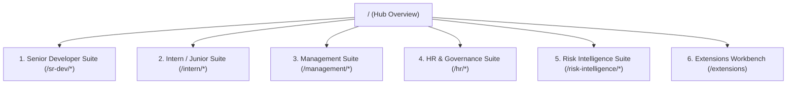

# KVCH — Product Requirements Document & Comprehensive Technical Specification

**Expanded Name:** Knowledge, Vigilance, Control Hub  
**Pronunciation:** “Kavach” (Hindi: defense armor)  
**Document Status:** Complete Production Specification & Implementation Reference  
**Version:** 2.0.0-alpha  
**Date:** 12 September 2026  
**Primary Deployment Model:** Self-hosted inside customer-controlled sovereign infrastructure  

---

## 1. Executive Summary

**KVCH (Knowledge, Vigilance, Control Hub)** is an enterprise-grade artificial intelligence workbench, organizational control plane, and continuous cyber risk quantification system.

Every employee—from interns to senior developers, Human Resources directors, security analysts, and executive leadership—operates within a role-specific, Linear-inspired workspace containing approved AI agents, relevant tools, tasks, notification streams, and actionable reports. At the same time, KVCH continuously observes actions across company infrastructure, detects operational mistakes and security threats, checks them against enterprise policy guardrails, places risky actions into controlled hold states, routes contextual notifications to responsible owners, and quantifies financial loss exposure in real time.

KVCH operates a **dual-layer unified architecture**:
1. **Internal Workbench & Control Plane (Next.js 16 App Router)**: A near-black, software-craft interface featuring 5 specialized role-based suites (`/sr-dev`, `/intern`, `/management`, `/hr`, `/risk-intelligence`), an extension marketplace & WASM sandbox (`/extensions`), real-time global timezone headers, and Linear-style high-density data tables.
2. **External Defense & Endpoint Vigilance Plane**: A suite of **8 specialized security detection engines** operating alongside an **always-on 24/7 EDR background daemon (`kvch-agent`)**. This system monitors file system events, process trees, network sockets, open ports, browser cookie databases, and supply chain lockfiles, streaming real-time security findings over WebSockets (`/api/ws`) into a central Prisma-backed PostgreSQL database.

All events—from internal PR mistakes to external malware injection—use one unified operating loop:

```text
Event Intake → Context Enrichment → Policy Guardrail → FAIR Risk Model → Role Projection → Decision Gate → Resolution → Verification
```

### Key Differentiators:
- **"Sentry watches software. KVCH watches work."**
- **Sovereign & Local First**: Runs locally or self-hosted; sensitive credentials, code diffs, and packet traces never leave customer infrastructure.
- **Financial Risk Quantification**: Built-in Monte Carlo simulation engine converting raw technical vulnerabilities (CVEs, EPSS) into Expected Annual Loss (EAL in ₹ INR) and Return on Security Investment (ROSI %).

---

## 🎨 2. Design System & Design Language Specifications

The KVCH user interface is explicitly modeled after **Linear's software-craft design language** (`DESIGN.md`). It presents a near-black, quietly luxurious, high-density control plane.

### 2.1 Color Ladder & Surface Lift Hierarchy
Depth and visual separation are carried by a **4-step surface lift ladder + 1px hairline borders** rather than atmospheric drop shadows.

| Surface Token | Hex Code | Purpose & Component Usage |
| :--- | :--- | :--- |
| **Canvas Anchor** | `#010102` / `#08090a` / `#0f1011` | Deepest background canvas (near-pure black with a subtle blue tint). |
| **Surface 1 (Charcoal Lift)** | `#141516` / `#1a1b1d` | Default cards, data tables, code diff containers, telemetry panels. |
| **Surface 2 (Elevated Lift)** | `#18191a` / `#1e2025` | Active tab headers, hovered card panels, modal overlays. |
| **Surface 3 (Elevated Pill)** | `#262729` | Selected pill toggles, secondary button fills. |
| **Hairline Border** | `#23252a` / `#2b2c2e` | 1px subtle divider rules & card boundaries. |
| **Hairline Strong** | `#34343a` | Focused inputs, hovered card borders. |

### 2.2 Chromatic Accents & Semantic Colors

| Role / Function | Token Name | Hex Code | Usage Guidelines |
| :--- | :--- | :--- | :--- |
| **Primary Brand Accent** | Linear Lavender-Blue | `#5e6ad2` | Used **scarcely**: active navigation tabs, primary CTAs, focus rings, key metric highlights. Hover: `#828fff`. |
| **Success / Compliant** | Semantic Green | `#27a644` / `#2ea043` | Passed controls, compliant scorecards, mitigated threats, online status. |
| **Warning / Moderate** | Amber Gold | `#f5a623` / `#f2c94c` | Medium risk alerts, audit mode policies, pending approvals. |
| **Critical / Incident** | Critical Red | `#e5484d` / `#eb5757` | SEV-1 outages, active threats, quarantined PRs, SLA breach warnings. |
| **Primary Text (Ink)** | Light Gray Ink | `#f7f8f8` | Primary headlines, card titles, key values. |
| **Muted Text** | Slate Gray | `#8a8f98` / `#858688` | Table headers, metadata labels, timestamps, subtitles. |
| **Code / Hash Tokens** | Linear Mono | Monospace | Hash strings, commit IDs, IP addresses, terminal commands. |

### 2.3 Typography Specifications
Built on **Inter / SF Pro Display** (`--font-sans`) fallback with negative letter-spacing for headers, and **JetBrains Mono / Linear Mono** for code tokens.

* **Display XL / Hero**: `56px–80px`, Weight 600, Tracking `-1.8px` to `-3.0px`, Line Height `1.1`
* **Headline / Card Title**: `22px–28px`, Weight 600, Tracking `-0.6px`, Line Height `1.2`
* **Subhead / Body Large**: `18px–20px`, Weight 400, Tracking `-0.2px`, Line Height `1.4`
* **Body Default**: `14px–16px`, Weight 400, Tracking `-0.05px`, Line Height `1.5`
* **Eyebrow / Monospace**: `11px–13px`, Weight 500/400, Tracking `+0.4px` (Positive for taxonomy), Font: Mono

---

## 🗺️ 3. Complete Role Suite Architecture & Page Breakdown

The KVCH control plane comprises **45 routes** grouped into **5 distinct role suites**, a root hub overview, and an extension marketplace.



---

### 3.1 👨‍💻 Senior Developer Suite (`/sr-dev/*`)
*Focus: Technical gatekeeping, code diff analysis, incident command, and architectural vigilance.*

1. **`/sr-dev/dashboard`** — Senior Command Center displaying codebase health scores, active critical PRs, sparklines, telemetry log streams, and AI security reports.
2. **`/sr-dev/reviews`** — Peer review queue with multi-file split diff viewer, AST vulnerability flags, and PR sign-off triggers.
3. **`/sr-dev/projects`** — Repository health tree, module dependency graphs, and tech-debt hot-spots visualizer (`ProjectsTimeline`).
4. **`/sr-dev/approvals`** — Gatekeeper approval queue for high-privilege holds (`APR-8810`), DB schema migrations, and emergency hotfix overrides.
5. **`/sr-dev/incidents`** — Incident command workbench with MTTR SLA gauge, SEV-1 telemetry, impacted user counters (`14,200`), and root-cause analysis (RCA) summaries.
6. **`/sr-dev/pulse`** — Real-time developer velocity & code churn sparkline graphs.
7. **`/sr-dev/inbox`** — Triage intelligence inbox with automated issue categorization.
8. **`/sr-dev/issues`** — Interactive Kanban issue board (`KanbanBoard`).
9. **`/sr-dev/initiatives`** — Strategic engineering initiatives roadmap (`InitiativesPage`).
10. **`/sr-dev/marketplace`** — Security extension marketplace (`MarketplacePage`).
11. **`/sr-dev/custom-extensions`** — Custom WASM extension sandbox (`CustomExtensionsPage`).

---

### 3.2 👨‍🎓 Intern / Junior Developer Suite (`/intern/*`)
*Focus: Guided onboarding, AI assistance, ticket execution, and skill growth.*

1. **`/intern/dashboard`** — Workspace overview displaying assigned onboarding tasks, PR status, mentor feedback, and AI educational report.
2. **`/intern/tasks`** — Interactive ticket board (`TASK-102`) equipped with inline AI context hints, coding guidelines, and starter code snippets.
3. **`/intern/reviews`** — Personal PR queue displaying mentor comments, automated linting passes, and AST security check results.
4. **`/intern/projects`** — Isolated repository view highlighting assigned modules with embedded OpenAPI / GraphQL schemas.
5. **`/intern/pulse`** — Personal growth tracker highlighting completed milestones, LOC contributed, and YARA hash comparison exercises.
6. **`/intern/inbox`** — Personal notification stream.
7. **`/intern/issues`** — Personal issue ticket board.
8. **`/intern/initiatives`** — Student/Intern project initiatives.
9. **`/intern/marketplace`** — Extension marketplace.

---

### 3.3 👔 Management & Tech Leads Suite (`/management/*`)
*Focus: Executive engineering KPIs, FAIR model risk exposure, ROSI calculations, and blocker escalations.*

1. **`/management/dashboard`** — Executive KPI summary displaying FAIR financial loss model (Min: `₹15L`, Likely: `₹48L`, Max: `₹1.2Cr`, EAL: `₹38.4L`), loss avoided (`₹72L`), and ROSI (`1,436%`).
2. **`/management/escalations`** — Blocker escalation matrix (`ESC-901`) tracking high-severity impediments, SLA breach countdowns (`12h`), financial risk (`₹45,00,000`), and executive exemption grants.
3. **`/management/investment`** — Business impact & capital investment page tracking FY26 Q3 budget allocation (`₹10.00 Cr`), R&D spend (`45%`), Tech Debt paydown (`25%`), Risk Shielding (`20%`), and DevEx (`10%`).
4. **`/management/pulse`** — Real-time team velocity, capacity utilization (`88%`), and cross-functional delivery speed.
5. **`/management/inbox`** — Executive decision stream for budget approvals, resource re-allocations, and scope changes.

---

### 3.4 🏢 HR & Organization Suite (`/hr/*`)
*Focus: Developer experience, employee accountability, workload sentiment, and policy compliance.*

1. **`/hr/dashboard`** — Organization health hub featuring committer ID tracking (`EMP-4029` Rohit Debnath), commit hash `7a8f9c1b`, PR #4, and compliance failure under ISO 27001 (A.8.28) & DPDP Act 2023.
2. **`/hr/pulse`** — Anonymized workload sentiment, burnout risk warnings, and developer satisfaction survey responses.
3. **`/hr/patterns`** — Work pattern analysis tracking after-hours commit ratios (`28%` in Core Backend), team burnout risk levels (`HIGH`), skill gap identification, and 1-on-1 check-in triggers.
4. **`/hr/policies`** — Enterprise policy center tracking IP protection (`HRP-101`), acknowledgment rates (`98%`), pending employee signature counts (`3`), and automated email reminders.
5. **`/hr/inbox`** — Action queue for developer onboarding tickets, equipment requests, and internal escalations.

---

### 3.5 🛡️ Risk Intelligence & Security Suite (`/risk-intelligence/*`)
*Focus: Financial cyber risk quantification, threat mitigation, cryptographic audit streams, and compliance.*

1. **`/risk-intelligence`** — Financial Cyber Risk Quantification & Monte Carlo Calculator. Features 3-step Intake → Loss → Optimization process indicator, CVE-2026-3891 (`pay-auth-crypto`), EPSS score (`0.72`), CISA KEV status, and real VCDB log ingestion.
2. **`/risk-intelligence/threats`** — Real-Time Threat Stream tracking secret leaks (`THREAT-9941`), rogue packages, active threat index (`8.9 / 10.0`), mean time to quarantine (`1.8 min`), and single-click remediation buttons ("Auto-Revoke Key & Block PR").
3. **`/risk-intelligence/audits`** — Forensic Cryptographic Audit Stream featuring immutable Merkle hash chain logs (`AUD-2026-9812`), actor IP (`10.244.12.98`), expandable raw code diffs, AI model prompt logs, and cryptographic ZIP bundle export.
4. **`/risk-intelligence/compliance`** — Continuous Compliance Scorecards for **SOC 2** (`94%`), **ISO 27001** (`88%`), **GDPR** (`98%`), and **NIST 800-53** (`82%`), with control failure SLA countdowns and auto-remediation triggers.
5. **`/risk-intelligence/policies`** — Guardrail Policy Engine featuring rule toggle matrix (`ENFORCE`, `AUDIT`, `DISABLED`), severity on trigger (`BLOCK_PR`, `QUARANTINE`), policy evaluation simulator, and rule editor modal.

---

### 3.6 🧩 Extensions Workbench Suite (`/extensions` & `/extensions/[artifactId]`)
* **`/extensions`**: Security extension marketplace for uploading, evaluating, scheduling, and executing `.kvch.tgz` security packages.
* **`/extensions/[artifactId]`**: Detailed extension evaluation stage featuring `IntelligentPerformanceStage` & live execution charts.

---

## 🧮 4. Financial Risk Economics & Monte Carlo Engine Specifications

KVCH implements an advanced financial risk quantification engine based on the **FAIR (Factor Analysis of Information Risk)** framework combined with **Monte Carlo simulation algorithms**:

### 4.1 Risk Quantification Pipeline
```text
Technical Finding (CVE, EPSS, Asset Downtime Cost)
  ↓
FAIR Loss Parameters (ALE = Loss Event Frequency × Loss Magnitude)
  ↓
Monte Carlo Simulation (10,000 Iterations)
  ↓
Loss Distribution Curve (Min, Most Likely, Max, EAL in ₹ INR)
  ↓
Optimal Mitigation Selection (Knapsack Optimization)
  ↓
ROSI Calculation (% Return on Security Investment)
```

### 4.2 Mathematical Formulas:
1. **Expected Annual Loss (EAL)**:
   $$\text{EAL} = \text{Threat Event Frequency (TEF)} \times \text{Vulnerability (V)} \times \text{Loss Magnitude (LM)}$$

2. **Return on Security Investment (ROSI)**:
   $$\text{ROSI} = \frac{(\text{Risk Reduction \%} \times \text{EAL}) - \text{Mitigation Cost}}{\text{Mitigation Cost}} \times 100$$

3. **Real VCDB Log Calibration Engine (`/api/risk/calibrate`)**:
   - Ingests empirical breach records from the **Veris Community Database (VCDB)** to calibrate asset downtime costs, incident response costs, and data breach cost per record.

---

## 🛡️ 5. Complete Breakdown of the 8 Security Scan Extensions

### Extension 1: Attack Surface Scanner (`attack-surface-scanner`)
* **CLI Entrypoint**: `External/extensions/1_attack_surface_scanner.py`
* **Data Sources**: Network sockets (`0.0.0.0`, `127.0.0.1`), open TCP ports (`22`, `80`, `443`, `3306`, `5432`, `8080`, `27017`), HTTP response headers (`Server`, `X-Powered-By`, `HSTS`, `CSP`).
* **Detection Heuristics**: Unencrypted HTTP endpoints, missing HSTS headers, database ports exposed to LAN/WAN, high response latency.

### Extension 2: VPN & Crypto Analyzer (`vpn-crypto-analyzer`)
* **CLI Entrypoint**: `External/extensions/2_vpn_crypto_analyzer.py`
* **Data Sources**: Network interfaces (`tun0`, `tap0`, `wg0`, `ppp0`), `/etc/resolv.conf` DNS configuration, active process table (`ps -ax`) searching for wallet processes (MetaMask, Phantom, Ledger Live, Exodus).
* **Detection Heuristics**: Split-tunneling DNS leakage, unencrypted DNS resolvers, exposed browser wallet debug ports.

### Extension 3: Phishing Hunter (`phishing-hunter`)
* **CLI Entrypoint**: `External/extensions/3_phishing_hunter.py`
* **Data Sources**: System hosts file (`/etc/hosts`), browser extension manifests (Chrome, Brave, Edge, Firefox), socket connections matching known phishing IOC domains.
* **Detection Heuristics**: Hosts file overrides redirecting banking/crypto domains to loopback/remote IPs, unverified third-party extension `update_url` targets.

### Extension 4: Threat Hunter 3000 (`threat-hunter-3000`)
* **CLI Entrypoint**: `External/extensions/4_threat_hunter_3000.py`
* **Data Sources**: Process table tree structure (`ps -ax -o pid,ppid,user,command`), autostart paths (`~/Library/LaunchAgents`, `/Library/LaunchDaemons`, `/etc/cron.*`), `/var/log` system logs.
* **Detection Heuristics**: Hidden/orphaned processes running out of `/tmp`, unauthorized LaunchAgents executing obfuscated shell scripts.

### Extension 5: Malware Analyzer (`malware-analyzer`)
* **CLI Entrypoint**: `External/extensions/5_malware_analyzer.py`
* **Data Sources**: Temporary and download directories (`/tmp`, `~/Downloads`), binary file headers (Mach-O, ELF, PE magic bytes).
* **Detection Heuristics**: High binary Shannon entropy (> 7.2) indicating packed/encrypted payloads, executable permission flags (`chmod +x`) on scripts in `/tmp`.

### Extension 6: Credential Exposure Auditor (`credential-exposure-auditor`)
* **CLI Entrypoint**: `External/extensions/6_credential_exposure_auditor.py`
* **Data Sources**: Browser extension content scripts, `.env` files, `~/.ssh/id_*`, `~/.aws/credentials`, clipboard API hooks, Web3 provider objects (`window.ethereum`).
* **Detection Heuristics**: BIP-39 12/24 word mnemonics, raw EVM/BTC/SOL private keys, Permit2 signature phishing, clipboard `writeText` overriding crypto addresses.

### Extension 7: Supply Chain Auditor (`supply-chain-auditor`)
* **CLI Entrypoint**: `External/extensions/7_supply_chain_auditor.py`
* **Data Sources**: Project lockfiles (`package-lock.json`, `pnpm-lock.yaml`, `Pipfile.lock`), package manifests (`package.json`, `pyproject.toml`).
* **Detection Heuristics**: Levenshtein distance typosquatting on popular packages (`reqeusts`, `cross-env-payload`), unpinned HTTP package URLs, lifecycle script hooks (`postinstall` executing curl/eval).

### Extension 8: Cookie Security, DOM XSS & Session Auditor (`cookie-xss-auditor`)
* **CLI Entrypoint**: `External/extensions/8_cookie_xss_analyzer.py`
* **Data Sources**: SQLite3 cookie databases across installed browser profiles (`~/Library/Application Support/.../Default/Cookies`), DOM assignment sinks, `localStorage`/`sessionStorage`.
* **Detection Heuristics**: Missing `HttpOnly`/`Secure` flags on session cookies, wildcard domain scoping (`Domain=.domain.com`), dangerous DOM assignment sinks (`.innerHTML =`, `document.write()`, `eval()`).

---

## 📡 6. 24/7 EDR Background Daemon Architecture (`kvch-agent`)

The continuous background daemon (`External/edr_daemon/`) monitors the endpoint 24/7 without requiring manual CLI execution:

- **Entrypoint**: `External/edr_daemon/agent.py`
- **Monitors**: `External/edr_daemon/event_monitors.py`
- **Daemon Control Script**: `External/scripts/kvch_edr_control.sh`

```
+-----------------------------------------------------------------------------------+
|                        ENDPOINT HOST (24/7 EDR Daemon Agent)                       |
|                                                                                   |
|  +---------------------+  +-------------------------+  +-----------------------+  |
|  | FileSystem Watcher  |  | Process & Socket Monitor|  | Network Port Scanner  |  |
|  | (/tmp, Downloads,   |  | (ps -ax, autostart,     |  | (socket TCP probes,   |  |
|  | ~/.ssh, lockfiles)  |  | network sockets)        |  | HTTP header audit)    |  |
|  +----------+----------+  +------------+------------+  +-----------+-----------+  |
|             |                          |                          |               |
|             +--------------------------+--------------------------+               |
|                                        v                                          |
|                 +-----------------------------------------------+                 |
|                 |    8 KVCH Security Detection Engines          |                 |
|                 |  (Ext 1-8: Sockets, Entropy, Cookie SQLite,   |                 |
|                 |   AST, Regex Deobfuscator, Lockfile Parsers)  |                 |
|                 +----------------------+------------------------+                 |
|                                        |                                          |
|                                        v (on anomaly / vulnerability)             |
|                 +-----------------------------------------------+                 |
|                 |     Standardized kvch.finding/v1 Envelope     |                 |
|                 +----------------------+------------------------+                 |
|                                        |                                          |
+----------------------------------------|------------------------------------------+
                                         | Real-Time WebSocket (ws:// or wss://)
                                         v
+-----------------------------------------------------------------------------------+
|                       KVCH CENTRAL CONTROL HUB (Web Dashboard)                    |
|                                                                                   |
|  +---------------------+  +-------------------------+  +-----------------------+  |
|  |  WebSocket Gateway  |->|  Prisma Database Store  |->|  Real-Time UI Alert   |  |
|  |  (ws://.../api/ws)  |  |  (FindingEnvelope DB)   |  |  Dashboard / Stream   |  |
|  +---------------------+  +-------------------------+  +-----------------------+  |
+-----------------------------------------------------------------------------------+
```

---

## 🗄️ 7. Prisma Relational Database Schema

```prisma
enum ArtifactState {
  uploaded
  evaluating
  deployable
  evaluation_failed
  runtime_unsupported
}

enum EvaluationStatus {
  queued
  running
  passed
  failed
}

enum DeploymentStatus {
  active
  paused
  failed
}

enum RunStatus {
  queued
  running
  healthy
  finding
  failed
}

model Extension {
  id         String     @id @default(cuid())
  companyId  String
  manifestId String
  name       String
  createdAt  DateTime   @default(now())
  updatedAt  DateTime   @updatedAt
  artifacts  Artifact[]

  @@unique([companyId, manifestId])
  @@index([companyId, createdAt])
}

model Artifact {
  id          String        @id @default(cuid())
  extensionId String
  companyId   String
  sha256      String
  storageKey  String
  size        Int
  manifest    Json
  adapterKey  String?
  state       ArtifactState @default(uploaded)
  createdAt   DateTime      @default(now())
  extension   Extension     @relation(fields: [extensionId], references: [id], onDelete: Restrict)
  evaluations Evaluation[]
  deployments Deployment[]
  runs        ScheduledExtensionRun[]
  findings    Finding[]

  @@unique([companyId, sha256])
  @@unique([storageKey])
  @@index([extensionId, createdAt])
}

model Finding {
  id         String                @id @default(cuid())
  runId      String
  artifactId String
  envelope   Json
  severity   String
  category   String
  title      String
  observedAt DateTime
  createdAt  DateTime              @default(now())
  run        ScheduledExtensionRun @relation(fields: [runId], references: [id], onDelete: Restrict)
  artifact   Artifact              @relation(fields: [artifactId], references: [id], onDelete: Restrict)

  @@index([artifactId, observedAt])
  @@index([runId])
}
```

---

## 🎯 8. Implementation Status Matrix

| Component | Target Requirement | Status | Verification |
| :--- | :--- | :--- | :--- |
| **5 Role Suites** | Next.js 16 UI (`/sr-dev`, `/intern`, `/management`, `/hr`, `/risk-intelligence`) | **[COMPLETED]** | 45 routes compiled with 0 errors via `npm run build` |
| **Linear Design Language** | Near-black canvas, charcoal surface ladder, hairline borders, lavender accent | **[COMPLETED]** | `DESIGN.md` compliance verified |
| **Risk Intelligence Suite** | `/audits`, `/threats`, `/compliance`, `/policies` pages & subnav tabs | **[COMPLETED]** | Fully populated with rich demo data |
| **Action Gateway** | PR merge guardrail & hold states | **[COMPLETED]** | Governed intern PR -> Sr Dev approval flow |
| **8 Extension Engines** | Attack Surface, VPN, Phishing, Threat Hunter, Malware, Credentials, Supply Chain, Cookie/XSS | **[COMPLETED]** | Standalone Python scan engines & CLI adapters |
| **24/7 EDR Daemon** | Background event agent (`kvch-agent`) | **[COMPLETED]** | `kvch_edr_control.sh` lifecycle verification |
| **WebSocket Gateway** | Live telemetry streaming server (`/api/ws`) | **[COMPLETED]** | Real-time push connection to web hub |
| **Prisma Database** | Relational schema & Finding store | **[COMPLETED]** | Migrations & Prisma Client bindings |
| **Extension Packaging** | `@arko05roy/kvch-extension` `.kvch.tgz` packaging | **[COMPLETED]** | Manifest validator & artifact builder |

---

## 👥 9. Team Ownership

- **Ayush**: 5 Role Control Plane (`/sr-dev`, `/intern`, `/management`, `/hr`, `/risk-intelligence`), Linear Design System Implementation, Real-time Timezone Clock Header, Clean-up & Next.js TypeScript/ESLint optimization.
- **Arko & Atul**: External Threat Detection System, local-laptop host targeting, aggregate `kvch.finding/v1` envelope design, portable YARA-X / ifaddr / Nmap / TShark integration, `netstat -anv` socket snapshots, Extensions 1–5 & 8, and 24/7 EDR Daemon architecture (`kvch-agent`).
- **Rohit & Sahil**: Extensions 6 & 7 (Digital Asset & Credential Exposure Auditor, Extension Supply-Chain & Integrity Auditor), Extension Packaging Bridge (`@arko05roy/kvch-extension`), manifest preflight evaluation checks.

---

## 📌 10. Final Product Definition

> **KVCH—Knowledge, Vigilance, Control Hub—is a sovereign AI workbench, organizational control plane, and 24/7 endpoint defense system deployed across an enterprise. Every employee receives a role-specific workspace (`/sr-dev`, `/intern`, `/management`, `/hr`, `/risk-intelligence`) with approved tools, tasks, and reports. KVCH watches actions across company systems, catches mistakes and security threats, holds risky work before harm, routes contextual notifications to responsible owners, and quantifies financial risk exposure in real time. On the endpoint and network boundary, its 8 security scanning engines and continuous 24/7 EDR daemon monitor host activity, streaming real-time security telemetry into an integrated central hub.**
