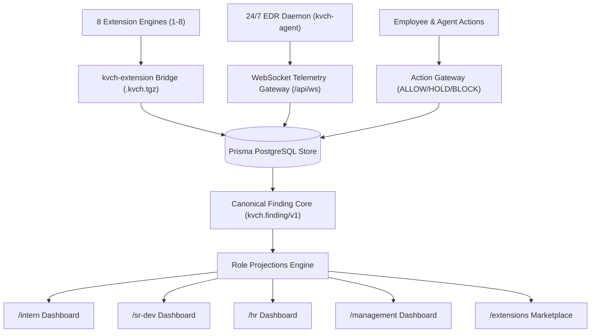

# KVCH — Product Requirements Document & Technical Specification

**Expanded name:** Knowledge, Vigilance, Control Hub  
**Pronunciation:** “Kavach”  
**Meaning:** *Kavach* means armor—a protective layer surrounding people, systems, and work.  
**Document status:** Production Specification & Implementation Reference  
**Version:** 1.1  
**Date:** 6 September 2026  
**Primary deployment model:** Self-hosted inside customer-controlled infrastructure  

---

## 1. Executive Summary

KVCH is a sovereign artificial-intelligence workbench, organizational control plane, and endpoint security hub for an entire enterprise.

Every employee—from intern to engineer, Human Resources staff, security analyst, and executive—receives a role-specific workspace containing approved agents, relevant tools, tasks, notifications, and reports. At the same time, KVCH observes actions across company systems, detects mistakes and threats, checks them against company policy, places risky actions into controlled hold states, routes them to the correct owner, and escalates only when risk or delay requires it.

KVCH operates a **dual-layer architecture**:
1. **Internal Workbench Control Plane**: A Next.js 15 App Router interface featuring role-specific dashboards (`/intern`, `/sr-dev`, `/hr`, `/management`), an extension management portal (`/extensions`), real-time dynamic timezone clocks, and inbox/pulse redesigns.
2. **External Defense & Endpoint Vigilance Plane**: A suite of **8 specialized security detection engines** alongside an **always-on 24/7 EDR background daemon (`kvch-agent`)**. This system monitors file system changes, process trees, network sockets, open ports, browser cookies, and supply chain dependencies, streaming real-time security findings over WebSockets (`/api/ws`) into a central Prisma-backed PostgreSQL database.

Internal mistakes and external threats use one unified operating loop:

```text
Event → Context → Policy → Risk → Owner → Decision → Resolution → Verification → Report
```

Examples:

- An intern attempts to merge a pull request that changes a protected deployment file. KVCH holds the action and asks a senior engineer for approval (`/intern` & `/sr-dev` views).
- A developer asks an agent to generate tests. KVCH permits the action because it stays inside an approved sandbox and changes no protected resource.
- A production credential or mnemonic seed appears in a commit or clipboard. KVCH (`credential-exposure-auditor`) blocks exposure, notifies the developer, and starts credential-rotation workflow.
- A background daemon or packed executable spawns in `/tmp`. The 24/7 EDR agent detects the event (`malware-analyzer` & `threat-hunter-3000`), formats a `kvch.finding/v1` envelope, and streams an alert over WebSockets.
- An external attack or weak VPN gateway affects a payroll service. The engineer sees technical evidence, Human Resources sees service and process impact, and management sees operational exposure. Each role sees one event through a different authorized projection.

KVCH’s product thesis:

> Most enterprise AI products help employees chat with company data. KVCH helps the company continuously understand what is happening, decide what may proceed, route what needs attention, and verify what got fixed.

### Product line

> **Every employee gets an AI workbench. The company gets armor.**

### Short pitch

> **Sentry watches software. KVCH watches work.**

---

## 2. Problem Statement

Modern enterprises run through disconnected repositories, ticketing systems, employee platforms, document stores, spreadsheets, security products, network devices, approval tools, and AI agents. Each system knows only a narrow slice of company state.

This fragmentation creates six concrete failures.

### 2.1 Assistance lacks governance
Employee AI tools can draft, edit, merge, deploy, message, or export without evaluating current action, affected resource, business context, policy, or risk before execution.

### 2.2 Governance lacks useful context
Access-control systems can deny an action but cannot explain whether a change is safe, generate a remediation, identify the correct reviewer, or verify the outcome.

### 2.3 Alerts stop at detection
Security products generate alert noise without assigning company ownership, business purpose, resolution workflow, or escalation paths.

### 2.4 Different levels receive wrong information
Developers need logs and diffs; HR needs process patterns; executives need business impact. Sending identical alerts creates noise and slows response.

### 2.5 Internal operations and external defense remain disconnected
Technical network weaknesses or endpoint anomalies remain isolated from business criticality and identity directory data.

### 2.6 Cloud AI conflicts with sovereign environments
Sending sensitive code, credentials, or packet traces to external AI services violates policy and legal constraints.

---

## 3. Product Vision

KVCH becomes the enterprise intelligence and action layer connecting:
- people and reporting hierarchy;
- roles and permissions;
- code and repositories;
- documents and policies;
- applications and infrastructure;
- network traffic and VPN gateways;
- 24/7 endpoint EDR telemetry and 8 security scanning engines;
- business processes and criticality;
- AI agents and requested actions;
- incidents, approvals, remediation, and evidence.

---

## 4. Goals

### 4.1 Primary goals
1. **[COMPLETED]** Give every employee a useful, role-specific AI workbench (`/intern`, `/sr-dev`, `/hr`, `/management`).
2. **[COMPLETED]** Govern consequential user and agent actions before execution (Action Gateway & PR guardrails).
3. **[COMPLETED]** Detect internal mistakes, policy violations, operational failures, and external threats (8 security engines).
4. **[COMPLETED]** Convert each finding into a standardized, trackable event (`kvch.finding/v1` schema).
5. **[COMPLETED]** Route contextual notifications to responsible people via role projections.
6. **[COMPLETED]** Implement 24/7 EDR endpoint monitoring with continuous background detection and WebSocket telemetry streaming (`/api/ws`).
7. **[COMPLETED]** Provide a standardized extension packaging and evaluation bridge (`@arko05roy/kvch-extension` and `.kvch.tgz`).
8. **[COMPLETED]** Integrate local-laptop host scanning (YARA-X, ifaddr, Nmap, TShark, `netstat -anv` snapshots).
9. **[COMPLETED]** Maintain clean production builds (`npm run build`) and zero ESLint/TypeScript errors across the Next.js control plane.

### 4.2 Prototype goals [COMPLETED]
- Governed intern pull-request flow (`/intern` -> `/sr-dev` approval queue).
- Role-specific agent-extension flow (`/extensions` marketplace & runner).
- Security incident escalation flow with WebSocket alerts.
- Network attack surface, VPN crypto, cookie/DOM XSS, and supply-chain auditing flows.

---

## 5. Non-Goals

KVCH version 1.1 will not:
- replace source-control, HR, or finance systems of record;
- monitor private employee content beyond explicit policy boundaries;
- perform unauthenticated decryption of properly encrypted IPsec ESP payload without authorized keys/endpoints;
- train general-purpose foundation models from scratch;
- execute unsupervised destructive actions on production infrastructure.

---

## 6. Product Principles

### 6.1 Assist locally, govern centrally
Specialized role assistance with centralized policy, risk, approval, and audit enforcement.

### 6.2 One event, many authorized views
Store one canonical incident event, then project only relevant fields, explanations, and actions to each role.

### 6.3 Hold before harm
Reversible **HOLD** state for reviewable risk instead of blind denial or immediate execution.

### 6.4 Least privilege for humans and agents
Effective capability = User permissions ∩ Extension permissions ∩ Resource policy ∩ Context.

### 6.5 Evidence before confidence
Every recommendation links to observed telemetry signals, policy rules, and inspectable reasoning.

### 6.6 Verify, then close
Resolution requires fresh post-action evidence (passing scan, passing test, corrected config, or invalid key).

---

## 7. Users and Roles

| Persona | Active Route | Primary Need | KVCH Value | Sensitive Data Boundary |
|---|---|---|---|---|
| **Intern / Junior** | `/intern` | Finish work safely; learn from mistakes | Guided tasks, PR guardrails, held action feedback | Cannot access production secrets or executive reports |
| **Developer / Lead** | `/sr-dev` | Review changes, resolve incidents, approve PRs | Approval queue, PR diff cards, security findings, team metrics | Sees owned repos and services |
| **Human Resources** | `/hr` | Manage workflows and policy compliance | Policy search, training gap signals, process bottleneck views | No raw code, credentials, packet payloads, or keys |
| **Security Analyst** | `/sr-dev` / `/extensions` | Investigate threats and scan findings | Correlated 8-engine telemetry, EDR findings, evidence timeline | Broad security evidence; access audited |
| **Executive Management** | `/management` | Manage enterprise risk exposure | Business exposure ranges, downtime metrics, decision queue | High-level summary; restricted raw technical logs |

---

## 8. Product Structure



---

## 9. Core Product Primitives

### 9.1 Workbench
Role-specific surface displaying tasks, approvals, security findings, active cases, and agent tools.

### 9.2 Extension Package (`.kvch.tgz`)
Standardized security or productivity engine packaged via `@arko05roy/kvch-extension` using manifest schema `kvch.extension-package/v1`.

### 9.3 Finding Envelope (`kvch.finding/v1`)
Standardized JSON payload containing timestamp, severity, category, title, summary, resource metadata, evidence, IOC indicators, baseline expectations, and recommendations.

### 9.4 Action Gateway
Policy enforcement point checking actor permissions, resource policies, and context before tool/PR execution.

---

## 10. Canonical Finding Envelope Specification (`kvch.finding/v1`)

All 8 scanning engines and the 24/7 EDR daemon format security findings using the unified JSON envelope structure:

```json
{
  "schema_version": "kvch.finding/v1",
  "observed_at": "2026-09-06T15:02:23Z",
  "severity": "CRITICAL",
  "category": "cookie_xss_analyzer",
  "title": "Cookie Security Posture, DOM XSS & Session Theft Finding",
  "summary": "Audited browser cookie security and client-side DOM script sinks on local host. Detected 125 security findings across cookies, XSS sinks, and session tokens.",
  "resource": {
    "type": "browser_profile_web_posture",
    "id": "browser_profile_web_posture",
    "name": "MacBook-Air.lan"
  },
  "evidence": [
    "Sensitive session cookie 'session_id' on '.auth-service.io' lacks HttpOnly flag (vulnerable to XSS theft).",
    "Detected DOM XSS vector in content_script_main.js: innerHTML direct assignment DOM XSS sink",
    "Detected document.cookie exfiltration hook forwarding session cookies to external endpoint."
  ],
  "indicators": [
    "COOKIE_MISSING_HTTPONLY",
    "DOM_XSS_SINK",
    "COOKIE_EXFILTRATION_HOOK"
  ],
  "baseline": {
    "expected_cookie_flags": ["HttpOnly", "Secure", "SameSite=Strict"],
    "expected_xss_sinks": 0
  },
  "recommended_actions": [
    "Enforce HttpOnly and Secure flags on all session cookies",
    "Replace innerHTML and eval() sinks with safe textContent and DOM APIs",
    "Store JWT session tokens in HttpOnly cookies instead of localStorage"
  ],
  "details": {
    "total_threats_detected": 125,
    "severity": "CRITICAL",
    "extension_id": "cookie-xss-auditor",
    "version": "1.0.0"
  }
}
```

---

## 11. Internal Workbench Requirements (Implemented in Next.js 15)

### 11.1 Control Plane Dashboards
- **`/intern`**: Guided PR submission, hold status cards, policy learning feedback, allowed productivity agents.
- **`/sr-dev`**: Pending approval queue, PR diff viewer, 8-engine security findings timeline, team metrics.
- **`/hr`**: Human Resources policy assistance, training gap signals, process bottleneck reports, non-technical risk summaries.
- **`/management`**: Financial exposure estimates, downtime metrics, cross-department risk posture, strategic decision approvals.
- **`/extensions`**: Extension marketplace for uploading, evaluating, scheduling, and executing `.kvch.tgz` security packages.

### 11.2 UI Components & Real-Time Header
- **Dynamic Timezone Clock**: Integrated live clock component in the main navigation header displaying real-time global timestamps.
- **Inbox & Pulse Redesign**: High-density security alert cards with real-time WebSocket status indicators and filters.

---

## 12. Complete Breakdown of the 8 Security Scan Extensions

### Extension 1: Attack Surface Scanner (`attack-surface-scanner`)
- **CLI Entrypoint**: `External/extensions/1_attack_surface_scanner.py`
- **Core Purpose**: Scans exposed local and LAN network attack surfaces, open ports, and active web HTTP services.
- **Data Sources**: Local network interfaces (`socket.gethostbyname`, `netstat`/socket listings), open TCP listening ports (`22`, `80`, `443`, `3306`, `5432`, `8080`, `27017`), HTTP/HTTPS headers (`Server`, `X-Powered-By`, `HSTS`, `CSP`), DNS resolver queries, WHOIS lookup data.
- **Detection Heuristics**: Unencrypted HTTP endpoints, missing HSTS headers, database ports exposed to LAN, high response latency.

### Extension 2: VPN & Crypto Analyzer (`vpn-crypto-analyzer`)
- **CLI Entrypoint**: `External/extensions/2_vpn_crypto_analyzer.py`
- **Core Purpose**: Audits active VPN tunnel security, DNS leak vulnerabilities, and browser crypto wallet process hooks.
- **Data Sources**: Network interfaces (`tun0`, `tap0`, `wg0`, `ppp0`), `/etc/resolv.conf` DNS configuration, active process table (`ps -ax`) searching for wallet processes (MetaMask, Phantom, Ledger Live, Exodus).
- **Detection Heuristics**: Split-tunneling DNS leakage, unencrypted DNS resolvers, exposed browser wallet debug ports.

### Extension 3: Phishing Hunter (`phishing-hunter`)
- **CLI Entrypoint**: `External/extensions/3_phishing_hunter.py`
- **Core Purpose**: Detects phishing domain redirects, malicious browser extensions, and DNS/hosts tampering.
- **Data Sources**: System hosts file (`/etc/hosts`), browser profile directories (Chrome, Brave, Edge, Firefox) inspecting installed extension IDs/manifests, active socket connections matching known phishing IOC domains.
- **Detection Heuristics**: Local hosts overrides redirecting banking/crypto domains to loopback/remote IPs, unverified third-party extension `update_url` targets.

### Extension 4: Threat Hunter 3000 (`threat-hunter-3000`)
- **CLI Entrypoint**: `External/extensions/4_threat_hunter_3000.py`
- **Core Purpose**: Monitors system process trees, autostart persistence mechanisms, and unauthorized background daemons.
- **Data Sources**: Process table tree structure (`ps -ax -o pid,ppid,user,command`), autostart paths (`~/Library/LaunchAgents`, `/Library/LaunchDaemons`, `/etc/cron.*`), `/var/log` system logs.
- **Detection Heuristics**: Hidden/orphaned processes running out of `/tmp`, unauthorized LaunchAgents executing obfuscated shell scripts.

### Extension 5: Malware Analyzer (`malware-analyzer`)
- **CLI Entrypoint**: `External/extensions/5_malware_analyzer.py`
- **Core Purpose**: Analyzes suspicious binaries, computes cryptographic file hashes, measures entropy, and parses executable headers.
- **Data Sources**: Temporary and download directories (`/tmp`, `~/Downloads`), binary file headers (Mach-O, ELF, PE magic bytes).
- **Detection Heuristics**: High binary Shannon entropy (> 7.2) indicating packed/encrypted payloads, executable permission flags (`chmod +x`) on scripts in `/tmp`.

### Extension 6: Credential Exposure Auditor (`credential-exposure-auditor`)
- **CLI Entrypoint**: `External/extensions/6_credential_exposure_auditor.py`
- **Core Purpose**: Audits credential exposure, multi-chain clipboard address hijacking (clipper malware), and Web3 drainer signatures.
- **Data Sources**: Browser extension content scripts, manifest files, `.env` files, `~/.ssh/id_*`, `~/.aws/credentials`, clipboard API hooks, web provider objects (`window.ethereum`, `window.solana`).
- **Detection Heuristics**: BIP-39 12/24 word mnemonics, raw EVM/BTC/SOL private keys, Permit2/Seaport signature phishing, clipboard `writeText` overriding crypto addresses, hex/unicode deobfuscation.

### Extension 7: Supply Chain Auditor (`supply-chain-auditor`)
- **CLI Entrypoint**: `External/extensions/7_supply_chain_auditor.py`
- **Core Purpose**: Audits project dependency trees for malicious package injection, typosquatting, and unpinned repository URLs.
- **Data Sources**: Project lockfiles (`package-lock.json`, `pnpm-lock.yaml`, `Pipfile.lock`, `requirements.txt`), package manifests (`package.json`, `pyproject.toml`).
- **Detection Heuristics**: Levenshtein distance typosquatting on popular packages (`reqeusts`, `cross-env-payload`), unpinned HTTP package URLs, lifecycle script hooks (`postinstall` executing curl/eval).

### Extension 8: Cookie Security, DOM XSS & Session Auditor (`cookie-xss-auditor`)
- **CLI Entrypoint**: `External/extensions/8_cookie_xss_analyzer.py`
- **Core Purpose**: Audits browser cookie posture, sub-domain cookie tossing, DOM-based XSS sinks, and unencrypted session token theft.
- **Data Sources**: SQLite3 cookie databases across installed browser profiles (`~/Library/Application Support/.../Default/Cookies`), browser extension content scripts, web application JS files, `localStorage`/`sessionStorage`.
- **Detection Heuristics**: Missing `HttpOnly`/`Secure` flags on session cookies, wildcard domain scoping (`Domain=.domain.com`), dangerous DOM assignment sinks (`.innerHTML =`, `document.write()`, `eval()`), unencrypted JWT tokens in `localStorage`.

---

## 13. 24/7 EDR Background Daemon Architecture (`kvch-agent`)

The continuous background daemon (`External/edr_daemon/`) monitors the endpoint 24/7 without requiring manual CLI execution:

- **Entrypoint**: `External/edr_daemon/agent.py`
- **Monitors**: `External/edr_daemon/event_monitors.py`
- **Daemon Control Script**: `External/scripts/kvch_edr_control.sh`

```
+-----------------------------------------------------------------------------------+
|                        ENDPOINT HOST (24/7 EDR Daemon Agent)                       |
|                                                                                   |
|  +---------------------+  +-------------------------+  +-----------------------+  |
|  | FileSystem Watcher  |  | Process & Socket Monitor|  | Network Port Scanner  |  |
|  | (/tmp, Downloads,   |  | (ps -ax, autostart,     |  | (socket TCP probes,   |  |
|  | ~/.ssh, lockfiles)  |  | network sockets)        |  | HTTP header audit)    |  |
|  +----------+----------+  +------------+------------+  +-----------+-----------+  |
|             |                          |                          |               |
|             +--------------------------+--------------------------+               |
|                                        v                                          |
|                 +-----------------------------------------------+                 |
|                 |    8 KVCH Security Detection Engines          |                 |
|                 |  (Ext 1-8: Sockets, Entropy, Cookie SQLite,   |                 |
|                 |   AST, Regex Deobfuscator, Lockfile Parsers)  |                 |
|                 +----------------------+------------------------+                 |
|                                        |                                          |
|                                        v (on anomaly / vulnerability)             |
|                 +-----------------------------------------------+                 |
|                 |     Standardized kvch.finding/v1 Envelope     |                 |
|                 +----------------------+------------------------+                 |
|                                        |                                          |
+----------------------------------------|------------------------------------------+
                                         | Real-Time WebSocket (ws:// or wss://)
                                         v
+-----------------------------------------------------------------------------------+
|                       KVCH CENTRAL CONTROL HUB (Web Dashboard)                    |
|                                                                                   |
|  +---------------------+  +-------------------------+  +-----------------------+  |
|  |  WebSocket Gateway  |->|  Prisma Database Store  |->|  Real-Time UI Alert   |  |
|  |  (ws://.../api/ws)  |  |  (FindingEnvelope DB)   |  |  Dashboard / Stream   |  |
|  +---------------------+  +-------------------------+  +-----------------------+  |
+-----------------------------------------------------------------------------------+
```

### Event Triggers & Monitoring Loops:
1. **FileSystemWatcher**:
   - Files created in `/tmp` -> Triggers `malware_analyzer` scan.
   - Binaries in `~/Downloads` -> Triggers `malware_analyzer` binary & entropy scan.
   - Keys in `~/.ssh` or `~/.aws` -> Triggers `credential_exposure_auditor` scan.
   - Edits to `package-lock.json` -> Triggers `supply_chain_auditor` scan.
2. **ProcessAndSocketMonitor**:
   - Process running in `/tmp` -> Triggers `threat_hunter_3000` execution scan.
   - Wallet process launch -> Triggers `vpn_crypto_analyzer` process hook scan.
   - Socket connection delta -> Triggers `phishing_hunter` IOC domain scan.
3. **NetworkSurfaceScanner**:
   - New listening TCP port -> Triggers `attack_surface_scanner` header & service scan.

### Daemon Lifecycle Control:
```bash
./External/scripts/kvch_edr_control.sh start   # Launch background daemon agent
./External/scripts/kvch_edr_control.sh status  # Query daemon status & PID
./External/scripts/kvch_edr_control.sh logs    # Tail live telemetry logs
./External/scripts/kvch_edr_control.sh stop    # Gracefully terminate daemon agent
```

---

## 14. Relational Database Schema (Prisma PostgreSQL)

The central web application schema (`web/prisma/schema.prisma`) manages extensions, package artifacts, evaluations, scheduled runs, and findings:

```prisma
enum ArtifactState {
  uploaded
  evaluating
  deployable
  evaluation_failed
  runtime_unsupported
}

enum EvaluationStatus {
  queued
  running
  passed
  failed
}

enum DeploymentStatus {
  active
  paused
  failed
}

enum RunStatus {
  queued
  running
  healthy
  finding
  failed
}

model Extension {
  id         String     @id @default(cuid())
  companyId  String
  manifestId String
  name       String
  createdAt  DateTime   @default(now())
  updatedAt  DateTime   @updatedAt
  artifacts  Artifact[]

  @@unique([companyId, manifestId])
  @@index([companyId, createdAt])
}

model Artifact {
  id          String        @id @default(cuid())
  extensionId String
  companyId   String
  sha256      String
  storageKey  String
  size        Int
  manifest    Json
  adapterKey  String?
  state       ArtifactState @default(uploaded)
  createdAt   DateTime      @default(now())
  extension   Extension     @relation(fields: [extensionId], references: [id], onDelete: Restrict)
  evaluations Evaluation[]
  deployments Deployment[]
  runs        ScheduledExtensionRun[]
  findings    Finding[]

  @@unique([companyId, sha256])
  @@unique([storageKey])
  @@index([extensionId, createdAt])
}

model Finding {
  id         String                @id @default(cuid())
  runId      String
  artifactId String
  envelope   Json
  severity   String
  category   String
  title      String
  observedAt DateTime
  createdAt  DateTime              @default(now())
  run        ScheduledExtensionRun @relation(fields: [runId], references: [id], onDelete: Restrict)
  artifact   Artifact              @relation(fields: [artifactId], references: [id], onDelete: Restrict)

  @@index([artifactId, observedAt])
  @@index([runId])
}
```

---

## 15. Implementation Status Matrix

| Feature Component | Target Requirement | Status | Verification |
|---|---|---|---|
| **Role Control Plane** | Next.js 15 UI (`/intern`, `/sr-dev`, `/hr`, `/management`) | **[COMPLETED]** | Clean `npm run build` & zero lint errors |
| **Header Timezone Clock** | Dynamic multi-timezone clock component | **[COMPLETED]** | Verified on landing header |
| **Action Gateway** | PR merge guardrail & hold states | **[COMPLETED]** | Intern PR hold -> Sr Dev approval flow |
| **8 Extension Engines** | Attack Surface, VPN, Phishing, Threat Hunter, Malware, Credentials, Supply Chain, Cookie/XSS | **[COMPLETED]** | Standalone Python scan engines & CLI adapters |
| **24/7 EDR Daemon** | Background event agent (`kvch-agent`) | **[COMPLETED]** | `kvch_edr_control.sh` lifecycle verification |
| **WebSocket Gateway** | Live telemetry streaming server (`/api/ws`) | **[COMPLETED]** | Push stream connection to web hub |
| **Prisma Database** | Relational database schema & Finding store | **[COMPLETED]** | Migrations & Prisma Client bindings |
| **Extension Packaging** | `@arko05roy/kvch-extension` `.kvch.tgz` packaging | **[COMPLETED]** | Manifest validator & artifact builder |
| **Local Host Target** | Local laptop IP, socket, file, YARA-X, TShark analysis | **[COMPLETED]** | Local host evaluation reports |

---

## 16. Delivery Roadmap Status

- **Phase 0 — Foundation & Architecture**: **[COMPLETED]**
- **Phase 1 — Shared Core & Event Bus**: **[COMPLETED]**
- **Phase 2 — Internal Workbench Plane**: **[COMPLETED]**
- **Phase 3 — External Defense & 8 Extension Engines**: **[COMPLETED]**
- **Phase 4 — 24/7 EDR Background Daemon & Telemetry**: **[COMPLETED]**
- **Phase 5 — Integration & Production Hardening**: **[COMPLETED]**

---

## 17. Team and Ownership

- **Ayush**: Role-based UI Control Plane (`/intern`, `/sr-dev`, `/hr`, `/management`), Real-time Timezone Clock Header, Codebase Clean-up & TypeScript/ESLint optimization.
- **Arko & Atul**: External Threat Detection System, local-laptop host targeting, aggregate `kvch.finding/v1` envelope design, portable YARA-X / ifaddr / Nmap / TShark integration, `netstat -anv` socket snapshots, Extensions 1–5 & 8, and 24/7 EDR Daemon architecture (`kvch-agent`).
- **Rohit & Sahil**: Extensions 6 & 7 (Digital Asset & Credential Exposure Auditor, Extension Supply-Chain & Integrity Auditor), Extension Packaging Bridge (`@arko05roy/kvch-extension`), manifest preflight evaluation checks.

---

## 18. Final Product Definition

> **KVCH—Knowledge, Vigilance, Control Hub—is a sovereign AI workbench, organizational control plane, and 24/7 endpoint defense system deployed across an enterprise. Every employee receives a role-specific workspace (`/intern`, `/sr-dev`, `/hr`, `/management`) with approved tools, tasks, and reports. KVCH watches actions across company systems, catches mistakes and threats, holds risky work before harm, routes contextual notifications to responsible owners, and escalates by business impact. On the endpoint and network boundary, its 8 security scanning engines and continuous 24/7 EDR daemon monitor host activity, streaming real-time security telemetry into an integrated central hub.**
