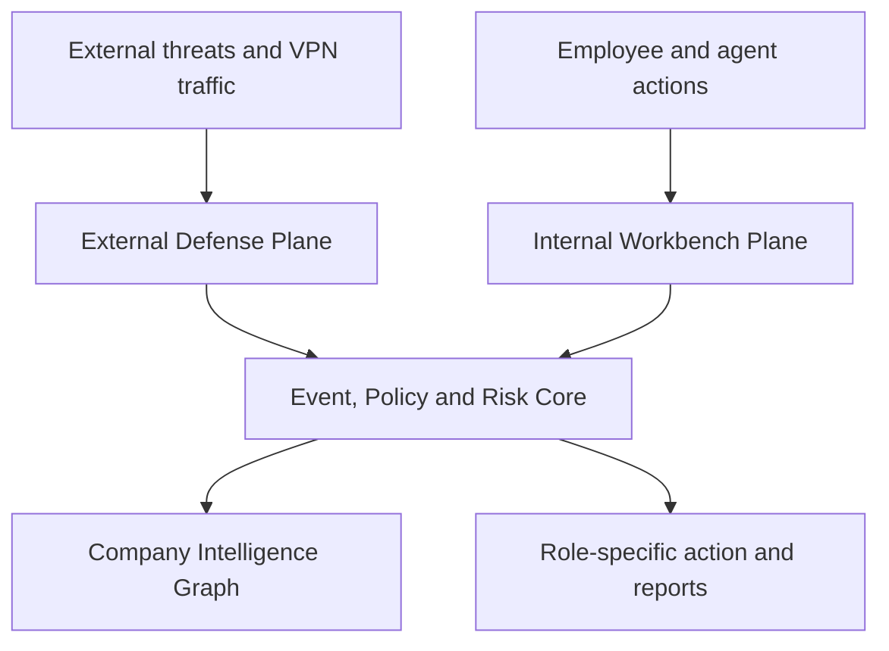
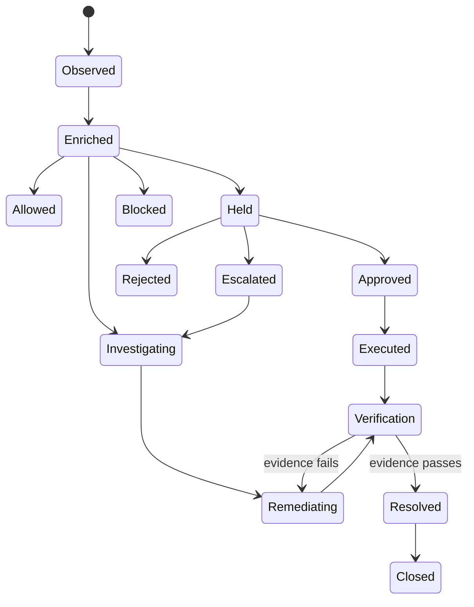
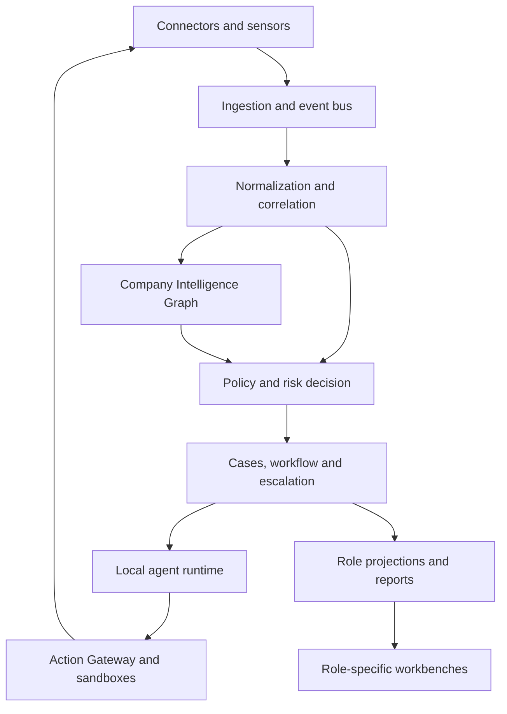

# KVCH — Product Requirements Document

**Expanded name:** Knowledge, Vigilance, Control Hub  
**Pronunciation:** “Kavach”  
**Meaning:** *Kavach* means armor—a protective layer surrounding people, systems, and work.  
**Document status:** Product definition and prototype specification  
**Version:** 1.0  
**Date:** 3 September 2026  
**Primary deployment model:** Self-hosted inside customer-controlled infrastructure

---

## 1. Executive Summary

KVCH is a sovereign artificial-intelligence workbench and organizational control plane for an entire enterprise.

Every employee—from intern to engineer, Human Resources staff, security analyst, and executive—receives a role-specific workspace containing approved agents, relevant tools, tasks, notifications, and reports. At the same time, KVCH observes actions across company systems, detects mistakes and threats, checks them against company policy, places risky actions into controlled hold states, routes them to the correct owner, and escalates only when risk or delay requires it.

KVCH also protects the company boundary. Its first external-defense module analyzes Internet Protocol Security (IPsec) Virtual Private Network (VPN) traffic and configurations. It identifies protocol characteristics, assesses cryptographic posture, detects weaknesses, classifies encrypted traffic from metadata where possible, and produces technical and executive reports.

Internal mistakes and external threats use one operating loop:

```text
Event → Context → Policy → Risk → Owner → Decision → Resolution → Verification → Report
```

Examples:

- An intern attempts to merge a pull request that changes a protected deployment file. KVCH holds the action and asks a senior engineer for approval.
- A developer asks an agent to generate tests. KVCH permits the action because it stays inside an approved sandbox and changes no protected resource.
- A production credential appears in a commit. KVCH blocks exposure, notifies the developer, and starts credential-rotation workflow.
- An IPsec gateway runs with weak configuration. KVCH identifies the network owner, opens a remediation task, and reports business impact upward.
- An external attack affects a payroll service. The engineer sees technical evidence, Human Resources sees service and process impact, and management sees operational and financial exposure. Each role sees one event through a different authorized projection.

KVCH’s product thesis:

> Most enterprise AI products help employees chat with company data. KVCH helps the company continuously understand what is happening, decide what may proceed, route what needs attention, and verify what got fixed.

### Product line

> **Every employee gets an AI workbench. The company gets armor.**

### Short pitch

> **Sentry watches software. KVCH watches work.**

Sentry, referenced here as product analogy, is an application-observability platform that detects software errors and sends contextual evidence to responsible developers. KVCH extends that detect-contextualize-route-resolve loop across company work, policies, agents, systems, and network defenses.

---

## 2. Problem Statement

Modern enterprises run through disconnected repositories, ticketing systems, employee platforms, document stores, spreadsheets, security products, network devices, approval tools, and AI agents. Each system knows only a narrow slice of company state.

This fragmentation creates six concrete failures.

### 2.1 Assistance lacks governance

Employee AI tools can draft, edit, merge, deploy, message, or export. Most tools treat permission as a binary login question: user either has access or does not. They rarely evaluate current action, affected resource, business context, policy, or risk before execution.

Result: agent makes bad action faster.

### 2.2 Governance lacks useful context

Traditional access-control systems can deny an action but cannot explain whether a particular change is safe, generate a remediation, identify correct reviewer, or verify later outcome.

Result: safe work gets blocked; risky work sometimes slips through coarse rules.

### 2.3 Alerts stop at detection

Security and observability products create alerts. Alerts often lack company ownership, business purpose, relevant policy, resolution workflow, and escalation path.

Result: alert exists, nobody owns fix.

### 2.4 Different levels receive wrong information

Developers need logs and diffs. Human Resources needs training and staffing patterns. Executives need downtime, money, and business exposure. Sending identical incident payload to every role creates noise, leaks sensitive data, and slows response.

### 2.5 Internal operations and external defense remain disconnected

A weak VPN configuration appears in network tooling. Service ownership lives elsewhere. Business criticality lives inside documents or enterprise-resource systems. Responsible engineer exists inside identity directory. No system joins those facts.

Result: technical weakness never becomes owned business action.

### 2.6 Cloud AI conflicts with sovereign environments

Code, employee records, incident evidence, network traces, contracts, and executive reports can contain highly sensitive information. Sending such material to external AI services may violate policy, contractual constraints, or national-security requirements.

Result: valuable AI workflows cannot be deployed—or get deployed unsafely through shadow tools.

---

## 3. Product Vision

KVCH becomes company-wide intelligence and action layer connecting:

- people and reporting hierarchy;
- roles and permissions;
- code and repositories;
- documents and policies;
- applications and infrastructure;
- network traffic and VPN gateways;
- business processes and criticality;
- AI agents and their requested actions;
- incidents, approvals, remediation, and evidence.

KVCH must understand both work and consequence.

It should answer:

1. What happened or is about to happen?
2. Who or what initiated it?
3. Which resource, process, or business function can be affected?
4. Does company policy permit it?
5. How severe and credible is risk?
6. Who owns technical response?
7. Who else needs an authorized summary?
8. Should KVCH allow, hold, block, or escalate?
9. Can an approved agent assist remediation?
10. What evidence proves resolution?

---

## 4. Goals

### 4.1 Primary goals

1. Give every employee a useful, role-specific AI workbench.
2. Govern consequential user and agent actions before execution.
3. Detect internal mistakes, policy violations, operational failures, and external threats.
4. Convert each finding into an owned, trackable event.
5. Route contextual notifications to responsible people.
6. Generate different authorized views from one canonical event.
7. Escalate unresolved or high-impact events through company hierarchy.
8. Help users investigate and remediate through approved agents.
9. Verify resolution using fresh evidence rather than manual checkbox closure.
10. Analyze IPsec VPN posture and encrypted-traffic metadata as first external-defense module.
11. Run sensitive inference, retrieval, telemetry processing, and agent execution locally.
12. Maintain complete audit trail for human and agent decisions.

### 4.2 Prototype goals

Prototype must prove four end-to-end loops:

- governed intern pull-request flow;
- role-specific agent-extension flow;
- internal or external security incident escalation flow;
- IPsec capture analysis and automated reporting flow.

### 4.3 Business goals

- Reduce preventable employee mistakes reaching production or formal approval.
- Reduce mean time from detection to correct owner assignment.
- Reduce notification noise through role-aware projections.
- Reduce mean time to remediation.
- Demonstrate sovereign AI without unauthorized external requests.
- Create extensible platform where new departmental workbenches and defense modules share same primitives.

---

## 5. Non-Goals

KVCH version 1 will not:

- replace source-control, Human Resources, finance, Security Information and Event Management, or endpoint-security systems;
- become unrestricted autonomous administrator across company systems;
- infer employee performance scores from raw activity volume;
- monitor private employee content beyond explicit company policy and authorized connectors;
- inspect plaintext hidden inside properly encrypted IPsec traffic without lawful endpoint access or decryption keys;
- claim deterministic identification of encrypted application traffic from metadata;
- train a general-purpose foundation model from scratch;
- provide payroll processing, applicant tracking, accounting, or customer relationship management as systems of record;
- permit extensions to exceed invoking user permissions;
- automatically take destructive or high-impact action without configured approval;
- serve as full network intrusion-detection replacement in prototype scope;
- support every VPN protocol during first release.

---

## 6. Product Principles

### 6.1 Assist locally, govern centrally

Each role gets specialized assistance. All consequential actions pass through common policy, risk, approval, and audit services.

### 6.2 One event, many authorized views

KVCH stores one canonical incident or work event, then projects only relevant fields, explanation depth, and recommended actions to each role.

### 6.3 Hold before harm

When intent looks legitimate but risk requires review, KVCH uses a reversible **HOLD** state instead of blindly allowing or permanently denying.

### 6.4 Least privilege for humans and agents

Effective agent permission equals intersection of user permission, extension permission, resource policy, and current context.

```text
Effective capability
  = User permissions
  ∩ Extension permissions
  ∩ Resource policy
  ∩ Contextual constraints
```

### 6.5 Evidence before confidence

Every recommendation must link to observed signals, applicable policy, and reasoning. Low confidence must remain visible.

### 6.6 Verify, then close

Resolution requires post-action evidence: clean scan, passing test, rotated credential, corrected configuration, restored service, or explicit authorized exception.

### 6.7 Sovereignty must be measurable

“Runs locally” is insufficient. Prototype must prove local model execution, local retrieval, logged egress, configurable network isolation, and zero unauthorized external AI calls.

### 6.8 Productivity data must not become surveillance by default

KVCH may help employee and protect company. It must not quietly convert assistance telemetry into opaque worker scoring. Collection purpose, retention, visibility, and use must be policy-bound and auditable.

---

## 7. Users and Roles

| Persona | Primary need | KVCH value | Sensitive data boundary |
|---|---|---|---|
| Intern / junior employee | Finish work safely; understand mistakes | Guided tasks, approved extensions, clear holds, learning feedback | Cannot access unrelated teams, production secrets, executive reports |
| Developer | Ship code, review changes, resolve incidents | Pull-request help, tests, debugging, deployment checks, actionable alerts | Sees owned repositories and services |
| Senior engineer / team lead | Review risky changes; keep services healthy | Approval queue, team incidents, root-cause evidence, escalation control | Sees team scope; cross-team access requires incident role |
| Human Resources staff | Run employee workflows and improve process | Policy search, document support, training-gap summaries, staffing impact | No raw code, credentials, packet payloads, or unrelated medical/personal data |
| Security analyst | Investigate threats and weaknesses | Correlated telemetry, attack path, IPsec analysis, evidence timeline | Broad security evidence; access itself audited |
| Network engineer | Operate VPNs and network controls | Configuration findings, packet metadata, remediation guidance | No business records beyond required service context |
| Chief Information Security Officer | Manage company security exposure | Portfolio risk, unresolved critical events, control investment view | Executive security scope |
| Chief Technology Officer | Manage engineering and technology risk | Service health, ownership gaps, remediation performance | Technical and business summaries |
| Chief Marketing Officer | Protect customer trust and communication | Customer/brand impact, approved incident communication workflow | Receives event only when brand or customer communication is relevant |
| Executive management | Understand business consequence and approve investment | Financial exposure, downtime, trends, high-impact decisions | Aggregated view; restricted raw evidence |
| Platform administrator | Configure KVCH | Connectors, roles, policies, models, extensions, retention | Cannot silently read all business content; privileged operations audited |
| Auditor / compliance reviewer | Prove controls operated | Immutable decision trail, policy versions, evidence packages | Read-only, time-bound, scoped access |

### 7.1 Role model

Roles are not hardcoded into product logic. KVCH ships templates, while customers map their identity directory groups and reporting hierarchy into customizable roles.

Each role contains:

- resource scopes;
- allowed actions;
- approval authority;
- notification preferences;
- escalation position;
- dashboard modules;
- installable extension catalog;
- report visibility;
- data-redaction rules.

---

## 8. Product Structure

KVCH contains two operating planes joined by shared intelligence services.



### 8.1 Internal Workbench Plane

Provides:

- personal role-based dashboards;
- role-specific AI agents;
- internal extension catalog;
- action interception;
- policy evaluation;
- hold and approval states;
- contextual notifications;
- investigation and remediation workflows;
- upstream reporting.

### 8.2 External Defense Plane

First module provides:

- IPsec VPN testbed generation;
- packet capture ingestion;
- Internet Key Exchange (IKE) and Encapsulating Security Payload (ESP) identification;
- tunnel-versus-transport mode analysis;
- cryptographic and Security Association assessment;
- encrypted-traffic metadata classification;
- risk, threat, confidence, technical, and executive reports.

### 8.3 Shared Core

Both planes use:

- canonical event model;
- company intelligence graph;
- policy decision point;
- risk engine;
- ownership resolver;
- notification and escalation engine;
- agent runtime;
- report generator;
- audit and evidence store.

---

## 9. Core Product Primitives

### 9.1 Workbench

Personal surface containing role-relevant tasks, alerts, agents, reports, approvals, and recent activity.

### 9.2 Extension

Admin-approved package giving an AI agent tools, instructions, input/output schema, resource scopes, and allowed actions. Extension never gains broader permission than user invoking it.

### 9.3 Event

Normalized record describing observed or requested activity that may require context, decision, ownership, or follow-up.

### 9.4 Policy

Versioned rule mapping actor, resource, action, context, and risk into decision and approval requirements.

### 9.5 Decision

One of:

- **ALLOW:** action may execute immediately;
- **HOLD:** action waits for named approval or additional evidence;
- **BLOCK:** action may not execute under current policy;
- **ESCALATE:** event proceeds to higher authority or specialist review;
- **OBSERVE:** no intervention, but event remains recorded and may affect later correlation.

### 9.6 Case

Container grouping related events, evidence, owners, tasks, decisions, communications, and reports into one incident or operational workflow.

### 9.7 Projection

Role-specific rendering of canonical case. Projection applies field-level access, redaction, explanation style, and action availability.

### 9.8 Evidence

Immutable or integrity-protected artifact supporting decision: diff, log excerpt, policy version, packet metadata, model output, test result, approval, or verification result.

### 9.9 Escalation

Rule-driven transfer or widening of visibility based on severity, confidence, business impact, elapsed time, failed remediation, or policy obligation.

### 9.10 Verification

Fresh observation proving risk reduced or action completed.

---

## 10. Canonical Event Lifecycle



### 10.1 Required transitions

Every state transition records:

- timestamp;
- actor: human, system, sensor, or agent;
- policy version;
- previous and next state;
- decision explanation;
- evidence references;
- confidence where inference contributed;
- approver where applicable;
- resulting notifications;
- correlation identifier.

### 10.2 Event severity

| Severity | Meaning | Default response |
|---|---|---|
| Informational | Useful context; no expected harm | Observe or notify actor only |
| Low | Local reversible issue | Notify owner; no escalation unless overdue |
| Medium | Team/process impact possible | Assign owner; deadline; team escalation |
| High | Production, sensitive data, or material workflow at risk | Hold/block; page responsible lead; open case |
| Critical | Active compromise, major outage, severe exposure, or legal obligation | Immediate containment path; security and executive escalation |

Severity is separate from confidence. High-severity, low-confidence findings require urgent validation—not fake certainty.

---

## 11. Company Intelligence Graph

Company Intelligence Graph links organizational, technical, policy, and business entities.

### 11.1 Core node types

- Person
- Role
- Team
- Department
- Manager relationship
- Repository
- Pull request
- Service
- Environment
- Server / workload
- Database
- Network gateway
- VPN tunnel
- Document
- Policy
- Business process
- Customer-facing capability
- Vendor
- Extension
- Agent
- Event
- Case
- Risk
- Control
- Approval
- Report

### 11.2 Core relationship types

- `PERSON MEMBER_OF TEAM`
- `PERSON REPORTS_TO PERSON`
- `PERSON OWNS RESOURCE`
- `ROLE MAY_PERFORM ACTION`
- `REPOSITORY DEPLOYS SERVICE`
- `SERVICE RUNS_ON WORKLOAD`
- `SERVICE ACCESSES DATABASE`
- `SERVICE SUPPORTS BUSINESS_PROCESS`
- `VPN_PROTECTS NETWORK_SEGMENT`
- `POLICY GOVERNS RESOURCE_OR_ACTION`
- `EVENT AFFECTS RESOURCE`
- `CASE GROUPS EVENT`
- `PERSON RESPONDS_TO CASE`
- `CONTROL MITIGATES RISK`
- `REPORT PROJECTS CASE_FOR ROLE`

### 11.3 Required graph query

Given any event, KVCH must determine:

1. affected technical resource;
2. responsible operational owner;
3. manager and escalation path;
4. connected business process;
5. business criticality;
6. applicable policy;
7. potentially affected department;
8. authorized audiences;
9. recommended control owner.

Example reasoning chain:

```text
Weak VPN gateway
→ protects payroll subnet
→ contains payroll application
→ owned by HR Operations
→ gateway owned by Network Engineering
→ technical fix assigned to network engineer
→ service-impact summary visible to HR
→ risk summary visible to CISO
→ executive escalation only if exposure threshold crossed
```

---

## 12. Internal Workbench Requirements

### 12.1 Personalized dashboard

**FR-IW-001:** System must derive dashboard modules from role, team, owned resources, permissions, installed extensions, and open cases.

**FR-IW-002:** User must see “My Work” combining assigned tasks, held actions, approvals, alerts, agent runs, and requested reports.

**FR-IW-003:** Dashboard must prioritize by urgency, deadline, business impact, and whether user can take next action.

**FR-IW-004:** User must be able to ask why any item appears on dashboard.

**FR-IW-005:** User must not see unauthorized fields merely because event is visible in aggregate.

### 12.2 Agent extension catalog

**FR-IW-010:** Admin must publish extensions to company catalog and target them by role, team, or resource scope.

**FR-IW-011:** Extension detail page must show purpose, tools, requested permissions, data accessed, publisher, version, and approval status.

**FR-IW-012:** User may install only eligible extensions.

**FR-IW-013:** High-risk extensions require administrator or manager approval before activation.

**FR-IW-014:** Every extension run must receive short-lived scoped credentials.

**FR-IW-015:** Extension output must separate suggestions, proposed actions, and executed actions.

**FR-IW-016:** User must review diff or action plan before any write unless policy explicitly allows automatic execution.

**FR-IW-017:** Admin must revoke extension version and prevent new runs immediately.

**FR-IW-018:** Existing runs using revoked extension must stop at next tool boundary.

### 12.3 Action gateway

Action Gateway intercepts consequential operations requested through KVCH agents or supported integrations.

**FR-IW-020:** Gateway must normalize action into actor, resource, verb, parameters, environment, extension, and evidence.

**FR-IW-021:** Gateway must evaluate policy before tool execution.

**FR-IW-022:** Gateway must support ALLOW, HOLD, BLOCK, ESCALATE, and OBSERVE.

**FR-IW-023:** HOLD must preserve requested action and immutable input snapshot.

**FR-IW-024:** Approver must see exact proposed change, reason, risk, policy, and agent provenance.

**FR-IW-025:** Approved action must be invalidated if underlying resource changes materially before execution.

**FR-IW-026:** Approval must expire after policy-defined time.

**FR-IW-027:** BLOCK must explain violated policy and safe recovery path without exposing sensitive rule internals.

**FR-IW-028:** Break-glass override must require elevated authority, reason, time limit, and enhanced audit.

### 12.4 Pull-request workflow

A pull request (PR) is proposed source-code change awaiting review before merge.

**FR-IW-030:** KVCH must inspect changed files, diff, authorship, branch protection, tests, reviewer status, secret findings, dependency changes, and user authority.

**FR-IW-031:** Protected file classes must be configurable; examples include deployment definitions, access policies, security workflows, and production configuration.

**FR-IW-032:** Rules must target resource class and context, not brittle filenames alone. `.gitignore` may be valid change; risk depends repository, diff, policy, and actor.

**FR-IW-033:** Intern-initiated merge touching protected production resource must enter HOLD and route to eligible senior reviewer.

**FR-IW-034:** Reviewer must receive Sentry-style card containing actor, repository, PR, risky diff, likely impact, evidence, recommended action, and controls.

**FR-IW-035:** Approved PR must still satisfy repository branch checks at merge time.

**FR-IW-036:** Rejected PR must return actionable explanation to author.

**FR-IW-037:** KVCH may propose patch, tests, or documentation but may not fabricate passing results.

### 12.5 Notifications

**FR-IW-040:** Notification must contain severity, confidence, affected resource, owner, why recipient sees it, recommended action, deadline, and case status.

**FR-IW-041:** Notification channels must include in-product inbox and connector-ready email/chat/webhook delivery.

**FR-IW-042:** Duplicate signals correlated into same case must update existing notification rather than create alert storm.

**FR-IW-043:** User must acknowledge, assign, snooze within policy limit, remediate, request exception, or escalate.

**FR-IW-044:** Notification must deepen into full case without losing current context.

**FR-IW-045:** Management must not receive low-level event unless configured impact or escalation threshold is crossed.

### 12.6 Reporting

**FR-IW-050:** KVCH must generate role-specific projections from same case.

**FR-IW-051:** Reports must cite evidence and include generation timestamp, model version where used, policy version, and data cutoff.

**FR-IW-052:** Report generator must support Markdown, PDF, and Word exports in later prototype stage; Markdown required first.

**FR-IW-053:** Sensitive fields must be redacted before generation—not merely hidden in interface after generation.

**FR-IW-054:** Human editor must approve external-facing report or public communication.

---

## 13. Role-Specific Workbench Requirements

### 13.1 Intern / junior workbench

Modules:

- assigned tasks;
- my PRs;
- held actions;
- feedback and required changes;
- approvals waiting on others;
- installed extensions;
- approved extension catalog;
- relevant policy guidance;
- personal agent activity log.

Default extensions:

- PR Assistant;
- Code Review Explainer;
- Test Generator;
- Documentation Agent;
- Repository Search;
- Meeting Summary.

Experience goal: prevent mistake without humiliating employee. Explain concrete risk, show correction, preserve momentum.

### 13.2 Developer workbench

Modules:

- repositories and PRs;
- code and security findings;
- deployments;
- service health;
- production alerts;
- owned cases;
- pending reviews;
- intern escalations;
- sandbox agent runs;
- generated patches and test evidence.

Default extensions:

- PR Reviewer;
- Bug Investigator;
- Security Scanner;
- Test Agent;
- Refactoring Agent;
- Deployment Checker;
- Incident Investigator;
- Documentation Generator.

### 13.3 Senior engineer / lead workbench

Modules:

- approval queue;
- team cases;
- escalations nearing deadline;
- production and security posture;
- ownership gaps;
- agent exceptions;
- root-cause reports;
- team risk trends.

### 13.4 Human Resources workbench

Modules:

- employee workflow tasks;
- policy search and drafting;
- document review;
- training-gap signals;
- staffing or response bottlenecks;
- incident participation summaries;
- role-based compliance reminders;
- HR-specific agent catalog;
- authorized reports.

HR does not receive packet dumps, credentials, raw source code, or individual technical activity unrelated to legitimate HR purpose.

### 13.5 Security and network workbench

Modules:

- active cases;
- detection timeline;
- IPsec gateways and tunnels;
- protocol posture;
- suspicious flows;
- identity and asset context;
- attack paths;
- vulnerabilities;
- containment tasks;
- evidence explorer;
- residual risk.

### 13.6 Management workbench

Modules:

- major active incidents;
- business services at risk;
- financial exposure ranges;
- department and control trends;
- unresolved ownership gaps;
- investment recommendations;
- approvals requiring executive authority;
- generated executive reports.

Management view suppresses raw technical noise unless executive requests authorized drill-down.

---

## 14. Role-Specific Event Projection

One security incident can produce these views:

| Audience | Sees | Does not see by default | Primary question |
|---|---|---|---|
| Developer | service, logs, diff, vulnerable component, patch, tests | HR patterns, financial assumptions | “How do I fix it?” |
| Security analyst | timeline, indicators, attack path, scope, containment, evidence | unrelated employee records | “What happened and how far did it spread?” |
| HR | responsible team, response load, training pattern, process gap | credentials, packet payload, exploit details | “What people/process support reduces recurrence?” |
| CMO | customer impact, communication status, brand exposure | internal technical evidence | “Do customers need communication?” |
| CISO | security exposure, control failure, response status, residual risk | unnecessary personal detail | “What risk remains?” |
| Executive | downtime, business function, financial range, decision needed | raw logs, code, individual blame | “What matters, what costs, what decision?” |

Projection generation rules:

1. Apply authorization before summarization.
2. Use deterministic redaction for secrets and protected fields.
3. Select evidence approved for audience.
4. Generate role-appropriate explanation.
5. Validate output against disclosure policy.
6. Record report hash and source evidence.

---

## 15. External Defense: IPsec Analysis

### 15.1 Definitions

- **Virtual Private Network (VPN):** encrypted network path connecting endpoints or networks across untrusted infrastructure.
- **Internet Protocol Security (IPsec):** protocol suite providing authentication, integrity, confidentiality, and replay protection at Internet Protocol layer.
- **Internet Key Exchange (IKE):** negotiation protocol used to authenticate peers and establish cryptographic parameters and keys.
- **Encapsulating Security Payload (ESP):** IPsec protocol carrying encrypted and/or authenticated protected traffic.
- **Authentication Header (AH):** IPsec protocol providing integrity and authentication without payload encryption; optional prototype support.
- **Security Association (SA):** negotiated one-way security context containing algorithms, keys, lifetimes, identifiers, and anti-replay state.
- **Advanced Encryption Standard (AES):** symmetric block cipher used for encryption.
- **Galois/Counter Mode (GCM):** authenticated-encryption mode combining confidentiality and integrity.
- **Cipher Block Chaining (CBC):** encryption mode requiring separate integrity protection, commonly a Hash-based Message Authentication Code (HMAC).
- **Diffie–Hellman (DH) group:** parameter set used for shared-secret key exchange.
- **Perfect Forward Secrecy (PFS):** use of fresh ephemeral key exchange so compromise of long-term key does not reveal past session keys.

### 15.2 VPN testbed generation

**FR-ED-001:** Testbed must create repeatable IPsec tunnels across configurable endpoints.

**FR-ED-002:** Test matrix must support:

- tunnel mode;
- transport mode where supported;
- AES-128;
- AES-256;
- AES-GCM;
- AES-CBC plus HMAC;
- multiple DH groups;
- PFS enabled and disabled;
- IPv4 and IPv6;
- IKE version 1 and version 2 where feasible;
- configurable SA and key lifetimes;
- replay protection settings.

**FR-ED-003:** Traffic generator must produce labeled classes including Voice over Internet Protocol (VoIP), web browsing, email-like transfer, messaging-like traffic, Internet Control Message Protocol (ICMP), file transfer, and video streaming.

**FR-ED-004:** Testbed must preserve ground-truth labels for configuration and traffic class.

### 15.3 Traffic capture and ingestion

**FR-ED-010:** System must ingest Packet Capture (PCAP) files and live mirrored traffic.

**FR-ED-011:** Ingestion must identify capture source, interface, time range, packet count, byte count, and integrity hash.

**FR-ED-012:** Parser must extract IKE exchanges, ESP flows, optional AH traffic, and surrounding normal traffic.

**FR-ED-013:** Original captures must use access-controlled evidence storage and configured retention.

**FR-ED-014:** Analysis must continue on packet metadata when payload is encrypted.

### 15.4 Protocol identification

**FR-ED-020:** Analyzer must identify likely IPsec traffic.

**FR-ED-021:** Analyzer must determine IKE version when negotiation is observable.

**FR-ED-022:** Analyzer must infer tunnel or transport mode where headers permit reliable determination and mark “unknown” otherwise.

**FR-ED-023:** Analyzer must extract negotiated encryption, integrity, pseudorandom function, DH group, SA lifetime, identities where authorized, and traffic selectors from observable IKE data.

**FR-ED-024:** Analyzer must summarize SA characteristics and directionality.

**FR-ED-025:** Each inferred field must include evidence source, method, and confidence.

### 15.5 Security assessment

**FR-ED-030:** Rules engine must evaluate cryptographic strength against versioned policy profile.

**FR-ED-031:** Assessment must inspect:

- cipher suite strength;
- authenticated encryption versus separate encryption/integrity;
- IKE version;
- authentication mechanism;
- DH group policy;
- PFS configuration;
- key and SA lifetime;
- replay protection;
- mode appropriateness;
- configuration compliance;
- metadata exposure;
- deprecated or disallowed algorithms;
- policy exceptions.

**FR-ED-032:** Finding must distinguish observed fact, inferred fact, policy judgment, and remediation recommendation.

**FR-ED-033:** Risk score must never be only opaque AI output. Deterministic components and weights must remain inspectable.

### 15.6 Encrypted traffic classification

ESP payload encryption prevents ordinary payload inspection. Classifier may use only observable features such as:

- packet length distribution;
- direction sequence;
- inter-arrival timing;
- burst size;
- flow duration;
- packet rate;
- idle intervals;
- endpoint and tunnel context where authorized.

**FR-ED-040:** Output must state “predicted traffic class,” never claim decrypted knowledge.

**FR-ED-041:** Output must include confidence and calibration bucket.

**FR-ED-042:** System must support `unknown` when confidence falls below threshold.

**FR-ED-043:** Evaluation must report per-class precision, recall, F1 score, confusion matrix, and performance under unseen network conditions.

**FR-ED-044:** Report must disclose limitations: encapsulation, padding, multiplexing, network conditions, application updates, and adversarial traffic shaping can reduce accuracy.

### 15.7 External-defense output

Each analyzed gateway or capture produces:

- protocol summary;
- SA inventory;
- cryptographic posture;
- configuration findings;
- security score;
- risk matrix;
- traffic metadata summary;
- predicted traffic classes and confidence;
- prioritized remediation;
- technical report;
- executive report;
- machine-readable event stream into shared KVCH core.

---

## 16. Risk Engine

KVCH combines deterministic scoring with bounded AI explanation.

### 16.1 Risk dimensions

- likelihood or exploitation probability;
- technical severity;
- confidence;
- affected asset criticality;
- data sensitivity;
- blast radius;
- privilege level;
- operational disruption;
- financial exposure range;
- customer impact;
- regulatory or contractual relevance;
- reversibility;
- control coverage;
- time sensitivity.

### 16.2 Scoring model

Prototype normalized score:

```text
Inherent Risk = Likelihood × Impact × Exposure Modifier
Residual Risk = Inherent Risk × (1 − Control Effectiveness)
Priority = Residual Risk × Confidence × Time Criticality
```

Score components must be inspectable. AI may extract evidence, propose inputs, or explain output. AI may not silently invent monetary values or override deterministic policy.

### 16.3 Financial exposure

Where data exists, output range—not fake precise number:

```text
Expected Loss Range
= probability range
× consequence range
× exposure duration
```

Consequence can include downtime, recovery labor, contractual penalties, lost transactions, customer remediation, and incident response. Every assumption must be editable and cited to company source.

---

## 17. Policy Engine

### 17.1 Policy inputs

- actor identity and role;
- department and reporting hierarchy;
- requested action;
- target resource and classification;
- environment: development, staging, production;
- extension identity and version;
- current case context;
- change risk signals;
- working hours or emergency state where relevant;
- required separation of duties;
- previous approval;
- policy exception.

### 17.2 Policy output

```yaml
decision: HOLD
reason_code: PROTECTED_PRODUCTION_CHANGE
policy_id: ENG-PROD-004
policy_version: 7
required_approver_role: SENIOR_ENGINEER
expires_in_minutes: 60
allowed_preview_fields:
  - diff
  - test_results
  - risk_summary
required_evidence:
  - passing_ci
  - secret_scan
```

### 17.3 Example policies

```text
IF actor.role = Intern
AND action = MergePullRequest
AND resource.environment = Production
AND change.touchesProtectedClass = true
THEN HOLD for SeniorEngineer approval
```

```text
IF secretScan.activeCredential = true
THEN BLOCK merge
AND create credential-rotation case
AND notify repository owner and security
```

```text
IF action = GenerateTests
AND execution.target = ApprovedSandbox
AND extension.risk = Low
THEN ALLOW
```

### 17.4 Policy administration

**FR-PE-001:** Policies must be versioned and testable against historical/synthetic events before activation.

**FR-PE-002:** Admin must preview which users and actions new policy affects.

**FR-PE-003:** Policy conflict resolution must be deterministic; explicit deny or hold outranks allow unless documented override applies.

**FR-PE-004:** Policy changes require approval and audit.

**FR-PE-005:** Existing cases retain policy version used at decision time.

---

## 18. Ownership and Escalation Engine

### 18.1 Owner resolution order

1. explicit resource owner;
2. service or process on-call owner;
3. team owner;
4. departmental fallback;
5. administrator triage queue.

### 18.2 Escalation triggers

- severity threshold;
- response deadline missed;
- remediation failed;
- confidence increases after correlation;
- blast radius grows;
- customer or brand impact appears;
- data classification changes;
- legal/compliance rule requires notification;
- owner unavailable;
- event repeats beyond policy threshold.

### 18.3 Escalation safeguards

- no automatic “notify every manager” cascade;
- no HR visibility unless people/process relevance exists;
- no CMO visibility unless customer/brand/communication relevance exists;
- no executive visibility for local reversible issue unless overdue pattern becomes material;
- every recipient can see why notification reached them;
- escalation can add visibility without transferring technical ownership.

---

## 19. Agent Runtime

### 19.1 Runtime responsibilities

- select approved local model;
- retrieve authorized context;
- build plan;
- request tools through Action Gateway;
- execute inside sandbox where possible;
- pause for policy decision or approval;
- record inputs, outputs, tool calls, and evidence;
- validate result;
- return proposed or executed outcome.

### 19.2 Model routing

| Task | Preferred component |
|---|---|
| Code generation and review | Local coding model |
| Investigation and planning | Local reasoning model |
| Scanned report analysis | Local Optical Character Recognition plus vision model |
| Company knowledge search | Local embedding and retrieval model |
| Encrypted-traffic class prediction | Purpose-trained classifier |
| Risk calculation | Deterministic statistical engine |
| Policy decision | Deterministic policy engine |

Optical Character Recognition (OCR) converts text visible in scanned images into machine-readable text. Embedding model converts text into numeric vectors used for semantic retrieval.

### 19.3 Agent safety

**FR-AR-001:** Agents cannot invoke unregistered tools.

**FR-AR-002:** Tool call receives minimum scoped token and explicit target.

**FR-AR-003:** Read and write capabilities remain separate.

**FR-AR-004:** Production writes require configured approval.

**FR-AR-005:** Agent cannot approve own held action.

**FR-AR-006:** Tool output must be treated as untrusted input to prevent prompt injection.

**FR-AR-007:** Retrieved documents cannot silently redefine system policy.

**FR-AR-008:** Network access defaults denied for local agent workloads.

**FR-AR-009:** Long-running action must support cancellation.

**FR-AR-010:** Failed or ambiguous execution must stop safe and retain evidence.

---

## 20. Key End-to-End Flows

### 20.1 Flow A — Intern attempts risky PR merge

**Preconditions:** Intern authenticated; repository connected; protected-resource policy active.

1. Intern opens PR through KVCH or asks PR Agent to merge.
2. PR Agent fetches diff, checks, reviews, and repository metadata.
3. Action Gateway normalizes `MergePullRequest` request.
4. Scanner detects protected production configuration change.
5. Policy engine evaluates role, resource, action, and environment.
6. Decision becomes HOLD.
7. Intern sees exact reason, affected lines, and required reviewer.
8. Senior engineer receives contextual approval card.
9. Engineer reviews diff, tests, risk, and agent explanation.
10. Engineer rejects or approves.
11. If approved, KVCH revalidates commit hash and branch checks.
12. Merge executes using short-lived permission.
13. KVCH records outcome and verifies deployment or CI result where configured.
14. Case closes or remains open for remediation.

**Failure conditions:** stale commit, failed tests, new secret, expired approval, reviewer lacks authority. Any condition returns action to HOLD or BLOCK.

### 20.2 Flow B — Safe productivity action

1. Developer asks Test Agent to generate unit tests.
2. Agent reads authorized repository context.
3. Policy allows sandbox write.
4. Agent writes candidate tests into temporary branch.
5. Tests run locally.
6. Developer sees diff and results.
7. No management notification occurs.

Purpose: KVCH improves employee life without turning every action into company incident.

### 20.3 Flow C — Exposed production credential

1. Source connector sees new commit.
2. Secret scanner identifies likely active credential.
3. KVCH blocks supported merge/deployment path.
4. Case links actor, repository, service, secret owner, and affected environment.
5. Developer receives safe remediation steps without displaying full credential.
6. Security receives event if credential active or externally exposed.
7. Rotation agent prepares revocation and replacement plan.
8. Authorized owner approves rotation.
9. KVCH verifies old credential invalid and service healthy with replacement.
10. Case closes; training pattern may reach HR only after configured recurrence threshold.

### 20.4 Flow D — External IPsec weakness

1. Sensor ingests live/captured VPN traffic.
2. Protocol analyzer identifies IKE version and negotiated suite.
3. Rules engine finds PFS disabled and suite outside company target profile.
4. Company graph maps gateway to protected network, services, business process, and network owner.
5. Network engineer receives technical finding and recommended configuration.
6. Security lead receives posture and exposure view.
7. Affected department sees service-risk summary if material.
8. Engineer changes configuration through approved workflow.
9. KVCH analyzes fresh negotiation and verifies compliant parameters.
10. Executive report updates residual risk.

### 20.5 Flow E — Active external attack with upstream views

1. External sensor detects suspicious traffic.
2. KVCH correlates endpoint, deployment, identity, dependency, and service data.
3. Case opens with Critical severity.
4. Engineer sees technical containment options.
5. Security sees incident timeline and attack path.
6. HR sees team load or training pattern only if policy says relevant.
7. CMO sees customer/brand impact only if incident crosses communication threshold.
8. Management sees business service, downtime, exposure range, and decision request.
9. Approved containment executes.
10. KVCH verifies indicators disappeared and service remains operational.

---

## 21. User Experience and Information Architecture

### 21.1 Global navigation

- Home
- My Work
- Cases
- Approvals
- Agents
- Reports
- Search
- role-specific domain module
- Admin, when authorized

### 21.2 Home dashboard

Header:

- role and active scope;
- current critical status;
- search / ask KVCH;
- notification inbox;
- model/network sovereignty indicator.

Primary sections:

1. Needs Your Action
2. Held or Blocked Actions
3. Active Cases
4. Agent Shortcuts
5. Team or Domain Health
6. Recent Reports
7. Recent Agent Activity

### 21.3 Case page

- title and current state;
- severity and confidence;
- role-specific summary;
- why user can see case;
- affected resources;
- owner and escalation path;
- event timeline;
- evidence tabs;
- related policy;
- recommended next actions;
- agent workspace;
- approvals;
- verification status;
- generated reports.

### 21.4 Approval card

Must answer before approver clicks:

- who requested action;
- what exactly changes;
- why policy held it;
- what can break;
- what evidence exists;
- what approval authorizes;
- when approval expires;
- whether action remains reversible.

Actions:

- Approve once
- Reject
- Request changes
- Ask KVCH
- Escalate
- Grant time-bound exception, if permitted

### 21.5 IPsec dashboard

- gateway inventory;
- tunnel status;
- cryptographic posture distribution;
- non-compliant configurations;
- SA timelines;
- traffic-class predictions;
- capture upload/live sensor control;
- confidence and unknown-rate panels;
- remediation queue;
- technical and executive report exports.

---

## 22. System Architecture



### 22.1 Components

1. **Identity and Role Service** — maps enterprise identities, roles, groups, managers, and access scopes.
2. **Connector Framework** — ingests repository, CI/CD, document, HR, infrastructure, security, and network data. Continuous Integration/Continuous Delivery (CI/CD) means automated build, test, and deployment pipelines.
3. **Event Bus** — transports normalized events reliably.
4. **Correlation Engine** — joins related signals into cases.
5. **Company Intelligence Graph** — stores entity relationships and ownership.
6. **Policy Decision Point** — returns action decision and obligations.
7. **Risk Engine** — calculates technical, operational, and business priority.
8. **Case and Workflow Service** — owns lifecycle, tasks, deadlines, and verification.
9. **Notification and Escalation Service** — delivers role-filtered updates.
10. **Local Model Router** — chooses approved model based on task and sensitivity.
11. **Retrieval Service** — retrieves authorized company knowledge.
12. **Agent Runtime** — plans and executes bounded workflows.
13. **Action Gateway** — enforces policy at tool boundary.
14. **Sandbox Manager** — isolates code and document execution.
15. **IPsec Analysis Service** — parses captures, extracts negotiation facts, assesses posture, and classifies traffic metadata.
16. **Report Service** — produces role-specific outputs.
17. **Evidence and Audit Store** — preserves provenance and decision history.
18. **Web Application** — delivers dashboards and workflows.

### 22.2 Deployment zones

- **Control zone:** core services, policy, graph, case engine.
- **Model zone:** local inference servers with no default internet egress.
- **Execution zone:** disposable sandboxes for agent tools.
- **Sensor zone:** network capture and infrastructure collectors.
- **Evidence zone:** encrypted logs, captures, reports, and audit records.
- **User zone:** browser access through enterprise authentication.

### 22.3 Resilience principle

Failure of AI component must not disable deterministic controls. Policy engine can continue allowing, holding, or blocking using static rules. AI assistance may degrade; guardrails remain alive.

---

## 23. Data Model

### 23.1 Event

```yaml
event_id: uuid
event_type: string
source: string
observed_at: timestamp
actor_ref: entity_id
resource_refs: [entity_id]
action:
  verb: string
  parameters_hash: string
environment: string
raw_evidence_refs: [evidence_id]
correlation_keys: [string]
confidence: 0.0-1.0
classification: string
```

### 23.2 Case

```yaml
case_id: uuid
title: string
category: operational | policy | security | network | agent
severity: informational | low | medium | high | critical
confidence: 0.0-1.0
state: observed | held | investigating | remediating | verifying | resolved | closed
owner_ref: entity_id
affected_entities: [entity_id]
business_processes: [entity_id]
event_refs: [event_id]
policy_refs: [policy_version_id]
risk_assessment_ref: risk_id
deadline: timestamp
escalation_level: integer
verification_requirements: [requirement]
```

### 23.3 Extension manifest

```yaml
extension_id: pr-assistant
version: 1.4.0
publisher: internal-platform-team
eligible_roles: [intern, developer]
tools:
  - repository.read
  - pull_request.comment
requested_actions:
  - pull_request.merge
network_access: denied
data_classes:
  - source_code
risk_tier: medium
approval_mode: policy_driven
model_profiles:
  - local-code-model
```

### 23.4 Audit record

```yaml
audit_id: uuid
timestamp: timestamp
principal: human | agent | service
principal_id: string
operation: string
target: string
decision: string
policy_version: string
input_hash: string
output_hash: string
evidence_refs: [evidence_id]
correlation_id: string
```

---

## 24. Integration Requirements

Prototype connector priority:

### Tier 1

- enterprise identity directory;
- Git repository provider;
- CI/CD system;
- in-product notifications;
- PCAP upload;
- local network sensor;
- local model server;
- document store for policies.

### Tier 2

- team chat and email;
- issue tracker;
- Security Information and Event Management (SIEM), centralized platform aggregating security events;
- Endpoint Detection and Response (EDR), endpoint telemetry and containment platform;
- cloud and infrastructure inventory;
- Human Resources Information System;
- service ownership catalog.

### Tier 3

- finance/procurement systems;
- customer support and status communication;
- additional VPN and protocol analyzers;
- enterprise reporting suites.

Connector contract must support:

- read scope;
- write actions;
- event subscription;
- health status;
- credential rotation;
- field classification;
- rate limits;
- retry and dead-letter behavior;
- tenant-specific mapping.

---

## 25. Security, Privacy, and Sovereignty

### 25.1 Security requirements

**NFR-SEC-001:** All network traffic uses authenticated encryption.

**NFR-SEC-002:** Stored sensitive data uses customer-controlled encryption where deployment permits.

**NFR-SEC-003:** Secrets never appear in model prompts, notifications, or reports unless explicitly required and authorized; default behavior uses redaction or references.

**NFR-SEC-004:** Privileged actions require strong authentication and may require step-up authentication.

**NFR-SEC-005:** Service identities use short-lived credentials.

**NFR-SEC-006:** Agent execution occurs inside isolated sandboxes with CPU, memory, time, filesystem, and network limits.

**NFR-SEC-007:** Audit records are append-only or integrity-protected.

**NFR-SEC-008:** Model and extension artifacts require provenance and integrity verification.

**NFR-SEC-009:** Packet captures use strict access, encryption, and configurable retention.

**NFR-SEC-010:** Product must support security review of its own attack surface.

### 25.2 Privacy requirements

- collect minimum data required for configured purpose;
- distinguish security telemetry from productivity telemetry;
- expose employee-visible activity history where lawful and appropriate;
- prohibit hidden productivity scoring in default product;
- support retention and deletion policies by data class;
- support field-level access and report redaction;
- record every privileged evidence access;
- separate training/evaluation datasets from live employee data unless explicit governance permits use.

### 25.3 Sovereignty proof

Prototype demonstration must show:

1. local model inference;
2. local embeddings and retrieval;
3. local OCR and vision processing;
4. local agent tool execution;
5. local telemetry and PCAP processing;
6. outbound network deny policy;
7. egress-monitor dashboard;
8. no unauthorized external AI request during confidential workflow;
9. full agent action audit.

---

## 26. Threat Model

KVCH itself is high-value infrastructure. Major threats:

| Threat | Concrete failure | Required mitigation |
|---|---|---|
| Prompt injection | Malicious repository/document tells agent leak data or alter policy | Treat content as data; fixed system policy; tool allowlists; output validation |
| Over-privileged agent | Agent performs action user could not perform | Capability intersection; short-lived scoped tokens; Action Gateway |
| Compromised extension | Extension exfiltrates or corrupts | Signed artifacts; approved catalog; sandbox; default-deny network; revocation |
| Poisoned telemetry | Attacker fabricates signals to trigger action | Source authentication; correlation; confidence; human approval for high impact |
| Approval spoofing | Fake approver releases held action | Enterprise identity, strong auth, signed decision record |
| Stale approval | Resource changes after approval | Bind approval to immutable input hash and revalidate before execute |
| Sensitive report leakage | Executive/HR projection reveals raw evidence | Authorization before summarization; deterministic redaction; disclosure validation |
| Model hallucination | Agent invents vulnerability, fix, or evidence | Evidence citations; deterministic scanners; verification; uncertainty |
| Audit tampering | Operator hides bad action | Integrity-protected remote/append-only audit and separation of duties |
| Capture abuse | PCAP reveals sensitive network metadata | Scoped access, encryption, minimization, retention controls |
| Insider abuse | Privileged analyst searches unrelated employee activity | Purpose-bound access, alerts, audit, review |
| KVCH outage | Actions blocked or ungoverned | Configurable fail-safe behavior by action class; HA core; emergency procedures |

Fail-safe policy:

- high-risk production write: fail closed or hold;
- low-risk read-only assistant: configurable degraded operation;
- emergency containment: predefined break-glass path;
- reporting or recommendation: queue until recovery.

---

## 27. Non-Functional Requirements

### 27.1 Performance

- policy decision p95 under 250 ms excluding external connector latency;
- ordinary event visible in dashboard under 5 seconds after ingestion;
- urgent notification dispatch under 10 seconds after classification;
- PR analysis under 60 seconds for typical change under configured size;
- 1 GB PCAP asynchronous ingestion with visible progress and resumable failure handling;
- dashboard p95 initial load under 2.5 seconds on target enterprise network.

### 27.2 Availability

- core policy and hold services target 99.9% prototype production availability;
- no event loss during planned restart;
- connectors retry safely without duplicating actions;
- Recovery Point Objective under 5 minutes for case state;
- Recovery Time Objective under 60 minutes for full service, with policy gateway prioritized.

Recovery Point Objective (RPO) states acceptable data-loss window. Recovery Time Objective (RTO) states target restoration time.

### 27.3 Explainability

- every intervention shows policy and evidence;
- every inference shows confidence;
- every score exposes component values;
- every report links source case and cutoff time;
- every agent write shows diff or action payload.

### 27.4 Accessibility

- keyboard-navigable critical workflows;
- color never sole severity signal;
- screen-reader labels for status and controls;
- plain-language summary beside technical detail;
- responsive desktop-first layout.

### 27.5 Localization

Architecture must permit translated UI and reports. Prototype language: English.

---

## 28. Success Metrics

### 28.1 North-star metric

**Verified risk-bearing events resolved by correct owner before impact or escalation deadline.**

### 28.2 Product metrics

- percentage of events assigned to correct owner without manual rerouting;
- median detection-to-owner time;
- median hold-to-decision time;
- median detection-to-remediation time;
- percentage of closed cases with machine-verifiable evidence;
- duplicate alert reduction through correlation;
- notification action rate by role;
- extension weekly active users;
- successful agent runs requiring no rollback;
- percentage of reports accepted with minor/no edits;
- unauthorized data disclosure count;
- break-glass use rate;
- policy false-positive and false-negative rates.

### 28.3 IPsec metrics

- protocol field extraction accuracy;
- configuration finding precision/recall;
- traffic classifier per-class precision, recall, F1;
- unknown-rate at configured confidence threshold;
- confidence calibration error;
- report correctness judged by network-security experts;
- remediation verification success rate.

### 28.4 Prototype targets

| Metric | Target |
|---|---:|
| Correct owner routing across scripted demo cases | ≥ 95% |
| Deterministic policy decision correctness | 100% on acceptance suite |
| Held action stale-input prevention | 100% |
| Critical notification dispatch | < 10 seconds |
| Closed demo cases with verification evidence | 100% |
| Unauthorized external AI calls during isolated demo | 0 |
| Known IPsec configuration identification on controlled testbed | ≥ 95% field accuracy |
| Encrypted traffic classification | Report measured result; no minimum claim before dataset validation |

---

## 29. MVP Scope

Minimum Viable Product (MVP) means smallest release proving core loop with real integrations.

### 29.1 Must have

- self-hosted single-tenant deployment;
- enterprise login and six demo roles;
- role-specific dashboards;
- Company Intelligence Graph with people, repositories, services, VPN gateways, business processes, and policies;
- normalized event model;
- deterministic policy engine;
- ALLOW/HOLD/BLOCK/ESCALATE states;
- approval workflow with stale-input protection;
- in-product contextual notifications;
- PR Agent and Test Agent;
- extension catalog with permission manifests;
- repository and CI connector;
- secret/protected-change detections;
- case timeline and evidence;
- role-specific technical, HR/process, and executive projections;
- local model routing and retrieval;
- egress monitoring;
- IPsec testbed supporting representative configurations;
- PCAP upload and parser;
- IKE/ESP identification and configuration assessment;
- metadata-based traffic classifier with confidence and unknown class;
- Markdown report generation;
- complete audit trail.

### 29.2 Should have

- live network capture sensor;
- email/chat notification connector;
- PDF and Word reports;
- local OCR document workflow;
- automated remediation proposal;
- sandbox code execution;
- basic financial exposure model;
- policy simulation UI;
- management trend dashboard.

### 29.3 Could have

- additional departmental extensions;
- customer communication draft flow;
- advanced attack-path visualization;
- control-investment optimizer;
- signed extension distribution;
- multi-site deployment;
- mobile approval experience.

### 29.4 Won’t have in MVP

- unsupervised production remediation;
- multi-tenant software-as-a-service control plane;
- full EDR/SIEM replacement;
- every HR/finance workflow;
- employee productivity ranking;
- decryption of protected ESP payload;
- broad marketplace accepting arbitrary public extensions.

---

## 30. Prototype Demonstrations

### Demo 1 — Intern Guardrail

1. Intern dashboard opens.
2. Intern installs approved PR Agent.
3. Intern requests merge changing protected deployment configuration.
4. KVCH detects risk and creates HOLD.
5. Senior engineer receives contextual notification.
6. Engineer sees diff, impact, tests, and policy.
7. Engineer requests correction or approves.
8. KVCH revalidates and merges only safe/current input.
9. Audit and role reports appear.

### Demo 2 — Role-Specific Incident

1. Vulnerable dependency or exposed credential enters repository.
2. KVCH correlates repository, service, owner, business process, and policy.
3. Developer receives remediation.
4. Security receives investigation view.
5. HR receives training/process view only if recurrence rule triggers.
6. Management receives business impact only after threshold.
7. Agent proposes patch; human approves; tests run.
8. KVCH verifies fix and closes case.

### Demo 3 — IPsec Security Analysis

1. Testbed creates several labeled VPN configurations.
2. Sensor captures IKE and ESP traffic.
3. KVCH identifies observable protocol parameters.
4. Rules engine assesses cipher, DH group, PFS, lifetime, replay posture, and metadata exposure.
5. Classifier predicts inner traffic categories from metadata with confidence.
6. Technical and executive reports generate.
7. Finding routes to network owner and relevant management view.
8. Configuration changes; fresh traffic proves remediation.

### Demo 4 — Sovereign Execution

1. Operator disables external egress for model and execution zones.
2. User uploads sensitive report or source repository.
3. KVCH performs local retrieval, inference, agent analysis, and report generation.
4. Egress monitor shows zero unauthorized requests.
5. Audit log shows every model, tool, evidence source, and action.

---

## 31. Acceptance Criteria

### 31.1 Internal governance

- Intern cannot merge protected production change without eligible approval.
- Hold preserves exact commit and diff hash.
- Change after approval invalidates approval.
- Reviewer receives enough evidence to decide without opening five tools.
- Low-risk test generation proceeds without management alert.
- Agent cannot exceed user or extension scope.

### 31.2 Role projections

- Developer and executive reports derive from same case identifier.
- HR view contains no raw credential, packet payload, or source-code detail.
- CMO receives no event lacking customer/brand relevance.
- Recipient can see why event reached them.
- Unauthorized API request cannot fetch hidden projection fields.

### 31.3 External defense

- Parser recognizes controlled IKE and ESP samples.
- Extracted configuration matches testbed labels within target accuracy.
- Unknown or unobservable fields remain unknown.
- Traffic classifier presents confidence and supports abstention.
- Weak configuration produces owned internal case.
- Fresh compliant negotiation closes case only after verification.

### 31.4 Sovereignty

- Confidential demo completes without external AI endpoint access.
- Local model identity and version appear in audit.
- Network-denied agent cannot bypass egress policy.
- Sensitive artifacts remain inside configured deployment boundary.

---

## 32. Delivery Roadmap

### Phase 0 — Foundation and threat model (Weeks 1–2)

- finalize personas, policies, and demo company;
- define canonical event, case, evidence, and graph schemas;
- establish security boundaries and egress policy;
- build acceptance dataset and scripted scenarios.

### Phase 1 — Shared core (Weeks 3–6)

- identity and role service;
- event ingestion;
- Company Intelligence Graph;
- policy engine;
- case lifecycle;
- notification inbox;
- audit trail.

### Phase 2 — Internal workbench (Weeks 7–10)

- intern, developer, senior engineer, HR, security, management dashboards;
- extension catalog;
- PR Agent and Test Agent;
- Action Gateway;
- hold/approval flow;
- role projections.

### Phase 3 — External IPsec defense (Weeks 7–11, parallel workstream)

- repeatable VPN testbed;
- capture ingestion and parsing;
- protocol/configuration extraction;
- security assessment rules;
- labeled traffic dataset;
- baseline traffic classifier;
- IPsec dashboard.

### Phase 4 — Sovereign agents and remediation (Weeks 11–14)

- local model router;
- retrieval service;
- sandbox execution;
- patch proposal and verification;
- egress monitor;
- report generation.

### Phase 5 — Integration and hardening (Weeks 15–17)

- end-to-end correlation;
- performance tuning;
- adversarial testing;
- role leakage tests;
- failure recovery;
- demo packaging and documentation.

### Phase 6 — Pilot readiness (Weeks 18–20)

- deployment installer;
- admin configuration;
- sample policies;
- operator runbooks;
- evaluation report;
- demonstration video.

---

## 33. Team and Ownership

Recommended prototype team:

- Product lead — workflows, priorities, acceptance;
- Platform/backend engineers — event, case, policy, graph, connectors;
- Frontend engineer — role workbenches, case and approval UX;
- AI/agent engineer — local routing, retrieval, extension runtime, evaluation;
- Network-security engineer — IPsec testbed, parsing, posture rules;
- Machine-learning engineer — encrypted-traffic classifier and calibration;
- Security engineer — threat model, sandbox, identity, audit, sovereignty proof;
- DevOps/platform engineer — self-hosted deployment, monitoring, resilience;
- Designer/researcher — role workflows and high-stakes decision UX.

One person may hold several roles for hackathon/prototype, but ownership must remain explicit.

---

## 34. Risks and Mitigations

### 34.1 Scope explosion

**Risk:** “Workbench for everyone” becomes six weak products.

**Mitigation:** Build one shared loop and four proof workflows. Department breadth comes through projections and extensions, not independent platforms.

### 34.2 AI overclaiming

**Risk:** Product claims it knows encrypted traffic contents or exact cause without evidence.

**Mitigation:** Separate observed/inferred/judged fields; confidence; abstention; deterministic validation.

### 34.3 Alert fatigue

**Risk:** Company-wide visibility becomes spam.

**Mitigation:** correlation, owner-first routing, materiality thresholds, role relevance, digesting, and escalation timers.

### 34.4 Employee surveillance perception

**Risk:** Helpful workbench feels like management spyware.

**Mitigation:** transparent collection, personal activity view, purpose limitations, no opaque productivity scoring, aggregate HR patterns, strict access.

### 34.5 Incorrect automatic action

**Risk:** Agent patch or containment harms production.

**Mitigation:** sandbox, dry run, diff, approvals, rollback plan, verification, bounded autonomy.

### 34.6 Bad ownership data

**Risk:** Events route to wrong person.

**Mitigation:** explicit owner registry, confidence, fallback queues, correction feedback, periodic ownership review.

### 34.7 Sovereign deployment complexity

**Risk:** Local models and infrastructure raise installation/operations burden.

**Mitigation:** supported deployment profiles, hardware sizing, model abstraction, health checks, offline package workflow.

### 34.8 IPsec observability limits

**Risk:** Negotiation absent from capture, fields encrypted, or NAT/encapsulation hides signals.

**Mitigation:** clearly return unknown, combine config import with traffic evidence, capture from correct point, never invent field.

### 34.9 Dataset shift

**Risk:** Encrypted-traffic classifier learns lab artifacts and fails in real networks.

**Mitigation:** varied topology, latency, load, application versions, devices, holdout sites, confidence calibration, abstention.

---

## 35. Open Product Decisions

1. Should “KVCH” brand stand alone, or pair with descriptive subtitle “Enterprise Intelligence and Defense Workbench”?
2. Which source-control provider becomes first integration?
3. Which enterprise identity system becomes first integration?
4. Which actions can MVP truly intercept versus only observe?
5. What customer policy format will admins accept: visual builder, policy language, or both?
6. Which local model families and hardware profiles must first deployment support?
7. How should financial exposure assumptions enter system and who approves them?
8. What data may HR receive from security cases under target customer policy and law?
9. Which VPN implementation creates official testbed?
10. Must prototype analyze live streams, PCAP files, or both for judging criteria?
11. What event volume and retention period define first production target?
12. What legal/compliance regimes matter for first customer segment?

---

## 36. Future Expansion

After MVP proves shared loop, KVCH can add:

- finance and procurement agents;
- document approval guardrails;
- operational inspection analysis;
- endpoint and identity correlation;
- cloud configuration posture;
- additional VPN and network protocols;
- security investment optimization;
- multi-site/federated graphs;
- privacy-preserving cross-organization threat sharing;
- organization-owned extension development kit;
- controlled autonomous remediation for proven low-risk actions;
- formal compliance evidence packages;
- customer-impact and communication workflows.

Expansion rule: every new feature must plug into shared primitives—Workbench, Extension, Event, Policy, Case, Projection, Escalation, Verification. If it creates isolated dashboard with separate logic, it does not belong in core product.

---

## 37. Glossary

| Term | Meaning inside KVCH |
|---|---|
| Action Gateway | Enforcement point checking policy before agent or user tool action executes |
| Agent | AI-driven worker using approved tools inside bounded workflow |
| Case | Correlated container for events, evidence, owners, remediation, and reports |
| Company Intelligence Graph | Relationship map connecting people, assets, policies, systems, and business processes |
| Event | Normalized observation or requested action |
| Extension | Admin-approved package adding agent capability for selected roles |
| Hold | Reversible waiting state requiring evidence or approval before action |
| Projection | Authorized role-specific view generated from canonical case |
| Residual risk | Risk remaining after current controls |
| Sovereign AI | Models, retrieval, execution, and sensitive data processing running inside customer-controlled boundary |
| Verification | Fresh evidence proving remediation worked |

---

## 38. Final Product Definition

> **KVCH—Knowledge, Vigilance, Control Hub—is a sovereign AI workbench and organizational control plane deployed across an enterprise. Every employee receives a role-specific workspace with approved agents, tools, permissions, tasks, and reports. KVCH watches actions across company systems, catches mistakes and threats, holds risky work before harm, routes contextual notifications to responsible owners, assists remediation, escalates by business impact, and verifies resolution. At company boundary, its external-defense plane analyzes IPsec VPN traffic and configuration, turning protocol-level weaknesses and attacks into owned internal action.**

KVCH covers one continuous spectrum:

```text
Intern mistake
→ developer review
→ team/process impact
→ security incident
→ external threat
→ business exposure
→ executive decision
```

Different scale. Same nervous system. Same armor.

