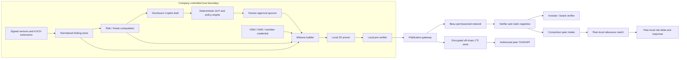
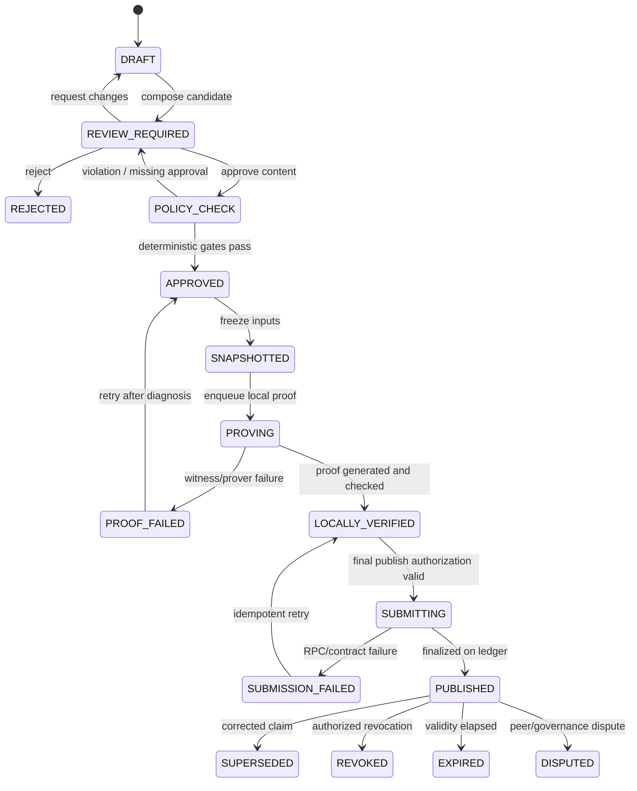
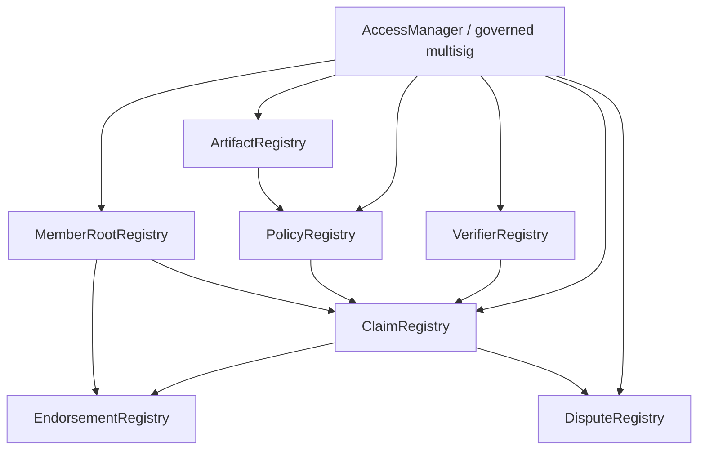

# KVCH Zero-Knowledge Privacy Assurance and Consortium Intelligence

## Product Requirements, Cryptographic Protocol, Ledger, and Implementation Specification

**Expanded name:** Knowledge, Vigilance, Control Hub  
**Document purpose:** Implementation-ready definition of KVCH's optional zero-knowledge assurance and privacy-preserving threat-sharing subsystem  
**Status:** Detailed product and engineering specification  
**Version:** 1.0  
**Date:** 9 September 2026  
**Primary geography:** India, with protocol portability for other jurisdictions  
**Primary deployment:** Customer-controlled VPC, on-premises, or air-gapped prover with an optional permissioned consortium network  
**Related product definition:** [KVCH_PRD.md](./KVCH_PRD.md)  
**Related risk/ML specification:** [KVCH_ML_CYBER_RISK_PRD.md](./KVCH_ML_CYBER_RISK_PRD.md)  

---

## 1. Executive answer

KVCH Zero-Knowledge Privacy Assurance is a separate subsystem that lets an enterprise prove a narrowly defined cyber-risk or threat-intelligence statement without revealing the private evidence used to establish it.

It solves two different trust problems:

1. **Stakeholder assurance:** an investor, board, insurer, auditor, or other approved stakeholder can verify that a disclosed risk statement was derived from committed evidence, passed a named policy, falls inside an approved band, and received the required company approvals—without receiving raw logs, internal topology, exact loss values, proprietary model inputs, or personal data.
2. **Consortium intelligence:** an enterprise can warn sector peers about a detected exploit pattern by publishing a minimized threat claim, proof, commitment, expiry, and optional encrypted STIX object. Peers can use the claim as threat context while the originating enterprise keeps its raw evidence and breach status private.

This is **not ZKML**. The ML and risk-quantification systems run normally inside the customer's trust boundary. ZK proves a small deterministic predicate over their signed and committed outputs. Keeping ML and ZK separate makes the statement understandable, the circuit auditable, proof generation practical, and model evolution independent of circuit releases.

The complete product path is:

```text
Private enterprise telemetry
  → normalized KVCH finding
  → monetary risk quantification / threat analysis
  → company-controlled disclosure draft
  → deterministic privacy and policy gates
  → authorized human approval
  → local witness construction
  → zero-knowledge proof
  → permissioned verifier / consortium ledger
  → audience-specific dashboard or peer intelligence feed
```

### 1.1 Winning product line

> **Prove the cyber-risk claim, not the confidential evidence.**

### 1.2 What ZK adds to the problem statement

The primary problem statement asks KVCH to quantify cyber risk in financial terms, explain risk drivers, optimize investment, and support governance and regulatory reporting. The ML and quantitative-risk system performs those jobs. ZK adds a defensible trust layer for the moment when a company must communicate outside its security boundary.

Without ZK, an outside stakeholder must either:

- trust a self-reported summary;
- demand sensitive supporting evidence;
- rely on a periodic third-party attestation; or
- accept an unverifiable `Low / Medium / High` label.

With ZK, the company can disclose an exact, machine-verifiable proposition such as:

> “This approved residual-risk result was calculated from a committed evidence snapshot no older than 24 hours, contains all mandatory source families, lies between ₹10 crore and ₹25 crore EAL, and passed policy `INVESTOR_DISCLOSURE_V3`.”

The exact risk value, asset list, findings, features, topology, model inputs, and evidence remain private.

### 1.3 The core honesty statement

A valid proof establishes that a witness satisfies the circuit. It does **not**, by itself, establish that the witness represents reality.

KVCH therefore binds proofs to signed sensor outputs, approved detector artifacts, immutable evidence commitments, review signatures, policy versions, and freshness windows. Even then, ZK proves consistency with those inputs—not universal truth, model correctness, the absence of an incident, or that the company is secure.

That limitation must appear in the product UI, verifier documentation, pitch, and audit reports.

---

## 2. Product position and problem-statement traceability

| Problem-statement requirement | Primary KVCH capability | ZK contribution | ZK is not responsible for |
| --- | --- | --- | --- |
| Continuous telemetry aggregation | Connectors, extensions, finding normalization | Commits to an evidence snapshot and proves required source/freshness conditions | Collecting raw telemetry |
| Incident likelihood and financial impact | ML and probabilistic risk engine | Proves an approved output is in a disclosed band or was derived under a named policy | Predicting likelihood or loss |
| EAL, VaR, asset/business-unit risk | Quantification engine | Selectively discloses a band, trend, or threshold result | Performing Monte Carlo simulation |
| Control effectiveness | Control-evidence engine | Proves required controls/evidence met a policy predicate | Judging every control directly in-circuit |
| AI recommendations | Risk Copilot and optimizer | Can bind a disclosure to an immutable recommendation/result ID | Generating recommendations |
| Natural-language stakeholder access | Grounded, role-authorized Risk Copilot | Gives the stakeholder a verifiable claim card as context | Letting an LLM interpret proof semantics freely |
| Investment optimization | Constrained optimizer | Proves an approved portfolio stays within a public budget band and meets a risk-reduction threshold | Solving the optimization problem in-circuit |
| Framework mapping | Versioned control crosswalk | Anchors evidence/report versions and approval state | Declaring certification or compliance |
| Regulatory reporting | Dedicated report workflow | Adds integrity, timestamp, and narrow predicate evidence | Replacing mandatory filings or disclosure duties |
| Emerging threats | Threat-intelligence pipeline | Enables minimized, privacy-preserving consortium claims | Inferring Company B is breached because Company A was attacked |

### 2.1 Product hierarchy

The implementation and demo must preserve this order:

1. continuous monetary cyber-risk quantification;
2. business-impact mapping and risk-driver explanation;
3. budget-constrained mitigation optimization and ROSI;
4. stakeholder dashboards and grounded natural-language analysis;
5. company-controlled disclosure workflow;
6. optional ZK stakeholder assurance;
7. optional privacy-preserving consortium threat intelligence;
8. post-MVP consumer status transparency without mandatory ZK.

ZK elevates the core product; it must not turn the pitch into “a blockchain security product” or consume the core demo before risk quantification works.

### 2.2 Why ZK exists on the investor side

Investors, boards, insurers, lenders, auditors, and approved counterparties may make capital, governance, coverage, or oversight decisions from company risk statements. They need higher assurance than an ordinary status message but should not receive attack paths, raw logs, customer data, proprietary weights, internal subnets, or exact asset exposure.

ZK creates a middle option between blind trust and full disclosure:

| Option | Assurance | Privacy | Problem |
| --- | --- | --- | --- |
| Self-reported summary | Low | High | Stakeholder must trust the company |
| Raw evidence sharing | High if evidence is sound | Low | Creates security, legal, IP, and privacy risk |
| Periodic audit | Medium/high | Medium | Slow, expensive, and stale between audit dates |
| ZK claim bound to signed evidence | High for the exact predicate | High | Requires careful circuit, key, policy, and source governance |

### 2.3 Why ZK is not required for the consumer dashboard

Consumers primarily need timely, understandable service-impact information:

- whether a named service is operational, degraded, disrupted, or recovering;
- which broad region or customer cohort is affected;
- when the issue began and when the next update is expected;
- what the consumer should do.

A proof does not make an outage message easier to understand. It may also delay communication, reveal unwanted correlations through repeated public inputs, and create a misleading “cryptographically secure” badge. The consumer path therefore uses deterministic disclosure policy, aggregation, DLP, optional GenAI drafting, and company approval. A proof may be exposed only for a rare, narrow statement demanded by a sophisticated verifier—not as the default user experience.

### 2.4 Why a permissioned ledger is useful—and insufficient by itself

A consortium ledger supplies a shared, append-only state, common policy and verifier versions, independent timestamps, claim lifecycle, and multi-organization governance. It prevents KVCH or one company from silently rewriting the shared history.

Permissioning does **not** make on-chain data secret. Hyperledger Besu's documentation explicitly notes that permissioning restricts known nodes/accounts but relies on distributed trust; a bad participant can still allow access to its copy of the chain. Therefore every on-chain field must be safe if every consortium participant—or a future unauthorized reader—sees it.

---

## 3. Goals, non-goals, and design principles

### 3.1 Goals

1. Prove narrow stakeholder and threat-sharing claims while keeping underlying evidence private.
2. Generate the witness and proof inside the customer's controlled environment.
3. Bind every proof to an immutable evidence snapshot, policy version, circuit version, verifier, purpose, audience, and validity interval.
4. Ensure the company explicitly controls whether a candidate disclosure is approved, edited, rejected, delayed, or revoked.
5. Prevent one consortium member from fabricating quorum by publishing the same endorsement repeatedly.
6. Support claim expiry, supersession, revocation, dispute, and correction without deleting history.
7. Let a peer consume a claim as threat context without treating it as proof of local compromise.
8. Minimize on-chain information and keep sensitive payloads encrypted off-chain.
9. Make proof semantics readable to non-cryptographers and machine-verifiable by independent clients.
10. Operate alongside, not instead of, mandatory regulatory and incident-reporting workflows.
11. Version circuits and policies without breaking verification of historical proofs.
12. Make cryptographic, application, governance, privacy, and operational failures observable and recoverable.

### 3.2 Non-goals

The subsystem will not:

- perform ML inference inside a zero-knowledge circuit in versions 1–2;
- prove that the ML model is accurate, unbiased, calibrated, or free from compromise;
- prove that the enterprise is secure or that no undisclosed incident exists;
- make a private/permissioned blockchain equivalent to confidential storage;
- publish raw logs, stack traces, code, model weights, topology, exact private risk values, or PII on-chain;
- store encrypted raw evidence on-chain merely because ciphertext appears opaque;
- replace CERT-In, SEBI, RBI, law-enforcement, contractual, exchange, or other required reporting;
- allow an LLM to construct canonical public inputs, decide eligibility, verify a proof, or approve publication;
- automatically block peer indicators in production without local matching and the receiving company's policy;
- promise origin anonymity when transaction/network metadata or consortium governance makes the publisher identifiable;
- use a plain unsalted hash as privacy protection for guessable IP addresses, domains, ports, CVEs, package names, or small categorical values;
- make an immutable public accusation against an entity or person;
- claim non-repudiation when signing keys, sensors, or reviewers may be compromised.

### 3.3 Design principles

#### Prove a predicate, not a narrative

Every circuit must have a one-sentence statement with unambiguous public inputs and constraints. Long prose remains outside the proof.

#### Minimize before proving

ZK hides private witnesses but public inputs, timing, claim frequency, contract calls, and membership behavior can still leak information. The safest field is one never collected or published.

#### Data truth and computational truth are different

Signatures and attestations strengthen provenance. ZK strengthens computational consistency. Governance, corroboration, audit, and dispute handling address dishonest or faulty sources.

#### Local proving, independent verification

Raw evidence must not leave the tenant to generate a proof. The verifier receives only the proof, public inputs, and the registered verification key.

#### Version everything

Circuit source, compiled artifact, proving system, compiler, backend, verification key, policy, schema, normalization, disclosure template, and contract addresses are immutable versioned artifacts.

#### Fail closed on disclosure

If witness construction, DLP, approval, proving, verification, ledger submission, or finality fails, the claim is not published. Core risk computation continues.

#### Revocation is a first-class feature

An append-only ledger must support a signed correction or revocation. “Immutable” cannot mean “permanent misinformation.”

#### One peer incident is context, not contagion

A shared claim may raise a receiving tenant's threat prior only after a local match, relevance check, and policy decision. It never sets `COMPROMISED = true` for another tenant.

---

## 4. Users, organizations, and decisions

| Persona | Need | Permitted action | Must not see by default |
| --- | --- | --- | --- |
| Company security analyst | Prepare a shareable claim from a private finding | Select evidence, classification, expiry, and proposed audience | Other tenants' private evidence |
| Company risk officer | Approve a stakeholder risk assertion | Inspect private lineage, approve/reject, set disclosed band | Unrelated technical evidence |
| Company legal/privacy reviewer | Ensure disclosure is lawful and minimized | Require changes, delay, restrict audience, revoke | Unnecessary raw security data |
| CISO / designated publisher | Authorize external publication | Final approval and signature | Other tenant secrets |
| Investor / board / insurer | Verify a bounded risk statement | Verify proof, policy, time, status, and report context | Raw logs, exact private score, asset graph |
| Consortium peer analyst | Receive actionable minimized CTI | Search locally for match, endorse, dispute, request encrypted payload | Origin's raw incident data |
| Consortium operator | Maintain member, policy, circuit, and validator registries | Govern versions, suspend members, coordinate upgrades | Tenant evidence unless separately authorized |
| Independent auditor | Assess circuit, contracts, ceremonies, and process | Reproduce builds, inspect controls, challenge claims | Raw evidence beyond engagement scope |
| KVCH platform operator | Operate software without tenant-data access | Monitor job health, artifact hashes, public chain state | Tenant witnesses and raw telemetry |
| Regulator | Receive information through applicable legal channel | Verify optional proof if accepted | ZK does not restrict lawful required access |

### 4.1 Organizational roles

The application and contracts require separate roles:

- `EVIDENCE_PRODUCER`: approved detector/sensor identity;
- `CLAIM_AUTHOR`: prepares a candidate claim;
- `DISCLOSURE_REVIEWER`: reviews data minimization and audience;
- `RISK_APPROVER`: approves financial-risk semantics;
- `LEGAL_APPROVER`: optional legal/privacy approval;
- `PUBLISHER`: submits an approved proof/claim;
- `MEMBER_ADMIN`: manages the organization's internal issuers and publishers;
- `CONSORTIUM_ADMIN`: executes governed membership/policy changes;
- `CIRCUIT_ADMIN`: proposes audited circuit/verifier versions;
- `GUARDIAN`: pauses a verifier or claim type during an incident;
- `VALIDATOR_OPERATOR`: runs a Besu validator;
- `AUDITOR`: reads approval and protocol evidence without publish authority.

No single routine user should hold all author, reviewer, publisher, registry-admin, and guardian powers.

---

## 5. Scope: four claim families

### 5.1 Claim family A — Stakeholder risk-band assurance

**Purpose:** reassure an approved financial/governance stakeholder without disclosing private risk evidence.

Example public statement:

```text
For reporting period 2026-Q3, an authorized organization produced a residual-risk
estimate from a committed, policy-complete snapshot. The approved EAL is within
₹10–25 crore; all mandatory input families met the named freshness policy; and
the report received the required approval quorum.
```

Private facts can include:

- exact EAL, VaR, CVaR, loss percentiles, scenario values, and risk appetite;
- asset/service graph, findings, control evidence, business assumptions, and model features;
- exact timestamps within the disclosed period;
- identities of internal reviewers where external anonymity is desired;
- salts, Merkle paths, signatures, and source attestations.

Public facts can include:

- organization or an approved pseudonymous issuer identity;
- claim type, reporting period, currency, and disclosed range;
- policy/circuit/verifier/model-result commitment versions;
- evidence and report commitments;
- validity, revocation, and verification status;
- approval quorum class, without reviewer identities if policy permits.

### 5.2 Claim family B — Consortium threat eligibility

**Purpose:** share a useful warning without exposing the originating logs or incident status.

Example public statement:

```text
An active member observed evidence matching threat family MALICIOUS_MODEL_DESERIALIZATION.
The normalized confidence and severity meet policy CTI_FINTECH_V2, the evidence is
fresh, prohibited-data checks passed, and this member has not submitted the same
claim family for this epoch.
```

The proof does not say which host, model, customer, employee, network, or business service was affected. It does not say whether exploitation succeeded.

### 5.3 Claim family C — Anonymous peer endorsement / corroboration

**Purpose:** allow unique consortium members to state that their own local evidence matches an existing claim without publicly naming them.

The endorsement proves:

- the endorser is in the active member set;
- the endorsement is bound to a specific claim/version;
- the endorser has not endorsed that claim more than once in the relevant scope;
- its local match met the minimum corroboration policy;
- the endorsement was created before expiry.

The ledger counts unique nullifiers, not transactions, to prevent one member from fabricating quorum.

### 5.4 Claim family D — Evidence/report integrity anchor

**Purpose:** prove that a later-disclosed report or evidence package matches a commitment anchored at or before a ledger time.

This can support internal governance and audit provenance. A hash anchor proves integrity and relative existence—not that the content was correct, reviewed, or legally sufficient. Those properties require separate signed predicates.

### 5.5 Deferred claim families

The following are possible only after threat modeling and audit:

- proof that an approved mitigation portfolio stays within a budget band and exceeds a risk-reduction threshold;
- proof of control-evidence coverage above an approved percentage;
- recursive aggregation of multiple approved scenario proofs;
- private-set intersection or oblivious matching for low-entropy observables;
- proof-carrying VEX/attestation statements;
- verifiable computation of a deterministic risk formula;
- selective-disclosure credentials for stakeholder access.

---

## 6. System boundaries and end-to-end architecture



### 6.1 Trust boundaries

| Boundary | Raw evidence allowed? | Private witness allowed? | Proof/public input allowed? |
| --- | --- | --- | --- |
| Tenant raw store | Yes | Yes | Yes |
| Tenant proving worker | Minimum required subset | Yes, ephemeral | Yes |
| KVCH shared operations plane | No by default | No | Operational metadata only |
| Consortium ledger | Never | Never | Yes, minimized |
| Encrypted payload store | Only policy-approved minimized CTI, encrypted | No | Commitment/reference |
| Investor portal | No | No | Audience-approved public inputs/report |
| Consumer dashboard | No | No | Normally no ZK; approved service status only |

### 6.2 Required services

| Component | Responsibility |
| --- | --- |
| Evidence Snapshotter | Freeze canonical normalized records and Merkle-root the selected evidence |
| Disclosure Policy Engine | Deterministically evaluate audience, classification, required approvals, freshness, and forbidden fields |
| Disclosure Copilot | Suggest redaction/generalization; never authorize or enforce alone |
| Claim Composer | Produce canonical claim JSON and public/private input plan |
| Witness Builder | Convert signed business records into circuit inputs; produce a manifest and zeroize secrets |
| Prover Worker | Run pinned Noir/Barretenberg artifacts locally in an isolated job |
| Local Pre-verifier | Verify exact proof/public inputs/key before any publication attempt |
| Publication Gateway | Enforce application approval, idempotency, chain policy, and finality tracking |
| Consortium Contracts | Verify/register claims, nullifiers, versions, status, and events |
| Ledger Indexer | Materialize finalized claim state into PostgreSQL for dashboards and search |
| Encrypted CTI Gateway | Store and serve audience-encrypted optional STIX/TAXII payloads |
| Peer Relevance Matcher | Compare received patterns with only the receiving tenant's local assets/telemetry |
| Stakeholder Verifier UI | Explain the exact proven predicate, public inputs, state, age, and limitations |
| Key and Credential Service | Manage sensor, reviewer, publisher, member, validator, and encryption keys |

### 6.3 Existing repository integration

The current Next.js control plane remains the orchestration and UI layer. PostgreSQL remains the source of truth for application state and audit workflow. `pg-boss` runs snapshot, disclosure, witness, proving, verification, submission, indexing, expiry, and retry jobs. Qdrant is used only for approved narrative retrieval; it is not a proof source of truth.

Recommended additional bounded services:

```text
web/
  app/api/zk/**                 # authenticated orchestration and verifier APIs
  lib/zk/**                     # claim schema, canonicalization, policy adapters
  lib/ledger/**                 # RPC, finality, contract event parsing
  workers/**                    # pg-boss job handlers

zk/
  circuits/**                   # Noir packages and tests
  fixtures/**                   # synthetic, non-secret witnesses
  manifests/**                  # circuit/version metadata
  scripts/**                    # deterministic build and artifact checks

contracts/
  src/**                        # Solidity registries and interfaces
  test/**                       # unit, fuzz, invariant, integration tests
  deployments/**                # chain-scoped immutable manifests

services/prover/
  src/**                        # isolated local prover wrapper
  Dockerfile                    # pinned toolchain image
```

The exact folder names can change, but circuits, contracts, prover, and application orchestration must remain separable and independently testable.

---

## 7. Threat and trust model

### 7.1 Parties

1. **Proving organization:** owns private evidence and produces an approved proof.
2. **KVCH tenant deployment:** normalizes evidence, computes risk, enforces disclosure workflow, and generates the proof.
3. **Consortium governance:** manages membership, validators, policy/circuit versions, disputes, and emergency actions.
4. **Validators:** order and finalize transactions under permissioned consensus.
5. **Verifier:** smart contract and/or independent off-chain client that checks proof validity and registry state.
6. **Stakeholder:** reads an approved claim and its human-readable explanation.
7. **Peer organization:** ingests threat claims and performs local matching.
8. **Auditor/adversary:** may inspect code, public inputs, proofs, chain history, timing, and metadata.

### 7.2 Adversaries

- compromised enterprise sensor emitting false evidence;
- malicious company employee constructing or approving a deceptive claim;
- compromised prover host stealing witness data or keys;
- malicious consortium member spamming, replaying, equivocating, or deanonymizing claims;
- colluding members attempting false corroboration;
- compromised validator censoring or reordering transactions;
- malicious registry administrator installing an unsafe verifier;
- observer correlating timestamps, proof cadence, public bands, transaction sender, or off-chain fetch patterns;
- outsider brute-forcing commitments for low-entropy observables;
- malicious LLM inserting secrets or false text into a disclosure draft;
- software-supply-chain attacker replacing circuit, compiler, backend, contract bytecode, or proving key;
- stakeholder presenting an expired or revoked proof as current;
- peer treating consortium context as local incident truth.

### 7.3 Required security properties

| Property | Requirement |
| --- | --- |
| Completeness | A valid approved witness produces a proof accepted by the registered verifier |
| Soundness | An invalid witness cannot feasibly produce an accepted proof, subject to proof-system assumptions |
| Zero knowledge | Proof reveals no witness data beyond explicit public inputs and unavoidable metadata |
| Binding | Evidence/report commitments cannot be opened to different content under the chosen construction |
| Authorization | Only active permitted publishers can register the relevant claim type |
| Uniqueness | Scoped nullifiers prevent duplicate anonymous submissions/endorsements |
| Freshness | Claim must satisfy both in-circuit epoch constraints and application/ledger expiry |
| Replay resistance | Proof/signature is bound to chain, contract, claim ID, version, purpose, and epoch |
| Auditability | Historical circuit, policy, key, claim, approval, and state transitions remain reconstructable |
| Revocability | Authorized correction/revocation is visible and current consumers reject superseded state |
| Tenant isolation | One tenant cannot access another tenant's raw evidence, witness, secrets, or decrypted payload |
| Availability | Ledger/prover failure does not stop internal risk computation or mandatory reporting |

### 7.4 What remains trusted

The initial design trusts:

- customer governance to approve the correct sensors, policies, models, and reviewers;
- the integrity of approved sensor signing keys or attestations;
- the deterministic normalization and witness-builder implementation;
- the audited circuit and proof-system implementation;
- the active registry/governance process;
- the local prover environment not to exfiltrate witnesses;
- a sufficient fraction of Besu validators to maintain QBFT liveness and safety assumptions;
- stakeholders to interpret the exact statement rather than overclaim it.

ZK reduces disclosure and recomputation trust. It does not eliminate institutional or endpoint trust.

---

## 8. Data classification and disclosure tiers

### 8.1 Classification

| Class | Examples | Default handling |
| --- | --- | --- |
| `KVCH-0 PUBLIC` | approved claim type, sector, broad threat family, policy version | May be a public input after approval |
| `KVCH-1 CONSORTIUM` | minimized indicator token, confidence band, coarse time, mitigation class | Permissioned claim/payload; still treated as sensitive |
| `KVCH-2 STAKEHOLDER` | risk band, trend, assurance status, approved narrative | Audience-restricted portal/report |
| `KVCH-3 CONFIDENTIAL` | exact EAL, asset/service identifiers, internal controls, detailed IOC | Private witness or encrypted authorized payload only |
| `KVCH-4 RESTRICTED` | raw logs, code, proprietary weights, topology, secrets, PII, investigation notes | Never on-chain; avoid witness unless essential; strongest retention/access |

### 8.2 Traffic Light Protocol mapping

Where consortium payloads use STIX, support applicable data markings and an agreed sharing policy, including TLP-style restrictions. A ZK proof does not override the marking. The stricter of claim policy, data marking, contract, regulation, and recipient agreement governs use.

### 8.3 Disclosure decision matrix

| Recipient | Default content | ZK | Encrypted detail | Human approval |
| --- | --- | --- | --- | --- |
| Internal security | Full role-authorized evidence | Not needed | At rest/in transit | Existing workflow |
| Board/CISO | Risk and business detail | Optional | Portal | Risk owner |
| Investor/insurer | Approved band/trend and claim card | Recommended for narrow assurance | Optional audience report | Risk + disclosure approvers |
| Consortium peer | Minimized CTI claim | Recommended | Optional per-community encrypted STIX | CTI + disclosure approvers |
| Regulator | Legally required form/data | Optional supplement only | Required official channel | Regulatory workflow |
| Consumer | Service-impact status | Normally no | No | Company policy/playbook |

### 8.4 Privacy checklist before public-input approval

For every candidate public input, document:

1. business need;
2. intended verifier;
3. exact semantic meaning;
4. entropy and brute-force risk;
5. timing and correlation risk;
6. whether repeated disclosures narrow a private value;
7. whether it reveals incident existence or breach status;
8. whether it identifies a person, customer, asset, vendor, or third party;
9. retention and expiry behavior;
10. safer alternative, including a broader band or omission.

No field becomes public merely because it is “only a hash.”

---

## 9. Canonical records and cryptographic objects

### 9.1 Evidence leaf

An evidence leaf is a canonical, signed, versioned representation of one eligible input record.

```json
{
  "schema": "kvch.evidence-leaf/v1",
  "tenant_id": "private",
  "source_id": "sensor-key-id",
  "source_type": "EDR",
  "source_artifact_digest": "sha256:...",
  "record_type": "kvch.finding/v1",
  "record_id": "0199...",
  "observed_at_ms": 1788888888000,
  "ingested_at_ms": 1788888890000,
  "canonical_payload_digest": "sha256:...",
  "classification": "KVCH-4",
  "source_signature": "..."
}
```

The leaf committed into the circuit-friendly tree must be derived from a canonical byte encoding—not ordinary JSON serialization with unstable field order.

### 9.2 Evidence snapshot

```json
{
  "schema": "kvch.evidence-snapshot/v1",
  "snapshot_id": "0199...",
  "purpose": "CONSORTIUM_THREAT_CLAIM",
  "normalization_version": "finding-normalizer@1.4.0",
  "selection_policy_id": "cti-fintech-v2",
  "created_at_ms": 1788889000000,
  "leaf_count": 42,
  "ordered_leaf_manifest_digest": "sha256:...",
  "circuit_tree_root": "0x...",
  "archive_digest": "sha256:...",
  "retention_class": "INCIDENT_EVIDENCE"
}
```

Maintain both:

- a standard digest such as SHA-256 for conventional artifact integrity and audit tooling; and
- a circuit-friendly commitment/tree root such as Poseidon over explicitly encoded field elements.

The mapping between the two is stored in the signed snapshot manifest. Do not casually implement SHA-256 inside the circuit if it creates unnecessary constraints.

### 9.3 Claim envelope

```json
{
  "schema": "kvch.zk-claim/v1",
  "claim_id": "0x32-byte-domain-separated-id",
  "claim_type": "THREAT_ELIGIBILITY_V1",
  "claim_family": "MALICIOUS_MODEL_DESERIALIZATION",
  "audience": "CONSORTIUM:FINTECH",
  "sector": "FINANCIAL_SERVICES",
  "severity_band": "HIGH",
  "confidence_band": "C80_95",
  "observed_epoch": 496913,
  "valid_from_epoch": 496913,
  "expires_epoch": 497081,
  "policy_id": "cti-fintech-v2",
  "policy_commitment": "0x...",
  "circuit_id": "threat-eligibility-v1",
  "circuit_artifact_digest": "sha256:...",
  "verification_key_digest": "sha256:...",
  "evidence_commitment": "0x...",
  "payload_commitment": "0x...",
  "member_root": "0x...",
  "nullifier": "0x...",
  "offchain_reference_digest": "0x...",
  "proof_encoding": "BB_ULTRAHONK_PINNED",
  "proof": "base64...",
  "publisher_signature": "0x..."
}
```

All enumerations map to versioned integer codes before entering the circuit. Free-form strings are not directly interpreted in-circuit.

### 9.4 Disclosure report manifest

```json
{
  "schema": "kvch.disclosure-report/v1",
  "report_id": "0199...",
  "audience_id": "investor-room-2026-q3",
  "reporting_period": "2026-Q3",
  "currency": "INR",
  "disclosed_eal_lower_minor": 10000000000,
  "disclosed_eal_upper_minor": 25000000000,
  "risk_result_id": "0199...",
  "risk_result_commitment": "0x...",
  "approved_projection_digest": "sha256:...",
  "approval_policy_id": "investor-disclosure-v3",
  "approval_manifest_digest": "sha256:...",
  "valid_until": "2026-10-15T00:00:00Z"
}
```

Monetary values use integer minor units. No floating-point value enters a circuit or signed canonical record.

### 9.5 Policy artifact

Each proof policy is an immutable signed artifact:

```json
{
  "schema": "kvch.zk-policy/v1",
  "policy_id": "cti-fintech-v2",
  "version": 2,
  "claim_type": "THREAT_ELIGIBILITY_V1",
  "minimum_confidence_bps": 8000,
  "minimum_severity_code": 3,
  "max_evidence_age_seconds": 86400,
  "required_source_mask": 13,
  "forbidden_data_mask": 65535,
  "required_approval_roles": ["CTI_REVIEWER", "PUBLISHER"],
  "approval_threshold": 2,
  "allowed_sectors": ["FINANCIAL_SERVICES"],
  "max_validity_seconds": 604800,
  "circuit_id": "threat-eligibility-v1",
  "effective_from_epoch": 496000,
  "effective_to_epoch": 500000,
  "governance_signature": "..."
}
```

For MVP, policy values are compiled or committed and checked against a registered policy commitment. A prover must not supply an arbitrary private threshold and then claim it passed “a policy.”

---

## 10. Commitment and encoding specification

### 10.1 Canonicalization

Define a language-independent canonical encoding for every signed or committed object. Recommended requirements:

- fixed schema and version prefix;
- explicit domain-separation tag;
- integer field IDs or an audited canonical CBOR profile;
- fixed-width unsigned integers with declared endianness;
- UTF-8 strings normalized according to an explicitly chosen profile;
- no floats, NaN, implicit time zones, unordered maps, or locale formatting;
- arrays either ordered by schema or sorted by a declared stable key;
- absent and null represented differently;
- maximum lengths enforced before hashing;
- duplicate keys rejected;
- test vectors implemented in TypeScript, Rust/Noir tooling, and Solidity where applicable.

### 10.2 Domain separation

Every hash/commitment includes an unambiguous domain:

```text
KVCH_DOMAIN = H(
  "KVCH" || protocol_version || object_type || purpose ||
  consortium_id || chain_id || verifying_contract || circuit_id
)
```

Example leaf commitment:

```text
leaf = Poseidon(
  DOMAIN_EVIDENCE_LEAF_V1,
  source_type_code,
  source_artifact_digest_fields,
  record_id_fields,
  observed_at_ms,
  payload_digest_fields,
  classification_code,
  random_salt
)
```

Example evidence commitment:

```text
evidence_commitment = Poseidon(
  DOMAIN_EVIDENCE_SNAPSHOT_V1,
  evidence_merkle_root,
  leaf_count,
  normalization_version_code,
  selection_policy_commitment,
  snapshot_nonce
)
```

### 10.3 Salt requirements

- use at least 128 bits of cryptographically secure randomness for a hiding commitment;
- generate salts inside the tenant boundary;
- never reuse a salt across distinct claim purposes;
- store salts encrypted with the evidence manifest only as long as audit/reopening requires;
- never derive a salt only from tenant ID, time, hostname, or another predictable value;
- test RNG failure and fail closed;
- do not expose the salt in public inputs unless opening the commitment is intentional.

### 10.4 Merkle trees

The evidence snapshot uses a fixed, versioned tree construction:

- circuit-friendly hash and arity;
- maximum depth declared by the circuit;
- deterministic leaf order or index assignment;
- empty-leaf value and padding rule fixed;
- leaf count committed to prevent ambiguous padding;
- duplicate record behavior explicit;
- inclusion path generation independently verified;
- historical roots retained with policy-defined TTL;
- no root accepted unless its snapshot manifest is signed and immutable.

### 10.5 Standard hash versus circuit hash

SHA-256/Keccak is appropriate for ordinary artifacts, container images, contract bytecode, and ecosystem tooling. Poseidon or the chosen backend-native hash is appropriate inside arithmetic circuits. The protocol must never assume these digests are interchangeable.

Store an auditable signed bridge record:

```text
standard_artifact_digest ↔ canonical field encoding ↔ circuit commitment
```

### 10.6 Low-entropy data warning

A hash of `10.0.0.8`, `CVE-2026-1234`, `port 443`, `lodash`, or a common domain can be guessed by enumeration. Salting prevents third-party verification/matching unless the salt is shared, and sharing a common salt restores dictionary risk.

Therefore:

- never publish plain hashes of internal IPs, hostnames, usernames, service names, small categories, CVEs, ports, or common packages as a privacy mechanism;
- publish broad taxonomies when sufficient;
- use high-entropy file hashes only when policy allows and they do not reveal confidential samples;
- use an HMAC/keyed token only within a controlled sharing community with rotation and access governance;
- evaluate an OPRF/private-set-intersection protocol for privacy-preserving exact matching in a later version;
- assume ledger permanence makes future dictionary attacks possible.

---

## 11. Circuit portfolio

Each circuit is intentionally narrow. “One mega-circuit for all cyber risk” is prohibited.

### 11.1 Circuit ZK-01 — `ThreatEligibilityV1`

#### Statement

> The prover knows a committed evidence snapshot and authorized member credential whose normalized threat result passes registered consortium policy for the disclosed family, bands, time window, and payload commitment, without revealing the evidence or member identity.

#### Public inputs

| Input | Meaning |
| --- | --- |
| `protocol_version` | KVCH proof protocol version |
| `consortium_id` | Sharing community identifier |
| `chain_id` | Target chain replay domain |
| `registry_contract` | Target registry replay domain |
| `claim_id` | Deterministic domain-separated claim identifier |
| `claim_family_code` | Broad approved threat family |
| `sector_code` | Approved sector or community |
| `severity_band_code` | Coarse disclosed severity band |
| `confidence_band_code` | Coarse disclosed confidence band |
| `observed_epoch` | Coarsened observation interval |
| `expires_epoch` | Claim expiry |
| `policy_commitment` | Registered policy artifact commitment |
| `circuit_version` | Exact circuit semantic version |
| `evidence_commitment` | Commitment to private evidence snapshot |
| `payload_commitment` | Commitment to optional minimized CTI payload |
| `member_root` | Active member-credential Merkle root |
| `nullifier` | Unique member/claim/epoch signal |

#### Private witness

- exact normalized confidence basis points;
- exact severity score and category;
- exact observation time;
- evidence tree root, leaf count, snapshot nonce, and salts;
- required source-family presence mask and source timestamps;
- forbidden-data/DLP result mask;
- normalized threat-family derivation inputs;
- optional detector artifact digest and source attestation fields;
- policy fields or an authenticated policy Merkle path;
- member secret/identity key and member Merkle inclusion path;
- approval role/signature records or approval Merkle proof;
- exact payload field vector and payload nonce;
- claim nonce.

#### Constraints

The circuit must enforce, at minimum:

```text
1. recompute(evidence snapshot) == public evidence_commitment
2. recompute(payload fields, payload nonce) == public payload_commitment
3. private policy fields commit to public policy_commitment
4. policy claim type == THREAT_ELIGIBILITY_V1
5. policy is effective for observed_epoch
6. exact_confidence_bps >= policy.minimum_confidence_bps
7. confidence_band(exact_confidence_bps) == public confidence_band_code
8. exact_severity >= policy.minimum_severity_code
9. severity_band(exact_severity) == public severity_band_code
10. observed_epoch <= current/claim epoch according to bounded policy
11. expires_epoch - observed_epoch <= policy.max_validity
12. every required source bit is present
13. every required source timestamp is within policy freshness
14. forbidden_data_mask == 0
15. derived threat family == public claim_family_code
16. sector/community is allowed by policy
17. member commitment is included under public member_root
18. member credential was valid for observed_epoch
19. required approval threshold and distinct roles are satisfied
20. public nullifier == Poseidon(member_secret, consortium_id,
    claim_family_code, observed_epoch, claim_id, NULLIFIER_DOMAIN_V1)
21. claim_id commits to all replay-relevant public inputs
```

#### Explicit exclusions

The circuit does not parse raw logs, execute YARA, run an ML model, call an LLM, or determine legal reportability. Those operations produce signed/committed inputs governed outside the circuit.

### 11.2 Circuit ZK-02 — `StakeholderRiskBandV1`

#### Statement

> The prover knows an approved immutable risk result whose exact monetary values fall within the disclosed bands, whose required inputs satisfy registered coverage/freshness rules, and whose report projection matches the public commitment.

#### Public inputs

- issuer identifier or approved pseudonymous organization credential root;
- stakeholder audience/purpose ID;
- reporting period code;
- currency code;
- public EAL lower and upper bounds;
- optional VaR lower/upper bounds and percentile code;
- optional residual-risk appetite relation: `BELOW`, `WITHIN`, or `ABOVE`;
- policy commitment;
- risk-result commitment;
- evidence-snapshot commitment;
- approved report commitment;
- model/parameter bundle commitment;
- approval-class code;
- issued/valid-until epoch;
- circuit/version/verifier domain;
- nullifier or unique disclosure ID.

#### Private witness

- exact EAL and any exact percentile values in integer minor units;
- scenario aggregation values or committed result leaf;
- risk-result salt and evidence snapshot salt;
- feature completeness/freshness mask;
- exact appetite value if only relation is disclosed;
- report projection field vector and salt;
- active organization/stakeholder entitlement credential;
- approval records and reviewer membership paths;
- model/result lineage record.

#### Constraints

```text
exact_eal >= public_eal_lower
exact_eal < public_eal_upper
risk_result_commitment == Commit(exact result + lineage + nonce)
evidence_snapshot_commitment == committed snapshot used by result
model_parameter_commitment == model/parameter bundle referenced by result
all mandatory input-family bits are present
input freshness satisfies policy
approved report fields commit to public report commitment
approval roles and quorum satisfy policy
reporting period and result timestamp are consistent
current/issued epoch is inside policy and credential validity
disclosure nullifier is correctly derived for purpose and period
```

The upper-bound convention—exclusive or inclusive—must be fixed in the protocol and displayed in the UI. This document recommends half-open ranges `[lower, upper)` to avoid overlap.

### 11.3 Circuit ZK-03 — `AnonymousEndorsementV1`

#### Statement

> An active, unique consortium member has locally matched the specified threat claim under the registered corroboration policy and has not endorsed the same claim in the same scope before.

#### Public inputs

- consortium ID;
- target claim ID and target claim version;
- member root;
- endorsement policy commitment;
- match-class band;
- endorsement epoch and expiry;
- endorsement nullifier;
- optional payload/reference commitment.

#### Private witness

- member identity secret and membership path;
- local match score and eligible local-evidence commitment;
- local match rule/version;
- policy witness;
- evidence freshness inputs;
- endorsement nonce.

#### Constraints

- membership inclusion succeeds;
- target claim is bound into the nullifier scope;
- local match score crosses policy threshold;
- local evidence is fresh;
- match band matches exact score;
- nullifier derives from member secret, target claim, version, and scope;
- no origin identity is a public output.

The contract, not the circuit, checks whether the nullifier has already been used.

### 11.4 Circuit ZK-04 — `ApprovalQuorumV1`

This optional circuit proves that a required number of distinct active reviewers with allowed roles approved a committed disclosure before cutoff without exposing reviewer identities externally.

For MVP, ordinary signatures verified inside the tenant application and committed in `StakeholderRiskBandV1` are simpler. Move approval-signature verification fully in-circuit only if reviewer anonymity is a real requirement and the chosen signature primitive is efficient and audited.

### 11.5 Circuit ZK-05 — `EvidenceInclusionV1`

This diagnostic/audit circuit proves that a particular privately disclosed record belongs to an anchored evidence snapshot. It is used in a controlled audit room, not on the consortium ledger by default.

### 11.6 Circuit composition policy

- Prefer separate proofs over a large combined circuit until latency and proof count require aggregation.
- Bind child proofs through explicit public commitments if composed.
- Recursive proof aggregation is post-MVP and requires backend-specific safety review.
- Never use an unconstrained helper for security-critical computation unless its result is fully constrained.
- Inspect circuit and backend gate counts as part of every release.
- Define maximum array lengths; reject oversize witness data before proving.

---

## 12. Proof-system and toolchain decision

### 12.1 Recommended MVP stack

Use **Noir plus a pinned Barretenberg backend** for the initial local circuits and proof service, subject to a spike that verifies:

- exact compiler/backend compatibility;
- proof generation and verification on target Linux hardware;
- proof size and latency for the actual circuits;
- stable serialization of proof and public inputs;
- feasibility and cost of the chosen EVM verification path;
- deterministic builds and artifact hashing;
- security review of all standard-library and backend features used.

Noir makes private inputs private by default and explicit public inputs visible to the verifier. Its current documentation also provides `nargo` build/test/fuzz tooling and Barretenberg proving/verification workflows. Pin exact versions; never deploy from floating `latest`, `main`, or `next` branches.

### 12.2 Verification path decision gate

Two supported modes:

#### Mode A — On-chain proof verification

The registry contract invokes an audited Solidity verifier and writes the claim only on success.

Advantages:

- every consortium node independently executes the same verifier;
- claim validity is directly part of chain state;
- independent clients need only chain state and registered artifacts.

Costs/risks:

- EVM verification compatibility and gas must be benchmarked for the exact Noir/Barretenberg version;
- verifier bytecode is version-specific;
- contract/circuit upgrade mistakes are high impact.

#### Mode B — Governed off-chain verification plus on-chain attestation

Multiple designated verifier services independently verify the proof, sign an EIP-712 verification result, and the contract records it after a configured signature quorum.

Advantages:

- simpler if direct EVM verification is unstable or too costly;
- independent implementations can be added;
- easier emergency rollback.

Costs/risks:

- adds verifier-service trust;
- ZK validity is no longer checked directly by the chain;
- quorum and key governance become critical.

**MVP recommendation:** demonstrate local proof generation and independent local verification first. Use direct on-chain verification only after the exact artifact passes a reproducible integration benchmark. Do not claim on-chain verification in a demo if the contract only trusts one KVCH server signature.

### 12.3 Alternatives considered

| Stack | Strength | Limitation | Position |
| --- | --- | --- | --- |
| Noir + Barretenberg | Readable circuit DSL, strong developer tooling, backend abstraction | Fast-moving version compatibility; exact EVM path must be pinned/tested | Recommended spike/MVP |
| Circom + snarkjs Groth16 | Mature examples, small proofs, Solidity verifier generation | Per-circuit trusted setup; circuit safety and ceremony burden | Strong fallback |
| Circom + PLONK | Universal setup pattern | Different performance/constraint tradeoffs; tooling audit needed | Evaluate |
| Rust/gnark ecosystem | Strong typed implementation options | Team learning curve and integration work | Production alternative |
| zkVM (RISC Zero/SP1 class) | Prove richer existing program execution | Larger operational/performance footprint for narrow predicates | Future complex computation |
| ZKML frameworks | Can prove model inference | Unnecessary complexity, model constraints, slow evolution | Explicitly out of scope |

Circom's official documentation states that Groth16 uses a per-circuit trusted setup and supports proof generation, verification, and Solidity verifier export. If selected, KVCH must execute and document a multi-party ceremony for every production circuit version rather than using a developer-only setup.

### 12.4 Selection scorecard

Before final selection, benchmark each candidate on:

- security assumptions and audit history;
- circuit expressiveness and risk of underconstraint;
- proof size;
- witness generation time and memory;
- proof time on target tenant hardware;
- off-chain verification time;
- on-chain verification gas/runtime;
- trusted/universal setup requirements;
- key/circuit upgrade model;
- JavaScript/TypeScript and container integration;
- long-term maintenance and release stability;
- ability to reproduce artifacts from pinned source;
- availability of independent auditors and test tooling.

### 12.5 Toolchain pinning manifest

Every release contains:

```yaml
protocol: kvch-zk/v1
circuit_id: threat-eligibility-v1
source_commit: <git sha>
source_tree_digest: sha256:...
noir_version: <exact>
backend_name: barretenberg
backend_version: <exact>
proof_flavor: <exact>
stdlib_lock_digest: sha256:...
compiled_circuit_digest: sha256:...
verification_key_digest: sha256:...
solidity_verifier_source_digest: sha256:... # if used
solidity_verifier_bytecode_digest: sha256:... # if used
container_image_digest: sha256:...
build_environment_digest: sha256:...
audit_report_digest: sha256:...
```

---

## 13. Membership, identity, and nullifiers

### 13.1 Membership choices

There are two modes:

#### Identified member mode

The publisher uses an allowlisted consortium account. Other members can see which organization submitted a claim.

Use when:

- governance requires attribution and accountability;
- origin secrecy is not promised;
- operational simplicity matters more than anonymity.

#### Anonymous active-member mode

The organization proves membership in an active-member Merkle root and publishes a nullifier without revealing which leaf it owns. This follows the general group-membership/nullifier pattern used by protocols such as Semaphore: a group is represented by a Merkle tree of identity commitments, a member proves inclusion, and a scoped nullifier prevents double signaling.

Use when:

- hiding the source organization from ordinary consortium readers materially increases willingness to share;
- governance can issue/revoke private member credentials safely;
- timing, network, and transaction metadata are also addressed.

### 13.2 MVP recommendation

Start with identified transaction submitters at the validator/application layer but hide all raw evidence and sensitive claim detail. Add anonymous member claims only after the basic protocol is correct and the privacy requirement is validated with real consortium participants.

If the pitch demonstrates anonymous origin, route submission through an approved relayer and explain that validator/network metadata can still weaken anonymity. Do not promise anonymity based only on a Merkle-membership circuit.

### 13.3 Member root lifecycle

- governance issues one or more organization commitments;
- active commitments are stored in a versioned Merkle tree;
- the root is registered with `validFromEpoch` and `validToEpoch`;
- proofs may use only roots active at their claim epoch;
- removal publishes a new root and revocation record;
- historical roots remain available to verify historical claims;
- compromised credentials can be explicitly revoked before the next normal root epoch;
- root construction and membership count policy must preserve the intended anonymity set.

### 13.4 Nullifier design

```text
nullifier = Poseidon(
  NULLIFIER_DOMAIN_V1,
  member_secret,
  consortium_id,
  claim_type,
  target_claim_id_or_family,
  epoch,
  scope
)
```

Properties:

- deterministic within the intended duplicate-prevention scope;
- unlinkable across distinct scopes to the extent the hash construction and metadata permit;
- bound to consortium and claim purpose;
- not reusable across staging/production chains;
- recorded once and rejected on repeat;
- never computed from organization name, public account, or other guessable identity.

### 13.5 Sybil resistance

ZK hides identity; it does not establish that every identity corresponds to a distinct legitimate company. Consortium governance must perform organization onboarding and limit credential issuance. Quorum counts organizations, not employees, API keys, or proof transactions.

---

## 14. Source authenticity and evidence provenance

### 14.1 Evidence trust ladder

| Level | Source | Assurance |
| --- | --- | --- |
| L0 | Unsigned manual entry | Low; allowed only with explicit disclosure |
| L1 | Authenticated application record | Known tenant/user, mutable application trust |
| L2 | Sensor/extension signed record | Bound to approved source key/artifact |
| L3 | Hardware-backed key or workload identity | Stronger key protection and workload provenance |
| L4 | Remote-attested approved runtime plus signed record | Strongest planned source provenance, still not infallible |

Policies specify minimum evidence level by claim type. A critical consortium claim should not be eligible solely from an unsigned L0 entry.

### 14.2 Detector artifact binding

Each sensor result records:

- extension/agent ID and semantic version;
- source commit and package/container digest;
- KVCH Judge evaluation ID and result;
- signing-key ID and validity;
- configuration/policy digest;
- observed and ingested time;
- normalized record digest;
- signature or attestation evidence.

The proof can bind to the approved artifact digest or to an allowlist root of approved artifacts. This proves the witness references an approved version; it does not prove the detector has no false positives.

### 14.3 Evidence snapshot immutability

After snapshot creation:

- raw records remain in the tenant evidence store under retention policy;
- the ordered manifest is write-once or object-locked where available;
- corrections create a new record/snapshot rather than mutation;
- the snapshot commitment and standard archive digest are stored in PostgreSQL audit state;
- proof jobs reference the immutable snapshot ID;
- deletion after legal retention preserves only the approved commitment and deletion audit event.

### 14.4 Time

All participating sources must use synchronized time. Store both `observedAt` and `ingestedAt`, clock source, and measured skew where available. Coarsen public time into an epoch while retaining exact private time. A ledger timestamp alone proves transaction ordering/time under ledger assumptions, not the true sensor observation time.

---

## 15. Disclosure workflow and human authority



### 15.1 Disclosure Copilot

The Copilot may suggest:

- removing internal hosts, IPs, subnets, topology, repository/file paths, usernames, emails, ticket IDs, customer identifiers, credentials, secrets, and exact exploit steps;
- replacing exact time with a coarse epoch;
- replacing exact risk with a pre-approved non-overlapping range;
- replacing a specific affected product/service with an approved category;
- separating confirmed facts from hypotheses;
- lowering confidence when evidence is indirect;
- delaying disclosure until a tactical exploit detail is no longer dangerous;
- adding consumer/stakeholder-safe remediation status;
- selecting a claim circuit/policy compatible with the approved audience.

### 15.2 Copilot controls

- input is a role-authorized projection, not unrestricted raw storage;
- output is structured against a claim-draft schema;
- every suggested change shows before/after and reason;
- user can accept, edit, reject, or cancel;
- prompts and outputs are tenant-isolated and retained per policy;
- third-party LLM use requires explicit deployment/data policy;
- local models are preferred for restricted evidence;
- no draft becomes canonical without deterministic validation;
- prompt injection in evidence is treated as untrusted data;
- the Copilot cannot call the publish endpoint.

### 15.3 Deterministic privacy gates

Run after AI drafting and after every human edit:

- schema allowlist: reject any unknown field;
- PII/identifier scanning;
- secret and credential scanning;
- internal network/hostname pattern scanning;
- code/path/stack-trace pattern scanning;
- exact-value-to-band transformation validation;
- minimum aggregation/k-anonymity-style policy where applicable;
- exploitability-detail policy;
- third-party confidentiality and attribution policy;
- prohibited term/entity dictionary;
- maximum text length and URL restrictions;
- payload/public-input consistency;
- audience authorization and expiry;
- approval quorum and segregation of duties.

An AI “looks safe” score is never a release gate.

### 15.4 Approval policy examples

| Claim | Required approval |
| --- | --- |
| Investor risk band | Risk owner + disclosure/legal reviewer + designated publisher |
| Low/medium consortium indicator | CTI analyst + publisher |
| Critical zero-day pattern | Senior security reviewer + publisher; optional emergency fast-track |
| Anonymous corroboration | Local CTI reviewer or pre-approved playbook for deterministic match |
| Revocation/correction | Same authority as original or emergency guardian |

### 15.5 Emergency fast-track

A fast-track may reduce human latency for high-severity, actively exploited threats, but may not bypass:

- schema/DLP checks;
- active member/publisher authorization;
- minimum evidence authenticity;
- proof verification;
- expiry;
- audit logging.

Fast-track claims begin as `PROVISIONAL`, have short TTLs, and require post-publication review within a configured SLA.

---

## 16. Consortium claim lifecycle and state machine

### 16.1 On-ledger states

| State | Meaning | Consumer behavior |
| --- | --- | --- |
| `VERIFIED_PROVISIONAL` | Proof valid under fast-track/limited corroboration | Use as low/medium-weight context; require local match |
| `VERIFIED` | Proof and publication policy valid | Use as eligible CTI context |
| `CORROBORATED` | Unique endorsement threshold reached | Increase CTI confidence within capped policy |
| `DISPUTED` | An authorized dispute is open | Reduce/hold automation; show dispute |
| `SUPERSEDED` | New claim version replaces it | Resolve to latest version; retain history |
| `REVOKED` | Origin/governance withdrew it | Stop new use; trigger downstream correction |
| `EXPIRED` | TTL elapsed | Do not use as active signal |
| `INVALIDATED` | Circuit/verifier/key incident affects trust | Quarantine and re-evaluate |

### 16.2 Valid transitions

```text
NONE → VERIFIED_PROVISIONAL
NONE → VERIFIED
VERIFIED_PROVISIONAL → VERIFIED
VERIFIED_PROVISIONAL → EXPIRED / REVOKED / DISPUTED
VERIFIED → CORROBORATED / DISPUTED / SUPERSEDED / REVOKED / EXPIRED
CORROBORATED → DISPUTED / SUPERSEDED / REVOKED / EXPIRED
DISPUTED → VERIFIED / CORROBORATED / REVOKED / SUPERSEDED
ANY_ACTIVE → INVALIDATED (emergency governed action)
```

No state is deleted. The materialized current state is derived from finalized events and governance rules.

### 16.3 Claim identity and versioning

```text
claim_series_id = H(protocol, consortium, claim_family, stable pattern commitment)
claim_id = H(claim_series_id, version, policy, observed_epoch, payload_commitment)
```

Do not use a claim identifier that leaks the raw indicator through a dictionary attack. For low-entropy patterns, use a random series ID or keyed/interactive matching design.

### 16.4 Corroboration thresholds

Keep three thresholds distinct:

1. **Eligibility threshold:** one company's evidence must cross a severity/confidence/privacy threshold before publishing.
2. **Corroboration threshold:** a number or weighted quorum of unique peer organizations must independently match before the shared claim becomes corroborated.
3. **Receiving-company action threshold:** each peer's local policy decides whether to enrich, search, alert, recommend, or block.

Suggested defaults for prototype only:

| State | Rule |
| --- | --- |
| Eligible | confidence ≥ 0.80, severity ≥ high, evidence fresh, privacy gates pass |
| Provisional | one eligible origin, short TTL |
| Corroborated | ≥2 additional unique organizations within TTL |
| Automated enrichment | verified + local relevance match |
| Automated alert | corroborated + strong local match |
| Automated block | never by default; receiving company policy and human approval |

Production values require consortium risk/governance approval and evaluation against false-positive rates.

### 16.5 Weighted corroboration caveat

Weights based on company size, reputation, or sensor coverage can improve signal quality but may identify endorsers or entrench powerful members. MVP counts unique active organizations equally and exposes the threshold policy. Add weights only with privacy analysis and governance approval.

---

## 17. Threat-claim data model and interoperability

### 17.1 Public threat taxonomy

Use coarse, approved families such as:

- `MALICIOUS_MODEL_DESERIALIZATION`;
- `DEPENDENCY_CONFUSION`;
- `TYPOSQUATTED_PACKAGE`;
- `SECRET_EXFILTRATION_PATTERN`;
- `CREDENTIAL_STUFFING_CAMPAIGN`;
- `RANSOMWARE_BEHAVIOR`;
- `SUPPLY_CHAIN_ARTIFACT_TAMPERING`;
- `CLOUD_IDENTITY_ABUSE`;
- `DATA_EXFILTRATION_PATTERN`;
- `SERVICE_AVAILABILITY_ATTACK`.

The taxonomy has a version, definitions, mappings, prohibited uses, and migration rules. Never let an LLM invent a new on-chain family code.

### 17.2 STIX/TAXII payload

OASIS STIX 2.1 is the recommended interoperable representation for approved off-chain cyber-threat intelligence; TAXII 2.1 supplies an HTTPS API pattern for exchange. The ledger stores only a content commitment, encrypted object reference digest, markings, schema version, and lifecycle state.

Possible STIX objects:

- `indicator` for a detection pattern;
- `observed-data` only when it does not expose origin-sensitive details;
- `attack-pattern` and `vulnerability` relationships;
- `malware-analysis` for sanitized artifact analysis;
- `course-of-action` for safe mitigation guidance;
- `sighting` or an extension for anonymous corroboration, after schema review;
- data markings for audience/use restrictions.

### 17.3 Minimized payload example

```json
{
  "type": "indicator",
  "spec_version": "2.1",
  "id": "indicator--uuid",
  "created": "2026-09-08T12:00:00.000Z",
  "modified": "2026-09-08T12:00:00.000Z",
  "name": "Malicious model deserialization family",
  "description": "Sanitized behavior-level indicator; no origin breach status asserted.",
  "indicator_types": ["malicious-activity"],
  "pattern_type": "stix",
  "pattern": "[file:hashes.'SHA-256' = '<approved-high-entropy-hash>']",
  "valid_from": "2026-09-08T12:00:00Z",
  "valid_until": "2026-09-15T12:00:00Z",
  "confidence": 85,
  "object_marking_refs": ["marking-definition--community-policy-id"],
  "extensions": {
    "extension-definition--kvch": {
      "claim_id": "0x...",
      "proof_status": "VERIFIED",
      "policy_id": "cti-fintech-v2",
      "origin_breach_status": "NOT_DISCLOSED"
    }
  }
}
```

The actual STIX extension must follow STIX 2.1 extension rules and pass the official validator. The example is illustrative, not a finalized extension identifier.

### 17.4 Required semantic distinction

Every claim carries separate fields for:

- `observation_assertion`: evidence matching a pattern was observed;
- `exploit_attempt_status`: unknown / attempted / confirmed, if approved;
- `compromise_status`: not disclosed / no evidence / suspected / confirmed, only when legally and operationally approved;
- `service_impact_status`: none known / degraded / disrupted / recovering, only in a distinct disclosure;
- `confidence`: confidence in the claim predicate;
- `corroboration`: peer match count/status.

“Observed a malicious pattern” must never be rendered as “company breached.”

### 17.5 Receiving-tenant ingestion

```text
Finalized ledger claim
  → verify registry/circuit/policy/member-root/expiry/revocation
  → retrieve authorized encrypted payload if available
  → validate STIX/schema/markings
  → map broad family to local detection query
  → run against receiving tenant only
  → calculate local match score and affected local assets
  → update local threat prior within configured cap
  → produce recommendation / alert / optional endorsement
```

### 17.6 ML interaction

Consortium information is a feature with strict semantics:

- no effect without an active verified claim;
- no material risk jump without local relevance;
- capped contribution so peer spam cannot dominate;
- source count, freshness, sector relevance, and corroboration are separate features;
- revoked/expired/disputed claims are removed or down-weighted;
- model explanations show the exact claim IDs and local match;
- each tenant can disable consortium-derived features;
- consortium data never becomes evidence that the receiving tenant itself was compromised.

---

## 18. Investor and stakeholder assurance product

### 18.1 Stakeholder room

The stakeholder portal displays:

- issuer and reporting period;
- exact human-readable claim;
- disclosed band/trend/threshold only;
- `Verified`, `Expired`, `Revoked`, `Superseded`, or `Verification unavailable` status;
- policy and circuit name/version;
- issue and validity time;
- report commitment and downloadable approved narrative;
- proof/public-input download for independent verification;
- verification transaction/finality if a ledger is used;
- limitations in plain language;
- approved natural-language Q&A over the stakeholder projection only.

### 18.2 Claim-card copy

Good:

> Verified statement: the committed approved EAL result for 2026-Q3 is within ₹10 crore (inclusive) and ₹25 crore (exclusive), and required input-freshness and approval conditions in policy v3 passed.

Bad:

> KVCH blockchain proves this company is cyber-safe.

### 18.3 Stakeholder NLP

The stakeholder assistant may answer:

- “What exactly was proven?”
- “Which range was disclosed?”
- “When does this proof expire?”
- “Has the claim been revoked or superseded?”
- “Which policy and circuit were used?”
- “What does the proof not establish?”
- “How does the approved risk band compare with the previous approved period?”

It may not:

- query private evidence or exact risk values;
- infer hidden values from repeated ranges;
- claim proof of security, compliance, or absence of incidents;
- answer beyond the authorized report projection;
- generate a new canonical claim.

Every answer cites the claim, report, and public-input fields it used. A deterministic template remains available if the LLM is disabled.

### 18.4 Range-disclosure privacy

Repeated overlapping ranges can reveal the exact private number. For example, proofs of `x ∈ [10,25)`, then `[18,30)`, then `[20,22)` progressively narrow `x`.

Controls:

- fixed board-approved band taxonomy;
- minimum band width;
- one active disclosure per metric/purpose/period;
- overlap analysis before publication;
- nullifier/unique disclosure scope;
- query/range proof rate limiting;
- no stakeholder-chosen arbitrary range queries;
- retention of disclosure history for cumulative privacy review.

### 18.5 Report language and liability

The report must state:

- the estimate is probabilistic, not an accounting fact;
- the proof covers only the named result and policy;
- the estimate depends on source coverage and model/parameter assumptions;
- a valid proof does not establish absence of unknown events;
- expiry/revocation status must be checked at use time;
- mandatory disclosures remain governed by law and contract.

---

## 19. Ledger architecture

### 19.1 Recommended network

Use a Hyperledger Besu private network with QBFT for the consortium prototype. Besu documents QBFT as its recommended enterprise-grade consensus protocol for private networks; approved validators take turns proposing blocks and at least a two-thirds supermajority signs before a block is inserted. Besu also warns that losing more than one-third of validators can stall block production.

### 19.2 Initial topology

Prototype:

- 4 validator nodes across independent administrative domains;
- 1 non-validator read/RPC node per participating organization where practical;
- 1 bootnode pair across different operators;
- TLS/private connectivity between nodes;
- monitored RPC gateways, never open unrestricted to the internet;
- separate development, staging, and production chains with different chain IDs/keys;
- database/indexer outside validator storage.

Production pilot target:

- 7 validators across at least 5 independent organizations or operators;
- no single organization controls one-third or more if governance requires Byzantine independence;
- geographic and infrastructure diversity consistent with data-residency requirements;
- documented validator replacement and recovery process;
- validator/HSM support evaluated for the selected operating model.

### 19.3 Finality policy

- show `SUBMITTED` immediately after transaction hash;
- show `CONFIRMED` only after the configured finalized-block policy;
- index only canonical finalized events;
- retry idempotently after RPC uncertainty;
- reconcile database state against chain after restarts;
- alert on chain halt, peer loss, validator disagreement, or clock skew;
- never represent a locally accepted transaction as consortium-final.

### 19.4 Permissioning

Use both node and account permissioning plus contract-level roles. Besu notes that local permissioning rules apply only to the node that enforces them, so consortium governance and monitoring must not rely on one member's local allowlist as a global security boundary.

Requirements:

- member node/account onboarding approval;
- explicit RPC authentication and method allowlists;
- account suspension capability;
- contract roles independent of network connection permission;
- member certificate/key rotation;
- audit trail for allowlist changes;
- detection of unauthorized peer connections;
- no assumption that a permissioned peer keeps ledger data confidential.

### 19.5 On-chain versus off-chain

| On-chain | Off-chain |
| --- | --- |
| claim ID/type/version | raw evidence |
| selected minimized public inputs | private witness |
| evidence/payload/report commitments | salts/openings |
| proof or proof digest/reference, based on verification mode | exact risk and detailed result |
| circuit/verifier/policy IDs | proprietary model inputs/weights |
| member root and nullifier | internal identity/topology |
| lifecycle events/status | encrypted STIX payload content |
| expiry/revocation/supersession | investigation notes and legal advice |

### 19.6 Ledger does not store secrets

Do not put raw evidence on-chain. Do not put long-lived ciphertext containing raw evidence on-chain. Encryption keys can be compromised later while the chain is permanent, and access/retention/deletion become difficult. Store only the minimum commitments and approved public claim fields.

---

## 20. Smart-contract suite

### 20.1 Contract map



### 20.2 `MemberRootRegistry`

Responsibilities:

- register member roots with valid intervals and consortium scope;
- revoke compromised roots/credentials;
- retain historical roots for historical verification;
- emit membership-root events without exposing private member secrets;
- optionally register identified publisher accounts.

Suggested interface:

```solidity
function registerRoot(
    bytes32 consortiumId,
    bytes32 root,
    uint64 validFromEpoch,
    uint64 validToEpoch,
    bytes32 manifestDigest
) external;

function revokeRoot(bytes32 consortiumId, bytes32 root, bytes32 reasonDigest) external;
function isRootActive(bytes32 consortiumId, bytes32 root, uint64 epoch) external view returns (bool);
```

### 20.3 `PolicyRegistry`

Responsibilities:

- register immutable policy commitment/version/effective period;
- bind policy to allowed claim type and circuit;
- deprecate a policy for new claims while preserving historical verification;
- expose machine-readable artifact digest/reference.

### 20.4 `VerifierRegistry`

Responsibilities:

- map `(claimType, circuitVersion, proofFlavor)` to a verifier contract or verification-quorum policy;
- record circuit source/artifact/key/audit digests;
- activate only after governance delay;
- pause unsafe versions;
- mark versions invalidated from a specific governance event without erasing historical data;
- prevent verifier substitution after a proof is issued.

### 20.5 `ClaimRegistry`

Suggested struct:

```solidity
struct ClaimHeader {
    bytes32 claimId;
    bytes32 claimSeriesId;
    uint32 version;
    uint16 claimType;
    uint16 claimFamily;
    uint16 sector;
    uint8 severityBand;
    uint8 confidenceBand;
    uint64 observedEpoch;
    uint64 expiresEpoch;
    bytes32 policyCommitment;
    bytes32 evidenceCommitment;
    bytes32 payloadCommitment;
    bytes32 memberRoot;
    bytes32 nullifier;
    bytes32 verifierId;
    bytes32 offchainReferenceDigest;
}
```

Core functions:

```solidity
function submitClaim(
    ClaimHeader calldata header,
    bytes calldata proof,
    bytes calldata publisherAuthorization
) external returns (bytes32 claimId);

function supersedeClaim(bytes32 oldClaimId, bytes32 newClaimId, bytes32 reasonDigest) external;
function revokeClaim(bytes32 claimId, uint16 reasonCode, bytes32 reasonDigest) external;
function getClaimStatus(bytes32 claimId) external view returns (uint8);
```

Submission checks:

1. contract not paused;
2. claim ID recomputes correctly;
3. claim/nullifier unused;
4. policy active and compatible with claim/circuit;
5. member root active for claim epoch;
6. expiry valid and inside policy maximum;
7. publisher/relayer authorization valid;
8. proof verifies under exact registered verifier;
9. supersession/version rules valid;
10. state stored and event emitted atomically.

### 20.6 `EndorsementRegistry`

- validate target claim active/eligible;
- verify endorsement proof;
- reject used nullifier;
- increment unique endorsement count;
- transition to `CORROBORATED` at policy threshold;
- exclude origin self-endorsement when the protocol can enforce it without deanonymization, or account for this in credential scopes;
- expire endorsements with claim/version;
- emit no member identity in anonymous mode.

### 20.7 `DisputeRegistry`

Disputes include:

- false positive;
- stale indicator;
- poisoned/malicious submission;
- IP/third-party confidentiality issue;
- incorrect family/severity/confidence band;
- compromised member/sensor/publisher key;
- unsafe circuit/verifier;
- payload commitment mismatch;
- legal takedown/correction request.

The ledger stores a reason code and commitment/reference to restricted evidence, not the sensitive dispute material.

### 20.8 Access control and emergency controls

Use audited role-based access-control primitives. OpenZeppelin provides `AccessControl`/`AccessManager`, delayed administration, guardian patterns, signature utilities, and Merkle proof utilities. Production administration should use governed multisig/timelock arrangements, not one developer EOA.

Required roles:

- `POLICY_ADMIN_ROLE`;
- `VERIFIER_ADMIN_ROLE`;
- `MEMBERSHIP_ADMIN_ROLE`;
- `CLAIM_PUBLISHER_ROLE` for identified mode;
- `DISPUTE_MANAGER_ROLE`;
- `PAUSER_ROLE`;
- `UNPAUSER_ROLE` under stricter governance;
- `UPGRADE_ADMIN_ROLE`, if upgrades are permitted.

### 20.9 Upgrade strategy

Prefer immutable registry logic plus new-version deployments and a governed router over unrestricted proxy upgrades. If proxies are used:

- storage layout checks are mandatory;
- upgrades have a delay and public artifact diff;
- historical verifier mapping cannot be rewritten;
- emergency pause is distinct from upgrade;
- audit covers proxy/admin logic;
- rollback/forward migration is rehearsed.

### 20.10 EIP-712 authorizations

Use EIP-712 typed structured data for publisher, reviewer, relayer, revocation, and governed verification attestations. Include:

- protocol name/version;
- chain ID;
- verifying contract;
- claim ID and exact action;
- nonce;
- issued/expiry time;
- signer role/credential ID;
- policy/circuit version.

EIP-712 provides typed domain-separated signing but explicitly does not supply replay protection by itself; contracts/application code must enforce nonces, claim uniqueness, expiry, and idempotency.

---

## 21. Off-chain encrypted payload architecture

### 21.1 Purpose

Some CTI is too detailed for public inputs but useful to an authorized consortium peer. Store a minimized STIX/TAXII payload off-chain under envelope encryption and commit to the ciphertext/plaintext manifest according to a documented construction.

### 21.2 Encryption model

- generate a random data-encryption key (DEK) per payload/version;
- encrypt with an authenticated-encryption mode and unique nonce;
- bind claim ID, policy, audience, payload schema, and version as associated data;
- wrap the DEK for authorized recipient organizations or a community key service;
- keep recipient keys in HSM/KMS where feasible;
- record key version and recipients in the private access manifest;
- never reuse nonces under a key;
- rotate/revoke recipient keys;
- log every retrieval/decryption;
- support crypto-erasure subject to legal retention, while acknowledging the immutable commitment remains.

### 21.3 Commitment choices

Maintain three distinct digests where needed:

- `plaintext_payload_commitment`: generated inside tenant, used by proof;
- `ciphertext_digest`: lets recipients verify storage/transport integrity;
- `access_manifest_digest`: binds intended recipient set/key versions without making the set public unless approved.

Do not expose a plaintext standard hash for a guessable payload.

### 21.4 Retrieval

- ledger reference is a digest or opaque object ID, not a secret bearer URL;
- recipient authenticates through consortium identity;
- server checks current claim, marking, recipient, and revocation state;
- short-lived download authorization is issued;
- client verifies ciphertext digest, decrypts locally, validates payload commitment if authorized to open it, and validates STIX schema/markings;
- fetch metadata is treated as sensitive because it can reveal investigative interest.

### 21.5 Retention

Payload TTL normally does not exceed claim TTL unless legal/audit policy requires it. Expiry removes ordinary access; revocation blocks new retrieval immediately. Immutable ledger metadata remains and must contain no secret.

---

## 22. Key management and ceremonies

### 22.1 Key inventory

| Key | Owner | Recommended protection | Rotation/revocation |
| --- | --- | --- | --- |
| Sensor signing key | Tenant workload/device | Workload identity, TPM/HSM/KMS where possible | On compromise/version change |
| Reviewer signing key | Authorized person/org | Enterprise IdP-backed signing or HSM | Role change/periodic |
| Publisher transaction key | Tenant | HSM/Web3Signer-class remote signer | Periodic/incident |
| Anonymous member secret | Tenant org | HSM or sealed secret; offline recovery | Root/credential rotation |
| Validator node key | Validator operator | HSM/security module where supported | Planned validator replacement |
| Governance multisig keys | Consortium governors | Independent hardware signers | Membership/incident |
| Payload DEK | Per payload | Generated by CSPRNG, wrapped immediately | One-time |
| Recipient KEK | Recipient org | HSM/KMS | Periodic/incident |
| Proving key/SRS artifact | Protocol release | Integrity-verified artifact store | Circuit/proof version |
| Verification key | Public registry artifact | Digest pinned on-chain | Immutable per circuit version |

### 22.2 Proving-key confidentiality

Many proving keys are not secrets; integrity and correct provenance are the primary requirements. Treat them as high-integrity build artifacts, verify digest before every proof, and prevent unauthorized replacement. Do not confuse “not secret” with “safe to modify.”

### 22.3 Trusted setup

If the chosen proof system requires trusted setup:

- document whether setup is universal or circuit-specific;
- use a multi-party ceremony with independent contributors;
- publish contribution transcripts and artifact digests;
- verify each contribution and final beacon procedure;
- ensure at least one honest contributor destroys toxic waste;
- never use a local developer-only ceremony for production;
- repeat the required phase on circuit change according to the proof system;
- commission external review of the process.

If the selected system avoids a per-circuit ceremony, record that specific property without claiming the system has no setup or assumptions at all.

### 22.4 Key compromise playbooks

For each key class define:

- detection signal;
- immediate suspension/pause action;
- claims/roots/time range potentially affected;
- replacement and re-onboarding;
- re-proof/re-attestation plan;
- stakeholder/peer notification;
- dispute/invalidation events;
- forensic evidence preservation;
- recovery owner and SLA.

### 22.5 Witness secret handling

- construct witness in an isolated worker inside the tenant network;
- mount inputs read-only where possible;
- avoid shell arguments and environment variables for secrets;
- no debug logging of witness/private inputs;
- use encrypted temporary storage only when unavoidable;
- zeroize process buffers where supported;
- delete ephemeral witness files after verified proof and audit manifest creation;
- disable core dumps for prover worker;
- restrict outbound network access;
- enforce CPU/memory/time limits;
- sign/attest the prover container where feasible;
- scan for remnants in crash artifacts and support bundles.

---

## 23. Application data model

Suggested Prisma entities; exact schema should follow existing repository conventions.

### 23.1 Circuit and policy

```text
ZkCircuitVersion
  id, circuitId, semanticVersion, proofSystem, compilerVersion,
  backendVersion, sourceDigest, artifactDigest, verificationKeyDigest,
  verifierContractAddress, verifierChainId, status, auditDigest,
  activatedAt, deprecatedAt, invalidatedAt, createdAt

ZkPolicyVersion
  id, policyId, version, claimType, artifactJson, artifactDigest,
  circuitVersionId, effectiveFrom, effectiveTo, status,
  governanceSignature, createdAt
```

### 23.2 Evidence and claims

```text
EvidenceSnapshot
  id, tenantId, purpose, normalizationVersion, selectionPolicyId,
  leafCount, treeRoot, archiveDigest, manifestDigest, createdBy,
  createdAt, retentionUntil, deletionState

DisclosureDraft
  id, tenantId, audienceType, audienceId, claimType, sourceRecordIds,
  proposedFields, classification, aiSuggestionArtifactId,
  dlpResultId, status, createdBy, createdAt, updatedAt

DisclosureApproval
  id, tenantId, draftId, role, approverId, decision, reason,
  canonicalDigest, signature, signedAt, revokedAt

ZkClaim
  id, tenantId, claimId, claimSeriesId, version, claimType,
  policyVersionId, circuitVersionId, evidenceSnapshotId,
  publicInputsJson, publicInputsDigest, payloadCommitment,
  reportCommitment, memberRoot, nullifier, proofArtifactId,
  localVerificationStatus, ledgerState, chainId, transactionHash,
  blockNumber, finalizedAt, expiresAt, revokedAt, supersededById
```

### 23.3 Jobs and artifacts

```text
ZkProofJob
  id, tenantId, claimId, idempotencyKey, status, attempt,
  witnessManifestDigest, proverImageDigest, startedAt, completedAt,
  proofSizeBytes, gateCount, peakMemoryBytes, errorCode

ZkVerification
  id, claimId, verifierType, verifierId, artifactDigest,
  publicInputsDigest, result, verifiedAt, durationMs, errorCode

LedgerSubmission
  id, claimId, chainId, contractAddress, transactionHash,
  nonce, submittedAt, minedAt, finalizedAt, status, lastError

EncryptedDisclosurePayload
  id, tenantId, claimId, objectStoreKey, ciphertextDigest,
  plaintextCommitment, accessManifestDigest, encryptionAlgorithm,
  keyVersion, expiresAt, revokedAt
```

### 23.4 Consortium mirror

```text
ConsortiumClaimMirror
  chainId, claimId, claimSeriesId, version, claimType, family,
  severityBand, confidenceBand, policyCommitment, verifierId,
  status, endorsementCount, observedEpoch, expiresEpoch,
  payloadCommitment, referenceDigest, blockNumber, blockHash,
  transactionHash, finalizedAt, lastReconciledAt

TenantClaimAssessment
  id, tenantId, consortiumClaimId, verificationStatus,
  payloadAccessStatus, localMatchScore, localMatchClass,
  affectedAssetCount, riskDeltaCap, decision, explanation,
  assessedAt, expiresAt
```

### 23.5 Tenant isolation

- `tenantId` is mandatory on every private table and job;
- database row-level or service-layer isolation is defense in depth, not optional convention;
- proof artifacts containing only public material may be globally cached by artifact digest;
- witness manifests and openings never enter shared cache;
- idempotency keys include tenant and purpose;
- background jobs re-authorize tenant scope at execution time;
- object-store prefixes and KMS encryption contexts include tenant ID;
- cross-tenant model/claim joins are prohibited except finalized consortium public data.

---

## 24. APIs and job contracts

### 24.1 Internal APIs

```text
POST   /api/zk/disclosures/drafts
GET    /api/zk/disclosures/drafts/:id
POST   /api/zk/disclosures/drafts/:id/analyze
POST   /api/zk/disclosures/drafts/:id/validate
POST   /api/zk/disclosures/drafts/:id/approve
POST   /api/zk/disclosures/drafts/:id/reject
POST   /api/zk/disclosures/drafts/:id/snapshot

POST   /api/zk/claims/:id/prove
POST   /api/zk/claims/:id/verify-local
POST   /api/zk/claims/:id/publish
POST   /api/zk/claims/:id/revoke
POST   /api/zk/claims/:id/supersede
GET    /api/zk/claims/:id
GET    /api/zk/claims/:id/proof
GET    /api/zk/claims/:id/public-inputs
```

### 24.2 Stakeholder and consortium APIs

```text
GET    /api/verifier/claims/:claimId
POST   /api/verifier/verify
GET    /api/verifier/artifacts/:verifierId
GET    /api/verifier/claims/:claimId/status

GET    /api/consortium/claims?status=&family=&since=&cursor=
GET    /api/consortium/claims/:claimId
POST   /api/consortium/claims/:claimId/assess-local
POST   /api/consortium/claims/:claimId/endorse
POST   /api/consortium/claims/:claimId/dispute
GET    /api/consortium/claims/:claimId/payload
```

If TAXII is exposed, implement the relevant TAXII 2.1 API behavior instead of inventing a “TAXII-like” incompatible endpoint.

### 24.3 Proof request

```json
{
  "claimId": "0199...",
  "circuitId": "threat-eligibility-v1",
  "policyId": "cti-fintech-v2",
  "evidenceSnapshotId": "0199...",
  "approvalSetId": "0199...",
  "expectedPublicInputsDigest": "sha256:...",
  "idempotencyKey": "tenant:claim:version:prove"
}
```

The server resolves private records by ID after authorization. Clients never upload an arbitrary raw witness to the orchestration API.

### 24.4 Proof response

```json
{
  "proofJobId": "0199...",
  "claimId": "0x...",
  "status": "LOCALLY_VERIFIED",
  "proofArtifactDigest": "sha256:...",
  "publicInputsDigest": "sha256:...",
  "circuitArtifactDigest": "sha256:...",
  "verificationKeyDigest": "sha256:...",
  "proverImageDigest": "sha256:...",
  "metrics": {
    "proofBytes": 0,
    "proveMs": 0,
    "verifyMs": 0,
    "peakMemoryBytes": 0
  }
}
```

### 24.5 Job types

- `zk.snapshot.create`;
- `zk.disclosure.analyze`;
- `zk.disclosure.validate`;
- `zk.witness.build`;
- `zk.proof.generate`;
- `zk.proof.verify-local`;
- `zk.ledger.submit`;
- `zk.ledger.confirm`;
- `zk.ledger.reconcile`;
- `zk.claim.expire`;
- `zk.claim.revoke-propagate`;
- `zk.payload.encrypt`;
- `zk.payload.rewrap`;
- `zk.payload.delete`;
- `zk.peer.assess`;
- `zk.endorsement.prove`;
- `zk.dispute.notify`;
- `zk.artifact.integrity-check`.

### 24.6 Idempotency

- proof generation key: tenant + claim ID + claim version + circuit artifact + public-input digest;
- ledger submission key: chain + contract + claim ID;
- payload encryption key: claim ID + payload version + recipient-manifest digest;
- endorsement key: tenant + target claim + scope/epoch;
- repeated requests return the existing terminal artifact/status;
- a retry may never generate a semantically different claim under the same ID.

### 24.7 Error taxonomy

| Code | Meaning | Retry |
| --- | --- | --- |
| `ZK_POLICY_NOT_ACTIVE` | Policy outside effective range | No; choose correct policy |
| `ZK_PUBLIC_INPUT_MISMATCH` | Composed inputs differ from approved digest | No; investigate |
| `ZK_WITNESS_INCOMPLETE` | Required private input absent | After data fix |
| `ZK_CONSTRAINT_UNSATISFIED` | Witness does not meet predicate | No automatic retry |
| `ZK_PROVER_RESOURCE_EXCEEDED` | CPU/memory/time limit | Controlled retry/resize |
| `ZK_PROOF_INVALID_LOCAL` | Generated proof failed pre-verification | No; security alert |
| `ZK_VERIFIER_VERSION_INACTIVE` | Registry version not active | After governance resolution |
| `ZK_NULLIFIER_USED` | Duplicate scoped signal | No; idempotent lookup |
| `ZK_MEMBER_ROOT_INACTIVE` | Credential root invalid for epoch | No; reissue if appropriate |
| `ZK_LEDGER_UNAVAILABLE` | RPC/consensus unavailable | Yes with backoff |
| `ZK_TX_REVERTED` | Contract rejected transaction | No blind retry; decode |
| `ZK_FINALITY_TIMEOUT` | Submission not finalized in SLA | Reconcile |
| `ZK_PAYLOAD_ACCESS_DENIED` | Recipient not authorized | No |
| `ZK_CLAIM_REVOKED` | Claim no longer active | No; propagate correction |

---

## 25. Local proving service

### 25.1 Execution contract

The prover service receives only opaque record IDs and an approved immutable manifest from the application. It independently:

1. verifies tenant and job authorization;
2. verifies circuit/toolchain/container digests;
3. loads the approved policy and evidence snapshot;
4. re-runs deterministic canonicalization and public-input construction;
5. verifies sensor and approval signatures;
6. constructs the witness;
7. checks expected public-input digest;
8. executes the pinned circuit/prover;
9. verifies the proof locally using a separately loaded verification key;
10. stores the public proof artifact and signed job manifest;
11. destroys ephemeral witness files/buffers;
12. returns a reference, metrics, and status.

### 25.2 Isolation

- run as non-root;
- read-only root filesystem;
- no privileged container or Docker socket;
- no outbound network by default;
- seccomp/AppArmor/SELinux profile where supported;
- minimal mounted inputs and output directory;
- per-job temporary directory;
- CPU, memory, process, disk, and wall-clock quotas;
- signed image and dependency SBOM;
- no shared `/tmp` across tenants;
- no telemetry containing private values;
- reproducible invocation recorded without secrets.

### 25.3 Scaling

Proof jobs scale horizontally by tenant-isolated queue. The model is one circuit artifact per claim version, many independent tenant witnesses—not one model or prover per company.

Scheduling policy:

- separate queues by circuit/resource class;
- tenant concurrency and quota limits;
- priority for critical provisional CTI and expiring stakeholder reports;
- deterministic backpressure; never skip privacy checks to reduce queue time;
- warm compiled artifacts cached by digest, not private witnesses;
- autoscaling within customer-controlled compute;
- optional GPU use only if supported/audited and materially beneficial;
- capacity dashboard for queue wait, prove time, failures, and peak memory.

### 25.4 Performance budgets

Initial targets to validate, not claims of current performance:

| Operation | Prototype target | Pilot target |
| --- | --- | --- |
| Claim composition + policy check | p95 < 2 s | p95 < 1 s |
| Evidence snapshot for 10k leaves | p95 < 30 s | p95 < 15 s |
| Threat eligibility proof | p95 < 60 s | p95 < 20 s |
| Stakeholder band proof | p95 < 60 s | p95 < 20 s |
| Off-chain proof verification | p95 < 2 s | p95 < 500 ms |
| Ledger submission to final state | p95 < 30 s when healthy | p95 < 15 s |
| Claim index availability after finality | p95 < 10 s | p95 < 5 s |
| Revocation visible to portals | p95 < 60 s | p95 < 30 s |

Do not freeze these targets until actual circuits are benchmarked on declared hardware.

---

## 26. Privacy and leakage analysis

### 26.1 Leakage channels

| Channel | Example | Mitigation |
| --- | --- | --- |
| Public input | Narrow risk range | Fixed wide bands, rate limits, cumulative analysis |
| Timing | Claim immediately follows public outage | Delayed/coarse epochs where safe; honest limits |
| Frequency | Repeated claims reveal attack volume | Aggregate, nullifier scopes, minimum intervals |
| Transaction sender | Identifies origin | Relayer/anonymous membership only if truly required |
| Network metadata | Validator sees submitter IP | Private routing/relay; do not promise perfect anonymity |
| Commitment dictionary | Hash reveals common domain/IP | Hiding salt, keyed/interactive matching, omit field |
| Payload fetch | Peer interest reveals local concern | Access proxy, batching, private retrieval future |
| Band sequence | Multiple ranges narrow exact EAL | One active proof, fixed taxonomy, overlap analysis |
| Member-set size | Small group makes anonymity trivial | Minimum anonymity set and honest UI |
| Revocation reason | Reason implies compromise | Coarse reason code + restricted details |
| Proof size/type | Circuit reveals claim category | Acceptable if claim type public; otherwise aggregate route |
| Error/logging | Witness printed on failure | Redaction, no debug inputs, crash-dump controls |

### 26.2 Privacy budget

For stakeholder numeric claims maintain a disclosure ledger containing every released band, threshold, trend, and period. Before approval, compute the intersection of all statements available to the same audience. Reject or escalate if the new statement narrows the hidden value beyond policy.

### 26.3 Anonymity-set display

If anonymous consortium membership is used, the verifier UI shows:

- active eligible membership-set size at proof epoch;
- whether submission used a relayer;
- known metadata limitations;
- whether claim/endorsement scopes are linkable;
- no misleading “fully anonymous” label.

### 26.4 Inference attacks through ML

The receiving tenant must not be able to query an origin's private model or risk engine through adaptive claim requests. Claim types and ranges are fixed by policy, requests are rate-limited, and origin companies decide whether to publish. No verifier receives an oracle for arbitrary predicates over private enterprise data.

---

## 27. Security requirements

### 27.1 Circuit security

- all private/public inputs documented and reviewed;
- every output constrained;
- no unused witness values that create semantic ambiguity;
- integer ranges constrained explicitly;
- no field arithmetic wraparound accepted as business arithmetic;
- comparisons use correctly range-constrained integers;
- array bounds and actual lengths constrained;
- Merkle path indices boolean-constrained;
- enum values constrained to allowed set;
- signatures/commitments use approved primitives and domain separation;
- public-input order pinned and cross-language tested;
- negative test for every predicate;
- independent circuit audit before production;
- artifact diff/gate-count review on every version.

### 27.2 Smart-contract security

- checks-effects-interactions and minimal external calls;
- no unbounded loops over member/claim history;
- nullifier marked atomically with accepted proof;
- expiry and epoch arithmetic overflow-safe;
- claim IDs and version transitions unique;
- access control initialized correctly;
- default admin protected by multisig/delay;
- pause covers new submissions but does not erase read/revocation access;
- reentrancy reviewed even if no value transfer;
- verifier return values and malformed proof behavior tested;
- events contain no private values;
- state invariants fuzzed;
- deployment bytecode digest verified against manifest;
- independent audit before multi-company production.

### 27.3 Application security

- strong tenant authorization at request and job execution;
- CSRF/replay protections for approval/publish actions;
- step-up authentication for publish/revoke/admin;
- signed approval canonical digest shown to signer;
- separation of duties;
- immutable audit records;
- dependency pinning/SBOM/signing;
- SSRF protection on payload references;
- strict JSON/schema/canonicalization validation;
- no user-controlled shell command construction;
- outbound allowlist for RPC/object storage;
- secrets only from managed secret store;
- security review of support/export endpoints.

### 27.4 Ledger/RPC security

- RPC authentication and TLS/private network;
- method allowlist and rate limits;
- transaction submission separated from read APIs;
- WebSocket subscription limits;
- peer/validator allowlists and monitoring;
- chain ID/genesis digest pinning;
- protection against wrong-chain submission;
- nonce management with reconciliation;
- contract address allowlist;
- multiple RPC endpoints across operators;
- detect chain stalls and divergent heads;
- backups and restore drills.

### 27.5 AI security

- evidence text treated as untrusted prompt content;
- tool calls disabled or explicitly allowlisted in disclosure drafting;
- model output parsed into strict schema;
- canonical values reloaded from database, never accepted from prose;
- DLP runs after AI output;
- prompt/model/version recorded;
- no external training on tenant prompts by default;
- deterministic template fallback;
- human and policy approval mandatory.

---

## 28. Regulatory, standards, and governance mapping

### 28.1 India cyber reporting

CERT-In's 28 April 2022 directions require covered entities to report listed cyber incidents within six hours of noticing them or being brought to notice and require specified ICT logs to be enabled and retained securely for 180 days within Indian jurisdiction. A consortium proof is not that report and must never delay it.

KVCH requirements:

- separate mandatory-reportability classifier and deadline timer;
- official reporting workflow independent of ZK/ledger availability;
- regulator-required content is not minimized merely because a consortium claim is minimized;
- proof may supplement integrity/provenance if accepted;
- record legal basis, form, recipient, time, acknowledgement, and amendments;
- display `CONSORTIUM SHARING ≠ REGULATORY FILING` in operator workflow.

### 28.2 SEBI CSCRF

Map applicable controls/evidence to the official SEBI Cybersecurity and Cyber Resilience Framework circular and subsequent applicable updates. Do not write “ZK satisfies SEBI threat-sharing mandates” as a blanket statement. Instead state:

> KVCH can support evidence integrity, controlled inter-entity threat-intelligence sharing, and auditable governance where consistent with the applicable CSCRF obligation and the entity's regulator-approved process.

Legal/compliance owners must determine current applicability, reporting content, timing, recipients, and whether a ZK proof is accepted.

### 28.3 Digital personal data

The Digital Personal Data Protection Act, 2023 defines personal data and personal-data breach broadly and treats disclosure/transmission as processing. KVCH therefore minimizes personal data, records purpose/audience, restricts access, separates public inputs from private evidence, and retains only what policy/law requires. ZK reduces data disclosure but does not remove obligations associated with collecting and processing the underlying personal data.

### 28.4 Framework mappings

| Framework area | KVCH ZK evidence |
| --- | --- |
| NIST CSF Govern | policy/verifier governance, roles, risk communication |
| NIST CSF Identify | evidence inventory, asset/risk result commitments |
| NIST CSF Detect | signed source artifacts and threat observations |
| NIST CSF Respond | sharing, approval, dispute, revocation workflows |
| NIST CSF Recover | correction, supersession, claim expiry and recovery |
| ISO/IEC 27001 | access, cryptography, supplier/sharing, incident evidence controls |
| CIS Controls | inventory, audit logs, data protection, incident response mappings |
| RBI/SEBI | applicable evidence and reporting workflows, not automatic compliance |

All mappings are versioned crosswalks with evidence and owner; they are not certifications.

### 28.5 Interoperability standards

- OASIS STIX 2.1 for structured CTI;
- TAXII 2.1 for approved CTI exchange APIs;
- EIP-712 for typed off-chain authorizations destined for EVM verification;
- standard artifact digests and signed manifests;
- JSON Schema/OpenAPI for application payloads;
- CycloneDX/VEX mapping for software-component exploitability context where relevant;
- optional W3C credential patterns only after a specific stakeholder credential requirement is defined.

---

## 29. Observability and operations

### 29.1 Metrics

#### Prover

- queue depth/wait by circuit and tenant class;
- witness build duration/failure;
- gate/opcode count by circuit version;
- prove/verify duration and distribution;
- proof size;
- peak memory/CPU/disk;
- container/artifact integrity failure;
- constraint-unsatisfied count by non-sensitive reason;
- witness-cleanup success.

#### Ledger

- peer count and validator availability;
- block time/finality latency;
- stalled rounds/chain head age;
- RPC error/rate-limit latency;
- transaction submitted/mined/finalized/reverted;
- contract pause/version state;
- indexer lag/reorg reconciliation;
- claims by state/family without exposing private tenant data.

#### Disclosure

- drafts, approval time, rejection reasons;
- DLP/policy violation category;
- AI suggestion acceptance/edit/rejection;
- proof publication and expiry time;
- revocation/supersession propagation latency;
- stakeholder verification success/failure;
- cumulative privacy-budget rejections.

#### Consortium quality

- unique claims/endorsements;
- corroboration latency;
- local-match rate;
- false-positive/dispute/revocation rate;
- downstream risk deltas and actions;
- expired claim use attempts;
- member concentration and anonymity-set size.

### 29.2 Logging

Log:

- correlation, tenant-scoped job, circuit/policy/artifact IDs;
- state transitions and non-sensitive error codes;
- public-input digest, never private inputs;
- transaction/block/finality data;
- authorization and approval events;
- deletion/zeroization outcome.

Never log:

- witness values, salts, member secrets, payload DEKs;
- raw logs or exact private risk through prover logs;
- decrypted off-chain payload;
- full approval tokens/signatures in ordinary application logs;
- environment or command lines that contain secrets.

### 29.3 Alerts

Page/security alert on:

- locally generated proof that fails independent verification;
- verifier artifact digest mismatch;
- unexpected circuit gate-count change;
- unauthorized/duplicate nullifier behavior;
- registry/admin/pauser change;
- chain halt or validator threshold risk;
- abnormal claim/endorsement spam;
- repeated DLP bypass attempts;
- witness-cleanup failure;
- key revocation/expiry;
- payload access anomaly;
- use of revoked/invalidated claim.

### 29.4 Backup and recovery

- back up Besu data according to node role and rehearse resync from peers/genesis;
- back up application metadata, deployment manifests, policy/circuit artifacts, audit logs, and encrypted payload manifests;
- protect backups with tenant/consortium keys and immutability policy;
- do not back up ephemeral witness files;
- retain historical verification keys and contract manifests indefinitely or for the required audit horizon;
- test full verifier reconstruction from source/artifact manifests;
- define RPO/RTO separately for internal risk, proof generation, stakeholder portal, and consortium ledger.

---

## 30. Testing and formal assurance

### 30.1 Circuit unit tests

For every circuit:

- valid minimum-bound witness;
- valid maximum-bound witness;
- lower-bound underflow rejection;
- upper-bound edge convention;
- invalid enum rejection;
- stale evidence rejection;
- missing required source bit rejection;
- forbidden-data bit rejection;
- wrong policy commitment rejection;
- wrong member root/path rejection;
- wrong nullifier rejection;
- wrong payload/evidence/report commitment rejection;
- insufficient approvals or duplicate reviewer rejection;
- mismatched claim ID/chain/contract rejection;
- tampered public input rejection;
- expired credential/policy rejection;
- integer overflow/wraparound adversarial inputs;
- maximum fixed-array capacity;
- padded element ambiguity tests.

### 30.2 Fuzz and property tests

- fuzz every integer and enum boundary;
- mutate each public input bit/field and require verification failure;
- mutate proof bytes and require failure without crash;
- property: one semantic object has one canonical encoding;
- property: cross-language commitment implementations match test vectors;
- property: accepted proof implies every documented predicate in reference evaluator;
- property: used nullifier cannot be accepted again;
- property: inactive policy/root/verifier cannot accept new claim;
- property: superseded/revoked/expired claim is never returned as active;
- property: report band contains private value under declared convention;
- differential test circuit against a simple independent reference implementation.

### 30.3 Smart-contract tests

- role initialization and unauthorized calls;
- governance delay and pause/unpause;
- valid and invalid proof submission;
- duplicate claim/nullifier;
- policy/circuit/root compatibility;
- expiry and boundary timestamps;
- version/supersession graph;
- dispute and resolution transitions;
- endorsement threshold and uniqueness;
- event/state consistency;
- malformed/oversize proof calldata;
- verifier revert/false behavior;
- invariant and stateful fuzz tests;
- storage/gas bounds;
- deployment manifest/bytecode matching.

### 30.4 End-to-end tests

1. signed synthetic finding → snapshot → approved claim → proof → local verification → ledger finality → portal verification;
2. DLP violation prevents witness/proof publication;
3. edited disclosure invalidates prior approval digest;
4. wrong-chain/contract replay fails;
5. Company A claim enters Company B only as external context;
6. no Company B local match produces no material risk delta;
7. local match produces capped explainable delta;
8. two unique endorsements corroborate; duplicate same member does not;
9. revocation removes active use and propagates to downstream assessments;
10. ledger outage queues publication but leaves internal risk/reporting operational;
11. stakeholder proof expires and UI refuses current status;
12. optional payload decrypts only for authorized recipient and matches commitment.

### 30.5 Privacy tests

- dictionary attack exercise on every public digest;
- cumulative range-intersection test;
- small anonymity-set warning;
- transaction/timing correlation review;
- logs/traces/crash dumps scanned for witnesses and secrets;
- object-store and backup access test;
- LLM prompt/output exfiltration test;
- recipient-revocation and key-rotation test;
- membership/nullifier linkability analysis;
- public-input inventory diff gate in CI.

### 30.6 Adversarial protocol tests

- malicious source signs false high-confidence record;
- colluding reviewers approve unsafe payload;
- compromised member spams families/epochs;
- multiple credentials from one org try to inflate quorum;
- malicious peer disputes every claim;
- validator/RPC censors origin;
- registry admin attempts instant unsafe verifier activation;
- compromised verification service signs false result in Mode B;
- old proof re-submitted after verifier invalidation;
- payload reference swapped after proof;
- chain restored from stale backup;
- clock-skewed sensor tries to bypass freshness.

### 30.7 Release assurance

Production circuit/contract release requires:

- two-person engineering review;
- reference predicate and test vectors;
- reproducible build report;
- clean unit/fuzz/invariant/integration suite;
- gate/public-input/storage-layout diff;
- threat-model update;
- independent cryptography/smart-contract audit;
- remediation or explicit acceptance of findings;
- staged canary on non-production consortium;
- rollback/pause rehearsal;
- governance approval after delay.

---

## 31. Non-functional requirements

### 31.1 Availability

- internal risk engine target is independent of ZK subsystem;
- proof/publication outage degrades to `ASSURANCE_PENDING`, never fabricates `VERIFIED`;
- stakeholder portal can verify cached finalized state with freshness indicator;
- consortium ingestion resumes from finalized block cursor;
- mandatory regulatory deadlines cannot depend on ledger availability.

### 31.2 Reliability

- exactly-once semantic claim registration using claim ID/nullifier despite at-least-once jobs;
- deterministic artifact and public-input digests;
- reconciliation between database and chain;
- immutable state transition audit;
- no silent proof/version fallback;
- explicit circuit/policy compatibility matrix.

### 31.3 Scalability

- 100+ consortium organizations without per-company circuit/model forks;
- horizontal proving and indexer workers;
- pagination for all claim feeds;
- no on-chain iteration over all claims/members;
- claim lifecycle derived from O(1) mappings plus events;
- off-chain analytics for dashboards;
- archive/expiry strategy for application mirrors.

### 31.4 Accessibility and usability

- WCAG-aligned status, not color alone;
- human-readable predicate beside cryptographic details;
- exact range semantics and timezone shown;
- copyable claim/proof IDs;
- independent verification instructions;
- `Not proven` limitations equally prominent;
- no blockchain jargon required for ordinary stakeholders.

### 31.5 Data sovereignty

- raw evidence and witness remain in customer-controlled region/deployment;
- consortium nodes and payload stores are placed according to member/legal policy;
- proof artifacts contain only approved public inputs;
- third-party LLM and telemetry endpoints are disabled in sovereign mode;
- proof generation can run air-gapped, with signed offline publication transfer if required.

---

## 32. Implementation roadmap

### Phase 0 — Protocol decisions and threat model

**Outcome:** one narrow claim has exact semantics before any chain work.

- select `StakeholderRiskBandV1` and `ThreatEligibilityV1` predicates;
- freeze public/private input tables and canonical encoding;
- define data classification, approval policy, and non-claims;
- choose proof-system candidates and benchmark plan;
- create cross-language hash test vectors;
- complete privacy/threat model;
- define demo synthetic evidence.

**Exit:** security, risk, legal/product, and engineering sign the claim semantics.

### Phase 1 — Local proof tracer bullet

**Outcome:** prove and independently verify one synthetic threat eligibility claim without a ledger.

- scaffold pinned circuit toolchain;
- implement policy commitment, range/freshness/source-mask constraints;
- add evidence/payload commitments;
- add circuit tests/fuzzing;
- implement minimal witness builder and isolated prover container;
- export proof/public inputs and local verifier result;
- measure gates, time, memory, and size.

**Exit:** invalid witness and every mutated public input fail.

### Phase 2 — Company disclosure workflow

**Outcome:** no proof can be published without deterministic privacy gates and approval.

- disclosure draft schema/UI;
- Copilot suggestion integration;
- DLP/secrets/network/topology rules;
- approval signatures and segregation;
- immutable snapshot/manifest;
- range overlap/privacy budget;
- proof job state machine and audit.

**Exit:** post-approval edits invalidate approval; DLP failure blocks proving.

### Phase 3 — Stakeholder verifier

**Outcome:** an investor/board user can verify and understand one risk-band claim.

- `StakeholderRiskBandV1` circuit;
- claim card and limitations;
- proof/public-input artifact download;
- deterministic independent verifier CLI/API;
- grounded stakeholder NLP over public projection;
- expiry/revocation/supersession display.

**Exit:** a non-KVCH verifier reproduces `valid/invalid` from published artifacts.

### Phase 4 — Besu consortium prototype

**Outcome:** claims have shared lifecycle across independent nodes.

- 4-node QBFT dev network;
- permissioned RPC/network configuration;
- policy/verifier/member/claim registries;
- contract tests, indexer, and reconciliation;
- claim submission/finality UI;
- pause/revoke/supersede;
- recovery and chain-halt exercise.

**Exit:** a claim submitted through one org is finalized and independently visible to all nodes; invalid proof is rejected under the selected verification mode.

### Phase 5 — Peer intelligence

**Outcome:** Company B benefits from Company A's minimized claim without seeing A's logs or being marked breached.

- STIX 2.1 minimized payload and validator;
- encrypted payload gateway;
- peer-local relevance matcher;
- capped explainable ML/risk feature;
- anonymous endorsement circuit or identified endorsements for MVP;
- corroboration and dispute workflow.

**Exit:** no local match yields no material risk change; a match yields a traceable capped change.

### Phase 6 — Anonymous membership and metadata hardening

**Outcome:** origin/endorser identity can be hidden to the defined adversary set.

- member credential/Merkle root lifecycle;
- scoped nullifiers;
- relayer design;
- anonymity-set UI;
- timing/network/fetch leakage analysis;
- credential revocation and root rotation;
- independent privacy review.

**Exit:** threat model explicitly states who can and cannot identify the source.

### Phase 7 — Production assurance

**Outcome:** audited pilot readiness.

- reproducible builds/SBOM/signing;
- HSM/KMS integrations;
- external circuit/contract audit;
- validator governance agreement;
- setup ceremony if required;
- SLO dashboards/runbooks;
- incident response and key compromise drills;
- legal/regulatory review;
- data retention/residency configuration.

**Exit:** all critical/high audit findings resolved or formally accepted by authorized risk owner; pilot runbooks approved.

---

## 33. MVP and winning demo

### 33.1 MVP must-have

1. One committed synthetic/private finding from a KVCH extension.
2. One risk/threat result with source and artifact lineage.
3. Disclosure Copilot suggesting sensitive-field removal.
4. A visible human accept/edit/reject approval step.
5. Deterministic DLP and policy result.
6. One local `ThreatEligibilityV1` or `StakeholderRiskBandV1` proof.
7. Independent proof verification.
8. Minimal Besu claim anchor or clearly labeled local-ledger simulation if network is not ready.
9. Peer or stakeholder view showing only allowed public inputs.
10. Plain-language “what was proven / not proven.”
11. Revocation/expiry demonstration.
12. Core monetary-risk/optimizer demo remains the main story.

### 33.2 Seven-minute demo narrative

**Minute 0–1: quantify the business risk.**  
KVCH detects a weaponized model/deserialization or malicious dependency pattern, links it to a critical payment/business service, and shows the private EAL/VaR and top driver.

**Minute 1–2: optimize the response.**  
The optimizer compares remediation choices under a fixed rupee budget and selects the best risk-reduction portfolio.

**Minute 2–3: show the disclosure problem.**  
The raw record contains an internal hostname, exact dependency path, stack trace, model identifier, exact loss, and evidence revealing breach posture. The investor/peer cannot safely receive it.

**Minute 3–4: company-controlled minimization.**  
Disclosure Copilot recommends redactions and a broad threat/risk band. The company edits/accepts suggestions. Deterministic rules catch a secret/internal subnet that the AI missed. An authorized reviewer approves.

**Minute 4–5: prove locally.**  
KVCH freezes the evidence commitment and produces a ZK proof that confidence/severity/freshness/approval conditions pass—or that exact EAL lies inside the disclosed band. The raw evidence never leaves the tenant.

**Minute 5–6: verify externally.**  
An investor or consortium peer independently verifies the exact claim and sees policy, circuit, expiry, and limitations. No raw code, logs, subnet, PII, exact loss, or model weights appear.

**Minute 6–7: collective defense without false contagion.**  
Company B ingests the verified claim. Its risk does not change until KVCH finds a local relevant dependency/pattern. After a local match, B gets a capped, explained likelihood delta and recommended mitigation. Revoke the claim and show the correction propagate.

### 33.3 Demo proof statements

Investor:

> “The approved residual EAL result is in ₹10–25 crore, uses a complete evidence snapshot no older than the policy limit, and has the required approval quorum.”

Consortium:

> “An active member observed a malicious model-deserialization pattern meeting confidence ≥80% and severity ≥High under policy v2; the evidence is fresh and the disclosed payload passed prohibited-data checks.”

### 33.4 Demo sentence for judges

> “Our ML and probabilistic engine calculates the risk; our optimizer tells the company where to spend; and our separate ZK layer lets an approved stakeholder verify a narrow result or threat claim without receiving the evidence that would make the company less secure.”

### 33.5 What not to demo

- a generic token/NFT transaction;
- raw hashes called “zero knowledge”;
- a ledger record with no proof verification;
- ZKML inference for flashiness;
- a public dashboard revealing breach status;
- autonomous AI publication;
- a fake claim that the chain makes evidence true;
- a consortium alert that automatically marks every peer compromised.

---

## 34. Acceptance criteria

### 34.1 Claim semantics

- [ ] Every claim type has a one-sentence predicate and complete public/private input inventory.
- [ ] UI and API use identical range, time, severity, and confidence semantics.
- [ ] Every public field has documented privacy and business justification.
- [ ] Proof limitations are shown beside verification status.

### 34.2 Privacy and company control

- [ ] Raw evidence and witness never leave the tenant during proving.
- [ ] AI cannot approve or publish.
- [ ] Deterministic DLP/policy runs after the final human edit.
- [ ] Publication requires configured approval roles/quorum.
- [ ] No prohibited field appears in ledger events, calldata, proof public inputs, URLs, logs, or support artifacts.
- [ ] Low-entropy indicators are not protected by a plain hash.
- [ ] Cumulative numeric disclosure is checked before approval.

### 34.3 Cryptography

- [ ] Circuit and toolchain versions are pinned and reproducibly hashed.
- [ ] Cross-language canonicalization/commitment vectors match.
- [ ] Valid witness verifies; every required invalid/edge witness fails.
- [ ] Proof is locally verified before publication.
- [ ] Verifier is bound to claim/policy/circuit/version.
- [ ] Nullifier prevents duplicate scoped signal.
- [ ] Trusted setup, if required, is production-grade and documented.

### 34.4 Ledger

- [ ] Only active policy, verifier, member root, and publisher can create a claim.
- [ ] Claim reaches a clearly defined finalized state.
- [ ] Revocation, expiry, supersession, dispute, and invalidation are supported.
- [ ] Database/index state reconciles from finalized chain events.
- [ ] Chain/RPC failure never blocks internal risk or mandatory reporting.
- [ ] Contract administration uses governed roles and emergency controls.

### 34.5 Stakeholder experience

- [ ] Stakeholder sees only approved projection and public inputs.
- [ ] Independent verifier can reproduce result without KVCH's private database.
- [ ] Expired/revoked proof is never shown as current valid assurance.
- [ ] NLP answers only from approved projection and cites the claim.
- [ ] The portal distinguishes cryptographic validity from business truth.

### 34.6 Consortium behavior

- [ ] Company A's claim does not disclose A's raw evidence or automatically mark B compromised.
- [ ] B's risk changes only after a B-local relevance match and within a configured cap.
- [ ] Unique organizations, not transactions, determine corroboration.
- [ ] Claim markings, TTL, revocation, and disputes propagate.
- [ ] Optional payload is schema-valid, encrypted, authorized, and commitment-matched.

---

## 35. Success metrics

### 35.1 North-star

> Percentage of approved external cyber-risk/threat disclosures that are independently verifiable, policy-compliant, and contain no confirmed sensitive-data leakage.

### 35.2 Product metrics

- median time from candidate finding/result to approved verified claim;
- disclosure approval/rejection/edit rate;
- stakeholder independent verification success;
- number of active consortium members and verified claims;
- percentage of peer claims producing a local relevance assessment;
- time from claim finality to peer availability;
- time from revocation to downstream removal;
- stakeholder comprehension score for “proven/not proven.”

### 35.3 Privacy/security metrics

- confirmed disclosure incidents: target zero;
- public-input privacy-review coverage: 100%;
- proof artifact/version integrity mismatch: target zero;
- invalid/duplicate proof acceptance: zero;
- witness leakage in logs/crash artifacts: zero;
- key rotation and recovery drill pass rate;
- anonymity-set threshold compliance where anonymous mode is enabled;
- cumulative range-disclosure policy violations blocked.

### 35.4 Intelligence quality

- corroboration precision and time;
- dispute/revocation/false-positive rate;
- receiving-tenant local match precision;
- percentage of claims with actionable safe mitigation;
- reduction in time to search/patch local exposure after verified peer claim;
- maximum and observed consortium-feature impact on local risk.

### 35.5 Operational metrics

- proof job success/p95 latency;
- verifier availability/p95 latency;
- finality/indexer lag;
- queue age and resource saturation;
- claim state reconciliation error rate;
- audit/reproducible build success.

---

## 36. Risks and mitigations

| Risk | Consequence | Mitigation |
| --- | --- | --- |
| ZK distracts from core PS | Judges see blockchain, not financial risk | Keep risk/optimizer first; ZK is optional external trust layer |
| False input produces valid proof | Cryptographically valid misinformation | Signed approved sensors, attestations, provenance levels, corroboration, dispute/audit |
| Underconstrained circuit | Invalid claim verifies | Reference predicate, negative/property tests, independent audit |
| Public input leaks secrets | Permanent privacy harm | Field inventory, entropy/correlation analysis, DLP, minimum bands |
| Plain hash of IOC is brute-forced | Internal indicator revealed | Salted commitments, keyed/interactive match, omit low-entropy field |
| Member anonymity overclaimed | Source company deanonymized | Explicit adversary set, relayer/metadata controls, anonymity-set UI |
| Range queries reveal exact risk | Financial disclosure leakage | Fixed bands, one active proof, privacy budget/rate limit |
| Consortium spam/poisoning | Peer alert fatigue or manipulated risk | Member governance, quotas, nullifiers, reputation/disputes, capped local effect |
| Colluding members fake quorum | False corroboration | Org-level credentials, governance, higher thresholds, audits, independent sources |
| Immutable false claim | Lasting misinformation | Expiry, revocation, supersession, dispute, current-state resolver |
| Permissioned chain assumed private | All members see sensitive data | Put only safe public inputs/commitments on-chain |
| Proof-system version churn | Broken builds/verifiers | Pin exact versions, reproducible artifacts, compatibility tests, fallback stack |
| Setup compromise | Forged proofs under affected system | Multi-party ceremony, transcripts, independent verification, rotation/versioning |
| Key compromise | False claims or deanonymization | HSM/KMS, short validity, revocation, incident playbooks |
| Ledger halt | Sharing unavailable | QBFT validator diversity, monitoring, queued retry, alternate mandatory channels |
| AI misses sensitive data | Leakage | Deterministic post-AI rules and human approval |
| AI invents claim semantics | Misleading disclosure | Schema/allowlist, canonical server-derived inputs, no publish ability |
| Peer incident becomes B breach flag | False risk contagion | Mandatory local relevance match and capped explainable delta |
| ZK claimed as compliance | Legal/regulatory misstatement | Evidence-based mapping, legal review, explicit non-substitution language |
| On-chain verification too costly/unstable | Demo or production failure | Benchmark exact artifact; governed multi-verifier fallback with honest labeling |
| Witness persists on disk/logs | Tenant secret compromise | Isolated ephemeral worker, no debug, cleanup/zeroization tests |

---

## 37. Governance charter requirements

The consortium agreement must define:

1. membership eligibility and identity verification;
2. validator eligibility, distribution, uptime, and replacement;
3. voting/quorum for membership, policy, circuit, verifier, and contract changes;
4. emergency pause/unpause powers and maximum pause duration;
5. allowed claim types and sector communities;
6. disclosure taxonomy, markings, and permitted use;
7. data residency, retention, audit, and breach response;
8. false submission, spam, poisoning, and sanctions;
9. disputes, corrections, revocations, and appeals;
10. key compromise notification and invalidation scope;
11. audit rights and confidentiality;
12. cost allocation and service levels;
13. software licensing and vulnerability disclosure;
14. antitrust/competition and market-sensitive information controls;
15. legal/regulatory precedence over consortium policy;
16. exit/offboarding and historical verification;
17. liability and reliance limits for claims;
18. change management and backward compatibility.

Technology cannot substitute for this governance agreement.

---

## 38. Recommended build decisions for this repository

### 38.1 First vertical slice

Build exactly one claim end-to-end:

```text
existing kvch.finding/v1 record
  → evidence snapshot + Poseidon commitment
  → ThreatEligibilityV1 public/private input manifest
  → deterministic policy and manual approval
  → pinned local Noir/Barretenberg proof
  → independent local verification
  → claim card in Next.js
  → optional ClaimRegistry submission on 4-node Besu devnet
  → revoke/expire flow
```

Do not begin with anonymous membership, recursive proofs, private set intersection, ZKML, multi-chain deployment, or full STIX exchange.

### 38.2 Initial synthetic demo finding

Use a weaponized pickle/model artifact scenario because it connects the existing extension system to an emerging AI supply-chain threat:

- private: internal model path, affected host, repository, employee, exact detector rules, exact confidence, exact financial exposure;
- public: `MALICIOUS_MODEL_DESERIALIZATION`, severity `HIGH`, confidence band `80–95`, broad sector, coarse day/epoch, expiry, policy/circuit IDs;
- proof: exact confidence ≥80%, exact severity maps to high, evidence fresh, required detector/EDR sources present, DLP mask zero, approvals valid;
- peer: a receiving company checks its own model/dependency inventory before changing local risk.

### 38.3 Initial technology choices

| Area | Choice |
| --- | --- |
| Circuit DSL | Noir, pinned after spike |
| Proving backend | Barretenberg, exact compatible version |
| Circuit hash | Backend-supported audited Poseidon variant, fully specified |
| Standard artifact hash | SHA-256 |
| Contracts | Solidity + OpenZeppelin role/signature utilities |
| Contract tests | Foundry or current repository-compatible EVM test stack |
| Consortium ledger | Hyperledger Besu QBFT devnet |
| Application | Existing Next.js control plane |
| Workflow/jobs | Existing PostgreSQL + pg-boss |
| Off-chain payload | S3-compatible tenant/consortium object store + envelope encryption |
| CTI | STIX 2.1, TAXII 2.1 when transport is implemented |
| Keys | Customer KMS/HSM; Web3Signer-class external signer evaluated for Besu transactions |
| GenAI | Suggestion-only Disclosure Copilot over tenant-authorized projection |

### 38.4 CI gates

```text
format/lint/typecheck
→ circuit unit and fuzz tests
→ canonicalization cross-language vectors
→ compile circuit and record gate/public-input diff
→ generate/verify synthetic proofs
→ contract unit/fuzz/invariant tests
→ deploy local Besu test network
→ valid/invalid proof integration
→ disclosure DLP and tenant-isolation tests
→ artifact/SBOM/signature/reproducibility checks
```

### 38.5 Definition of done for the vertical slice

- the predicate is frozen and understandable;
- proof generation uses no network and no raw evidence leaves the worker;
- public inputs contain no private host, path, employee, exact risk, or raw IOC;
- a valid proof verifies under the pinned key;
- a one-bit mutation fails;
- deterministic DLP blocks a seeded secret/subnet;
- manual approval is signed and invalidated by edits;
- ledger/registry validates or the demo clearly labels verification as off-chain;
- claim expiry and revocation are visible;
- Company B performs local relevance before risk change;
- the judge can download artifacts and run an independent verifier.

---

## 39. Open decisions requiring product/governance approval

1. Is the primary judged ZK claim investor risk-band assurance or consortium threat eligibility?
2. Will the demo perform direct on-chain proof verification or governed off-chain verification with an honest label?
3. Is origin organization identity visible, pseudonymous, or anonymous to ordinary peers, validators, governance, and KVCH?
4. What exact public threat taxonomy and confidence/severity bands are approved?
5. Which evidence-source authenticity level is required for each claim type?
6. Which policy values are compiled into circuits versus authenticated from a policy tree?
7. What is the minimum/maximum claim TTL and public time granularity?
8. What approval quorum and emergency fast-track applies?
9. How many distinct organizations create corroborated status?
10. Does the origin count toward corroboration?
11. Are high-entropy file hashes allowed in consortium payloads?
12. Which low-entropy matching problem justifies a later OPRF/PSI design?
13. Which stakeholders can see organization identity and risk bands?
14. What fixed monetary band taxonomy and cumulative privacy limit applies?
15. Where do validators, prover, payload store, and backups reside?
16. Which consortium organizations operate validators?
17. What governance/multisig/timelock model is acceptable?
18. Which proof system and exact versions pass the benchmark/audit threshold?
19. Is a production setup ceremony required?
20. Which claims remain verifiable after member/circuit/key revocation, and how are they labeled?
21. How are disputes adjudicated and within what SLA?
22. What legal reliance can an investor/insurer place on a proof?
23. Which SEBI/RBI/CERT-In obligations apply to each target customer category at launch?
24. Is encrypted STIX payload in MVP or proof/claim only?
25. Who funds and operates the consortium after the prototype?

---

## 40. Definition of done

The ZK subsystem is complete for pilot only when:

1. at least one stakeholder and one consortium claim predicate are frozen and reviewed;
2. every public input has passed privacy analysis;
3. private evidence remains in the tenant-controlled boundary;
4. proofs are generated and independently verified using pinned reproducible artifacts;
5. circuit and contract negative/fuzz/invariant tests pass;
6. independent cryptographic/smart-contract review has no unresolved critical/high findings;
7. disclosure requires deterministic DLP, company approval, and signed canonical artifacts;
8. active/inactive policy, circuit, member root, key, and verifier state is enforced;
9. replay/nullifier, expiry, revocation, supersession, dispute, and invalidation work;
10. ledger finality and database reconciliation are observable and rehearsed;
11. peer claims influence a tenant only after local relevance and within an approved cap;
12. stakeholder UI clearly distinguishes proven predicate, private facts, assumptions, and non-claims;
13. key compromise, ledger outage, unsafe verifier, and false claim runbooks are tested;
14. mandatory regulatory reporting is independent and clearly separated;
15. the main KVCH demo still proves the problem statement: monetary risk, risk drivers, optimization, dashboards, and framework evidence.

---

## Appendix A — Research-backed implementation references

### A.1 Zero-knowledge circuit and proof tooling

- [Noir documentation](https://noir-lang.org/docs/) — ZK circuit language and model of private/public inputs.
- [Noir manual getting started](https://noir-lang.org/docs/getting_started_manually) — current `nargo` plus Barretenberg example workflow for compile, witness, proof, and verification.
- [Noir data types and visibility](https://noir-lang.org/docs/language/data_types) — private-by-default values and explicit public inputs.
- [Noir thinking in circuits](https://noir-lang.org/docs/guides/thinking_in_circuits) — constraints, gate count, and circuit performance considerations.
- [Noir recursive proof guidance](https://noir-lang.org/docs/libraries/standard_library/recursion) — backend-specific safety warning and preference for backend-maintained verification libraries.
- [Circom proving circuits](https://docs.circom.io/getting-started/proving-circuits/) — Groth16 setup/proving/verification and Solidity verifier workflow; relevant fallback and ceremony reference.
- [Semaphore documentation](https://docs.semaphore.pse.dev/) and [Semaphore learn](https://semaphore.pse.dev/learn) — audited group-membership, Merkle commitment, and nullifier design reference. Reuse concepts after review; do not copy primitives/version assumptions blindly.
- [RISC Zero proof-system overview](https://dev.risczero.com/proof-system-in-detail.pdf) — zkVM reference for future richer verifiable computation, not the MVP default.

### A.2 Ledger and smart contracts

- [Hyperledger Besu QBFT](https://docs.besu-eth.org/private-networks/how-to/configure/consensus/qbft) — recommended enterprise private-network consensus, validator supermajority, configuration, and liveness warning.
- [Hyperledger Besu permissioning](https://docs.besu-eth.org/private-networks/concepts/permissioning) — node/account permissioning and its distributed-enforcement limitations.
- [Web3Signer key storage](https://docs.web3signer.consensys.io/how-to/store-keys) — external signer/key-storage integration reference to evaluate.
- [EIP-712](https://eips.ethereum.org/EIPS/eip-712) — typed structured data signing and domain separation; application replay protection remains required.
- [OpenZeppelin access control](https://docs.openzeppelin.com/contracts/5.x/access-control) — role-based access, delayed administration, and management patterns.
- [OpenZeppelin cryptography utilities](https://docs.openzeppelin.com/contracts/5.x/api/utils/cryptography) — signature and Merkle proof utilities.

### A.3 Threat-intelligence interoperability

- [OASIS Cyber Threat Intelligence documentation](https://oasis-open.github.io/cti-documentation/) — STIX structured CTI and TAXII exchange overview.
- [STIX 2.1 specification](https://docs.oasis-open.org/cti/stix/v2.1/os/stix-v2.1-os.html) — normative object, relationship, marking, and serialization rules.
- [STIX 2.1 getting started and validators](https://oasis-open.github.io/cti-documentation/stix/gettingstarted.html) — official validators and examples.
- [TAXII 2.1 introduction](https://oasis-open.github.io/cti-documentation/taxii/intro.html) — HTTPS REST API and collection model.
- [CycloneDX specification overview](https://cyclonedx.org/specification/overview/) — SBOM/VEX/vulnerability representation for software-supply-chain claims.

### A.4 India regulatory sources

- [SEBI Cybersecurity and Cyber Resilience Framework circular, 20 August 2024](https://www.sebi.gov.in/legal/circulars/aug-2024/cybersecurity-and-cyber-resilience-framework-cscrf-for-sebi-regulated-entities-res-_85964.html) — official CSCRF circular and linked framework.
- [CERT-In directions under section 70B, 28 April 2022](https://www.cert-in.org.in/PDF/CERT-In_Directions_70B_28.04.2022.pdf) — incident reporting, log retention, time synchronization, and information-assistance requirements.
- [Digital Personal Data Protection Act, 2023](https://www.meity.gov.in/static/uploads/2024/06/2bf1f0e9f04e6fb4f8fef35e82c42aa5.pdf) — official statutory text for personal-data processing and breach concepts.

### A.5 Research-use rule

- Pin exact versions and archive the referenced material used for implementation review.
- Prefer normative specifications and official project documentation over blog summaries.
- Obtain legal advice for regulatory interpretation.
- Obtain cryptographic review for primitive/circuit choices.
- A reference link is evidence for a design input, not proof that the resulting implementation is secure or compliant.

---

## Appendix B — Judge-facing hard questions

### “Why use ZK at all?”

Because an external stakeholder may need evidence that a narrow policy, freshness, approval, or numeric-band statement is valid while the company cannot safely disclose logs, topology, exact loss, customer data, proprietary models, or exploit details. ZK removes the forced choice between blind trust and raw-data disclosure.

### “Why on investors and not consumers?”

Investors, insurers, boards, and auditors make capital/governance decisions and may need machine-verifiable assurance. Consumers need fast, clear service-impact communication. Proof inspection adds little consumer value and can delay or overcomplicate status updates, so the consumer path uses approved minimized status data instead.

### “Why is this not ZKML?”

The model changes frequently and its quality must be assessed statistically. Putting it in a circuit would add major complexity and couple model releases to cryptographic releases. KVCH runs ML privately, commits the result and lineage, then proves a simple deterministic disclosure predicate. The proof does not claim the model is correct.

### “Can the company put false data in and get a valid proof?”

If the false data satisfies the circuit, ZK alone cannot detect reality mismatch. KVCH raises the input assurance with signed approved sensors, artifact provenance, review quorum, local evidence retention, peer corroboration, dispute, revocation, and audits. We state this limitation explicitly.

### “Is a permissioned blockchain private?”

No. Permissioning controls participation but every participant may see replicated chain data, and a participant can leak its copy. That is why KVCH stores only minimized public inputs, commitments, proof state, and lifecycle metadata on-chain.

### “Why blockchain instead of a database?”

A single-company investor proof can work without a blockchain. The consortium ledger is useful when multiple independent enterprises need shared ordering, policy/verifier registries, unique endorsements, revocation, and history without one company or KVCH unilaterally rewriting it. We use the ledger only for that multi-party trust problem.

### “If Company A is attacked, does Company B's risk increase?”

Not automatically. B first verifies the claim and matches the pattern against B's own assets/telemetry. Only a relevant local match creates a bounded, explainable threat-likelihood adjustment. A's claim never proves B is compromised.

### “Why not just hash the IOC?”

A hash proves integrity but does not hide guessable data. IPs, domains, CVEs, ports, and package names can be enumerated. KVCH uses broad classifications, hiding commitments, controlled keyed tokens, or future private matching depending on entropy and use case.

### “Does this satisfy SEBI or CERT-In reporting?”

It can support controlled information sharing, evidence integrity, and auditability, but it does not automatically satisfy or replace any filing. Mandatory content, channel, deadline, and recipient requirements remain separate and are configured from current official obligations.

### “What happens when a claim is wrong?”

Claims expire and can be disputed, superseded, revoked, or invalidated. Consumers resolve current state rather than treating an old proof as permanently valid. History remains for audit and downstream systems receive correction events.

### “What exactly does the proof prove?”

The UI prints the complete one-sentence predicate, public inputs, policy, circuit, issue/expiry state, and limitations. It never replaces that with a vague “blockchain verified” badge.

---

## Appendix C — Protocol review checklists

### C.1 New claim-type checklist

- [ ] Business decision and verifier identified.
- [ ] One-sentence predicate approved.
- [ ] Public/private inputs exhaustive.
- [ ] Data-origin truth assumptions documented.
- [ ] Every public input privacy-reviewed.
- [ ] Low-entropy and correlation analysis complete.
- [ ] Policy and approval owner named.
- [ ] Range/time/enum semantics fixed.
- [ ] Replay/nullifier scope fixed.
- [ ] Expiry/revocation/supersession defined.
- [ ] Reference evaluator implemented.
- [ ] Negative/property test matrix complete.
- [ ] Circuit/contract audit scope updated.
- [ ] Stakeholder copy states non-claims.

### C.2 Circuit release checklist

- [ ] Exact source commit and dependencies pinned.
- [ ] Reproducible compiled artifact.
- [ ] Public-input and gate-count diff reviewed.
- [ ] Cross-language test vectors pass.
- [ ] Unit/fuzz/differential tests pass.
- [ ] Proving and verification benchmarks recorded.
- [ ] Verification key/artifact digests recorded.
- [ ] Trusted setup/ceremony complete if required.
- [ ] Independent review/audit complete.
- [ ] Verifier registry activation delayed/governed.
- [ ] Old version deprecation and historical behavior documented.
- [ ] Emergency invalidation runbook tested.

### C.3 Publication checklist

- [ ] Audience and lawful/business purpose selected.
- [ ] Source records immutable and eligible.
- [ ] Disclosure Copilot output reviewed.
- [ ] Deterministic schema/DLP/policy passed after last edit.
- [ ] Public-input privacy budget passed.
- [ ] Required approvals signed over canonical digest.
- [ ] Policy/circuit/verifier/member root active.
- [ ] Witness generated in isolated tenant worker.
- [ ] Proof independently verified locally.
- [ ] Public inputs match approved preview exactly.
- [ ] Expiry and revocation owner set.
- [ ] Mandatory regulator/customer notification handled separately.

### C.4 Verifier checklist

- [ ] Correct chain/genesis/contract selected.
- [ ] Claim transaction finalized.
- [ ] Circuit/verifier/policy active for claim time.
- [ ] Proof valid for exact public inputs.
- [ ] Claim not expired, revoked, superseded, disputed, or invalidated.
- [ ] Member root valid for claim epoch.
- [ ] Public predicate displayed without embellishment.
- [ ] Current status checked at decision time.
- [ ] No inference made about undisclosed facts.

---

## Appendix D — Reference predicate pseudocode

### D.1 Threat eligibility

```text
function referenceThreatEligibility(private w, public p, policy q): boolean {
  assert hashPolicy(q) == p.policyCommitment
  assert q.claimType == THREAT_ELIGIBILITY_V1
  assert q.effectiveFrom <= p.observedEpoch < q.effectiveTo

  assert commitEvidence(w.evidence) == p.evidenceCommitment
  assert commitPayload(w.payload) == p.payloadCommitment

  assert w.confidenceBps >= q.minimumConfidenceBps
  assert confidenceBand(w.confidenceBps) == p.confidenceBand
  assert w.severityCode >= q.minimumSeverityCode
  assert severityBand(w.severityCode) == p.severityBand
  assert deriveThreatFamily(w.normalizedFeatures) == p.claimFamily

  assert (w.presentSourceMask & q.requiredSourceMask) == q.requiredSourceMask
  assert allRequiredSourcesFresh(w.sourceTimes, p.observedEpoch, q.maxAge)
  assert w.forbiddenDataMask == 0

  assert merkleMember(w.memberCommitment, w.memberPath, p.memberRoot)
  assert w.memberCredentialValidAt(p.observedEpoch)
  assert approvalsSatisfy(w.approvals, q.requiredRoles, q.threshold)

  assert p.expiresEpoch > p.observedEpoch
  assert p.expiresEpoch - p.observedEpoch <= q.maxValidity
  assert deriveNullifier(w.memberSecret, p) == p.nullifier
  assert deriveClaimId(p.withoutClaimId()) == p.claimId
  return true
}
```

### D.2 Stakeholder risk band

```text
function referenceStakeholderRiskBand(private w, public p, policy q): boolean {
  assert hashPolicy(q) == p.policyCommitment
  assert q.claimType == STAKEHOLDER_RISK_BAND_V1

  assert p.lowerEalMinor <= w.exactEalMinor
  assert w.exactEalMinor < p.upperEalMinor
  assert commitRiskResult(w.riskResult, w.resultNonce) == p.riskResultCommitment
  assert w.riskResult.evidenceCommitment == p.evidenceCommitment
  assert w.riskResult.modelBundleCommitment == p.modelBundleCommitment
  assert w.riskResult.reportingPeriod == p.reportingPeriod

  assert requiredInputsCompleteAndFresh(w.riskResult, q)
  assert commitReport(w.reportProjection, w.reportNonce) == p.reportCommitment
  assert approvalsSatisfy(w.approvals, q.requiredRoles, q.threshold)
  assert p.issuedEpoch <= p.validUntilEpoch
  assert deriveDisclosureNullifier(w.issuerSecret, p) == p.nullifier
  return true
}
```

These reference functions define business semantics. Circuit code must be tested differentially against them; they are not substitutes for circuit constraints or an audit.
