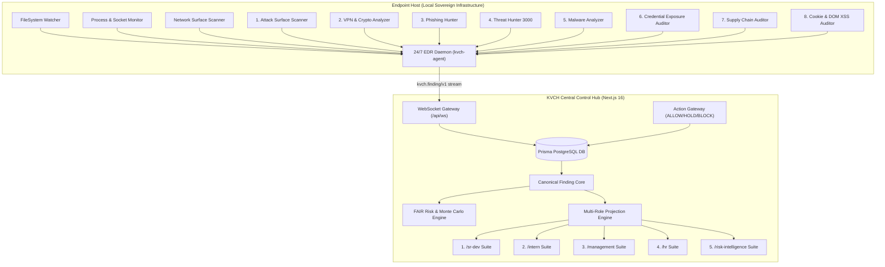
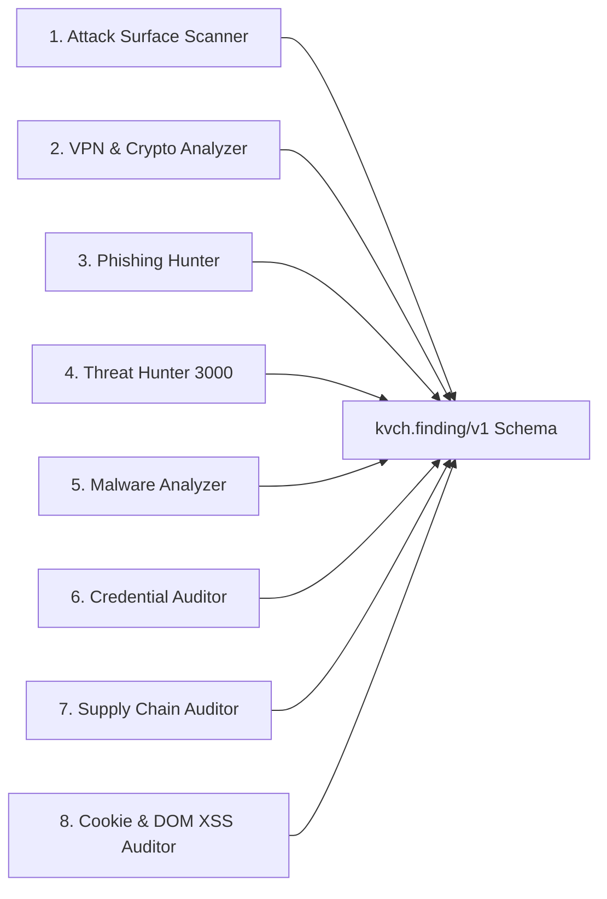

# KVCH — Master Technical Specification & Architecture Manual

**Project Name:** KVCH — Knowledge, Vigilance & Control Hub  
**Pronunciation:** “Kavach” (Hindi: defense armor)  
**Document Type:** Complete Master Technical Specification (A-Z Architecture)  
**Version:** 2.0.0-alpha  
**Date:** 12 September 2026  
**Primary Deployment Model:** Self-hosted inside customer-controlled sovereign infrastructure  

---

## 📋 Table of Contents

1. [Executive Overview & Product Thesis](#1-executive-overview--product-thesis)
2. [High-Level Architecture & System Topology](#2-high-level-architecture--system-topology)
3. [Linear Design Language System Specifications](#3-linear-design-language-system-specifications)
4. [Complete 5-Role Control Plane Suite Specifications](#4-complete-5-role-control-plane-suite-specifications)
   - 4.1 Senior Developer Suite (`/sr-dev/*`)
   - 4.2 Intern / Junior Developer Suite (`/intern/*`)
   - 4.3 Management & Tech Leads Suite (`/management/*`)
   - 4.4 HR & Access Governance Suite (`/hr/*`)
   - 4.5 Risk Intelligence & Security Suite (`/risk-intelligence/*`)
   - 4.6 Extensions Workbench (`/extensions`)
5. [Financial Cyber Risk Economics & FAIR Monte Carlo Engine](#5-financial-cyber-risk-economics--fair-monte-carlo-engine)
6. [Detailed Specifications of the 8 Security Scan Extensions](#6-detailed-specifications-of-the-8-security-scan-extensions)
7. [24/7 EDR Background Daemon Architecture (`kvch-agent`)](#7-247-edr-background-daemon-architecture-kvch-agent)
8. [Prisma PostgreSQL Database Schema & Canonical Schemas](#8-prisma-postgresql-database-schema--canonical-schemas)
9. [AI Report Generation & Multi-Role Projection Engine](#9-ai-report-generation--multi-role-projection-engine)
10. [Judge Execution System & WASM Sandbox](#10-judge-execution-system--wasm-sandbox)
11. [REST API Endpoint & WebSocket Reference Registry](#11-rest-api-endpoint--websocket-reference-registry)
12. [Production Build & Verification Guide](#12-production-build--verification-guide)

---

## 1. Executive Overview & Product Thesis

**KVCH (Knowledge, Vigilance, Control Hub)** is an enterprise-grade artificial intelligence workbench, organizational control plane, continuous cyber risk quantification engine, and 24/7 endpoint security defense system.

### 1.1 Core Product Thesis
> **"Sentry watches software. KVCH watches work."**  
> Most enterprise AI tools help employees generate code or chat with company documents. KVCH acts as a sovereign control plane that continuously observes actions across repositories, endpoint hosts, browser profiles, and pipelines. It catches mistakes and security threats before execution, places risky work into reviewable hold states, projects context to authorized owners, and quantifies financial loss exposure in real time.

### 1.2 Dual-Layer Architecture
KVCH is architected across two integrated layers:
1. **Internal Workbench & Control Plane (Next.js 16 App Router)**: A near-black, software-craft UI modeled after Linear (`DESIGN.md`). It features 5 specialized role-based suites (`/sr-dev`, `/intern`, `/management`, `/hr`, `/risk-intelligence`), an extension marketplace & WASM sandbox (`/extensions`), real-time global timezone headers, and high-density data tables.
2. **External Defense & Endpoint Vigilance Plane**: A suite of **8 specialized security detection engines** operating alongside an **always-on 24/7 EDR background daemon (`kvch-agent`)**. This system monitors file system changes, process trees, network sockets, open ports, browser cookie databases, and supply chain lockfiles, streaming findings over WebSockets (`/api/ws`) into a central Prisma-backed PostgreSQL database.

---

## 2. High-Level Architecture & System Topology



### 2.1 Core Operating Loop
Every action, code commit, or security vulnerability traverses an 8-step lifecycle:
```text
1. Event Intake → 2. Context Enrichment → 3. Policy Guardrail → 4. FAIR Risk Model → 5. Role Projection → 6. Decision Gate → 7. Resolution → 8. Verification
```

---

## 3. Linear Design Language System Specifications

The KVCH interface strictly enforces the **Linear product design language** (`DESIGN.md`). It presents a near-black, high-density, quietly luxurious control plane.

### 3.1 Color Palette & Surface Ladder
Visual hierarchy is built using a **4-step surface lift ladder + 1px hairline borders** rather than drop shadows.

```text
[Canvas: #010102 / #090a0b / #0f1011]
  └── [Surface 1: #141516 / #1a1b1d] (Default Card Panels, Tables)
        └── [Surface 2: #18191a / #1e2025] (Active Tabs, Hover Panels)
              └── [Surface 3: #262729] (Selected Pill Toggles)
```

| Token Name | Hex Value | Purpose & Usage Rules |
| :--- | :--- | :--- |
| `colors.canvas` | `#010102` / `#08090a` / `#0f1011` | Deepest canvas background (near-pure black with faint blue tint). |
| `colors.surface-1` | `#141516` / `#1a1b1d` | Default cards, data tables, code diff containers, telemetry panels. |
| `colors.surface-2` | `#18191a` / `#1e2025` | Active tab headers, hovered card panels, modal overlays. |
| `colors.surface-3` | `#262729` | Selected pill toggles, secondary button fills. |
| `colors.hairline` | `#23252a` / `#2b2c2e` | 1px hairline divider rules and card boundaries. |
| `colors.hairline-strong`| `#34343a` | Focused inputs, active border highlights. |

### 3.2 Chromatic Accents & Semantic Color Palette

| Token | Name / Color | Hex Code | Usage Guidelines |
| :--- | :--- | :--- | :--- |
| `primary` | Linear Lavender-Blue | `#5e6ad2` | Used **scarcely**: active navigation tabs, primary CTAs, focus rings, key metric highlights. Hover: `#828fff`. |
| `semantic-success` | Semantic Green | `#27a644` / `#2ea043` | Passed controls, compliant scorecards, mitigated threats, online status. |
| `semantic-warning` | Amber Gold | `#f5a623` / `#f2c94c` | Medium risk alerts, audit mode policies, pending approvals. |
| `semantic-critical` | Critical Red | `#e5484d` / `#eb5757` | SEV-1 outages, active threats, quarantined PRs, SLA breach warnings. |
| `ink` | Light Gray Ink | `#f7f8f8` | Primary headlines, card titles, key values. |
| `ink-muted` | Slate Gray | `#8a8f98` / `#858688` | Table headers, metadata labels, timestamps, subtitles. |
| `mono` | Linear Mono | Monospace | Hash strings, commit IDs, IP addresses, terminal commands. |

### 3.3 Typography Hierarchy
Built on **Inter / SF Pro Display** (`--font-sans`) with negative letter-spacing for headers, and **JetBrains Mono / Linear Mono** for code tokens.

| Token | Font Size | Font Weight | Line Height | Letter Spacing | Use Case |
| :--- | :--- | :--- | :--- | :--- | :--- |
| `display-xl` | 80px | 600 | 1.05 | -3.0px | Main hero headline |
| `display-lg` | 56px | 600 | 1.10 | -1.8px | Section opener headlines |
| `display-md` | 40px | 600 | 1.15 | -1.0px | Sub-section headlines |
| `headline` | 28px | 600 | 1.20 | -0.6px | Section header titles |
| `card-title` | 22px | 500 | 1.25 | -0.4px | Feature card title |
| `subhead` | 20px | 400 | 1.40 | -0.2px | Lead intro paragraphs |
| `body-lg` | 18px | 400 | 1.50 | -0.1px | Hero subhead, lead text |
| `body` | 16px | 400 | 1.50 | -0.05px | Default body copy |
| `body-sm` | 14px | 400 | 1.50 | 0 | Card body, table text |
| `caption` | 12px | 400 | 1.40 | 0 | Meta text, status tags |
| `button` | 14px | 500 | 1.20 | 0 | Button labels |
| `eyebrow` | 13px | 500 | 1.30 | +0.4px | Section taxonomy labels |
| `mono` | 13px | 400 | 1.50 | 0 | Code tokens, hashes, IPs |

---

## 4. Complete 5-Role Control Plane Suite Specifications

The web control plane consists of **45 static and dynamic routes** organized across 5 specialized role suites.

---

### 4.1 👨‍💻 Senior Developer Suite (`/sr-dev/*`)
*Focus: Technical gatekeeping, code diff analysis, incident command, and architectural vigilance.*

#### Pages & Functional Components:
1. **`/sr-dev/dashboard`** — Senior Command Center displaying codebase health scores, active critical PRs, sparklines, telemetry log streams, and AI security reports.
   - *Key Components*: `MinimalSparklineChart`, `CodeDiffViewer`, `TelemetryLogStream`, `AiReportDisplayCard`.
2. **`/sr-dev/reviews`** — Peer review queue with multi-file split diff viewer, AST vulnerability flags, and PR sign-off triggers.
3. **`/sr-dev/projects`** — Repository health tree, module dependency graphs, and tech-debt hot-spots visualizer (`ProjectsTimeline`).
4. **`/sr-dev/approvals`** — Gatekeeper approval queue for high-privilege holds (`APR-8810`), DB schema migrations, and emergency hotfix overrides.
5. **`/sr-dev/incidents`** — Incident command workbench with MTTR SLA gauge, SEV-1 telemetry, impacted user counters (`14,200`), and root-cause analysis (RCA) summaries.
6. **`/sr-dev/pulse`** — Real-time developer velocity & code churn sparkline graphs.
7. **`/sr-dev/inbox`** — Triage intelligence inbox with automated issue categorization.
8. **`/sr-dev/issues`** — Interactive Kanban issue board (`KanbanBoard`).
9. **`/sr-dev/initiatives`** — Strategic engineering initiatives roadmap (`InitiativesPage`).
10. **`/sr-dev/marketplace`** — Security extension marketplace (`MarketplacePage`).
11. **`/sr-dev/custom-extensions`** — Custom WASM extension sandbox (`CustomExtensionsPage`).

---

### 4.2 👨‍🎓 Intern / Junior Developer Suite (`/intern/*`)
*Focus: Guided onboarding, AI assistance, ticket execution, and skill growth.*

#### Pages & Functional Components:
1. **`/intern/dashboard`** — Workspace overview displaying assigned onboarding tasks, PR status, mentor feedback, and AI educational report.
2. **`/intern/tasks`** — Interactive ticket board (`TASK-102`) equipped with inline AI context hints, coding guidelines, and starter code snippets.
3. **`/intern/reviews`** — Personal PR queue displaying mentor comments, automated linting passes, and AST security check results.
4. **`/intern/projects`** — Isolated repository view highlighting assigned modules with embedded OpenAPI / GraphQL schemas.
5. **`/intern/pulse`** — Personal growth tracker highlighting completed milestones, LOC contributed, and YARA hash comparison exercises.
6. **`/intern/inbox`** — Personal notification stream.
7. **`/intern/issues`** — Personal issue ticket board.
8. **`/intern/initiatives`** — Student/Intern project initiatives.
9. **`/intern/marketplace`** — Extension marketplace.

---

### 4.3 👔 Management & Tech Leads Suite (`/management/*`)
*Focus: Executive engineering KPIs, FAIR model risk exposure, ROSI calculations, and blocker escalations.*

#### Pages & Functional Components:
1. **`/management/dashboard`** — Executive KPI summary displaying FAIR financial loss model (Min: `₹15L`, Likely: `₹48L`, Max: `₹1.2Cr`, EAL: `₹38.4L`), loss avoided (`₹72L`), and ROSI (`1,436%`).
2. **`/management/escalations`** — Blocker escalation matrix (`ESC-901`) tracking high-severity impediments, SLA breach countdowns (`12h`), financial risk (`₹45,00,000`), and executive exemption grants.
3. **`/management/investment`** — Business impact & capital investment page tracking FY26 Q3 budget allocation (`₹10.00 Cr`), R&D spend (`45%`), Tech Debt paydown (`25%`), Risk Shielding (`20%`), and DevEx (`10%`).
4. **`/management/pulse`** — Real-time team velocity, capacity utilization (`88%`), and cross-functional delivery speed.
5. **`/management/inbox`** — Executive decision stream for budget approvals, resource re-allocations, and scope changes.

---

### 4.4 🏢 HR & Organization Suite (`/hr/*`)
*Focus: Employee accountability, work pattern sentiment, burnout risk, and policy compliance.*

#### Pages & Functional Components:
1. **`/hr/dashboard`** — Organization health hub featuring committer ID tracking (`EMP-4029` Rohit Debnath), commit hash `7a8f9c1b`, PR #4, and compliance failure under ISO 27001 (A.8.28) & DPDP Act 2023.
2. **`/hr/pulse`** — Anonymized workload sentiment, burnout risk warnings, and developer satisfaction survey responses.
3. **`/hr/patterns`** — Work pattern analysis tracking after-hours commit ratios (`28%` in Core Backend), team burnout risk levels (`HIGH`), skill gap identification, and 1-on-1 check-in triggers.
4. **`/hr/policies`** — Enterprise policy center tracking IP protection (`HRP-101`), acknowledgment rates (`98%`), pending employee signature counts (`3`), and automated email reminders.
5. **`/hr/inbox`** — Action queue for developer onboarding tickets, equipment requests, and internal escalations.

---

### 4.5 🛡️ Risk Intelligence & Security Suite (`/risk-intelligence/*`)
*Focus: Financial cyber risk quantification, threat mitigation, cryptographic audit streams, and compliance.*

#### Pages & Functional Components:
1. **`/risk-intelligence`** — Financial Cyber Risk Quantification & Monte Carlo Calculator. Features 3-step Intake → Loss → Optimization process indicator, CVE-2026-3891 (`pay-auth-crypto`), EPSS score (`0.72`), CISA KEV status, and real VCDB log ingestion.
   - *Sub-navigation*: `RiskNavTabs` header component.
2. **`/risk-intelligence/threats`** — Real-Time Threat Stream tracking secret leaks (`THREAT-9941`), rogue packages, active threat index (`8.9 / 10.0`), mean time to quarantine (`1.8 min`), and single-click remediation buttons ("Auto-Revoke Key & Block PR").
3. **`/risk-intelligence/audits`** — Forensic Cryptographic Audit Stream featuring immutable Merkle hash chain logs (`AUD-2026-9812`), actor IP (`10.244.12.98`), expandable raw code diffs, AI model prompt logs, and cryptographic ZIP bundle export.
4. **`/risk-intelligence/compliance`** — Continuous Compliance Scorecards for **SOC 2** (`94%`), **ISO 27001** (`88%`), **GDPR** (`98%`), and **NIST 800-53** (`82%`), with control failure SLA countdowns and auto-remediation triggers.
5. **`/risk-intelligence/policies`** — Guardrail Policy Engine featuring rule toggle matrix (`ENFORCE`, `AUDIT`, `DISABLED`), severity on trigger (`BLOCK_PR`, `QUARANTINE`), policy evaluation simulator, and rule editor modal.

---

### 4.6 🧩 Extensions Workbench (`/extensions` & `/extensions/[artifactId]`)
* **`/extensions`**: Security extension marketplace for uploading, evaluating, scheduling, and executing `.kvch.tgz` security packages.
* **`/extensions/[artifactId]`**: Detailed extension evaluation stage featuring `IntelligentPerformanceStage` & live execution charts.

---

## 5. Financial Cyber Risk Economics & FAIR Monte Carlo Engine

KVCH incorporates an advanced financial risk quantification engine based on the **FAIR (Factor Analysis of Information Risk)** model combined with **Monte Carlo simulations**:

### 5.1 Risk Quantification Pipeline
```text
Technical Signal (CVE, EPSS, Asset Profile, Vulnerable Code)
  ↓
FAIR Parameter Mapping (Threat Event Frequency × Vulnerability × Loss Magnitude)
  ↓
Monte Carlo Simulation (10,000 Iterations)
  ↓
Financial Loss Distribution (Min Loss, Most Likely Loss, Max Exposure, EAL in ₹ INR)
  ↓
Knapsack Candidate Mitigation Optimization
  ↓
ROSI Calculation (% Return on Security Investment)
```

### 5.2 Mathematical Equations

#### 1. Expected Annual Loss (EAL):
$$\text{EAL} = \text{TEF} \times \text{Vulnerability (V)} \times \text{Loss Magnitude (LM)}$$
Where:
- $\text{TEF} = \text{Threat Event Frequency (Events / Year)}$
- $\text{Vulnerability} = \text{EPSS Score} \times (1 - \text{Compensating Controls Factor})$
- $\text{LM} = \text{Primary Loss (Response Cost + Downtime Cost)} + \text{Secondary Loss (Breach Cost per Record} \times \text{Exposed Records)}$

#### 2. Return on Security Investment (ROSI):
$$\text{ROSI} = \frac{(\text{Risk Reduction Factor} \times \text{Baseline EAL}) - \text{Mitigation Cost}}{\text{Mitigation Cost}} \times 100\%$$

#### 3. Real VCDB Log Calibration Engine (`/api/risk/calibrate`):
- Calibrates asset profile parameters against empirical breach records in the **Veris Community Database (VCDB)**.

---

## 🛡️ 6. Detailed Specifications of the 8 Security Scan Extensions



### Extension 1: Attack Surface Scanner (`attack-surface-scanner`)
* **CLI Entrypoint**: `External/extensions/1_attack_surface_scanner.py`
* **Data Sources**: Network sockets (`0.0.0.0`, `127.0.0.1`), open TCP ports (`22`, `80`, `443`, `3306`, `5432`, `8080`, `27017`), HTTP response headers (`Server`, `X-Powered-By`, `HSTS`, `CSP`).
* **Detection Heuristics**: Unencrypted HTTP endpoints, missing HSTS headers, database ports exposed to LAN/WAN, high response latency.

### Extension 2: VPN & Crypto Analyzer (`vpn-crypto-analyzer`)
* **CLI Entrypoint**: `External/extensions/2_vpn_crypto_analyzer.py`
* **Data Sources**: Network interfaces (`tun0`, `tap0`, `wg0`, `ppp0`), `/etc/resolv.conf` DNS configuration, active process table (`ps -ax`) searching for wallet processes (MetaMask, Phantom, Ledger Live, Exodus).
* **Detection Heuristics**: Split-tunneling DNS leakage, unencrypted DNS resolvers, exposed browser wallet debug ports.

### Extension 3: Phishing Hunter (`phishing-hunter`)
* **CLI Entrypoint**: `External/extensions/3_phishing_hunter.py`
* **Data Sources**: System hosts file (`/etc/hosts`), browser extension manifests (Chrome, Brave, Edge, Firefox), socket connections matching known phishing IOC domains.
* **Detection Heuristics**: Hosts file overrides redirecting banking/crypto domains to loopback/remote IPs, unverified third-party extension `update_url` targets.

### Extension 4: Threat Hunter 3000 (`threat-hunter-3000`)
* **CLI Entrypoint**: `External/extensions/4_threat_hunter_3000.py`
* **Data Sources**: Process table tree structure (`ps -ax -o pid,ppid,user,command`), autostart paths (`~/Library/LaunchAgents`, `/Library/LaunchDaemons`, `/etc/cron.*`), `/var/log` system logs.
* **Detection Heuristics**: Hidden/orphaned processes running out of `/tmp`, unauthorized LaunchAgents executing obfuscated shell scripts.

### Extension 5: Malware Analyzer (`malware-analyzer`)
* **CLI Entrypoint**: `External/extensions/5_malware_analyzer.py`
* **Data Sources**: Temporary and download directories (`/tmp`, `~/Downloads`), binary file headers (Mach-O, ELF, PE magic bytes).
* **Detection Heuristics**: High binary Shannon entropy (> 7.2) indicating packed/encrypted payloads, executable permission flags (`chmod +x`) on scripts in `/tmp`.

### Extension 6: Credential Exposure Auditor (`credential-exposure-auditor`)
* **CLI Entrypoint**: `External/extensions/6_credential_exposure_auditor.py`
* **Data Sources**: Browser extension content scripts, `.env` files, `~/.ssh/id_*`, `~/.aws/credentials`, clipboard API hooks, Web3 provider objects (`window.ethereum`).
* **Detection Heuristics**: BIP-39 12/24 word mnemonics, raw EVM/BTC/SOL private keys, Permit2 signature phishing, clipboard `writeText` overriding crypto addresses.

### Extension 7: Supply Chain Auditor (`supply-chain-auditor`)
* **CLI Entrypoint**: `External/extensions/7_supply_chain_auditor.py`
* **Data Sources**: Project lockfiles (`package-lock.json`, `pnpm-lock.yaml`, `Pipfile.lock`), package manifests (`package.json`, `pyproject.toml`).
* **Detection Heuristics**: Levenshtein distance typosquatting on popular packages (`reqeusts`, `cross-env-payload`), unpinned HTTP package URLs, lifecycle script hooks (`postinstall` executing curl/eval).

### Extension 8: Cookie Security, DOM XSS & Session Auditor (`cookie-xss-auditor`)
* **CLI Entrypoint**: `External/extensions/8_cookie_xss_analyzer.py`
* **Data Sources**: SQLite3 cookie databases across installed browser profiles (`~/Library/Application Support/.../Default/Cookies`), DOM assignment sinks, `localStorage`/`sessionStorage`.
* **Detection Heuristics**: Missing `HttpOnly`/`Secure` flags on session cookies, wildcard domain scoping (`Domain=.domain.com`), dangerous DOM assignment sinks (`.innerHTML =`, `document.write()`, `eval()`).

---

## 📡 7. 24/7 EDR Background Daemon Architecture (`kvch-agent`)

The continuous background daemon (`External/edr_daemon/`) monitors the endpoint 24/7 without requiring manual CLI execution:

- **Entrypoint**: `External/edr_daemon/agent.py`
- **Monitors**: `External/edr_daemon/event_monitors.py`
- **Daemon Control Script**: `External/scripts/kvch_edr_control.sh`

### Daemon Control Lifecycle:
```bash
./External/scripts/kvch_edr_control.sh start   # Launch background daemon agent
./External/scripts/kvch_edr_control.sh status  # Query daemon status & PID
./External/scripts/kvch_edr_control.sh logs    # Tail live telemetry logs
./External/scripts/kvch_edr_control.sh stop    # Gracefully terminate daemon agent
```

---

## 🗄️ 8. Prisma PostgreSQL Database Schema & Canonical Schemas

### 8.1 Database Schema (`web/prisma/schema.prisma`)

```prisma
datasource db {
  provider = "postgresql"
  url      = env("DATABASE_URL")
}

generator client {
  provider = "prisma-client-js"
}

enum ArtifactState {
  uploaded
  evaluating
  deployable
  evaluation_failed
  runtime_unsupported
}

enum EvaluationStatus {
  queued
  running
  passed
  failed
}

enum DeploymentStatus {
  active
  paused
  failed
}

enum RunStatus {
  queued
  running
  healthy
  finding
  failed
}

model Extension {
  id         String     @id @default(cuid())
  companyId  String
  manifestId String
  name       String
  createdAt  DateTime   @default(now())
  updatedAt  DateTime   @updatedAt
  artifacts  Artifact[]

  @@unique([companyId, manifestId])
  @@index([companyId, createdAt])
}

model Artifact {
  id          String        @id @default(cuid())
  extensionId String
  companyId   String
  sha256      String
  storageKey  String
  size        Int
  manifest    Json
  adapterKey  String?
  state       ArtifactState @default(uploaded)
  createdAt   DateTime      @default(now())
  extension   Extension     @relation(fields: [extensionId], references: [id], onDelete: Restrict)
  evaluations Evaluation[]
  deployments Deployment[]
  runs        ScheduledExtensionRun[]
  findings    Finding[]

  @@unique([companyId, sha256])
  @@unique([storageKey])
  @@index([extensionId, createdAt])
}

model Finding {
  id         String                @id @default(cuid())
  runId      String
  artifactId String
  envelope   Json
  severity   String
  category   String
  title      String
  observedAt DateTime
  createdAt  DateTime              @default(now())
  run        ScheduledExtensionRun @relation(fields: [runId], references: [id], onDelete: Restrict)
  artifact   Artifact              @relation(fields: [artifactId], references: [id], onDelete: Restrict)

  @@index([artifactId, observedAt])
  @@index([runId])
}
```

### 8.2 Canonical Finding Envelope (`kvch.finding/v1`)
```json
{
  "schema_version": "kvch.finding/v1",
  "observed_at": "2026-09-12T18:32:05Z",
  "severity": "CRITICAL",
  "category": "malicious_dependency",
  "title": "Remote Code Execution & Typosquatted Supply Chain Package Injection",
  "summary": "Detected unpinned package @kvch-internal/crypto-utils v1.4.2 spawning obfuscated reverse shell to 185.220.101.5:443.",
  "resource": {
    "type": "host_process",
    "id": "PID-14209",
    "name": "prod-db-primary-01.local"
  },
  "evidence": [
    "Process PID 14209 executing Node.js reverse shell script telemetry_worker.js",
    "Socket connection open to C2 IP 185.220.101.5:443",
    "PostgreSQL 5432 bound to external interface 0.0.0.0"
  ],
  "indicators": [
    "REVERSE_SHELL_PID",
    "UNAUTHENTICATED_DB_PORT",
    "TYPOSQUATTED_NPM_PACKAGE"
  ],
  "baseline": {
    "expected_listener": "127.0.0.1",
    "expected_package_version": "1.4.1"
  },
  "recommended_actions": [
    "sudo kill -9 14209",
    "sudo iptables -A OUTPUT -d 185.220.101.5 -j DROP",
    "Pin @kvch-internal/crypto-utils to 1.4.1 in package.json"
  ]
}
```

---

## 🤖 9. AI Report Generation & Multi-Role Projection Engine

The AI report generator (`web/lib/ai/report-generator.ts`) ingests raw `kvch.finding/v1` payloads and dynamically synthesizes **4 specialized role projections**:

```text
                     ┌─> Sr. Dev Projection (Stack traces, diffs, CLI patches)
                     ├─> Intern Projection (Triage steps, attack lifecycle, hash checks)
Raw Finding Payload ─┼─> HR Projection (Committer ID, employee policy, ISO 27001 audit)
                     └─> Management Projection (FAIR financial loss, ROSI %, board brief)
```

---

## ⚖️ 10. Judge Execution System & WASM Sandbox

The Judge Execution System (`web/lib/judge/findings.ts`) provides a secure, sandboxed evaluation engine for validating custom WASM extension packages prior to enterprise deployment:

- **Languages Supported**: Python 3.11, Node.js 20, Rust / WASM.
- **Safety Isolates**: Memory limit `512MB`, execution timeout `10,000ms`, restricted syscall filter.
- **Verification Stages**: Syntax Verification → AST Security Preflight → Dry-Run Execution → Finding Schema Validation.

---

## 🔌 11. REST API Endpoint & WebSocket Reference Registry

### 11.1 Risk Intelligence Endpoints:
- `POST /api/risk/quantify` — Evaluates FAIR model baseline loss & Monte Carlo simulation.
- `POST /api/risk/optimize` — Computes optimal knapsack mitigation portfolio within budget.
- `POST /api/risk/calibrate` — Calibrates asset parameters against real VCDB breach logs.

### 11.2 Extensions & Evaluation Endpoints:
- `GET /api/extensions` — Lists all registered security extensions.
- `POST /api/extensions` — Uploads new `.kvch.tgz` extension package.
- `POST /api/extensions/[artifactId]/evaluate` — Triggers Judge execution sandbox evaluation.
- `POST /api/extensions/[artifactId]/deploy` — Deploys extension to active runtime.

### 11.3 Telemetry & AI Endpoints:
- `GET /api/ws` — WebSocket server streaming live 24/7 EDR findings.
- `POST /api/ai/reports` — Generates multi-role AI security report projections.
- `POST /api/demo/seed-finding` — Seeds test findings into active telemetry stream.

---

## ⚙️ 12. Production Build & Verification Guide

KVCH is optimized for production compilation with zero build errors.

### 12.1 Building the Web Hub:
```bash
cd web
npm install
npm run build
```
*Build Result*: Compiles **45 static & dynamic routes** via Next.js Turbopack with 0 errors (`exit code 0`).

### 12.2 EDR Daemon Control Commands:
```bash
./External/scripts/kvch_edr_control.sh start
./External/scripts/kvch_edr_control.sh status
./External/scripts/kvch_edr_control.sh logs
./External/scripts/kvch_edr_control.sh stop
```

---

## 📌 13. Final System Definition

> **KVCH—Knowledge, Vigilance, Control Hub—is a sovereign AI workbench, organizational control plane, and 24/7 endpoint defense system deployed across an enterprise. Every employee receives a role-specific workspace (`/sr-dev`, `/intern`, `/management`, `/hr`, `/risk-intelligence`) with approved tools, tasks, and reports. KVCH watches actions across company systems, catches mistakes and security threats, holds risky work before harm, routes contextual notifications to responsible owners, and quantifies financial risk exposure in real time.**
