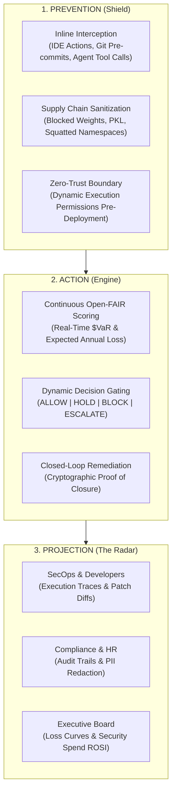
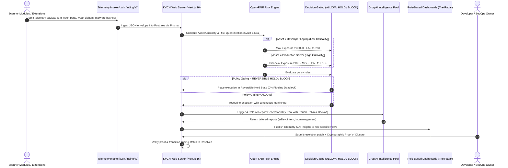

# KVCH (Knowledge, Vigilance, Control Hub) - Technical Workflow PRD & Architecture Specifications

> **System Vision**: KVCH creates a sovereign enterprise **Cyberdome**—an integrated defense umbrella that encircles developer workspaces and autonomous AI agent execution environments to intercept unauthorized runtime actions, automate verified remediation, and project isolated threat visibility across every enterprise tier.

---

## 1. Smart India Hackathon (SIH) System Architecture & Tech Stack Diagram

This diagram provides a presentation-ready breakdown of the complete end-to-end system architecture with explicit technology stack badges for every component.


### Complete Technology Stack Matrix

| Component Layer | Technologies & Frameworks | Key Responsibilities & Capabilities |
|---|---|---|
| **IDE Extension & Scanners** | `Python 3.12`, `Scapy`, `YARA-X`, `Nmap`, `netstat` | Intercepts local network sockets, packet traffic, model weights (`.pkl`), typosquatting DNS, and malware signatures. |
| **Telemetry Intake Contract** | `kvch.finding/v1` JSON Schema | Standardized telemetry envelope format for cross-module risk correlation. |
| **Central Web Server** | `Next.js 16` (App Router), `React 19`, `TypeScript`, `Tailwind CSS v4`, `Lucide React` | High-performance full-stack portal with real-time SSE & WebSocket event streaming. |
| **Database & Worker Queue** | `PostgreSQL 16`, `Prisma ORM v6`, `PgBoss` (Postgres Job Queue), `TSX / Node.js` | Persistent audit logs, evaluation job queuing, artifact hash verification, and worker execution. |
| **AI Risk & Intelligence Engine** | `Groq SDK` (Multi-key Pool), `Meta Llama-3`, `Open-FAIR $VaR Model` | Round-robin key pool manager with rate-limit backoff generating 4 role-specific security reports. |
| **Role-Based Dashboards** | `SecOps / Sr. Dev`, `Cyber Intern`, `HR Compliance`, `Executive CISO` | Isolated views providing tailored technical diffs, triage checklists, compliance audits, and financial ROSI. |
| **Automation & Alerts** | `WebSocket`, `Webhooks`, `Email / Slack Notifications` | Immediate alert routing and execution gating (`ALLOW`, `HOLD`, `BLOCK`, `ESCALATE`). |

---

## 2. High-Level System Architecture Overview (3-Pillar Cyberdome)

This diagram represents the 3 operational pillars for **Slide Page 4 ("TECHNICAL APPROACH")**.




---

## 3. Full End-to-End Technical Sequence Workflow


### Sequence Workflow



---

## 4. Telemetry Data Contract (`kvch.finding/v1`)

```json
{
  "schema_version": "kvch.finding/v1",
  "observed_at": "2026-09-08T12:00:00Z",
  "severity": "high",
  "category": "attack_surface_scan",
  "title": "Discovered Open PostgreSQL Port 5432 & Unencrypted Socket Listener",
  "summary": "Attack surface scanner identified TCP port 5432 bound on 0.0.0.0",
  "resource": {
    "type": "laptop",
    "id": "192.168.0.166",
    "name": "MacBook-Air.lan"
  },
  "evidence": [
    "netstat -anv line: tcp4 0 0 *.5432 *.* LISTEN",
    "nmap scan result: 5432/tcp open postgresql"
  ],
  "indicators": ["LISTEN *.5432", "UNENCRYPTED_LISTENER"],
  "baseline": { "threshold": 0, "enforcement": "BLOCK" },
  "recommended_actions": [
    "Bind PostgreSQL port 5432 strictly to 127.0.0.1",
    "Enable SSL/TLS certificate authentication on database socket"
  ],
  "details": {
    "target_ip": "192.168.0.166",
    "open_ports": [5432, 445],
    "risk_score": 82
  }
}
```
