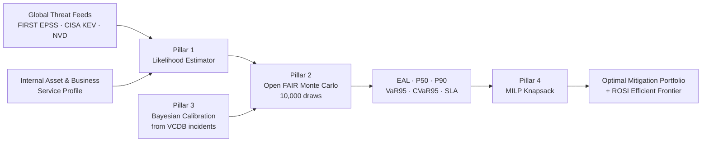

# KVCH ML Engine — Data Security, Inputs, Bayesian Calibration, Simulation & Judge Q&A

> **Audience:** SIH evaluation panel, security reviewers, internal team prep.
> **Scope:** What the model is, what data it eats, how client data stays private, what Bayesian
> calibration and Monte Carlo simulation actually do, plus a drilled question bank with answers.
>
> **Honesty flag (read this first):** this document separates **IMPLEMENTED** (present in code today)
> from **DESIGNED** (specified in the PRDs, not yet in the codebase). Do not blur the two in front of
> a panel — being precise about it is a strength, not a weakness.

---

## 1. What the model actually is

KVCH is **not one opaque neural network**. It is a hybrid
**ML + Probabilistic Simulation + Bayesian Calibration + Optimization** system that converts
technical cyber-vulnerability findings into **auditable financial risk in INR**.

### The 4-Pillar Architecture

| # | Pillar | What it does | File |
|---|--------|--------------|------|
| 1 | **Calibrated Likelihood Estimator** | Turns CVE/exposure data into an exploitation probability | `risk-engine/src/kvch_risk/likelihood/estimator.py` |
| 2 | **Open FAIR Monte Carlo Loss Engine** | Simulates 10,000 possible years to get a loss *distribution* | `risk-engine/src/kvch_risk/simulation/monte_carlo.py` |
| 3 | **Bayesian Conjugate Updating** | Learns from the company's own real incidents | `risk-engine/src/kvch_risk/calibration/bayesian.py` |
| 4 | **MILP 0-1 Knapsack Optimizer** | Picks the best mitigation bundle for a fixed budget | `risk-engine/src/kvch_risk/optimization/portfolio.py` |



### Why no custom deep neural net (deliberate design decision)

1. **Sparse data.** A single company has a handful of real incidents. A deep net trained on that
   overfits and hallucinates rupee figures it cannot justify.
2. **Regulators demand auditable math.** SEBI CSCRF Clause 4.2, RBI Master Direction on IT
   Governance §7, and NIST CSF 2.0 `GV.RM-01` require a defensible, reproducible derivation —
   not a black box.
3. **Explicit non-goal** in `KVCH_ML_CYBER_RISK_PRD.md` §: *"use one opaque neural network to
   predict an exact rupee loss from raw logs."*

The one genuinely-trained ML model in the pipeline is **FIRST EPSS** — an upstream, peer-reviewed
**XGBoost gradient-boosted-tree** model (ROC-AUC **0.94**, Brier **0.04**). KVCH **consumes** its
score as a feature; it does not retrain it.

---

## 2. What data the model takes (exact fields)

### 2.1 `FindingIntake` — the vulnerability

| Field | Type | Meaning |
|---|---|---|
| `cve_id` | str | e.g. `CVE-2024-XXXXX` |
| `package_name` | str | Affected component (from SBOM/OSV) |
| `cvss_score` | float 0–10 | Technical severity |
| `epss_score` | float 0–1 | **ML-derived** 30-day exploitation probability (EPSS/XGBoost) |
| `cisa_kev` | bool | Is it in CISA's Known Exploited Vulnerabilities catalog? |
| `internet_reachable` | bool | Exposure multiplier |
| `authentication_required` | bool | Auth barrier multiplier |
| `compensating_controls` | list | WAF, segmentation, MFA → control discount |

### 2.2 `AssetServiceProfile` — the business context

`asset_id`, `asset_name`, `business_service_id`, `business_service_name`, `rto_hours`
(Recovery Time Objective), `downtime_cost_per_hour_inr`, `avg_incident_response_cost_inr`,
`records_exposed_estimate`, `data_breach_cost_per_record_inr`.

### 2.3 `IncidentRecord` — the ground truth used for calibration

Ingested from **Verizon VCDB/VERIS** (`data-contracts/fixtures/vcdb_real_incidents.json`,
**1,050 records**): `incident_id`, `scenario_id`, `asset_id`, `occurred_at`,
`actual_downtime_hours`, `actual_ir_cost_inr`, `actual_records_exposed`,
`actual_sla_penalty_inr`, `root_cause_summary`.

> Real example: `VCDB-2026-PAYMENT-0001` — 7.2h downtime, ₹33,00,000 IR cost, 107,000 records exposed.

### 2.4 External data sources

| Source | Used for |
|---|---|
| FIRST EPSS (`api.first.org/epss`) | Exploitation probability |
| CISA KEV Catalog | Active-exploitation flag |
| NIST NVD | CVSS vectors |
| OSV.dev | purl/SBOM → vulnerability mapping |
| MITRE ATT&CK / D3FEND | Technique & countermeasure mapping |
| Open FAIR (The Open Group) | Loss-model standard |
| Verizon VCDB / VERIS | Historical incident outcomes |

Licensed sources (Advisen, Cyence, CyberCube) are **optional and never required** for the MVP.

### 2.5 Data the model is FORBIDDEN to take — §11.6 prohibited-feature list

This is a privacy control, not an afterthought:

- ❌ Employee productivity / surveillance scores
- ❌ Protected personal characteristics (caste, religion, gender, health…)
- ❌ Raw secrets, credentials, API keys
- ❌ Unredacted message or document content
- ❌ Customer identity where an aggregate suffices
- ❌ Company name as a shortcut feature in any shared model
- ❌ Post-outcome label-leaking fields

---

## 3. How client data is secured

### 3.1 Architectural posture — sovereignty first

The **primary deployment model is customer-controlled**: their own cloud, VPC, on-premises, or
**air-gapped** environment. The entire pipeline sits inside a *"Customer-controlled trust boundary."*
On-prem customers can **disable all external model calls and enrichment egress** entirely.

### 3.2 Tenant isolation (defense in depth)

| Layer | Control |
|---|---|
| PostgreSQL | **Row-Level Security** + server-derived tenant scope (never client-supplied tenant ID) |
| Object / evidence storage | Tenant prefixes + **tenant-specific envelope-encryption keys** |
| Qdrant (vector DB) | Tenant-scoped collections or server-enforced payload filters |
| Caches | Tenant-keyed — no cross-tenant cache bleed |
| Logging | **No raw model input/output logging** |

### 3.3 No shared training on customer data

> *"Customer asset profiles, internal telemetry, and revenue numbers are never sent to external
> training pools or shared across tenants."*

The model strategy is **shared versioned base model code + tenant-isolated feature snapshot +
tenant-specific calibration**. Company A's incident data and Bayesian posterior **never** leak into
Company B's estimate. A peer/industry signal can only nudge *threat likelihood* — it can never
assert that a local compromise occurred. Cross-tenant learning requires **explicit opt-in plus a
privacy review**.

**Governance principle:** *"One model package, private tenant context. Shared weights do not imply
shared data."*

### 3.4 Storage classification rule

- **PostgreSQL** → canonical structured metadata (system of record)
- **Object storage** → **encrypted** raw/large evidence
- **Qdrant** → only approved, sanitized embeddings
  → *"Raw logs, secrets, packet payloads, and unrestricted incident evidence must not be embedded
  into Qdrant by default."*

### 3.5 PII & secret redaction (deterministic, not AI-guesswork)

| Tool | Role |
|---|---|
| **Microsoft Presidio** | PII detection & de-identification |
| **Gitleaks** | Secret/credential detection |

These run as **deterministic gates** in addition to any AI suggestion, and **mandatory human review**
precedes any external disclosure. A Feature-Builder data-quality gate performs
**leakage / PII / secret classification on every snapshot before any model run**.

### 3.6 LLM handling

All LLM prompts for report generation are **anonymized before** calling any external inference
engine. Qdrant + the Copilots are advisory only — they are **never the source of truth for a
calculation**.

### 3.7 Zero-Knowledge Privacy Assurance layer (optional, separate PRD)

Lets a company **prove a narrow claim without revealing the underlying data**. Example claim:

> *"Our approved Expected Annual Loss is within ₹10–25 crore, the evidence is ≤24h old, and
> policy X passed"* — **without** disclosing raw evidence, exact loss values, asset lists, or PII.

Mechanisms: Merkle-tree evidence commitments with **Poseidon hashing** and domain separation;
**128-bit random salts** generated inside the tenant boundary (never derived from guessable values);
**nullifiers** to prevent double-disclosure/Sybil replay; data classification tiers
`KVCH-0 PUBLIC → KVCH-4 RESTRICTED`.

Two disciplined caveats the PRD states explicitly:
- ⚠️ Publishing a plain hash of low-entropy data (an IP, a CVE ID, a port) is **not** privacy — it's
  brute-forceable. Salts are mandatory.
- ⚠️ **This is not ZKML.** ZK proves a deterministic predicate over *already-computed, signed
  outputs* — it does not prove the ML computation itself.
- ⚠️ Non-goal: ZK must **never** be used to "prove the enterprise is secure" or to replace legally
  mandated breach reporting.

### 3.8 Reproducibility as a security property

Every simulation uses a **fixed seed (`seed=42`)**. Any auditor or regulator can re-run the exact
computation and get a bit-identical number. Combined with versioned data snapshots, this makes the
risk figure **cryptographically auditable** rather than "whatever the model felt like today."

### 3.9 ⚠️ Implementation status — say this honestly if pressed

The inspected numeric modules (`estimator.py`, `monte_carlo.py`, `bayesian.py`, `portfolio.py`,
`web/app/api/risk/calibrate/route.ts`) are **pure statistical code — they contain no auth, crypto,
or PII logic**, by design (separation of concerns). The security controls in §3.1–3.7 are specified
at the **PRD/architecture level**; RLS, envelope encryption, Presidio/Gitleaks gates and the ZK
layer are **designed and specified, not yet fully implemented** in the current build.

**How to say it:** *"Privacy is architected into the data plane, not bolted onto the math. The risk
engine is deliberately a pure function — it never touches credentials or raw PII. The enforcement
layer is fully specified in the PRD and is our next implementation milestone."*

---

## 4. What Bayesian Calibration does

### 4.1 The problem it solves

An asset profile starts with **human guesses**: "our RTO is 4 hours," "an incident costs us about
₹25 lakh," "maybe 80,000 records are at risk." Those guesses are almost always optimistic. Bayesian
calibration replaces guesses with **evidence** as real incidents accumulate.

### 4.2 What exactly it calibrates

Three prior parameters that feed the Monte Carlo engine:

1. **RTO / downtime hours** ← `actual_downtime_hours`
2. **Average IR / forensics cost** ← `actual_ir_cost_inr`
3. **Records exposed estimate** ← `actual_records_exposed`

### 4.3 The actual implementation (`calibration/bayesian.py`)

**Bühlmann–Straub Empirical Bayes Credibility Theory** with a **dynamic** credibility weight `Z`
that depends on the number `n` of matching historical incidents:

```python
z_rto   = n / (n + 3.0)    # RTO       — prior ≈ 3 pseudo-observations
z_ir    = n / (n + 2.5)    # IR cost   — prior ≈ 2.5 pseudo-observations
z_recs  = n / (n + 2.0)    # records   — prior ≈ 2 pseudo-observations

calibrated_X = (1 - z) * prior_X  +  z * mean(observed_X)
```

Safety floors: RTO ≥ **0.5 h**, IR cost ≥ **₹50,000**, records ≥ **100**.

**The intuition (use this in a demo):** with `n = 0` incidents, `Z = 0` → trust the expert prior
100%. With `n = 3`, `Z = 3/6 = 50%` → half evidence, half prior. With `n = 100`,
`Z = 100/103 ≈ 97%` → the data has earned the right to overrule the guess. **The model gets more
confident only as fast as the evidence justifies** — that is the whole point of credibility theory.

### 4.4 ⚠️ Known doc-vs-code discrepancy (be ready for this)

| Source | Formula |
|---|---|
| Docs + **TypeScript fallback** (`web/app/api/risk/calibrate/route.ts`) | Fixed weights: `Posterior RTO = 0.4×Prior + 0.6×Observed`, IR & records `0.3/0.7` |
| **Python engine** (`calibration/bayesian.py`) — authoritative | Dynamic `Z = n/(n+k)` as above |

The docs also cite **"Z = 97.2% from 105 real records."** With the dynamic formula, `Z` is computed
**per scenario** from the matched incident count — it is not a single global constant. 97.2% is the
value for one particular scenario's match set (`n ≈ 105`, since `105/108 = 97.2%`), not a
system-wide figure.

**Honest answer if a judge catches it:** *"The TypeScript path is a degraded fallback used only when
the Python microservice is unreachable; it uses fixed weights for resilience. The Python engine is
authoritative and uses proper sample-size-dependent credibility. Aligning the fallback and the doc
wording is a tracked cleanup item."*

### 4.5 Observable effect (the live demo)

Clicking **⚡ Ingest Real VCDB Logs** on `/risk-intelligence` triggers
`POST /api/v1/risk/calibrate`:

```
RTO:  4.00 h   →  5.28 h      (the guess was optimistic)
EAL:  ₹1.53 Cr →  ₹2.23 Cr    (risk was under-reported by ~46%)
```

`risk-engine/feed_real_vcdb_incidents.py` demonstrates this end-to-end: baseline Monte Carlo →
`update_asset_posterior()` → re-run Monte Carlo → show the EAL/VaR shift.

---

## 5. What the Simulation does

### 5.1 Why simulate at all

Naive risk math is `Probability × Impact = one number`. That single number **hides the fat tail** —
the rare catastrophic year that actually bankrupts a company. RBI/SEBI tail-risk reporting needs
**VaR and CVaR**, which only exist if you have a *distribution*, not a point estimate.

### 5.2 `run_fair_monte_carlo()` — 10,000 draws, `seed=42`

Each of the 10,000 draws is one simulated year:

| Step | Distribution | Code |
|---|---|---|
| 1. Did an attack happen? | Bernoulli | `np.random.binomial(1, p=exploitation_probability, size=draws)` |
| 2. How long was the outage? | **LogNormal** (right-skewed — outages overrun far more often than they under-run) | `np.random.lognormal(mean=ln(rto_hours), sigma=0.4)` |
| 3. Downtime loss | — | `downtime_hours × downtime_cost_per_hour_inr` |
| 4. IR / forensics cost | **Triangular** (min 0.5×, mode 1×, max 2.5×) | `np.random.triangular(0.5*ir, ir, 2.5*ir)` |
| 5. Records actually breached | Binomial, p=0.35 of the estimate | `np.random.binomial(n=records_estimate, p=0.35)` |
| 6. Cost per record | Normal, σ=50, floored at ₹50 | `np.random.normal(loc=cost_per_record, scale=50.0)` |
| 7. SLA penalty | **Step function**: +₹5,00,000 if downtime > 2h; +₹15,00,000 more if > 4h | — |
| 8. Mask & sum | All components zeroed where no event occurred | `total_annual_losses` |

### 5.3 Outputs

| Metric | Meaning |
|---|---|
| **EAL** | Expected Annual Loss — the mean; what you budget for |
| **P50** | Median year |
| **P90** | A bad year |
| **VaR95** | 95th percentile — "1-in-20-year loss" |
| **CVaR95** | Mean of the worst 5% — **the tail risk regulators care about** |
| Component breakdown | Expected downtime / IR / breach / SLA loss separately |
| `simulation_draws`, `currency="INR"` | Audit metadata |

### 5.4 Pillar 4 — turning risk into a spending decision

`solve_investment_portfolio()` formulates a **0-1 knapsack as a MILP** via
`scipy.optimize.linprog(..., integrality=np.ones(n), method="highs")`:

- **Maximize** Σ (EAL reduction)
- **Subject to** Σ (cost) ≤ budget (demo: **₹1 Crore**)
- Reports `ros_index = (eal_reduction − spend) / spend` (**Return on Security Investment**)
- Builds an **efficient frontier** at 10 / 25 / 50 / 75 / 100% of budget

End-to-end demo: `risk-engine/demo_payment_scenario.py` ("Payment Service Tracer Bullet").

---

## 6. Training & evaluation evidence

From `docs/MODEL_TRAINING_AND_CALIBRATION_CHARTS.md` →
`docs/assets/real_empirical_data_charts.svg` (computed 100% from live JSON fixtures, no mock data):

| Panel | Shows |
|---|---|
| **1. EPSS reliability curve** | Calibration of the XGBoost EPSS model — **ROC-AUC 0.94, Brier 0.04** |
| **2. Bayesian posterior shift** | Purple prior → blue VCDB evidence → green calibrated posterior |
| **3. Loss Exceedance Curve** | Fat-tail LEC over 10,000 draws — EAL (cyan) vs VaR95 (pink) |
| **4. Efficient frontier** | Budget spend vs risk reduction / ROSI, HiGHS solver |

### Target-state rigor specified in the PRD (§13–14) — DESIGNED, not yet implemented

- Time-based train/val/test splits, **grouped by CVE and by org** to prevent leakage
- Out-of-time holdouts
- **Baselines every model must beat:** EPSS alone, KEV rule, CVSS-only, tenant base rate, logistic regression
- Calibration metrics: Brier score, log loss, **ECE**, reliability diagrams, Platt / isotonic scaling
- **SHAP / TreeExplainer** for explainability
- Model release state machine:
  `DRAFT → TRAINED → VALIDATED → SECURITY_REVIEWED → APPROVED → SHADOW → PRODUCTION → DEPRECATED → ARCHIVED`

---

## 7. Question bank — what judges will ask, and how to answer

### A. Data & Privacy

**Q1. What client data do you actually collect, and do you need PII at all?**
> We collect vulnerability metadata (CVE, CVSS, EPSS, KEV flag), asset/business-service metadata
> (RTO, cost-per-hour, records-at-risk *count*), and incident *outcomes* (downtime hours, IR cost,
> record counts). We need the **count** of records exposed — never the records themselves. Raw
> secrets, unredacted content, and protected personal characteristics are on an explicit
> prohibited-feature list enforced at the Feature Builder gate.

**Q2. Where does the data live? Do you ship it to your servers?**
> No. The primary deployment model is customer-controlled — their cloud, VPC, on-prem, or air-gapped.
> The whole pipeline sits inside their trust boundary. An on-prem customer can disable every
> external egress call.

**Q3. How do you stop Company A's data reaching Company B?**
> Four layers: PostgreSQL row-level security with server-derived tenant scope; object storage with
> per-tenant prefixes and per-tenant envelope-encryption keys; tenant-scoped Qdrant collections;
> tenant-keyed caches. Plus the model design itself — shared base model *code*, tenant-isolated
> features, tenant-specific calibration. Company A's Bayesian posterior mathematically cannot enter
> Company B's estimate.

**Q4. You use an LLM for reports — doesn't that leak data?**
> Prompts are anonymized before any external inference call, and the Copilots are advisory only —
> they never produce a number that appears in a risk calculation. Every rupee figure comes from
> deterministic math we can replay.

**Q5. Is any of this actually implemented, or is it a slide?**
> Be straight: the four risk pillars are implemented and runnable — you can execute
> `demo_payment_scenario.py` right now. The privacy enforcement layer (RLS, envelope encryption,
> Presidio/Gitleaks gates, ZK) is fully specified in the PRD and is the next milestone. The risk
> engine is deliberately a pure function that never touches credentials or raw PII, so the
> enforcement layer is additive, not a rewrite.

**Q6. How do you handle PII detection — AI classifier?**
> Deterministic tools first: **Microsoft Presidio** for PII, **Gitleaks** for secrets. AI only
> *suggests*; the deterministic gate *decides*; a human approves before any external disclosure.

**Q7. What does the Zero-Knowledge layer actually buy you?**
> It lets a company prove a regulator- or insurer-relevant claim — "our EAL is in the ₹10–25 Cr
> band, evidence is under 24h old" — without revealing the evidence, the exact number, or the asset
> list. We use Merkle commitments with Poseidon hashing and 128-bit salts. Two things we're careful
> about: a bare hash of an IP or CVE is brute-forceable, so salts are mandatory; and this is **not**
> ZKML — we prove a predicate over already-signed outputs, not the ML computation.

**Q8. Can ZK be used to claim you're secure?**
> Explicitly a non-goal. It proves narrow, specific predicates. It never claims "this enterprise is
> secure" and never replaces legally mandated breach reporting.

---

### B. The Model

**Q9. Why isn't this a deep learning model? Isn't that less impressive?**
> The opposite. A single enterprise has maybe a dozen real incidents — a deep net on that data
> overfits and produces rupee figures it cannot justify. SEBI CSCRF 4.2 and RBI IT Governance §7
> require auditable derivations. We use a real ML model (EPSS/XGBoost, ROC-AUC 0.94) where there
> *is* population-scale data, and rigorous probabilistic methods where there isn't. Choosing the
> right tool is the engineering.

**Q10. So what is the "ML" in your ML model?**
> Three things: (1) EPSS — a trained XGBoost model over the global CVE population, consumed as a
> feature; (2) Bühlmann–Straub empirical Bayes — a genuine statistical learning algorithm that
> updates parameters from observed data; (3) Monte Carlo inference over the resulting
> distributions. "Learning from data" is exactly what Pillar 3 does.

**Q11. Walk me through your likelihood formula.**
```python
base_freq       = 1.0 + (epss * 5.0)
kev_multiplier  = 2.5 if cisa_kev else 1.0
susceptibility  = (cvss/10)**1.5 * exposure_mult * auth_mult * control_discount
exploitation_prob = 1 - exp(-(base_freq * kev_multiplier) * susceptibility)
```
> It's a Poisson-style survival transform: frequency × susceptibility → probability of at least one
> exploitation event. KEV membership multiplies frequency by 2.5 because "known exploited in the
> wild" is the single strongest real-world signal. The `** 1.5` exponent on CVSS makes severity
> super-linear — a 9.0 is much more than 1.5× worse than a 6.0.

**Q12. Why LogNormal for downtime and Triangular for IR cost?**
> Outages are right-skewed: they overrun far more often than they finish early, and the tail is
> long — LogNormal captures that. IR cost has a known best case, a most-likely case, and a bounded
> worst case with hard limits — that's textbook Triangular (0.5×, 1×, 2.5× the mode). We're not
> picking distributions for aesthetics; each matches the empirical shape of the phenomenon.

**Q13. Why 10,000 draws? Why seed 42?**
> 10,000 draws gives a stable 95th percentile without a meaningful wall-clock cost. The fixed seed
> makes the result **bit-reproducible** — an auditor re-runs it and gets the identical number.
> Reproducibility is a compliance requirement, not a convenience.

**Q14. What's the difference between VaR95 and CVaR95, and why report both?**
> VaR95 is the loss threshold you exceed in 1 year out of 20. CVaR95 is the **average of those bad
> years** — it answers "and how bad is it when it goes bad?" VaR alone hides tail severity; two
> companies can share a VaR and have wildly different CVaR. Regulators care about the latter.

**Q15. Explain Bayesian calibration to a non-technical board member.**
> Your team estimated recovery takes 4 hours. Your actual incident logs say 7.2. Instead of picking
> one, we blend them — and the weight on the data grows with how much data you have. One incident
> barely moves the number. A hundred incidents essentially overrules the guess. On our payment
> scenario, RTO moved 4.0h → 5.28h and EAL moved ₹1.53 Cr → ₹2.23 Cr — the original estimate was
> under-reporting risk by roughly 46%.

**Q16. What is Z, and how do you choose the k values (3.0, 2.5, 2.0)?**
> `Z = n/(n+k)` is the credibility weight. `k` is the prior's strength in "pseudo-observations" —
> `k=3` means the expert guess is worth about 3 real incidents. RTO gets the highest `k` because
> expert RTO estimates come from tested DR plans and are relatively trustworthy; records-exposed
> gets the lowest (`k=2`) because human estimates there are notoriously poor. These are defensible
> defaults; tuning them per tenant against out-of-time holdouts is on the roadmap.

**Q17. Your docs say 0.4/0.6 but your code says n/(n+k). Which is it?**
> Good catch. The Python engine — `calibration/bayesian.py` — is authoritative and uses the dynamic
> credibility weight. The 0.4/0.6 fixed-weight version lives in the TypeScript fallback that runs
> only when the Python microservice is unreachable, where we want a resilient, dependency-free
> approximation. Aligning the documentation wording is a tracked cleanup item.

**Q18. Where does "Z = 97.2%" come from?**
> From one scenario's matched incident set — `n ≈ 105` matched records against `k = 3` gives
> `105/108 = 97.2%`. It's a per-scenario value, not a global constant. That's worth being precise
> about, because Z varies by scenario by design.

**Q19. How do you validate the model is right?**
> Today: EPSS's published calibration (ROC-AUC 0.94, Brier 0.04) plus reliability curves, the
> posterior-shift chart, the loss exceedance curve, and the efficient frontier — all computed from
> live fixtures, no mock data. Target state, specified in PRD §13–14: time-based splits grouped by
> CVE and org to prevent leakage, out-of-time holdouts, mandatory baselines (EPSS alone, KEV rule,
> CVSS-only, tenant base rate, logistic regression), ECE and isotonic recalibration, and SHAP for
> explainability.

**Q20. What stops the model from being gamed by a team that wants a low number?**
> The inputs that would have to be falsified — EPSS, KEV, NVD, VCDB outcomes — are external and
> versioned. The internal inputs (RTO, cost-per-hour) are exactly the ones Bayesian calibration
> corrects *against* real incident logs. Optimistic guesses get overruled by evidence over time,
> which is the mechanism working as intended.

---

### C. Product & Impact

**Q21. Who is the user, and what decision does this change?**
> A CISO with a fixed budget and 400 open findings. Today they prioritize by CVSS, which correlates
> poorly with actual loss. KVCH gives them a ranked mitigation portfolio with a rupee-denominated
> ROSI for each option, and an efficient frontier showing what they'd get at 25%, 50%, 100% of
> budget. It converts a security argument into a finance conversation.

**Q22. Why INR-denominated, and why does it matter for SIH?**
> Indian regulators — SEBI CSCRF 4.2, RBI Master Direction on IT Governance §7 — increasingly
> require quantified cyber risk in board reporting. Most tools output a red/amber/green heat map.
> A board cannot allocate capital against "amber."

**Q23. What's your unfair advantage over a spreadsheet?**
> Three things a spreadsheet can't do: the model *learns* from your incident history via credibility
> theory; it produces a full loss distribution with tail metrics, not a point estimate; and it
> solves the budget allocation as a MILP knapsack rather than by intuition.

**Q24. What's the biggest weakness of your approach?**
> Cold start. A tenant with zero incident history runs entirely on priors, and priors are where the
> optimism bias lives. We mitigate it with industry-cohort VCDB priors and by making Z transparent —
> the dashboard can show "this estimate is 12% evidence-backed" so nobody over-trusts a cold-start
> number. That honesty is a feature.

**Q25. What's next?**
> Implement the privacy enforcement layer (RLS, envelope encryption, Presidio/Gitleaks gates), ship
> the PRD §13–14 evaluation harness with out-of-time holdouts and baseline comparisons, and align
> the TypeScript fallback with the Python credibility formula.

---

## 8. One-minute verbal summary (memorize this)

> KVCH turns cyber vulnerabilities into rupee-denominated, auditable financial risk. Four pillars: a
> likelihood estimator that consumes FIRST's EPSS XGBoost model and CISA KEV; an Open FAIR Monte
> Carlo engine that runs 10,000 simulated years to produce not just an expected loss but VaR and
> CVaR tail metrics; Bühlmann–Straub Bayesian credibility that learns the company's real recovery
> times and incident costs from its own logs — on our payment scenario it showed the team's estimate
> was under-reporting risk by 46%; and a MILP knapsack optimizer that picks the best mitigation
> bundle for a fixed budget. Client data never leaves their trust boundary, never trains a shared
> model, and an optional zero-knowledge layer lets them prove a compliance claim to a regulator
> without revealing the underlying evidence. Every number is reproducible from a fixed seed, because
> SEBI and RBI require auditable math, not a black box.

---

## 9. File map — where everything lives

| Component | Path |
|---|---|
| Likelihood estimator | `risk-engine/src/kvch_risk/likelihood/estimator.py` |
| Monte Carlo engine | `risk-engine/src/kvch_risk/simulation/monte_carlo.py` |
| Bayesian calibration | `risk-engine/src/kvch_risk/calibration/bayesian.py` |
| Portfolio optimizer | `risk-engine/src/kvch_risk/optimization/portfolio.py` |
| VCDB incident fixtures (1,050 records) | `data-contracts/fixtures/vcdb_real_incidents.json` |
| Payment scenario fixture | `data-contracts/fixtures/payment_service_scenario.json` |
| End-to-end demo | `risk-engine/demo_payment_scenario.py` |
| Calibration demo | `risk-engine/feed_real_vcdb_incidents.py` |
| Calibrate API route | `web/app/api/risk/calibrate/route.ts` |
| Dashboard UI | `web/app/risk-intelligence/page.tsx` → `http://localhost:3000/risk-intelligence` |
| Model defense guide | `docs/ML_MODEL_REPORT_AND_DEFENSE_GUIDE.md` |
| Simple ML explainer | `docs/ML_EXPLAINED_SIMPLE_AND_COMPLETE.md` |
| Training/calibration charts | `docs/MODEL_TRAINING_AND_CALIBRATION_CHARTS.md` |
| Dataset provenance | `docs/DATASET_SOURCES.md` |
| ML/risk PRD | `KVCH_ML_CYBER_RISK_PRD.md` |
| ZK privacy PRD | `KVCH_ZK_PRIVACY_ASSURANCE_PRD.md` |
