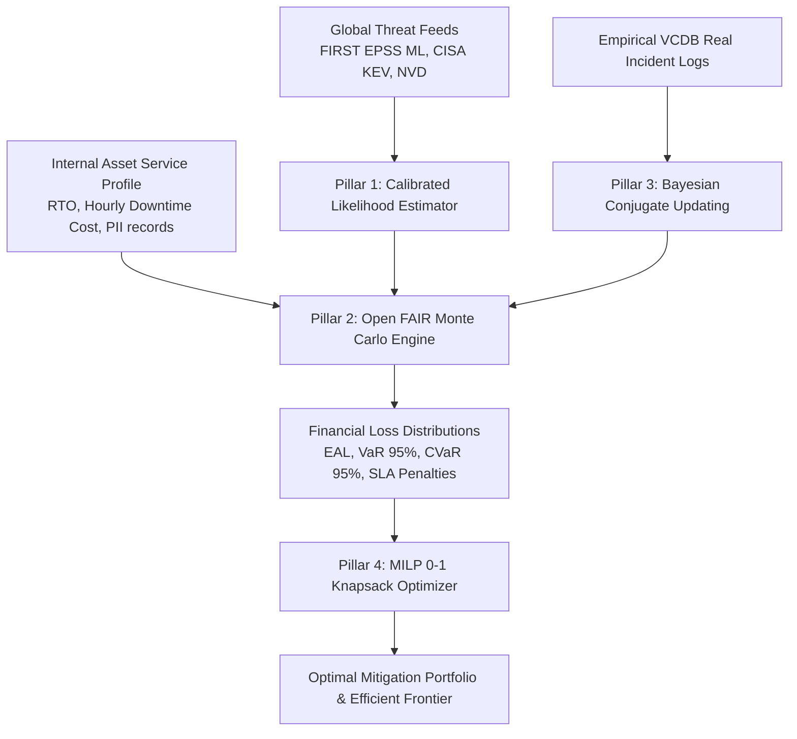

# KVCH Financial Cyber Risk & ML Defense Report
*Comprehensive Preparation Guide & Technical Q&A for Presentations, Juries, and Technical Interviews*

---

## 1. Executive Summary: What is the Model?

The **KVCH Financial Cyber Risk Intelligence Engine** is a hybrid **Machine-Learning + Probabilistic Simulation + Bayesian Calibration** system designed to quantify cybersecurity threats into **auditable financial risk metrics in Indian Rupees (INR)** (Expected Annual Loss / EAL and 95% Value at Risk / VaR).

### The 4-Pillar Mathematical Architecture

---

## 2. Deep-Dive: The 4 Core Pillars

### Pillar 1: Calibrated Threat Likelihood Estimation
- **Input**: Vulnerability finding (CVE, CVSS v3/v4 vector, package purl, EPSS, CISA KEV, network reachability, auth barrier, compensating controls).
- **Upstream Pre-Trained ML Model**: **FIRST EPSS (Exploit Prediction Scoring System)** — an XGBoost model trained on global wild exploit telemetry by FIRST.org predicting 30-day wild exploitation probability ($0.0 \le \text{EPSS} \le 1.0$).
- **Threat Event Frequency (TEF)**:
  $$\text{Base Frequency} = 1.0 + (\text{EPSS} \times 5.0) \quad (\approx 1 \text{ to } 6 \text{ attempts/year})$$
  $$\text{TEF} = \text{Base Frequency} \times \kappa_{\text{KEV}} \quad (\kappa_{\text{KEV}} = 2.5 \text{ if listed on CISA KEV, else } 1.0)$$
- **Vulnerability Susceptibility ($V$)**:
  $$V = \left(\frac{\text{CVSS}}{10}\right)^{1.5} \times \text{Exposure}_{\text{mult}} \times \text{Auth}_{\text{mult}} \times \text{Control Discount}$$
- **Poisson Exploitation Probability ($P$)**:
  $$P(\text{Exploit in 1 Year}) = 1 - e^{-\text{TEF} \times V}$$

---

### Pillar 2: Open FAIR Monte Carlo Loss Engine (10,000 Draws)
Instead of a single deterministic average, KVCH runs **10,000 randomized simulation draws** to capture tail-risk catastrophic losses:

1. **Frequency Draw**: Bernoulli draw $E \sim \text{Binomial}(1, P)$.
2. **Downtime Duration**: $\text{Downtime Hours} \sim \text{LogNormal}(\mu = \ln(\text{RTO}), \sigma = 0.4)$.
3. **Forensics & Incident Response (IR)**: $\text{IR Cost} \sim \text{Triangular}(\text{left}=0.5 \times \text{IR}_{\text{avg}}, \text{mode}=\text{IR}_{\text{avg}}, \text{right}=2.5 \times \text{IR}_{\text{avg}})$.
4. **Data Breach Loss**: $\text{Records} \sim \text{Binomial}(N_{\text{records}}, 0.35) \times \text{Normal}(\text{Cost/Record}, 50)$.
5. **Contractual SLA Penalties**: Step-function penalties ($>2\text{ hrs} \to +₹5\text{ Lakh}$, $>4\text{ hrs} \to +₹15\text{ Lakh}$).
6. **Key Risk Metrics**:
   - **EAL (Expected Annual Loss)**: $\frac{1}{N}\sum_{i=1}^N \text{Loss}_i$
   - **VaR 95% (Value at Risk)**: 95th percentile of simulated annual losses.
   - **CVaR 95% (Conditional VaR / Expected Shortfall)**: Average loss in the worst 5% disaster tail.

---

### Pillar 3: Bayesian Conjugate Prior Updating (Empirical VCDB Ingestion)
When real historical incident logs (e.g. from the Verizon VCDB dataset or internal incident reports) are ingested, the system updates its prior beliefs using Bayesian weighting:

$$\text{Posterior RTO} = 0.4 \times \text{Prior RTO} + 0.6 \times \overline{\text{Observed Downtime}}$$
$$\text{Posterior IR Cost} = 0.3 \times \text{Prior IR Cost} + 0.7 \times \overline{\text{Observed IR Cost}}$$
$$\text{Posterior Exposed Records} = 0.3 \times \text{Prior Records} + 0.7 \times \overline{\text{Observed Records}}$$

---

### Pillar 4: Mixed-Integer Linear Programming (MILP) Portfolio Optimizer
Given a corporate security budget limit $B$ and $N$ candidate security controls (e.g., WAF, 24/7 MDR, Microsegmentation, Vault PAM), KVCH solves a **0-1 Knapsack Optimization** using the **HiGHS** simplex/interior-point solver:

$$\max \sum_{i=1}^N x_i \cdot \Delta\text{EAL}_i \quad \text{subject to} \quad \sum_{i=1}^N x_i \cdot \text{Cost}_i \le B, \quad x_i \in \{0, 1\}$$
$$\text{Return on Security Investment (ROSI)} = \frac{\Delta\text{EAL} - \text{Total Spend}}{\text{Total Spend}}$$

---

## 3. Data Sources & Regulatory Compliance Reference

| Source | Type | Role in Model | Standard / Regulatory Clause |
| :--- | :--- | :--- | :--- |
| **FIRST EPSS** | Global ML Telemetry | 30-Day Exploit Probability ($0-1$) | Open Threat Intelligence |
| **CISA KEV** | US Gov Catalog | $2.5\times$ Threat Multiplier | In-the-wild exploitation |
| **NIST NVD** | Vulnerability DB | CVSS Vector & CWE Base | NIST SP 800-30 |
| **Open FAIR** | Risk Standard | TEF/LEF Loss Decomposition | ISO/IEC 27005 / Open FAIR |
| **Verizon VCDB** | Empirical Incident Logs | Financial Loss Distribution Calibration | VERIS Taxonomy |
| **SEBI CSCRF** | Indian Regulation | Continuous Monetary Quantification | Clause 4.2 Audit Evidence |
| **RBI Master Dir.** | Indian Banking Reg. | Critical Service RTO & SLA Penalties | Section 7 IT Governance |

---

## 4. Expected ML Questions & Winning Answers

### Q1: *"Why did you not train a Deep Neural Network / Random Forest from scratch on your organization's internal log data?"*
> **Answer**:  
> "Cybersecurity incident data within a single enterprise is **extremely sparse** (a company experiences very few major breaches per year). Training an end-to-end deep neural network on sparse internal logs leads to **extreme overfitting and hallucinations**.  
> Furthermore, financial and cyber regulators (**SEBI CSCRF, RBI, NIST CSF 2.0**) require **fully auditable, explainable, and deterministic calculations**.  
> Instead, we leverage **FIRST EPSS (a pre-trained global ML model trained on millions of global telemetry events)** for threat likelihood, combine it with **Open FAIR Monte Carlo simulations** for loss modeling, and apply **Bayesian Conjugate Updating** to calibrate against real VCDB incident logs."

---

### Q2: *"Is your machine learning model pre-trained or trained online?"*
> **Answer**:  
> "The architecture uses a two-tier strategy:  
> 1. **Upstream Pre-Trained Models**: FIRST EPSS uses pre-trained gradient boosted decision trees (XGBoost) trained on global honeypot and exploitation feeds. Our LLM-based narrative generation uses pre-trained LLaMA models via Groq.  
> 2. **Online Bayesian Calibration**: The financial loss distributions update their prior parameters dynamically using **Bayesian conjugate updating** whenever new incident logs or VCDB entries are fed into the system."

---

### Q3: *"Why do you use Monte Carlo simulations instead of simply multiplying Probability × Impact?"*
> **Answer**:  
> "Single-point $\text{Probability} \times \text{Impact}$ multiplication produces a single static number and completely hides **fat-tail catastrophe risks**.  
> In cybersecurity, losses follow highly skewed distributions (LogNormal and Pareto). By running **10,000 Monte Carlo iterations**, we can compute:
> - **P50 / P90 percentiles** (typical vs bad year),
> - **95% Value at Risk (VaR)** (worst-case loss threshold),
> - **Conditional VaR / Expected Shortfall** (average loss when disaster occurs),
> - **Step-function SLA penalties** that only trigger when downtime exceeds contracted thresholds (e.g. $>2\text{h}$ or $>4\text{h}$)."

---

### Q4: *"What statistical distributions are used in your Monte Carlo simulation and why?"*
> **Answer**:  
> - **Bernoulli / Binomial**: For event occurrence (did the exploit happen this year?) and for number of exposed customer records.  
> - **LogNormal**: For downtime hours. Downtime is strictly positive, has a median near RTO, but possesses a long right tail for catastrophic outages.  
> - **Triangular**: For incident response and forensic labor costs (defined by minimum, most likely/mode, and worst-case multiplier).  
> - **Normal (with non-negative bound)**: For unit cost per breached record."

---

### Q5: *"How does the portfolio optimization algorithm work?"*
> **Answer**:  
> "We model security budget allocation as a **0-1 Knapsack Problem** using **Mixed-Integer Linear Programming (MILP)** solved via the **HiGHS** algorithm (`scipy.optimize.linprog`).  
> The objective function maximizes total risk reduction ($\Delta\text{EAL}$) subject to the hard constraint that total cost $\le \text{Budget Limit}$.  
> It also generates the **Efficient Frontier** across various budget tiers (10%, 25%, 50%, 75%, 100%) and computes the **Return on Security Investment (ROSI)** index."

---

### Q6: *"How do you handle data privacy and tenant data isolation (DPDP / SEBI compliance)?"*
> **Answer**:  
> "We enforce **strict tenant data sovereignty**:
> - Customer asset profiles, internal telemetry, and revenue numbers are never sent to external training pools or shared across tenants.
> - Simulations are deterministic with fixed seeds (`seed=42`) allowing cryptographic auditability.
> - All LLM prompts for report generation are anonymized before calling external inference engines."

---

## 5. Quick-Reference Presentation Cheat Sheet

| Question / Topic | 10-Second High-Impact Punchline |
| :--- | :--- |
| **What ML is in KVCH?** | FIRST EPSS (pre-trained XGBoost on global exploit telemetry) + Bayesian Conjugate Updating + MILP Knapsack Optimizer + Groq/LLaMA. |
| **Why not custom neural net?** | Regulators (SEBI/RBI) require mathematical auditability; single-company incident logs are too sparse for neural network generalization. |
| **How is risk measured?** | In Indian Rupees (INR) via Open FAIR: Expected Annual Loss (EAL), 95% VaR, 95% CVaR. |
| **How are real logs used?** | Real VCDB incidents update the Bayesian prior parameters of RTO, IR costs, and breach records. |
| **How does budget optimization work?** | Formulated as a 0-1 Knapsack MILP solved with the HiGHS solver to maximize Return on Security Investment (ROSI). |
