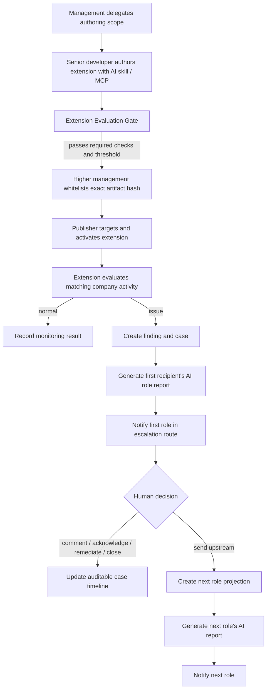

# 001 — Internal Security Control Flow

## Purpose

Define the first buildable KVCH flow for company-specific internal cyber-risk controls. KVCH does not attempt to predefine every possible issue. Instead, authorized company members publish evaluated extensions that monitor or prevent risks inside their approved scope, and KVCH provides one common lifecycle for findings, review, escalation, audit, and role-specific reporting.

The first persona is a junior developer, but the flow is reusable for any employee and any supported company system.

## Scope

This document covers:

- company authorization for a senior developer to create an extension;
- AI-assisted/MCP-assisted extension authoring;
- evaluation, whitelisting, artifact integrity, and activation;
- preventive and report extensions;
- first-recipient notification, human-only upstream escalation, comments, and closure;
- role-specific AI reports; and
- website monitoring through a common extension/finding format.

It deliberately defers connector implementation, model selection, extension runtime technology, and the complete external-defense/IPsec flow.

## Terms

- **Security Extension** — company-governed code that detects, reports, holds, or blocks a company-specific cyber-risk pattern.
- **Extension Publisher** — a delegated senior developer or equivalent who can create and target extensions within management-approved scope.
- **Extension Evaluation Gate** — KVCH Judge's hosted preflight for an exact stored artifact, as defined in [006](./006-judge0-eval.md) and [007](./007-kvch-judge-agile-plan.md). Broader governance and distributed-runtime flows in this document are future product direction.
- **Approved Artifact Hash** — the immutable hash of the exact evaluated and whitelisted extension artifact.
- **Extension Tracking ID** — the SHA-256 hash of the exact evaluated artifact, used by the website, monitoring, audit trail, and cases.
- **Finding Envelope** — the common parseable result emitted by all extensions, independent of how their code is written.
- **Escalation Route** — an ordered list of roles. It is not a broadcast list.
- **Role Projection** — the authorized, role-appropriate case view rendered for a recipient.

## Extension contract

Extension implementations remain intentionally open: each publisher can write different code, connect different company systems, and define its own normal conditions, abnormal conditions, and overlooked edge cases. KVCH only standardizes the governance envelope and the result it consumes.

Every extension declares:

```yaml
identity:
  name: string
  type: preventive | report
  creator: delegated publisher
  edit_access: [authorized identities]
  target_scope: company-specific resources, teams, environments, or actions

intent:
  what_is_normal: publisher-defined
  what_is_not_normal: publisher-defined
  overlooked_edge_cases: publisher-defined

routing:
  escalation_route: [first recipient, next recipient, ...]

governance:
  evaluation_threshold: set at whitelisting by higher management
```

KVCH calculates and returns the Approved Artifact Hash after deterministic packaging and evaluation; an authored extension declaration cannot contain its own final hash.

Every execution emits a common **Finding Envelope**. The exact implementation is deferred, but it must at minimum identify the extension/version, finding, observed time, affected actor/resource, result, evidence references, enforcement result, and a safe summary. This is what lets one website monitor every extension without dictating how extensions are written.

## Lifecycle



### Preventive extension

A preventive extension runs on a supported pre-action path. If its condition matches, it may HOLD or BLOCK according to its evaluated control. For example, an active secret-exposure control can block a junior developer’s `.env`/API-key push before merge or deployment and notify the configured senior developer.

The senior developer may release a HOLD after review. A BLOCK requires remediation or a policy-controlled, time-limited break-glass release.

### Report extension

A report extension monitors an action or state that cannot be intercepted. It creates a finding and case, but never claims to have prevented the original action.

## Notification, review, and escalation

The extension publisher configures an ordered escalation route. On a finding, KVCH notifies only the first configured recipient. It does not broadcast to HR, management, or every listed role.

The current recipient can:

- acknowledge the finding;
- leave an attributed case comment;
- mark a false positive with a reason;
- record remediation evidence and close the case; or
- use **Send upstream** at any time.

Upstream escalation is always a human decision. KVCH does not count incidents, score people, pressure the recipient, or auto-escalate. The next role receives a new authorized projection and AI-authored report, including any prior comments that role is allowed to see.

Example route:

```text
Junior developer action
  → senior developer
  → HR, if the senior developer sends upstream
  → executive/security leadership, if the current recipient sends upstream
```

For a repeated `.env` leak, the senior developer decides whether and when to send it upstream. KVCH preserves the evidence and comments but does not impose a recurrence threshold.

## Role-specific reports

The same canonical finding/case produces different reports:

| Recipient | Receives |
|---|---|
| Senior developer | Technical evidence, affected resources, extension result, recommended remediation, authorized prior comments |
| HR | Who handled and reported the issue, relevant process/training context, operational/financial impact, authorized prior comments; no unnecessary technical secrets |
| Executive/security leadership | Business exposure, money/service/customer impact, decisions needed, current ownership/status, authorized history |

AI writes the report after KVCH applies access control and redaction to form the role projection. AI never determines permissions or makes the escalation decision.

## Build chunks

### Chunk 1 — Shared extension and finding domain

Build the data model and APIs for extension metadata, version, tracking ID, type, target scope, escalation route, finding envelope, case timeline, comments, and immutable audit records.

**Done when:** the website can display a mock extension, its versions, and normalized findings from two differently implemented sample extensions.

### Chunk 2 — Extension Authoring Assistant

Build the AI skill/MCP workflow that helps an authorized publisher describe normal behavior, abnormal behavior, edge cases, scope, routing, and requested capabilities. It produces a candidate extension; it does not grant permissions.

**Done when:** a delegated senior developer can create a candidate for an internal risk such as secret exposure, while an unauthorized user cannot create or target one.

### Chunk 3 — Evaluation Gate and whitelisting

Run a candidate in isolation against supplied scenarios and enforce required checks. Store an evaluation result, management-selected threshold, whitelist decision, Approved Artifact Hash, and extension version.

**Done when:** a candidate below threshold or with a mandatory safety failure cannot activate; modifying a whitelisted artifact changes its hash and requires evaluation/whitelisting again.

### Chunk 4 — Targeting and runtime monitoring

Let a publisher activate a whitelisted extension only for approved company targets. Verify the artifact hash at runtime and receive its normalized finding envelope.

**Done when:** a targeted sample extension runs automatically for matching work without a junior developer enabling it, and its results appear under its Tracking ID.

### Chunk 5 — Preventive secret-exposure vertical slice

Implement one complete supported preventive integration: detect a `.env` file or likely API key on a pre-merge/pre-deploy path, BLOCK the action, create the finding/case, and notify the configured senior developer.

**Done when:** the UI shows the blocked action, evidence-safe explanation, extension/version/hash, and senior-developer controls for comment, remediation, closure, and permitted HOLD release.

### Chunk 6 — Report-extension vertical slice

Implement a sample report extension that observes a non-interceptable issue and opens the same normalized case without claiming prevention.

**Done when:** the same case UI handles both preventive and report findings, with their different enforcement outcomes correctly shown.

### Chunk 7 — Human-only upstream escalation and projections

Implement ordered escalation routes and the Send upstream action. Generate a new role projection and report only when the current recipient sends upstream. Carry authorized prior comments forward.

**Done when:** HR receives nothing until the senior developer clicks Send upstream; then HR sees a non-technical report and redacted authorized case history.

### Chunk 8 — AI role reports

Generate detailed role-specific reports from pre-redacted projections. Record the source findings, evidence references, generation time, model/version, and report recipient.

**Done when:** senior development and HR receive meaningfully different reports from the same incident without HR receiving secret values or irrelevant raw technical evidence.

### Chunk 9 — Monitoring website

Build the extension catalog, tracking-ID view, activation state, evaluation/whitelist status, finding feed, case timeline, comments, and role-specific inbox.

**Done when:** an authorized user can trace a website finding from extension identity and approved hash through the case, comments, manual escalation, and current recipient.

## Guardrails

- Extension code is open; governance, evaluation, integrity verification, and emitted findings are standardized.
- An extension may run only within the publisher’s delegated target scope.
- A configurable whitelisting threshold never bypasses mandatory safety failures.
- KVCH runs only the artifact matching the approved hash.
- A report extension never represents an observed event as prevented.
- No automatic escalation, employee scoring, or recurrence-triggered management notification belongs in this flow.
- Human recipients control Send upstream; AI only prepares authorized reports.
