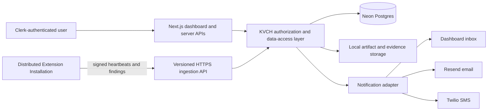

# 002 — Technical Architecture

## Purpose

This document defines KVCH's v1 technical architecture for governing company-specific Security Extensions, receiving their distributed runtime evidence, creating cases, and delivering authorized notifications. The domain lifecycle is defined in [001 — Internal Security Control Flow](./001-internal-flow.md); standalone extension-package authoring is defined in [003 — Extension Design](./003-extension-design.md).

AI-specific architecture is defined separately in [004 — AI Architecture](./004-AI.md).

The future package-to-platform bridge is planned in [005 — Extension Bridge Agile Plan](./005-extension-bridge-plan.md).

## Architectural shape

KVCH is a Next.js control plane. It owns company administration, authorization, extension governance, artifact approval, installation registration, finding/case workflows, audit records, role projections, the dashboard inbox, and external notifications.

Security Extensions are a distributed data plane. An approved extension can run in VS Code, CI, browsers, cloud services, or other supported environments. KVCH does not assume it executes every extension itself; it receives only declared runtime capability, liveness, and signed normalized findings.

## Application and identity

- The scaffolded Next.js application is the web control plane and public HTTPS ingestion surface.
- Clerk authenticates people and provides organization membership.
- A Clerk organization maps to one KVCH Company.
- `administrator` is the sole fixed KVCH role. Administrators create Company Groups, define their policies, and configure delegated authority.
- Company-defined groups—such as HR or Senior Developer—are not hard-coded platform roles. Their action and evidence access is granted by explicit Group Permission Policies.
- KVCH derives the Company and user from server-verified Clerk identity. Browsers never receive database credentials.

## Tenant isolation and persistence

- Neon Postgres is the system of record.
- Prisma defines the schema and is used through a server-side KVCH data-access layer.
- Every tenant-owned record includes `company_id` and every application query is scoped to that Company.
- Postgres row-level security mirrors the Company boundary as defense in depth.
- A single append-only `audit_events` table contains logically isolated Company audit streams; KVCH will not create one runtime table per Company.
- Each state transition writes its domain change and Audit Event atomically.
- Extension packages and large encrypted evidence pass through a Storage Adapter. V1 uses a local filesystem-backed adapter; Postgres stores immutable references, checksums, metadata, and authorization context. A cloud object-storage adapter is deferred.

## Extension governance and distributed runtime

- KVCH creates a deterministic extension package and calculates its SHA-256 hash independently of the evaluator.
- The SHA-256 hash is the Extension Tracking ID and Approved Artifact Hash for that exact artifact.
- The isolated Judge0-like Evaluation Gate executes the exact submitted package, but it does not establish artifact identity.
- Whitelisting approves one evaluated hash only. Changing any package byte creates a new candidate that must be evaluated and whitelisted again.
- Every package contains a mandatory Extension Manifest declaring runtime kind, monitored event/resource types, target scope, allowed capabilities, Finding Envelope version, and heartbeat requirements.
- Approved artifacts run as registered Extension Installations in distributed environments; KVCH tracks their declarations, health, and returned findings rather than hosting all execution.
- KVCH never retains raw detected secret values in v1. Secret-exposure evidence is limited to a one-way fingerprint, detector classification, resource reference, line range, redacted preview, and enforcement result.

## Installation trust protocol

1. KVCH creates a short-lived, single-use registration token during activation.
2. An installation generates an Ed25519 key pair locally and exchanges that token plus its public key for an installation identity.
3. The private key remains in the runtime's secure local store; KVCH stores the public key.
4. The installation sends signed Runtime Heartbeats and Finding Envelopes to versioned HTTPS ingestion endpoints.
5. Every submission has a runtime-generated UUID idempotency key. KVCH persists the accepted event before returning its Ingestion Receipt; retries return the same receipt without duplicate cases or notifications.
6. KVCH accepts a Finding Envelope only if the installation is active, its signature is valid, its hash is approved, and the reported event, target, capability, and envelope schema comply with the manifest and delegated scope.
7. Installation revocation immediately prevents future submissions from that installation alone.

Heartbeats establish installation liveness, not proof that every local action was observed. KVCH represents runtime state as healthy, stale, offline, or hash-mismatched.

## Case routing and notifications

- Escalation routes target Company Groups and remain ordered; later groups are never alerted until a human performs Send upstream.
- A group has a shared authorized inbox and a configurable on-call hierarchy.
- A Group Representative selects/manages the on-call configuration from the dashboard. Members set their own online/offline availability.
- KVCH notifies the current eligible online member; when unavailable it falls through the configured group hierarchy, without automatically escalating to the next group.
- The notification adapter creates an in-dashboard notification, Resend email prompt, and Twilio SMS alert.
- Email and SMS contain only minimal non-sensitive information and an authenticated deep link. All evidence and AI reports remain in KVCH's authorized dashboard projection.
- Provider delivery outcomes are retained as audit events. Notification providers receive no case evidence.

## Asynchronous work

KVCH uses `pg-boss` as its v1 Postgres-backed durable job queue. The ingestion transaction persists the accepted finding, case state change, Audit Event, and idempotent outbox jobs before returning an Ingestion Receipt. A worker processes notification delivery and Groq role-report generation independently, with retry and failure recording. A slow or failed provider call never causes an installation to retry an already accepted finding or blocks case creation.

## First implementation boundary

The first vertical slice should register one VS Code preventive secret-exposure extension, evaluate and whitelist its exact package, activate one installation, show its heartbeat, accept one signed idempotent BLOCK finding, create a Company-scoped case, route it to the appropriate Company Group inbox, and demonstrate dashboard, email, and SMS alerts.

## Deployment scope

KVCH will be demonstrated locally in v1. A real, local Judge0-compatible Evaluation Gate runs as an isolated service rather than inside the Next.js process. Production hosting and infrastructure-provider selection are intentionally deferred; the architecture records only the required service boundaries and integrations.

## Explicitly deferred

- Production deployment, scaling, and cloud object-storage provider.
- Detailed evaluator sandbox resource and network policy.
- Exact Groq model selection; the supplied Groq API key is server-only and each report records its actual model identifier.
- Additional extension languages and runtime kinds beyond the v1 TypeScript/Node.js contract.
