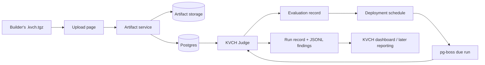

# 007 — KVCH Judge Agile Build Plan

## Status

Proposed implementation plan. This is the build plan for [006 — KVCH Judge and Artifact Intake](./006-judge0-eval.md). It replaces the hosted-runtime portions of [005 — Extension Bridge Agile Plan](./005-extension-bridge-plan.md): the published `@arko05roy/kvch-extension` package is complete, and this plan starts at website upload.

Implementation started 2026-09-05. Slice 0 provides the published-package inspector, server-only adapter descriptors, and independently runnable Node/Python concern fixtures. Run `cd web && npm run test:judge` to package both fixtures, inspect their manifests/hashes, and verify silent preflight plus two normal-run findings. Persistence, storage authority, execution kernel, and website integration remain unimplemented.

Slice 1 foundation is now present: Prisma schema and first Postgres migration; company-scoped artifact repository; streaming local Storage Adapter; validated environment; and a pg-boss worker that proves database connectivity and registers queues. Configure `web/.env.local` from `.env.example`, then run `npm run db:migrate`, `npm run dev`, and `npm run worker`. Evaluation jobs are active; deployment-run dispatch follows the next slice.

Slice 3 Judge kernel is present and covered by `npm run test:judge`: it rereads and rehashes storage bytes, inspects the manifest, selects and validates Node/Python adapters, expands into a unique workspace, runs install/build/run with input/timeout/bounded logs, parses normal-run JSONL, and removes the workspace. Evaluation/deployment persistence and worker handlers remain next.

Slice 4 evaluation service and worker handler are present. Each queued artifact evaluation creates a new `Evaluation` record before Judge work, captures phase evidence, and marks only silent successful preflight as `deployable`; failures remain append-only evidence and set `evaluation_failed` or `runtime_unsupported`. Deployment creation and its UI remain next.

Slice 5 backend is present: the worker schedules durable due-deployment dispatch every minute through pg-boss, atomically advances a deployment's `nextRunAt`, enqueues a unique run by deployment and due timestamp, and persists healthy/finding/failed normal-run outcomes. Website controls and an integration run against configured Postgres remain next.

Slice 6 operational UI is present at `/extensions`: authenticated server-context data provides a registry, upload action, immutable artifact detail, evaluation/deploy actions, pause/resume controls, latest evaluation evidence, deployment state, runs, and expandable finding envelopes. Development uses `KVCH_DEVELOPMENT_COMPANY_ID`; production must replace that resolver with the existing identity provider before serving requests.

## Product outcome

Someone who has packaged an extension can upload its `.kvch.tgz` file to KVCH. KVCH stores those exact bytes, calculates the authoritative SHA-256 tracking ID, evaluates the package through KVCH Judge, and—if it passes—runs the same hash on the creator-declared cron schedule. A healthy run is silent. A run that detects a concern emits detailed JSONL findings that KVCH records against the artifact and run.



KVCH Judge is application code in the KVCH server. It is not the Judge0 product, an external evaluation API, or a generic code-execution platform.

## Non-negotiable V1 decisions

- **Artifact authority:** KVCH stores the upload first and computes SHA-256 from those stored bytes. That hash is the Extension Tracking ID; any local hash is informational.
- **Supported hosted runtimes:** TypeScript/Node and Python only. Selection comes from `implementation.language` and `implementation.runtime` in `extension.yaml`, never filename inference.
- **Execution model:** every evaluation and scheduled run expands the exact artifact to a fresh temporary workspace, then performs its declared install → build → run lifecycle. There are no warm extension processes, saved build bundles, or an external worker product.
- **Preflight:** Judge invokes the run command with `KVCH_EVALUATION=1` and `{}` on standard input. Pass means exit code `0` and no finding output.
- **Normal runs:** KVCH supplies no use-case configuration. The artifact contains its own target links, detector logic, thresholds, and baseline. Exit `0` with empty stdout means healthy; each non-empty stdout line must be one valid Finding Envelope JSON object.
- **Scheduling:** the immutable `deployment.schedule` in the artifact manifest is the schedule. `pg-boss`, backed by KVCH's Postgres database, persistently records due work and dispatches Judge from the KVCH backend.
- **Scope:** V1 is low-frequency cron-style monitoring only. VS Code, browsers, CI, long-running services, high-rate checks, notifications, and AI reports are follow-up work.

## Build boundaries

### What this plan builds

- A real artifact upload and artifact-detail website flow.
- Persistent artifact, evaluation, deployment, run, and finding records.
- Local filesystem artifact storage behind a replaceable Storage Adapter.
- KVCH Judge adapters for Node and Python.
- A server-side durable schedule/run loop using `pg-boss`.
- A minimal run-history and finding view so the deployer can verify what ran and what KVCH received.

### What this plan deliberately does not build

- A general sandbox product, distributed runtime bridge, browser or VS Code adapter.
- A judgment of whether the extension correctly detects its cybersecurity use case.
- Creator target/configuration forms: that data belongs inside the artifact in V1.
- Email, SMS, Slack, escalation, AI-written reports, or recipient-selection UI.
- Warm workers or expensive high-frequency execution.

## Target implementation shape

All application logic belongs under the Next.js `web/` project. Keep browser components free of execution code.

```text
web/
├── app/
│   ├── api/extensions/...       # authenticated upload, status, run-detail APIs
│   └── extensions/...           # upload and artifact/deployment pages
├── lib/
│   ├── extensions/              # manifest, artifact, evaluation, deployment services
│   ├── judge/                   # adapter registry, workspace lifecycle, process runner, JSONL parser
│   ├── queue/                   # pg-boss setup, schedules, job handlers
│   ├── storage/                 # local artifact storage adapter
│   └── db/                      # Prisma client and repository layer
├── prisma/schema.prisma
└── scripts/kvch-worker.ts       # same backend codebase; consumes pg-boss jobs
```

The worker is a process in the same KVCH deployment, using the same codebase and Postgres database—not a separately purchased worker platform. Development runs Next.js and the worker independently; production starts both processes on the KVCH server. The worker does not expose a public API and never sends extension code to the browser.

### Persistent records

Use Prisma migrations and repository functions rather than extension-specific tables or in-memory state. The first migration should establish:

| Record | Essential fields | Purpose |
| --- | --- | --- |
| `Extension` | `id`, `companyId`, manifest extension ID, name | Stable conceptual extension identity. |
| `Artifact` | `id`, `extensionId`, SHA-256, storage key, size, manifest JSON, adapter key, state | One immutable uploaded byte sequence. SHA-256 is unique per company. |
| `Evaluation` | `id`, `artifactId`, adapter version, status, started/finished times, command results, stdout/stderr | Immutable preflight evidence for a hash. |
| `Deployment` | `id`, `artifactId`, schedule, status, next run | The active cron deployment of a passing artifact. |
| `ScheduledExtensionRun` | `id`, `deploymentId`, due/start/finish times, status, exit code, stdout/stderr | One actual Judge invocation. |
| `Finding` | `id`, `runId`, `artifactId`, envelope JSON, severity/category/title/observed time | A parsed concern emitted by an extension. |

Use explicit state values from the beginning:

```text
Artifact: uploaded | evaluating | deployable | evaluation_failed | runtime_unsupported
Evaluation: queued | running | passed | failed
Deployment: active | paused | failed
Run: queued | running | healthy | finding | failed
```

An artifact and its manifest/hash never change after creation. Logs and result records are append-only; a retry creates another evaluation/run record instead of overwriting history.

### Server interfaces

The first website/API surface is intentionally small:

| Action | Server endpoint/service behavior | Website result |
| --- | --- | --- |
| Upload artifact | Stream multipart `.kvch.tgz` to Storage Adapter, compute SHA-256, parse manifest without executing code, create `Artifact` | Shows hash and evaluation status. |
| Read artifact | Return metadata, manifest, selected adapter, evaluation history, deployment, and latest runs | Artifact detail screen. |
| Start/retry evaluation | Enqueue an evaluation by artifact ID; worker only loads stored bytes | Status updates without re-upload. |
| Create deployment | Only for a deployable artifact; read immutable schedule from manifest and register schedule work | Displays active schedule and next run. |
| Pause/resume deployment | Changes one deployment's status; resume recalculates next due time | Basic lifecycle control. |
| Read run/finding | Return recorded process outcome and parsed findings | Run history and finding detail. |

Upload responses must return the server-calculated hash and candidate ID. The client must not provide a trusted hash, runtime type, schedule, manifest, or execution command separately; all come from the stored artifact manifest.

## Agile delivery slices

Each slice leaves a usable vertical capability. Build the slices in order and demonstrate the listed acceptance criteria before proceeding.

### Slice 0 — Reconcile the hosted-runtime contract

**Goal:** Make docs and the package contract describe the same hosted execution model before application code depends on it.

**Work:**

- Replace the obsolete distributed-runtime/Judge0 language in `002` and hosted slices in `005` with links to `006` and this plan.
- Ensure the manifest parser used by the website can read `deployment.schedule`, implementation, commands, and entrypoint from the actual packed `extension.yaml`.
- Define one versioned adapter key format, beginning with `typescript/node` and `python/python3`.
- Add a real Node fixture artifact and a real Python fixture artifact that respect `KVCH_EVALUATION=1` and JSONL output.

**Acceptance criteria:**

- [x] No active document claims V1 deploys to VS Code, CI, or an external Judge0 service. Earlier architecture is explicitly marked historical.
- [x] The immutable artifact, not a website form, is the source of schedule and run commands.
- [x] Both fixtures package successfully through the published npm package and can run independently.

### Slice 1 — Persistence, storage, and backend foundation

**Goal:** Establish real KVCH state and artifact storage before any execution capability.

**Work:**

- Add Prisma, database configuration, migrations, and a company-scoped repository layer.
- Add the local filesystem Storage Adapter, configured by `KVCH_ARTIFACT_STORAGE_DIR`; keep storage paths outside `public/` and outside source control.
- Add `pg-boss` configuration, a backend worker entry point, health checks, and local development scripts.
- Add environment validation for database URL, storage path, workspace root, Node/Python command locations, and log limits.

**Acceptance criteria:**

- [x] A migration defines the six records and required hash/index constraints. It awaits application against the configured Postgres database.
- [x] Artifact bytes can be written, reread, checksummed, and deleted through the Storage Adapter without a hard-coded path.
- [x] Starting the worker validates database connectivity and registers no browser-visible execution capability.
- [x] Configuration is validated at startup; no runtime path or executable is hard-coded in application logic.

### Slice 2 — Real upload-to-artifact website flow

**Goal:** A user can turn a packaged file into a visible immutable KVCH artifact without executing it.

**Work:**

- Replace the static extensions presentation with a server-backed extensions list and upload action.
- Implement multipart upload with file type, size, and archive-read error states.
- Store the bytes first, calculate SHA-256 while storing, inspect only `extension.yaml`, select the adapter, and create the `Artifact` record atomically.
- Make identical re-uploads resolve to the existing company artifact rather than creating ambiguous duplicates.
- Create artifact detail at a stable route, such as `/extensions/[artifactId]`.

**Acceptance criteria:**

- [ ] Uploading a real `.kvch.tgz` displays its server-calculated tracking hash, manifest identity/version, declared schedule, and selected adapter.
- [ ] The archive is never executed by upload/inspection code.
- [ ] Invalid archive/manifest and unsupported runtime states are understandable in the UI.
- [ ] Refreshing the page reads the persisted record, not client state or mock data.

### Slice 3 — KVCH Judge execution kernel

**Goal:** Create one reusable server component that can execute an exact stored artifact and return an auditable process result.

**Work:**

- Implement the adapter registry keyed from manifest language/runtime.
- Implement a workspace manager: create unique workspace, retrieve exact artifact bytes, extract there, invoke manifest install/build/run commands, capture bounded stdout/stderr and duration, then clean up.
- Implement process execution with configured timeout, working directory, environment additions, and standard-input support.
- Implement a JSONL parser and Finding Envelope validator. Empty stdout is valid; every non-empty normal-run line must be a valid envelope.
- Implement Node and Python adapters without extension-specific branches.

**Acceptance criteria:**

- [x] Given a stored artifact reference, Judge proves it loaded the bytes matching the recorded hash before executing commands. Artifact-ID resolution will arrive with queued evaluation.
- [x] Node and Python fixtures execute through their selected adapters; an unsupported manifest returns `runtime_unsupported` before workspace creation.
- [x] Command outcome includes phase, exit code, duration, bounded stdout/stderr, adapter metadata, and failure reason.
- [x] The workspace is removed after pass and runtime-validation failure; timeout and thrown-error cleanup follows the same `finally` path.
- [x] The parser accepts multiple valid JSONL findings and rejects malformed lines before persistence exists.

### Slice 4 — Evaluation queue and deployment creation

**Goal:** The website can run the preflight contract and turn a passing artifact into a scheduled deployment.

**Work:**

- Add an `evaluate-artifact` `pg-boss` job. It calls Judge with `KVCH_EVALUATION=1` and `{}` stdin.
- Persist a new `Evaluation` record before work begins, then its individual command outcomes and terminal status.
- On pass, mark the artifact `deployable`; on failure, mark it `evaluation_failed` while retaining logs.
- Add a deployment service that reads `deployment.schedule` from the artifact manifest, creates one active `Deployment`, and registers its first due run.
- Add evaluation/deployment state to the artifact detail page with retry for failed evaluation and deploy action for a passed artifact.

**Acceptance criteria:**

- [x] An evaluation succeeds only when install/build/run all exit `0` and evaluation stdout is empty.
- [x] A finding, invalid JSON, command failure, or timeout during preflight creates inspectable failed evaluation evidence and no automatic deployment.
- [x] Deploying a passed artifact creates a deployment using the manifest schedule exactly; the future UI will expose no schedule field.
- [x] Repeated evaluations create new evidence records, and changed bytes resolve to a separate artifact hash.

### Slice 5 — Durable cron dispatch and normal run records

**Goal:** A deployed artifact runs reliably at its declared low-frequency schedule.

**Work:**

- Add scheduler jobs that calculate due deployments and enqueue idempotent `run-deployment` jobs.
- Add a uniqueness key for deployment + due timestamp so restart/retry cannot create duplicate scheduled runs.
- Have `run-deployment` create a `ScheduledExtensionRun`, call Judge normally, and persist its terminal result.
- Treat exit `0` with no stdout as `healthy`; exit `0` with one or more valid envelopes as `finding`; all other outcomes are `failed`.
- Add basic pause/resume controls and a run-history table on the artifact detail page.

**Acceptance criteria:**

- [ ] A real fixture scheduled every allowed interval produces one durable run record per due time, including across worker restart.
- [ ] Healthy fixture invocations create no findings and no fake success payload.
- [ ] A concern fixture produces one persisted Finding for each JSONL line, tied to run ID and artifact hash.
- [ ] Process failures are visible as run failures, never converted into findings.
- [ ] Pause prevents subsequent dispatch; resume calculates a future due run without replaying an arbitrary backlog.

### Slice 6 — Findings and usable operational website

**Goal:** The person who deployed an extension can see whether it is evaluating, deployed, healthy, failing, or finding concerns.

**Work:**

- Implement server-backed artifact list filters for status, adapter, and extension identity.
- Add artifact detail sections: immutable manifest/hash, latest evaluation, deployment schedule/status, recent runs, and findings.
- Add run detail with phase-level command result, duration, exit status, and captured logs.
- Add finding detail that renders stable Finding Envelope fields and preserves expandable `details` JSON without imposing extension-specific schemas.
- Add clear empty, queued, failure, and unsupported-runtime states; do not invent mock findings.

**Acceptance criteria:**

- [ ] Every displayed run and finding links to its exact artifact hash and deployment/run record.
- [ ] The UI shows a healthy silent run distinctly from a failed run.
- [ ] Arbitrary `details` fields remain available rather than being discarded for a fixed dashboard schema.
- [ ] All screens use server data and work after refresh with no seeded production records.

### Slice 7 — Hardening the V1 operating loop

**Goal:** Make the already working flow diagnosable and maintainable before adding notification/AI layers.

**Work:**

- Define and implement configured low-frequency schedule validation and a documented minimum interval.
- Add job retry classification for transient worker/database failures versus deterministic artifact failures.
- Add artifact retention and workspace/log retention jobs through `pg-boss`.
- Add structured server logs/metrics for queue depth, evaluation outcomes, run duration, failures, and findings.
- Write operator documentation: start web/worker, configure storage/database, migrate, recover worker, inspect an artifact/run, pause a deployment.

**Acceptance criteria:**

- [ ] Restarting the web process or worker does not lose queued evaluations or scheduled runs.
- [ ] Retrying a job cannot duplicate a Finding for the same durable run record.
- [ ] Storage and temporary workspaces do not grow without a defined retention path.
- [ ] A new developer can complete upload → evaluate → deploy → healthy run → finding run from the documentation alone.

## Test strategy

Use real, safe fixture extensions in integration tests. They are test packages, not product mocks:

| Fixture | Evaluation behavior | Normal-run behavior | Proves |
| --- | --- | --- | --- |
| Node healthy | exits 0, silent | exits 0, silent | Node adapter and healthy state. |
| Node concern | exits 0, silent | emits two valid JSONL findings | JSONL persistence and multiple findings. |
| Python healthy | exits 0, silent | exits 0, silent | Python adapter selection and execution. |
| Invalid output | exits 0, invalid JSONL normal run | invalid JSONL | Invalid output becomes run failure. |
| Evaluation violation | emits output or fails under `KVCH_EVALUATION=1` | n/a | Deployment is refused. |

The automated suite should cover deterministic package upload, SHA-256 authority, archive inspection without execution, manifest adapter selection, each Judge command phase, workspace cleanup, JSONL validation, queue idempotency, scheduler restart behavior, and the upload/detail/run/finding website paths.

## Build order and demo checkpoints

1. **Checkpoint A — immutable upload:** upload a real Node `.kvch.tgz`; reload the page; verify its persisted server hash and manifest.
2. **Checkpoint B — Judge proof:** evaluate it; show the persisted install/build/run result and a passing preflight.
3. **Checkpoint C — live hosted extension:** deploy it; the worker creates one healthy scheduled run with no output.
4. **Checkpoint D — meaningful concern:** deploy the concern fixture; show its persisted rich Finding Envelope linked to the run and hash.
5. **Checkpoint E — language claim:** repeat A–D with the Python fixture.

Only after Checkpoint E should KVCH add dashboard notification recipients, external notifications, or AI report generation. Those features consume real Findings from this pipeline rather than inventing their own extension runtime.

## Definition of done for this plan

The hosted extension flow is complete when a newly packaged Node or Python artifact can be uploaded through the website, receives a server-authoritative tracking hash, passes a recorded KVCH Judge preflight, is deployed from its own immutable cron schedule, runs through the backend after a worker restart, and either stays silent while healthy or persists fully structured JSONL findings when it detects a concern.
